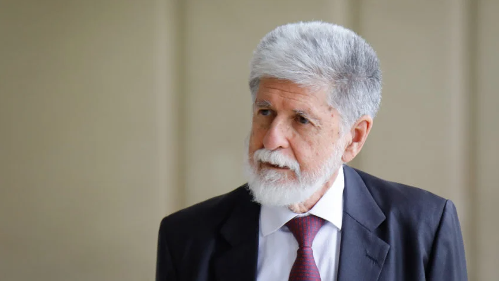

# 巴西总统顾问回应白宫指责：巴西没义务听从美国的所有意见

（观察者网讯）对于俄乌冲突，巴西一再拒绝站队，坚持劝和促谈。日前，巴西总统卢拉在访华期间和巴西外长在与俄罗斯外长会晤期间，均明确表达过这一立场。但这却引起美国的强烈不满，白宫方面甚至批评巴西在乌克兰问题上“鹦鹉般模仿中俄”。

4月18日，巴西总统首席顾问塞尔索·阿莫里姆接受巴西《圣保罗页报》采访，为卢拉在乌克兰问题上的立场辩护，称巴西已明确谴责俄罗斯，但仍坚持认为美西方“制裁”或“击败”俄罗斯无法解决问题。

对于中美关系，阿莫里姆指出，在推动建设多极世界以及和平解决俄乌冲突上，巴西与中国立场相近；巴西政府重视美国对于巴西选举结果的支持，两国之间有很多相近之处，但这不意味着巴西必须在国际事务中“听从美国的所有意见”。

_“我们没义务听从美国的所有意见”，《圣保罗页报》报道截图_

塞尔索·阿莫里姆（Celso Amorim）现年80岁，是巴西资深外交官。

上世纪90年代，阿莫里姆曾在巴西前总统伊塔马尔·佛朗哥执政时期担任巴西外交部长。此后，阿莫里姆在卢拉前两个总统任期（2003年至2010年）任职外交部长，后于巴西前总统迪尔玛·罗塞夫执政时期担任国防部长。目前，阿莫里姆为卢拉首席顾问，为其外交政策提供建议。

_塞尔索·阿莫里姆（资料图）_

在接受采访之前，巴西总统卢拉和巴西外长维埃拉17日与到访的俄罗斯外长拉夫罗夫会晤，而白宫官员对巴西政府在乌克兰问题上的立场提出尖锐批评。

对此，阿莫里姆回应称：“我不想和白宫的新闻官员发生争执。随他怎么想吧。”他强调，卢拉立场非常明确，即追求和平和捍卫多极世界，而这也是在捍卫巴西自己的利益。

被问及为何卢拉会见到访的俄外长时，阿莫里姆指出，这是礼节性的会晤，且巴西已经多次通过联合国投票和公开讲话就俄乌冲突谴责俄罗斯。他补充说，目前来看，“实施制裁或试图击败俄罗斯是没有意义的，不会带来和平”，巴西认为需要寻找一种方式进行和谈。

阿莫里姆认为，美西方对俄制裁无助于和平，而是“自愿或非自愿地延长了战争”。

“你们想要什么？复仇吗？还是给俄罗斯一个教训？”阿莫里姆向美西方发出疑问。他还称，一战结束后，欧洲各国曾经对德国尝试过这种做法，但最终却导致了纳粹德国的出现和二战的发生。

采访中，阿莫里姆多次表示，巴西致力于推动建设多极世界以及和平解决俄乌冲突，并质疑美国社会对此并不感兴趣。他认为，在这一点上，巴西与中国的立场相近，因为“中国是在全球化进程中发展最快的国家，而全球化有赖于和平”。

对于美巴关系，阿莫里姆坦承，在很多方面，“美国都是巴西的优秀合作伙伴”，美国还对巴西选举结果持积极态度。但他直言：“
**这并不意味着我们必须听从他们的每一个意见……‘我们支持巴西选举，所以巴西要在我们与中国的冲突中支持我们’，没有这样的约定。** ”

他重申：“我们不会出卖我们的原则，我们也不要陷入挑衅和无谓的冲突”。

阿莫里姆还提到，截至目前，卢拉没有前往俄罗斯和乌克兰的计划。

阿莫里姆上述表述是对白宫官员指责的回应。当地时间4月17日，白宫国家安全委员会发言人约翰·柯比声称，巴西的言行举止都在暗示美国和欧洲国家在某种程度上对和平不感兴趣，或者对战争负有责任，并声称“在这种情况下，巴西是在鹦鹉般模仿俄罗斯和中国的宣传，根本不考虑事实。”

次日（18日），白宫新闻发言人让-
皮埃尔在记者会上再次将矛头对向巴西，称白宫方面对于巴西外交部长在俄巴外长新闻发布会上的发言语气感到“震惊”，“（巴方）认为美欧对和平不感兴趣，或认为美国应对俄乌战争负有责任，这显然是错误的。”

另据俄新社报道，18日，正在拉美访问的俄罗斯外长拉夫罗夫表示：“（白宫的发言）没什么值得回应的。美国人总认为有权在任何情况下作出裁决，好像自己不受司法管辖一样。”

**本文系观察者网独家稿件，未经授权，不得转载。**

