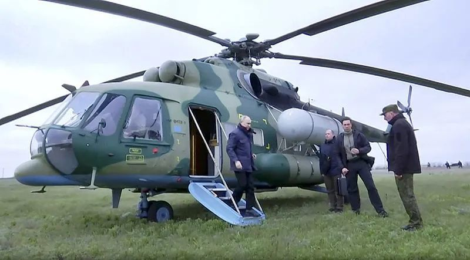
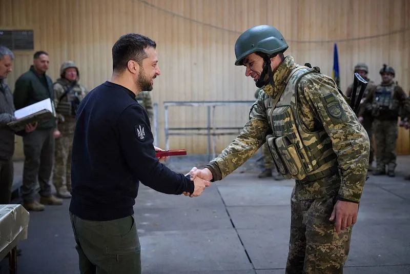
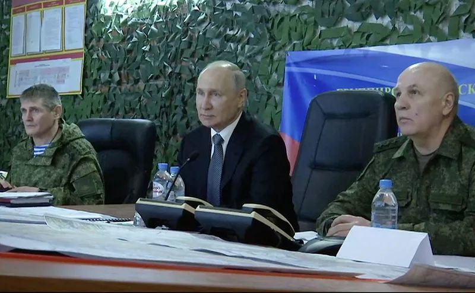
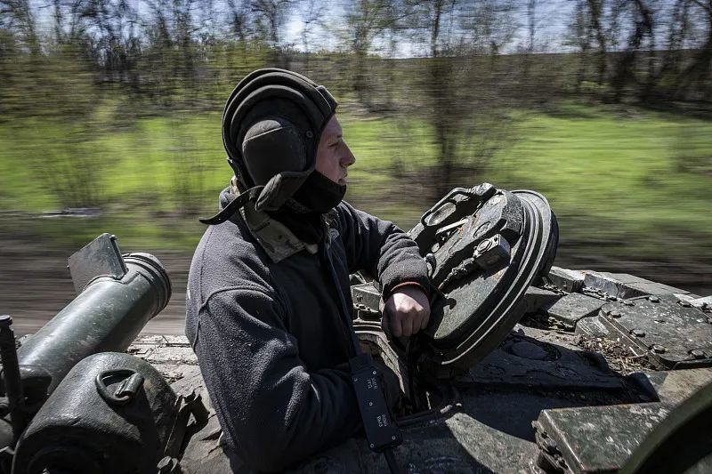
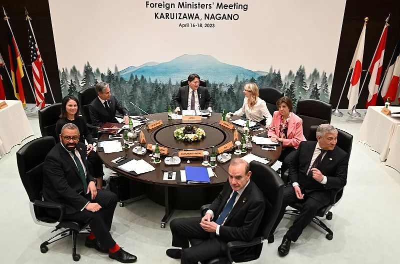

# 普京、泽连斯基突访前线，新的攻势要来了？

俄总统普京突访赫尔松和卢甘斯克一天后，乌克兰总统泽连斯基现身顿涅茨克前线。

克里姆林宫18日发布消息，普京于17日前往赫尔松地区和卢甘斯克地区，听取了军事指挥官有关局势情况的汇报。这也是俄乌冲突后普京首次到访这两地。

俄总统新闻局表示，普京对这两地的视察行程未事先准备。

_普京抵达赫尔松地区（视频截图）。图源：视觉中国_

就在普京视察赫尔松和卢甘斯克的第二天，当地时间18日，乌克兰总统泽连斯基官方社交账户公布，泽连斯基到访前线城市阿夫杰耶夫卡，视察乌克兰军队。

据悉，阿夫杰耶夫卡小镇位于顿涅茨克以北，是乌军在顿巴斯地区的战略要塞。

_泽连斯基在阿夫杰耶夫卡视察乌克兰军队。图源：视觉中国_

长安街知事（微信ID：Capitalnews）注意到，这已是普京一个月来再次进行未经安排的访问。

3月18日，普京突访顿涅茨克第二大城市马里乌波尔，视察了该市的几个项目，与当地居民进行了交谈，还开着车在城市的几个街区转了一圈。当时有报道称，这是普京首次访问顿巴斯地区，也是他最接近前线的一次访问。

此次访问赫尔松地区，普京乘车前往“第聂伯”部队参谋部并举行会议，听取了空降部队指挥官米哈伊尔·特普林斯基、“第聂伯”部队指挥官奥列格·马卡列维奇等军事领导人的报告。

会议开始时，普京说：“我不想打扰大家履行职责，因此我们的会议很短，但要具体。” 他指出：“听取大家对局势发展的意见、交换看法对我来说很重要。”

_普京视察“第聂伯”部队参谋部（视频截图）。图源：视觉中国_

视察卢甘斯克期间，普京前往“东方”国民警卫队参谋部，听取了亚历山大·拉平上将和其他高级军官关于该方向局势的报告。

此外，普京还祝官兵们复活节快乐，并向他们赠送圣象复制品作为礼物。

长安街知事（微信ID：Capitalnews）注意到，普京、泽连斯基两天内相继突访前线的背后，是影响俄乌局势的两大背景。

**其一，乌克兰正筹划新一轮攻势。**

俄乌在巴赫穆特持续激战之际，“乌军反攻”话题受到普遍关注。

早在3月29日，乌防长列兹尼科夫就表示，乌克兰将西方坦克用于战场的反攻行动可能在4月或5月开始，反攻将向若干方向推进。

最新消息则来自美军泄露的秘密文件。美国《新闻周刊》4月16日援引泄露的文件称，乌克兰计划于4月30日发动“春季攻势”，美国及其盟友正在帮助乌克兰积极备战。

其中一份文件详细说明了在美国及其盟国的帮助下为“春季攻势”做的准备。

文件显示，乌方正在组建12个旅的作战部队，其中9个旅由美国和其他北约成员国提供训练和补给。这9个旅中，6个旅计划在3月31日前就位，其余3个旅计划在4月30日前完成战备。这9个旅总计需要250余辆坦克和350余辆装甲车。

_4月17日，顿涅茨克地区，一名乌克兰士兵坐在坦克上。图源：视觉中国_

不过也有文件显示，美国情报界判断，乌克兰在招兵、筹集弹药和军备方面的困难，可能导致乌军不能实现春季反攻目标，即夺回俄方控制地区，而只能获得“些许领土收益”。

乌克兰总理什梅加尔近日在华盛顿召开的记者会上说，五角大楼的泄密事件不会改变基辅的计划，乌军将在近期发起反攻。他表示，基辅打算拿下克里米亚和顿巴斯两地，并强调乌克兰的目标是恢复1991年时的国界，并对此“充满信心”。

**其二，西方正加大对俄制裁。**

刚刚落下帷幕的G7外长会在联合声明中指出，同意加大对俄罗斯的制裁，并将持续向乌克兰提供援助。

声明指出，G7将继续合作，防止俄罗斯规避制裁，包括建立执法协调机制，打击俄罗斯和第三方规避和破坏制裁措施的企图。

_七国集团外长会在日本举行。图源：视觉中国_

此外，欧盟正在酝酿对俄罗斯实施第11轮制裁，重点将针对俄罗斯回避现行制裁所采取的措施。

对此，俄罗斯常驻维也纳国际组织代表乌里扬诺夫表示，制裁对俄罗斯造成的影响并不严重，相反，欧盟遭到的反噬效应却远高于预期。

连日来，对于结束乌克兰危机，俄方持续释放信号。

当地时间17日，俄罗斯外长拉夫罗夫在会见巴西外长维埃拉后表示，俄方愿意乌克兰危机尽快结束。

18日，当被问及巴西方面提出的关于乌克兰危机的和平倡议时，俄总统新闻秘书佩斯科夫表示，任何考虑到俄罗斯立场的主张都值得关注，俄方已做好听取这些主张的准备。

