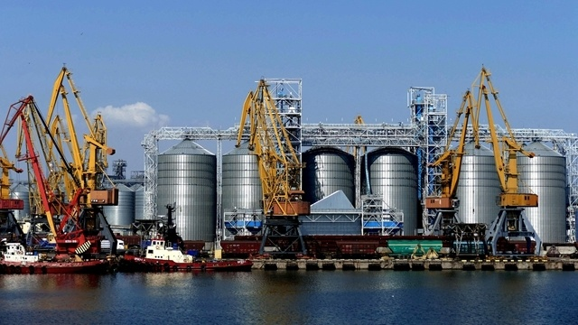

# 欧洲多国禁止乌克兰农产品进口，乌克兰粮食外运再生变数

全球粮食价格持续下跌，但粮食安全警报仍未解除。

联合国粮农组织（FAO）最新发布的3月全球粮食报价数据显示，由于谷物和植物油报价走低，国际食品商品价格基准指数连续第12个月下跌。3月指数平均为126.9点，环比下降2.1%，较上一年3月的历史峰值水平低20.5%。

然而，就在粮农组织数据发布不久，4月17日前后，由于受到乌克兰低价粮食的冲击，斯洛伐克、波兰、匈牙利政府相继叫停乌克兰的农产品进口。截至第一财经发稿时，外媒报道称，保加利亚政府也在考虑是否跟进禁令。

在乌克兰危机的大背景下，欧盟、联合国等此前开辟了多条运输渠道，确保农业大国乌克兰的粮食外运不受危机影响，同时也力保国际粮食市场避免出现去年危机暴发后的波动。

但是，正如粮农组织首席经济学家马克西莫·托雷罗（Máximo
Torero）所强调的，全球食品价格有所松动，但价格仍处于高位，对粮食安全仍构成挑战。联合国世界粮食计划署此前也发出预警，由于地区冲突、经济下滑、极端气候和肥料价格上涨继续扰乱粮食生产，2023年全球粮食形势仍将面临前所未有的风险水平。

目前，乌克兰方面将在19~20日与上述欧洲国家商讨粮食出口问题。

**乌克兰低价农产品冲击**

率先宣布对乌克兰粮食实施禁令的是波兰。波兰政府15日宣布禁止从乌克兰进口谷物及其他食品至6月30日，以保护当地农业部门。谷物、蜂蜜、葡萄酒、牛奶、鸡蛋等18种乌克兰农产品既不能进入波兰本国市场，也不能过境波兰运往第三国。同一天，匈牙利政府也宣布实施类似禁令，禁止进口乌克兰农产品。

4月17日，斯洛伐克农业部长萨姆埃尔·武尔昌（Samuel
Vlcan）表示斯洛伐克政府自当日起暂停从乌克兰进口谷物等农产品，但仍保持边境开放，以便乌克兰农产品运往第三方市场。武尔昌称，此举旨在保护斯洛伐克的农业和食品行业，尤其是保障消费者健康。

欧盟委员会强调，贸易政策属于欧盟的专属权限，不接受波兰、匈牙利等国采取的单边行动，欧盟正要求相关方提供更多信息以评估这些措施。

乌克兰危机爆发后，作为全球重要的农业大国，乌克兰的粮食外运受到影响，从而一度导致全球粮价波动。此后，欧盟通过取消关税、建立运输通道等多项措施保障乌克兰农产品外运，支持乌克兰恢复农业部门运转，维持经济命脉。

比如，欧盟于2022年5月建立了欧盟-
乌克兰“团结通道”，提高波兰、罗马尼亚等与乌克兰接壤国家的公路、铁路运输能力，支持乌克兰商品通过陆上线路实现外运。该通道目前是乌克兰农产品出口以及其他商品进出口的重要渠道。欧盟发布的数据显示，截至3月14日，已有超过5600万吨乌克兰商品通过“团结通道”的陆上线路向外运输，其中谷物和相关产品总计2900万吨。

但是，近一年来，随着大量乌克兰谷物以极低的价格涌入中东欧国家市场，再加上物流问题滞留当地，导致这些欧洲国家的农产品供大于求、价格下跌，当地农民遭受巨大经济损失。比如，有波兰农民表示，与2022年8月相比，波兰小麦价格当前跌幅超过35%。在保加利亚，80%去年生产的向日葵作物和300多万吨小麦至今仍在滞销。

3月31日，波兰、匈牙利、罗马尼亚、保加利亚和斯洛伐克五国联合致信欧盟委员会主席冯德莱恩，要求欧盟委员会采取各种措施限制乌克兰低价农产品进口造成的市场扭曲，包括提供更多资金来帮助农民，修改农产品进口法律以规范农产品流入的数量和方向。公开信呼吁，如果这些措施不成功，欧盟应重新引入针对乌克兰农产品的关税和关税配额。

此后，欧盟委员会承诺拨款5630万欧元为波兰、保加利亚和罗马尼亚的农民提供财政援助，补偿他们因乌克兰的粮食和油籽进口增加而产生的经济损失。其中，向波兰提供2950万欧元，向保加利亚提供1675万欧元，向罗马尼亚提供1005万欧元，这笔资金将于今年9月30日之前支付。

但赔偿涉及国家的政府和农民都认为这一数字远远不够。根据欧盟委员会的估计，由于乌克兰低价粮食的流入，上述中东欧五国农民总共损失了4.17亿欧元。

去年6月，欧盟通过了为期一年的与乌克兰临时贸易自由化的法令，规定暂时取消乌克兰农产品进口关税和关税配额，并且不对来自乌克兰的进口产品征收反倾销税。欧盟近期提议将该措施延长至2024年6月，但由于近期中东欧国家的农民反对，这项法令能否顺利延期仍有待观望。

**黑海农产品外运协议再度“命悬一线”**

除了中东欧国家的不满，上个月成功续期的黑海农产品外运协议也再度“命悬一线”。

俄罗斯与乌克兰均为全球产粮大国，去年7月双方在联合国和土耳其的斡旋下签署了黑海农产品外运协议，联合保障乌克兰农产品经黑海安全出口，缓解因俄乌冲突导致的全球粮食危机。该协议有效期为120天，并于2022年11月成功续期120天。

今年3月18日，俄乌就第二度延期黑海港口农产品外运协议达成一致，然而双方在延长期限方面存在分歧，俄罗斯宣布仅同意将该协议再延长60天，并表示只有在满足自身粮食和化肥产品出口相关要求的情况下，才会考虑进一步续期。

根据外媒报道，4月12日俄罗斯政府发言人佩斯科夫表示，将黑海农产品外运协议到期后（5月18日）再度延长的前景并不乐观，因为该协议中关于消除俄罗斯农产品和化肥出口障碍的承诺尚未兑现。

此前，俄罗斯外交部长拉夫罗夫在月初与土耳其外长的会谈中也表示，西方国家的制裁虽然未直指俄农产品，但俄罗斯农产品出口相关的融资、物流、运输和保险的障碍仍然存在，俄罗斯仍然难以向外顺畅地运送粮食和化肥。拉夫罗夫称，与其在今年晚些时候再次延期黑海农产品外运协议，俄罗斯可能届时决定直接与土耳其、卡塔尔合作，确保粮食送到需要的国家手中。

外媒报道称，俄罗斯的主要诉求包括允许俄罗斯农业银行重返SWIFT金融结算系统、允许向俄供应农业机械、取消船舶和货物的保险及进出港限制、重启将俄氨水输送到乌克兰黑海港口的管道以及解除对化肥公司的账户和金融交易限制。（实习生钱蔚对本文亦有贡献）

