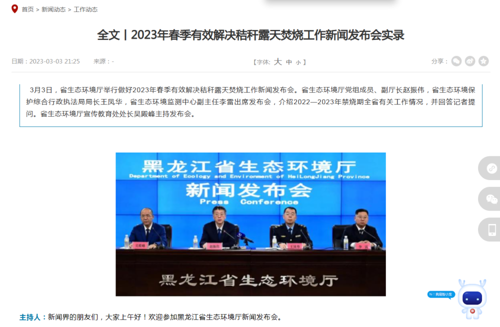

# 网传黑龙江185人因焚烧秸秆被罚1.782亿？官方：扣拨地方财政资金而非处罚农民本人

近日，不少自媒体文章在网络流传，称“黑龙江185人因违规焚烧秸秆被处罚1.782亿元，人均罚款96.3万元”。

_↑3月3日，黑龙江省生态环境厅举行做好2023年春季有效解决秸秆露天焚烧工作新闻发布会_

焚烧秸秆会收到如此的天价罚单么？红星新闻记者检索发现，该消息最初来自于3月3日中国新闻网的报道。报道指出截至3月3日，“针对秸秆禁烧管控不力、出现大面积露天焚烧现象，黑龙江省各市地已依规依纪问责党政干部414人，公安部门行政拘留露天焚烧秸秆及根茬残余物人员185人。黑龙江省联席会议办公室依据《黑龙江省禁止秸秆露天焚烧工作奖惩暂行规定》，594处秸秆及根茬残余物露天焚烧火点拟移交黑龙江省财政厅扣拨资金（罚款）1.782亿元。”

4月19日，黑龙江省生态环境保护综合行政执法局局长王凤华在接受红星新闻记者采访时表示：“必须要澄清的一点是，1.782亿是直接扣拨地方财政资金，跟焚烧秸秆的农民本人无关，此次对农民并无实际处罚。扣拨的资金我们最终还是‘用之于民’，用来奖励那些禁烧工作推行较好的地区。”

**1.782亿为扣拨地方财政资金**

**对185位农民本人无实际处罚**

上述原始报道中指出，“黑龙江省联席会议办公室依据《黑龙江省禁止秸秆露天焚烧工作奖惩暂行规定》，594处秸秆及根茬残余物露天焚烧火点拟移交黑龙江省财政厅扣拨资金（罚款）1.782亿元”。记者在黑龙江省人民政府检索到，这1.782亿元是发生在2022年11月1日—12月15日期间。

根据上文中提到的处罚依据，红星新闻记者在《黑龙江省禁止秸秆露天焚烧工作奖惩暂行规定》（以下简称《暂行规定》）中看到，这则于2018年9月1日起实施的《暂行规定》称，每年9月15日至12月10日、翌年3月10日至5月15日，两段期间内分别出现第一个火点的，省财政直接扣拨相关县（市、区）和省农垦总局、省森工总局、省监狱局50万元；再出现火点，按照每个火点30万元扣拨资金。省政府将秸秆露天焚烧扣拨资金，通过奖励和专项补偿的方式，划拨给禁止秸秆露天焚烧和综合利用工作先进县（市、区），用于下一年度秸秆综合利用项目和禁止秸秆露天焚烧等相关工作。在禁止秸秆露天焚烧期间，市、县级人民政府可根据实际情况安排资金对三级、四级网格员给予一定补贴。

此外，红星新闻记者还在黑龙江政府官网检索到，该《暂行规定》“2019-2020年禁烧期间，共扣拨资金（罚款）4070万元。”

近日，一些网友表示，对焚烧秸秆的农民处罚如此高额的罚款不合适。也有不少自媒体文章根据此前报道指出，“黑龙江185人因违规焚烧秸秆被处罚1.782亿元，人均罚款96.3万元”。

对此，王凤华表示，已经看到一些网友评论说这是对农民的处罚，首先感谢网友对他们工作的关注。“这里面有一个误解，说是对农民的处罚，其实不是这样，这不是对农民的处罚。”

王凤华说，截至目前奖惩规定仍在执行，1.782亿的扣拨资金便是依据此规定计算出来的。1.782亿是直接扣拨的出现焚烧秸秆火点地区的地方财政拨付资金，并且，这部分资金会用来奖励禁烧工作推行较好的地区，以便更好地调动地方推行禁烧工作的积极性。这部分资金与焚烧秸秆的农民之间没有什么关系。每年禁烧期结束由环境执法部门向省级财政报送禁烧情况，奖先罚劣。

他进一步解释，因为全省对于秸秆焚烧管控投入了大量资金，这有利于推动一些工作。这些钱被扣拨其实也是取之于民，用之于民。这些钱从工作不好的地方扣出来，拿给工作好的地方，起到激励和督促作用。未来被扣拨的地方还可以通过把工作做好，把钱奖补回来。

此外，王凤华还介绍说，对于农民焚烧秸秆，如果是造成火灾或造成重度污染天气或者对交通造成严重影响等严重后果的，由公安机关根据他们的具体行为和造成后果，依据治安处罚条例，对其进行相应的处罚。“根据《大气污染防治法》有关规定，可以对露天焚烧秸秆造成污染的处罚500元到2000元，但是我们主要以引导教育为主，对焚烧秸秆的农民本人并无实际处罚。另外，上述扣缴资金对农民的补贴和秸秆还田补贴都没有任何影响。”

**为何要对焚烧秸秆予以罚款？**

**秸秆也是资源，焚烧容易造成污染和灾害**

此外，红星新闻记者检索发现，黑龙江省人民政府办公厅2020年印发过秸秆综合利用工作实施方案，在这则方案中，提出对于秸秆还田、秸秆离田利用、秸秆还田离田机具都给出了一定补贴。对于秸秆利用的一些建设项目也设置了不同的补贴标准。

同时这则方案还提出，将秸秆综合利用工作实施情况纳入目标考核体系，实行目标管理省级制定验收标准和考核办法，开展重点考核和总体评价，对不能保质保量完成目标任务的，进行通报批评，秸秆综合利用率、还田率未完成既定任务目标和出现秸秆焚烧火点的要扣拨补助资金。秸秆资源台账系统中利用率和还田率比既定目标每低1个百分点，以县（市、区）为单位扣缴年度秸秆综合利用资金100万元。经生态环境部门核定每出现1个秸秆焚烧火点，以县（市、区）为单位扣缴年度秸秆综合利用资金100万元；每出现1个秸秆残余物焚烧火点，以县（市、区）为单位扣缴年度秸秆综合利用资金50万元。性质严重的，要进行约谈和严肃问责。对发现的违规违纪现象，坚决从重从严查处，严肃追究责任。

红星新闻记者在黑龙江省人民政府网站发现，当地相关部门及各地市多次对秸秆禁烧作出工作部署、调研、督导检查。

对此，王凤华介绍，黑龙江作为我国第一产粮大省，每年产生的秸秆量巨大。秸秆也是有价值的产品，若不对秸秆焚烧加以管控，不仅会容易造成火灾、空气污染、交通事故等后果，也可能会产生一定的经济损失。

王凤华说，秸秆如果利用好了，老百姓还能带来一部分收入，同时还减少污染和各种灾害的发生。比如通过秸秆的“五化利用”技术（肥料化、饲料化、燃料化、原料化和基料化），可以给老百姓带来额外的经济收入。对于秸秆的综合利用，相关部门也在积极地为老百姓寻找出路。

王凤华表示，近年来黑龙江省加大秸秆禁烧管控以来，已取得了显著成效。焚烧秸秆现象大大减少。尤其是2018年实施秸秆禁烧管控以来，空气质量呈现出逐年向好的趋势，优良天数比例目前已达到95.9%。下一步，将持续按照省委省政府的决策部署，坚决执行好大气污染防治工作。同时，在坚持现有做法情况下，推动地方政府提高秸秆综合利用率。

红星新闻首席记者 吴阳 实习生 李晨笑

编辑 郭宇 责编 冯玲玲

