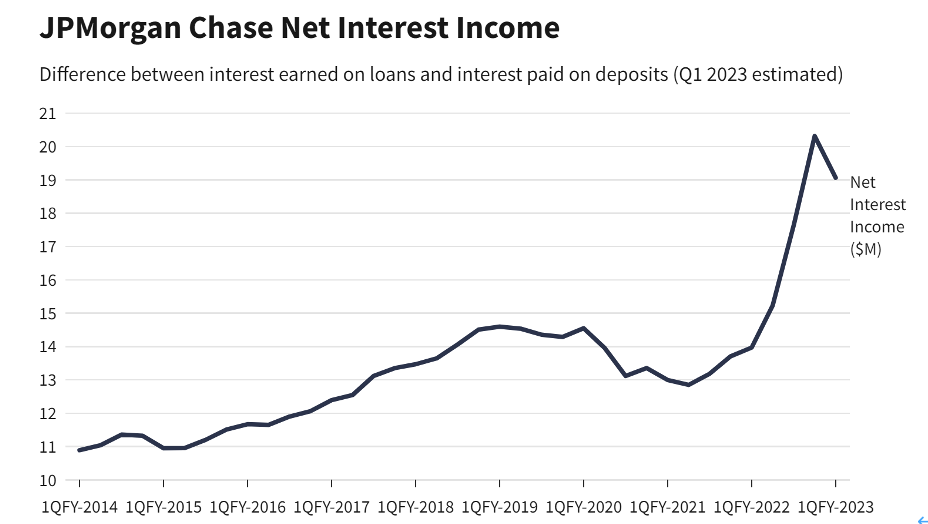

# 美中小银行危机引蔓延担忧 摩根大通净利润却增长80％｜潜望观察

腾讯新闻《潜望》 纪振宇 4月18日发自硅谷

3月份的美国中小银行业危机，令外界对于美国银行业的总体经营健康问题打上了一个大大的问号，这一轮危机是否仅仅局限于中小银行？大银行是否也存在潜在的类似风险？危机是否会有进一步蔓延的趋势？

上周末，美国资产规模最大的银行摩根大通发布的第一季度财报，给了外界强有力的回答：大银行经营状况依然稳健，随后，同一天发布财报的美国花旗银行、富国银行的业绩，也进一步佐证了这样的结论。

尽管一季度美国大银行财报让外界对银行业危机暂时松了一口气，但几乎所有已发布财报的美国大银行高管，在电话会上都透露出一种居安思危、未雨绸缪的态度，这也明确地反映在一季度财报数字中，几乎所有大银行应对潜在信贷损失的准备金都有所上升，而上升的主要业务部门均来自于消费信贷部门，在高通胀压力和经济放缓的大环境下，消费信贷恶化的趋势已经在美国大银行的一季度财报中悄然出现。

**摩根大通继续坐稳美国资产最大规模银行地位**

第一季度中，摩根大通实现了126亿美元净利润，同比增长52%，每股净利润4.10美元，远高于分析师此前预计的每股3.41美元的水平。

与此同时，截至第一季度，摩根大通账上的资产总额已经达到3.67万亿美元，继续坐稳美国资产最大银行的宝座。

在令人关注的存款指标方面，摩根大通第一季度存款总额由去年底的2.34万亿美元增长至2.38万亿美元，其中很大一部分增长来源于由于中小银行危机导致储户恐慌，将资金转存至大银行所导致。

得益于美联储从2022年开始进入的一轮加息周期，摩根大通享受到更大的净息差收益，第一季度净息差收入达到209亿美元，同比增长近50%。

在摩根大通的所有业务部门中，零售银行业务无疑是业绩的主要驱动力，第一季度收入165亿美元，同比增长35%，净利润52亿美元，同比增长80%。同时也是利润率最高的业务部门，权益回报率达到40%。

此外，公司和投行业务部门净利润为44亿美元，同比仅增长1%，收入与去年同期持平。

商业银行业务部门第一季度收入35亿美元，同比增长46%，净利润13亿美元，同比增长58%。

资产和财富管理业务第一季度收入48亿美元，同比增长11%，净利润14亿美元，同比增长36%。

纵观摩根大通的全部业务部门在第一季度的业绩表现，无疑可以用强劲来形容，收入规模最大和利润占比最大的零售银行业务，在大环境并不向好的情况下，居然依然能实现80%的净利润增长，而其他相对规模较小的业务部门，依然保证了良好的业绩增长，为总体的业绩起到添砖加瓦的贡献。

对于接下来全年的业绩，摩根大通的管理层也对外给出了乐观的预计，将2023年全年净息差收入由之前的740亿美元，进一步提高至810亿美元，这表明，第一季度业绩的强劲增长并非昙花一现，在美联储加息周期延续的背景下，摩根大通的业绩仍有望实现进一步的突破。

**大银行依然谨慎乐观、未雨绸缪**

尽管一季度美国大银行受益于美联储加息政策，没有受到中小银行危机所带来的连锁冲击，经营状况依然稳健，但几乎所有大银行的高管在财报后的电话会上，都表达出一种居安思危，为了未来美国经济下行的潜在风险做准备的态度。

摩根大通首席执行官杰米·戴蒙警告称，尽管美国经济依然保持强劲，但近期发生的银行业危机，可能使得贷款人更加趋于谨慎，并由此对消费带来冲击。

“我们在过去一年来密切关注的暴风雨前的云层，依然保持在水平面上，银行业动荡增加了这样的风险。”戴蒙说。

第一季度，摩根大通用于信贷损失的准备金为22.75亿美元，与去年年底22.88亿美元的水平基本持平，准备金增加部分主要来自于零售和企业贷款部分11亿美元的新增，摩根大通表示，准备金的增加主要受到对经济前景展望的恶化和由于信贷趋紧所带来的温和衰退可能性的上升。

富国银行首席财务官Mike
Santomassimo在电话会上对分析师表示，尽管大多数消费者在通胀压力下表现出韧性，但一些财务健康指标状况的趋势，较一年前已经有所减弱。公司正在采取措施对“放缓的经济”做好预案。

花旗集团首席执行官Jane Fraser 也认为，美国很有可能在今年底进入温和衰退。

“在信贷趋紧的环境下，可能加剧衰退的深度和持续时间。”Fraser表示。

花旗银行在第一季度中，拨备了2.41亿美元用于可能发生的潜在贷款损失，这相比一年前同期的1.38亿美元几乎增长了1倍。同样富国银行也在该季度中拨备12.1亿美元用于可能发生的贷款损失，相比去年同期的7.87亿美元同样大幅增加。

美国银行第一季度用于应对贷款损失的准备金为9.31亿美元，其中净新增的1.24亿美元主要受到高于预期的信用卡未偿还欠款增加导致。

尽管大银行抵御住了3月份中小银行业危机带来的对银行业整体信心的冲击，但在美国目前高通胀压力和经济下行的大背景下，没有一家大银行敢于对未来表达过度的乐观，消费信贷状况恶化的趋势，也已经悄然反映在一季度美国大银行的财报数字中。

