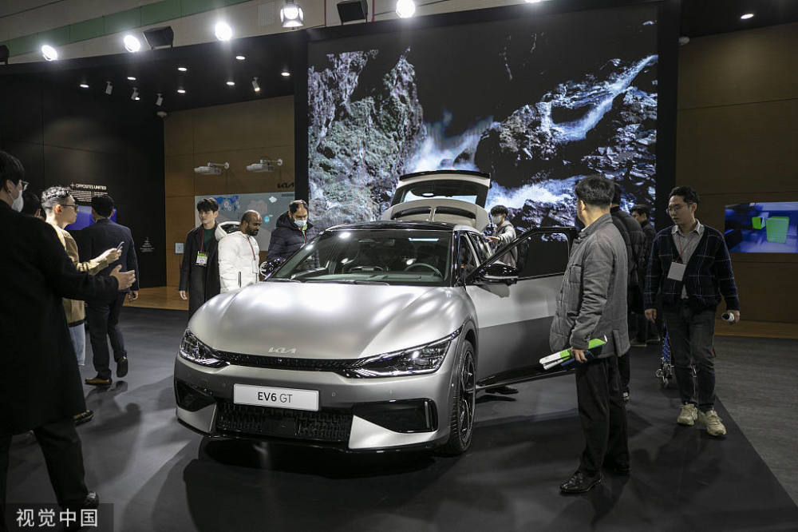

# 美国公布可获得补贴电动汽车名单，销量靠前的韩系车反而“全军覆没”

【环球时报驻韩国特约记者
张静】“美国竖起壁垒，露骨地推行‘美国优先’主义”，韩国《文化日报》18日报道称，在美国政府公布的可以获得补贴的电动汽车名单中，销量靠前的韩系车反而“全军覆没”。

_资料图_

美国政府当地时间17日发布《通胀削减法》细则，公布了可最高获7500美元补贴的16款电动汽车车型。细则规定，只有最终在北美组装的电动汽车才能以税额扣除的方式获得最高7500美元的补贴。规定还显示，电动车若使用50%以上北美组装的电池配件可享受每辆3750美元的补贴，若使用40%以上在美国或同美国签署自贸协定国家开采、加工的关键矿物可享受每辆3750美元的补贴。

根据韩国KBS电视台18日的报道，此次补贴名单中的大部分获益者为美国本土品牌，包括特斯拉Model 3和Model Y、雪佛兰沃蓝达、雪佛兰探界者、福特E-
Transit、福特野马以及凯迪拉克Lyriq等。在北美没有生产设施的现代起亚汽车以及德国和日本品牌的电动汽车均未被列入名单。

韩国《朝鲜日报》18日报道称，在美国阿拉巴马工厂组装的现代汽车GV70原本符合补贴范围，但细则公布后被排除在最终补贴名单外，原因是目前GV70使用的电池是由中国企业生产。此外，在北美设厂的日本汽车和部分美国品牌电动汽车也因不符合电池条件未能享受政策优惠。

韩媒称，这样的结果令一度在美国电动汽车市场销量排名第二的现代起亚集团面临严峻挑战。此前，拜登政府对反对《通胀削减法》的盟国解释称，美国将进一步扩大绿色能源汽车的比例，同时这是在电动车和电池领域的对华牵制之举。然而，随着后续政策的出台，这些国家的汽车企业发现，最终只有美国本土汽车厂商成为赢家。

据韩国纽西斯通讯社18日报道，目前现代起亚在美国绿色商用车的市场占有率从去年第一季度的5%增长到今年第一季度的28%。但业内分析认为，在“美国优先”政策的影响下，未来韩国产电动车在美国受到冲击将不可避免。韩国汽车融合技术院长李行久表示，美国正在通过《通胀削减法》极力扶持本国车企，未来韩系车在美国很有可能销量减少。

韩国《国际新闻》18日的报道称，釜京大学教授徐昌培当天针对美国公布电动汽车补贴名单表示，美国政府的电动车补贴计划是打着“牵制中国”的名号，但实际上干的却是打压韩国车企的勾当，这其实是限制外国企业在美国国内市场发展的行径。

