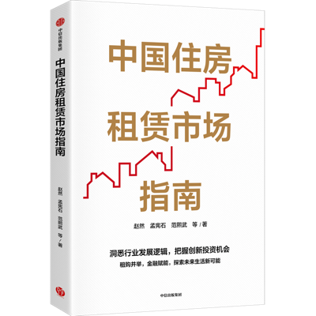

# 行业专家：住房租赁“中国模式”已形成 一辈子租房子没有什么可怕的

**本期精彩观点：**

  * _1_ 我们定义今年的关键词就是住房租赁的“中国模式”已经形成。
  * _2_ 我们认为房屋租赁租赁是房企转型的一个很好的赛道和契机，而且公募REITs进来后使这个赛道“投融建管退”的商业闭环逻辑跑通了。
  * _3_ 传统的房地产销售肯定是在走下坡路的，租赁住房肯定是在走上坡路的。两者一定会在某个时点有交集。这个交叉点很快就会来到了。

近日，一份一季度数据报告显示，全国重点40城住房租赁成交量同比增长14.7%。

报告披露，随着经济复苏的步伐，大城市新市民、青年人在春节后返城，其产生的新增、换租租赁需求旺盛，推动住房租赁市场热度提升。

在与腾讯财经的对话中，ICCRA住房租赁产业研究院院长、《中国住房租赁市场指南》作者之一赵然也表示，今年，房地产租赁在供给上肯定会出现一个井喷的状态，但租金并不会呈现一个爆发式地增长，而是会维持一个通货膨胀率的增长。

“2023年REITs要进行常态化发行，目前24只REITs里有4只是租赁住房产品，我相信今年这个数量肯定会翻倍。”

**谈及对年轻人的建议时，赵然坦然表示：“其实我在北京一直是租房，而且我要一辈子都租房子，我觉得这是一种生活方式。”她呼吁更多城市跟进“租售同权”政策。**

谈及年轻人把酒店当租房住的现象，赵然称：其实这就是高端公寓里的生活方式型公寓，它的位置都是在类似三里屯、国贸的核心地段，年轻人潮流聚集地，这一块的需求量还是相当大的。

**本期嘉宾｜赵然 ICCRA住房租赁产业研究院院长、《中国住房租赁市场指南》作者**

**文｜祝玉婷、袁小丽**

**以下为嘉宾精彩观点：**

**2010年后住房租赁真正进入市场化阶段**

**腾讯财经：当前中国租赁市场的现状是怎样的？存在什么样的问题？**

**赵然：**
如果按阶段划分，现在我们已经过了廉租房和公租房阶段，进入到长租房阶段。我们长租房的特征是双轮驱动，即有市场化的租赁住房，也有稍偏政策性的保障性租赁住房。

整体看，保租房每年每个城市都有相应指标。在“十四五”规划中，我们约定要完成870万套的保障性租赁住房，目前每年的进度都能按时完成，所以现在基本上处于一个供给和需求较为平衡的状态。

我们说整个市场其实已经进入一个快速蓬勃的发展时期。 **我们走过了公租房、廉租房阶段，从2010年以后，我们就真正进入了市场化阶段。**
这其中，从2017年提出“房住不炒”概念后我们进入到了一个快速发展通道。

**住房租赁的“中国模式”已经形成**

**腾讯财经：** 如果单从今年租赁市场的环境来看，您会用一个什么样的关键词来形容？

**赵然：我们定义今年的关键词就是住房租赁的“中国模式”已经形成。** 我们总结了三个特点：供给品质化、主体多元化、推力金融化。

从供给品质化来讲，现在的保障性租赁住房也好，市场化长租房也好，都讲究品质。因为我们不是为特定的低收入人群服务，而是服务于新市民和青年人。

从供给多元化来讲，分两个层面：一是国家供给渠道多元，租赁住房有新建类型，也有存量改造城市更新类型。所以，有一些开发商会去拿地、新建，建大型租赁式社区，同时还有一些企业已经拿出了一些存量的资产、物业或者土地来进行改造；

二是，参与主体也是多元化的。在公租房、廉租房阶段更多的参与主体是国企，但从2017年“房住不炒”政策落实后，我们更加强调市场化主体进入市场，它成了一门生意，所以我们更多地看到民营企业占比在加大，甚至有一些外资企业也进入到了市场，比如黑石龙地、Greystar等，但目前市场份额占比较少。

**最后一个关键词是推力金融化，这个行业的发展离不开金融，它的发展周期正好与金融快速发展阶段是相匹配的。**

看海外的情况，美国的租赁住房行业真正市场化的发展是始于1960年，在六七十年代，但它的公募REITs是在90年代推出的，两者差了几十年；

但是我国租赁住房进入市场化阶段就是2010年后，2020年公募REITs就已经落地，我们的发展速度比别的国家要快，金融推动行业发展时，会发现从一开始就是和金融市场、金融工具发展相匹配的。

**核心需求集中在沿海地区及中部核心省会城市**

**腾讯财经：** 从供给和需求的角度看，您如何看待不同城市之间住房租赁市场的差异？

**赵然：** 这分为两个维度：一是供需是否匹配，它是不是有比较旺盛的租住需求；二是城市之间的一些差异性特点。

首先说租住需求，从美国发展近百年的情况看，它的需求在东西海岸的热点城市和南部的佛罗里达，明显特点是集中在沿海地区。

所以我认为中国未来的核心需求城市也会集中在沿海地区以及中部一些核心省会城市。

再说城市间差异，
**我们目前是会监测约16个热点城市（北京、上海、广州、深圳、杭州、武汉、南京、成都、重庆、西安、长沙、合肥、厦门、天津、宁波和青岛），我认为将来肯定不是遍地开花，一些三四线城市可能不会有很旺盛的租住需求。**

我们把租赁住房按照目标客群分为四个产品类型：高端公寓、青年公寓、租赁式社区和宿舍型公寓，一线城市的产品结构比较丰富，这四条产品线都会有。但一线城市之间也会有差异，比如北京、上海的租金会比深圳、广州要高出一个档，因为深圳、广州有很多城中村产品，拉低了整体的平均租金价格。

再比如南京、杭州、西安这些省会城市，虽然租住需求也比较旺盛，但是它的产品线相对单一很多，所以青年公寓占比较大，也有很多新建项目是租赁式社区，但宿舍型公寓占比不高，因为城市的服务业并不那么发达。因为宿舍型公寓的用户是蓝领工人、“保时洁”客户（指保安、保洁、小时工）。

一线城市里，高端公寓也占一定比例，比如企业高管居住的服务式公寓，北京三里屯或上海新天地区域的生活方式公寓，有海外留学背景的一些年轻人、金领会选择这样的公寓。但它只会出现在一线城市，省会城市都很少有。

**机构管理类长租公寓需求将呈几何倍数增长**

**腾讯财经：** 目前城市间的租房需求处于一个什么样的水平？它的增长空间还有多大？

**赵然：**
目前的租房需求90%还集中在民宅部分，对于机构管理的长租公寓的租住需求还处于发展初期，未来将会以几何倍数增长，但一定聚焦在人口净流入且产业密集度高的城市。

以北京为例，“十四五”期间5年筹集保租房40万间（套），而我们长期监测的机构化品牌到2022年总供给量约6.2万间，在一线城市这个增长空间很大。

从年龄结构上看，还是以新市民和青年人为主 **，据统计，现在的租房平均年龄在25岁-40岁之间。**

**2023年在住房租赁供给上将出现井喷状态**

**腾讯财经：** 2023年住房租赁市场会有什么样的变化？包括政策、用户比较关心的价格这一块。

**赵然：** 整体来看，供给量还会持续增加。因为前两年疫情的影响，一些新建租赁住房，拿了地后建设工期滞后了，
**所以我认为今年供给上肯定会出现一个井喷的状态。**

既然供给增加了，就必然对租金有一个平抑的作用，租金并不会呈现一个爆发式地增长，而是会维持一个通货膨胀率的增长。

政策方面，我认为两方面可以期待：一是管理方面，一是金融财税端。

监管类，比如北京已经开始执行《住房租赁管理条例》，上海是2月1号开始执行，其他城市应该会陆续跟进。

金融财税端应该是今年的重头戏。因为2023年REITs要进行常态化发行，而保障型租赁住房是其中很重要的部分，
**目前24只REITs里有4只是租赁住房产品，我相信今年这个数量肯定会翻倍。**

另外，市场化长租房也会纳入到公募REITs探讨的范畴内，所以，市场会变得更加活跃。

**腾讯财经：** 2023年房地产业恢复情况是市场关注的焦点，住房租赁市场会怎样助力房地产市场的发展？

**赵然：** 首先，房地产企业转型势在必行，因为靠拍地、建设、再销售的逻辑，从市场发展规律看已经走到了收尾期，进入到持有物业且运营的状态。

所以，我们认为住房租赁是房企转型的一个很好的赛道和契机，而且公募REITs进来后使这个赛道“投融建管退”的商业闭环逻辑跑通了，大家投入的资本能在这个REITs的模式下回收、循环资金，它的商业模式是成立的，这种持有运营的业态也可以迫使开发商磨炼自己的资产管理能力。

**腾讯财经：** 住房租赁未来会成为房企的一个新的业务增长点吗？占其业务收入的比重会有多高？

**赵然：** 我个人认为目前的比重不会很高。因为目前住房租赁在这些房企里面的定位大概分为几类：

一类还是协同主业，比如主业是房地产，板块里会有商业运营、办公、产业园、租赁住房等等，叫“协同主业”，它必然不会超过主业。

另外一类就是像万科、龙湖等，已经从协同主业过渡到了一个“持有-
运营”的新赛道——这个赛道的主要特点是在依靠持续运营获取经营利润的同时，还可以享受资产增值的溢价。这在房企的战略布局中已经明确了的。所以，这种的将来逐步占比会越来越高。因为现在的租赁住房，如果一个房地产企业只有销售和租赁住房两个赛道，
**那它传统的房地产销售肯定是在走下坡路的，租赁住房肯定是在走上坡路的。两者一定会在某一个时点有一个交集和一个交叉点。我认为这个交叉点很快就会来到了。**

**腾讯财经：** 为了推动租房市场的发展，未来还有哪些措施有待推出？

**赵然：** 我认为更多的是税收方面的政策，需要去呼吁一下，包括减税。

在新个税法里，租房可以帮助普通用户进行“专业附加扣除”，因此它侧面推动了普通用户的租房占比。

另外，在公积金层面，是否会有更多城市推出公积金用于租房？是否有可能成为普适每个城市的举措？

还有一个最重要的， **我觉得在“租售同权”还需要更多的地区跟进推出优惠政策，今年开始应该会有更大的动作。**

我觉得，未来肯定还会出台一些针对房屋租赁机构的政策，更多地赋能机构。比如按照租赁式社区或者是青年公寓，一定要配备便利店、公共空间、商业等等。所以机构化管理方面也会有更多的政策出台。

**腾讯财经：** 在现在这个大背景下，您会建议年轻人选择租房，还是攒钱买房？

**赵然：其实我在北京一直是租房，而且我要一辈子都租房子，我觉得这是一种生活方式。**

我认为人对房子有三种诉求：居住、投资、情感。居住诉求，无论是租房还是买房都可以满足；投资诉求，买房当然可以保值增值，但是现在公募REITs出来了，个人投资者也可以买REITs来间接享受到房地产增值的溢价，所以租房也可以满足。

最后是情感需求，只要打破了情感需求，我觉得一辈子租房子没有什么可怕的。在中国传统观念里，情感需求占比挺高，大家觉得有固定资产对自己和家庭来说是一个稳定的因素。

所以，接下来就是要推动“租住”的生活方式能推广到全社会。怎么推广？比如公寓、社区，它要有很强的家的感觉，租户一进去，有24小时的管家，租约、租金涨幅是白纸黑字写到租赁合同里，押金、租金都是打到专项账户监管，不会有过多精神层面的纠纷。

同时每周管家会很热情地举办各种活动。它已经超出了传统物业管理的服务，介于酒店管理和物业管理之间，会提供高品质的服务。

现在一些品牌类的公寓里，这些已经是很常见的现象，所以这就是一个品质化的表现。

**腾讯财经：** 作为一个普通租户，在选择租房机构时应该关注哪些风险？如何规避？

**赵然：** 第一，选择机构类管理的房子，完全可以去避坑；选个人租房时，可以通过中介平台，因为住房租赁管理条例的出台，以前关于租房的乱象已经被治理。

第二，如果是具体到如何选机构类品牌，一是可以在各地住建部门的网站上查询是否有政府备案，二是可以关注我们的公众号，对各个品牌都有过研究。

**腾讯财经：** 如何看待年轻人长期住在酒店的现象？是一阵风还是未来确实有可能成为酒店的一种常规业务？

**赵然：**
其实这就是高端公寓里的生活方式型公寓，就类似酒店，它的位置都是在类似三里屯、国贸的核心地段，年轻人潮流聚集地，这一块的需求量还是相当大的，从目前ICCRA统计的数据来看，2021年高端公寓整体占比为4%，2022年这一数字上升至7.2%。

分享一个有意思的事情：除了这类租住酒店的年轻人群体外，我们调研发现很多年轻人在找房子的时候会考虑3个因素：租约稳定、交通便利，第三个是能否带宠物。现在的年轻人信奉的就是“我可以不去结婚生子，但是我不能没有宠物的陪伴。”

所以，机构化管理的集中式公寓，已经开始为这些带宠物的租客提供一些设施了，比如专门设置遛狗的地方，宠物花园、宠物房间、设置猫爬架，公寓的家具都是耐磨的，甚至地下空间有洗狗机。所以服务体系这块未来可以慢慢探索的空间还很大。

**腾讯财经：** 您认为租房市场的消费群体还是以年轻人为主吗？

**赵然：**
租房市场的消费群体还是覆盖了很大的年龄跨度，国家保障性租赁住房的政策也是要满足“新市民、青年人”。这里说的“新市民”就不仅仅是年轻人了。当然租房的原因也具有多样性。我个人感受周围很多人都在租房，原因各异，比如孩子在北京、上海上学，就要租房子；或者老人帮忙“打工人”带孩子，也需要租房子，租改善型的大房子。像我周围的同事，我身边的朋友完全都有租房的经历，有的是自己租改善型的大房子，有的是给照顾子女的老年人租房子都会租。

年轻人应该是租房刚需人群的主力消费群体，特别是机构化管理的租赁住房产品一开始也都是为年轻人量身定制。但是随着租赁住房产品的多元化发展，适合各个年龄层的产品也陆续面市。

比如适合家庭客群的租赁式社区已经逐步走入大家的视线。首先，这类租赁式社区本身的市政配套较为齐全，如幼儿园、小学等，在一定程度上可以解决“新市民”租房上学的问题；其次，有很多家庭也会由于子女教育问题，“孟母三迁”，离开自有住房，选择租住在距离子女学校更近的位置，这些面积适中的二居室和小三居正好可以满足这部分人群的需求；最后，还有一部分三代同堂家庭，在短期无法通过购房途径达到居住改善的目的的情况下，租赁式社区就成为了一个好的选择。

_图注：《中国住房租赁市场指南》，本篇对话嘉宾赵然系书籍作者之一。洞悉行业发展逻辑，把握创新投资机会，租购并举，金融赋能，探索未来生活新可能。_

