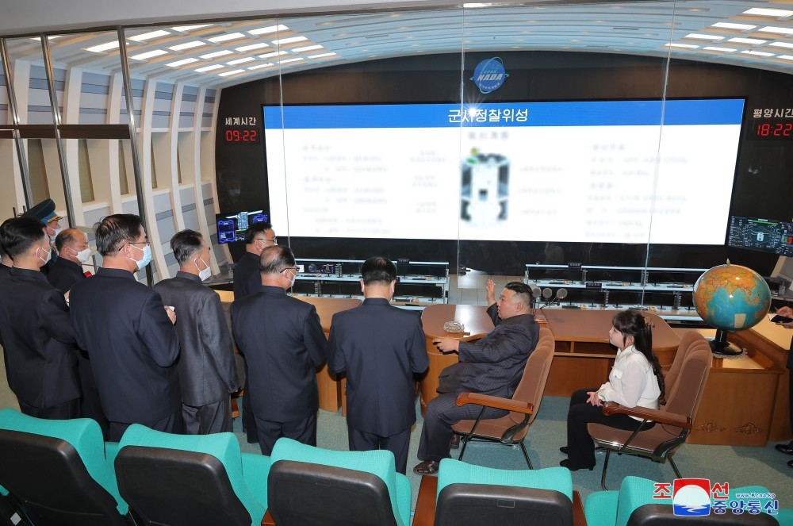
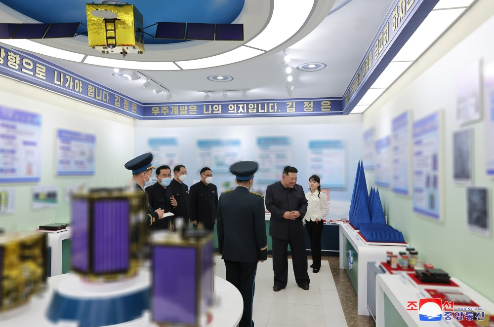
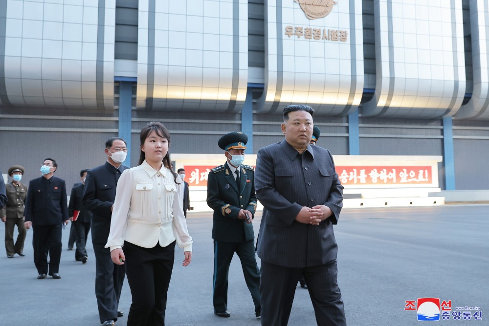
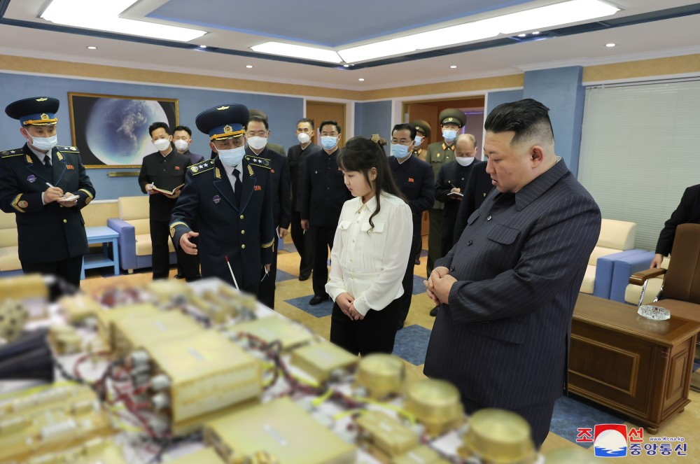
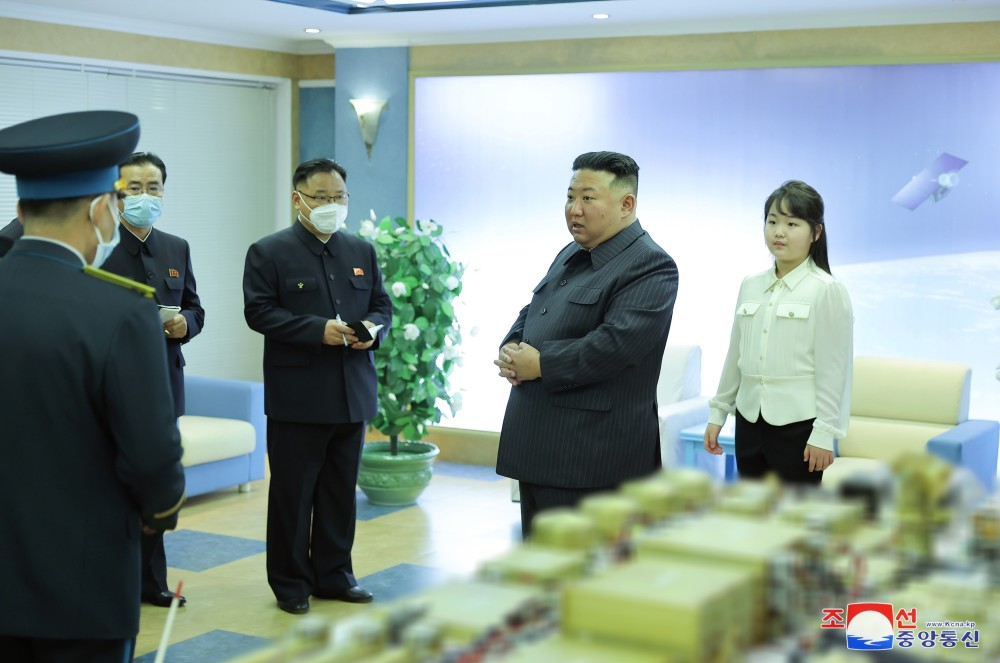
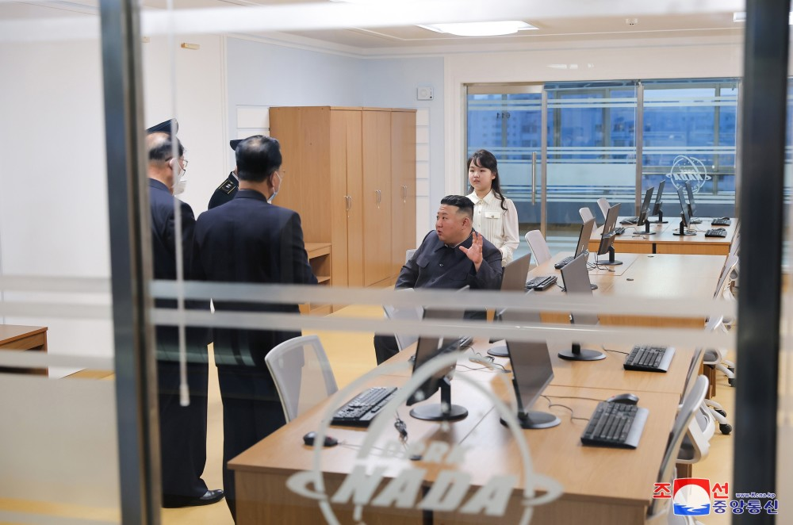
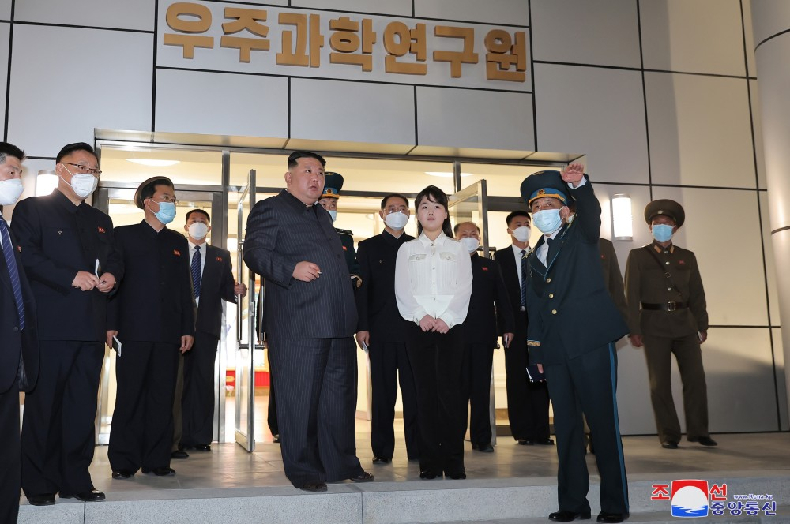

# 金正恩视察朝鲜国家宇宙开发局，要求如期发射“军事侦察卫星1号”

据韩联社消息，朝鲜中央广播电台19日报道，朝鲜国务委员会委员长金正恩前一天对朝鲜国家宇宙开发局进行现场指导，并指示如期发射“军事侦察卫星1号”。

_图自朝中社，下同_

报道称，金正恩在现场指导中要求，组建非常设性的卫星发射筹备委员会，以如期发射已制作完成的军事侦察卫星1号。与此同时，抓紧推进项目的准备工作，争取接连发射并部署多颗侦察卫星，增强侦察和情报收集能力。

