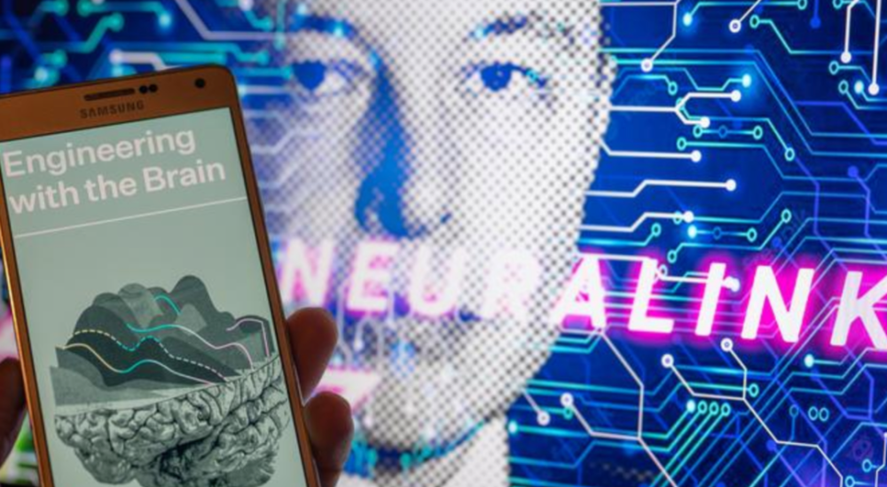

# 马斯克的脑机接口公司计划“人体试验”，让大脑连接芯片有哪些风险？

**划重点**

  * _1_ 脑机接口，作为在脑与外部设备之间建立直接的通信渠道，常用于帮助、增强、修复人体缺失的感觉。比如帮助瘫痪的患者再度行走，使有视力障碍的人能够重见光明。
  * _2_ 广阔的商业化前景引起了科技巨头的关注，比如马斯克创立的Neuralink，主要从事研发计算机与人脑融合技术，开发一种设计用于植入大脑的计算机芯片。
  * _3_ 脑机接口技术的出现，让一些患者有了痊愈的可能。但是这项技术的风险和代价也不容忽视。

【编者按】据外媒近日报道，马斯克的公司正在寻求今年之内进行神经链人体临床试验的许可。脑机接口（BCI）设备究竟会对人类产生怎样的“奇异效果”？这项被马斯克称为“改变世界的技术”可能会让人类付出何种代价？本期《硅谷封面》第五期聚焦脑机接口的技术进展，及脑机接口带来的伦理和安全问题。

_「硅谷封面」系列聚焦硅谷科技大公司动态、科技大咖访谈、重磅研究报告等，旨在为科技资讯爱好者提供全球最前沿的深度好文。_

在过去的七年里，马斯克的公司Neuralink，一直在开发一种设计用于植入大脑的计算机芯片，其声称该芯片可以监测数千个神经元的活动，希望可以帮助瘫痪的患者再度行走，使有视力障碍的人能够重见光明。

此前，Neuralink培育了一只能够“脑控”玩简单电脑游戏的猴子
“Pager”，震惊了全世界。然而，创新技术的发展从来都不是一帆风顺的，去年的Neuralink可谓是走入了“水逆期”：
多个在实验中的猴子死亡，Neuralink因嫌虐待动物涉登上头条、随之而来的公司内部变动，内部高管开启了一波“离职潮”、美国食品和药物管理局（FDA）申请许可被拒绝等等，都给该公司带来了不小的冲击。与此同时，Neuralink研发交付也迟迟无进展公布，使得人们对于脑机接口的发展开始质疑不断。

而在最近，Neuralink有了一波新进展，
根据外媒报道，Neuralink计划下个月（5月）开始“人体试验”。并且，他们正在寻找合作伙伴来协调初始实验。对此，本文带各位网友一起回顾Neuralink的发展史，以及解读脑机接口带来的变革和存在的风险性。

**01\. “命运多舛”的Neuralink：深陷舆论风波，多位创始人高管相继离职‍‍‍‍‍‍‍‍‍‍**

Neuralink成立于2016年，由特斯拉汽车公司和太空探索技术公司SpaceX的创始人埃隆·马斯克创办。在Neuralink创办之初，Elon
Musk曾表示，“在人脑中植入电极，将人类大脑与计算机相连，未来可以直接上传和下载想法”。

在创办后的两年里，Neuralink几乎淡出了公众视野，直到2019年该公司召开了关于脑机接口研究的发布会，并在预印本杂志《bioRxiv》发表了一篇未经同行评审的论文，才重回公众视野。同年，该公司推出了第一个植入式脑机接口设备，并在第二年公布了硬币大小、电池供电的
N1
芯片植入计划，展示了其成功采集了猪的大脑电生理信号。而后来引发舆论狂潮的事件则出现在2021年，彼时该公司放出了一个3分28秒新视频，视频中一只9岁的猴子Pager正在用意念玩电子乒乓球游戏，它的大脑内被植入了Neuralink的脑机接口设备。

自此，Neuralink经常出现在生物技术相关的新闻上。虽然相关报道诸多，但该公司的技术在市场推广上却一直未取得实质性的进展，到2022年初才向美国食品和药物管理局（FDA）申请许可。

人体测试是其产品获批过程的一个重要里程碑。Neuralink在所谓的脑计算机接口（BCI）设备的利基市场中竞争。这类设备使用穿透大脑的电极或位于其表面的电极，以提供与计算机的直接通信。然而目前，没有一家公司获得FDA的最终批准来销售BCI大脑植入物，尽管对其所属类别的确切定义在业内存在争议。

意料之中的是，FDA在去年拒绝了Neuralink的申请，主要是考虑到安全问题——尤其是锂电池安全性问题，比如植入物的微小电线可能会迁移到大脑的其他区域；以及该设备如何在不损害脑组织的情况下，可以被移除等等方面，都有待商榷。此外，Neuralink在追求获批的道路上还面临着来自政府的合规性调查。据路透社去年年底独家报道，联邦政府正在调查该公司对待其实验动物的方式。三名
Neuralink
员工告诉路透社，公司领导希望加速动物实验来收集数据，以解决FDA对人体试验批准的担忧。而员工们则越来越担心该公司仓促地进行实验，会加剧猪、羊和猴子遭受痛苦和死亡。

“祸不单行”的是，Neuralink也经过了一场前所未有的内部人事变动和高管离职潮。十几位Neuralink公司的现任和前任员工描述了目前的工作环境：虽然公司的发展目标高远，但从目前的情况来看，也是松散和无序的。虽然马斯克是领导层中为数不多的不变因素之一，但是包括著名科学家在内的八位公司创始人几乎都已离职。

对于内部出现如此分歧的原因，有分析表示可能是自公司成立以来， **为了节省成本，一直在不断雇用和提拔年轻员工。**
员工们说，这一策略节省了资金，也很符合马斯克的雇佣想法——即年轻员工的创新能力往往比年长的员工更强，但是，
**由于这些员工缺乏医疗监管方面的经验，一度导致Neuralink内部发展出现紧张的局势。**

比如该公司前总裁马克斯·霍达克（Max
Hodak）在Neuralink成立之初加入时还未满30岁。在加入Neuralink之前，霍达克在杜克大学读大学，就读期间曾在一个神经工程实验室工作，之后又创办了一家云计算创业公司。四名现任和前任员工说，目前公司与FDA的一名关键联络人是一名20多岁的软件工程师。

据外媒透露，“在某次公司会议上，马斯克说，如果公司研发进展没有加快，他将在Neuralink进行重大改革”，这位消息人士回忆说。几周后，据几位现任和前任员工讲述，马斯克解雇了公司总裁和实际领导人霍达克。而在解雇霍达克后，一个高管团队填补了这一空缺。据员工讲述：领导层中包括希冯·齐里斯（Shivon
Zilis），她与马斯克关系十分“密切”，曾在一家风险投资公司工作。在去年，齐里斯与马斯克生了两个孩子，但她称这段关系并不浪漫。根据她的领英（LinkedIn）页面，目前她是该公司运营和特别项目总监，这样的任命无疑让员工更加怀疑公司的公平和公正性，也对公司的发展前景表示堪忧。

时至今日，Neuralink的研发终于有了最新进展。据外媒报道，近日，六位知情人士透露，Neuralink公司一直在与位于亚利桑那州凤凰城的神经疾病治疗和研究机构Barrow
Neurological
Institute洽谈，准备在监管机构允许的情况下在人类身上测试其设备，而该机构是其潜在的临床试验合作伙伴。一旦监管机构允许，Neuralink将展开产品人体试验。

**02.从科幻小说到十亿美元的产业**

“如果我们希望在人工智能主导的世界中生存，就必须拥抱人机融合”，马斯克在一次解释Neuralink的潜在用途时曾表示。他希望将大脑与计算机连接起来，以便下载大脑深处的信息和记忆，就像
1999 年的科幻电影《黑客帝国》中的情节一样。

在电影中，一名男子接受了侵入性脑部植入物以帮助治疗他的癫痫发作。虽然手术最初很成功，但当持续接触芯片后（比如算力过载时），该男子出现了精神失常问题。就像科幻电影中常常上演的那样，一位科学家通过将植入物与
1940 年代和 1950 年代的脑叶切除术进行比较，并对此进行了“警告灾难”：“他们创造了数量未知的「人类植物」”。

尽管电影画面中的飞行汽车、人类移民火星等设想在短期较难实现，但脑机接口目前已逐步变为现实，并且超越了早期科幻电影的描述。目前，全世界已有超过200,000
人出于医疗方面的原因在使用“某种形式的脑机接口”。比如人工耳蜗可以让听力损伤的人重新听见世界的声音，而脑机接口的另一个主流用途是预防癫痫发作，现有设备可以监测大脑信号活动来警告患者避免某些活动，或者采取预防性药物治疗。

其实，用于治疗帕金森病、抑郁症、强迫症和癫痫症的植入物已经在人体试验中进行了多年。尤其在目前，人工智能和神经探测材料方面的飞速发展使得这些设备的体型更小，可扩展性更强，很快吸引了一波资本市场的关注。市场情报公司
Grand View Research 对 2021 年全球大脑植入市场的估值为 49 亿美元，其他公司预测到2030年这一数字可能翻一番。

目前BCI虽仅限于医疗领域，但已经为该技术提出了大量的非医疗用途。比如2018年发表的一篇研究文章，描述了参与者使用 BCI 与 Android
平板电脑上的众多应用程序交互的情形，包括打字、消息传递和仅通过想象相关动作来搜索网络。更多的推测性应用包括玩视频游戏、操纵虚拟现实，甚至直接接收文本消息或视频等数据输入，而无需显示器。这些听起来像是科幻小说，但现实是我们已经达到了这样一个地步。与此同时，这种技术的文化和道德障碍已经开始超过技术障碍。尽管“终端人”是虚构的，但它的灾难性转变引发了关于脑机接口无意影响的真正问题。

与许多新型的BCI设备一样，Neuralink尚未获得批准对其侵入性植入物进行临床试验。而整个市场竞争，虽然不像AI领域创业公司“百家齐放”，但在技术方面的竞争也是十分激烈的。除了Neuralink，目前还有三个研究团队正在进行临床试验，值得我们关注：

**第一个是最古老的先进BCI植入系统**
：BrainGate系统于1998年在马萨诸塞州成立，自20世纪90年代末以来一直存在，这使其成为最古老的先进BCI植入系统之一。其设备使用微针放置在大脑中，与Neuralink使用的技术相似。在BCI功能方面，BrainGate的设备可能是最先进的。它的一个有线设备的打字速度为每分钟90个字符，或每秒1.5个字符。

**第二是荷兰乌得勒支大学医疗中心首个为患者实现可以带回家的全无线植入式BCI技术。**
其设备使用基于皮质电图的BCI（ECoG），金属盘形式的电极则直接放置在大脑表面以接收信号。它们以无线方式连接到接收器上，而接收器又连接到计算机上。在2020年到2022年进行的一项临床试验中，参与者能够将该设备带回家，每天使用，持续大约一年时间。该设备使患者能够控制电脑屏幕，并以每分钟两个字符的速度打字。虽然这个打字速度很慢，但未来带有更多电极的版本预计会有更好的表现。

**还有Neuralink的强劲对手——Synchron公司，**
于2016年在澳大利亚墨尔本成立，2019年，它成为第一家在澳大利亚被批准进行临床试验的公司。其后在2020年，它成为第一家获得美国食品和药物管理局批准使用永久植入的BCI进行临床试验的公司——今年也终于在一名美国患者身上做到了这一点。

Synchron的方法是通过使用血管在大脑中植入电极来绕过全脑手术。这种微创方法类似于诊所中常规进行的其他支架手术。与Neuralink一样，Synchron的目标是帮助瘫痪的人用他们的大脑完成打字。据路透社去年8月报道，随着Neuralink追赶的步伐，马斯克于去年夏天与Synchron公司接触，商讨投资事宜。

在政府支持方面，美国设置了专门服务支持和资助医疗创新的美国国立卫生研究院（NIH），也在试图通过公私合作来帮助大脑植入技术相关公司，这是其“BRAIN计划”（通过推进创新神经技术进行大脑研究）的一部分。该机构为六家公司提供资金，包括初创企业
Blackrock Neurotech 和医疗设备巨头美敦力 (Medtronic)。 该项目于 2014年启动，今年将获得约 6.8 亿美元的资金。
除了拨款之外，它还提供访问政府专家的机会，他们就如何获得 FDA 批准和将设备商业化提供建议。

BRAIN 计划团队负责人 Nick Langhals 表示，该机构曾向 Neuralink 抛出橄榄枝，但遭到拒绝。 “我们不会将像 Neuralink
这样的公司排除在名单之外，但他们不感兴趣”，他补充说，该公司没有解释原因。据一位听过马斯克此类评论以及了解马斯克对 NIH
看法的消息人士称，马斯克认为，NIH 的资金会带来不必要的公众监督和官方障碍。

总的来说，Neuralink目前还在一直被夸大承诺的“黑历史”所困扰——如未能按时交付、引发了对违反动物福利指控的联邦调查等。Neuralink公司下一步将采取何种举措，其人体实验是否能够如期开展，我们拭目以待。

**03.高价值与高风险并存**

虽然BCI可以运用到诸多领域，尤其在疾病治疗方面潜力无穷，如治疗神经系统损伤；帮助提升记忆力、注意力或解决问题；促进辅助设备或假肢的沟通和控制；治疗抑郁症或焦虑症等精神健康状况等，但其目前还有多方安全隐患亟需关注。

在此次事件中，FDA拒绝Neuralink的申请原因也是业界重点关注的问题。在对Neuralink的拒批书中，FDA列出了该公司必须在人体试验前解决的安全问题。据梳理，主要有如下七方面，值得我们重点关注：

第一， **该设备的电线（携带电极）可能会迁移到大脑的其他区域。** 前FDA官员维克多·克劳特哈默（Victor
Krauthamer）表示，这些比头发丝还细的电极，一旦迁移会诱发炎症，损害大脑关键区域的功能，并使血管破裂。同样，迁移问题也会侵蚀设备的有效性，导致手术切除的风险。而Neuralink已经试图通过对几十头猪进行动物试验来解决这个问题。

第二，Neuralink公司提议用一种新型的充电系统制造其设备，该系统涵盖可以远程充电的锂电池。FDA要求Neuralink在动物实验中证明，该电池故障机率极低。脑移植专家对此评论说，
**如果与电池电流相连的设备的任何组件发生故障，电流可能会损害脑组织。**

第三 ， **FDA还提出了关于该设备是否可以在不损害脑组织的情况下被移除的问题。** 工程师亚历克斯·伍德·托马斯（Alex Wood
Thomas）被问及未来为植入升级版设备而移除原设备的潜在危险时他回答说，由于螺纹的尺寸很小，在大脑中的疤痕非常小，所以实际上很容易被移除。但据路透社报道，两位Neuralink消息人士和内部讨论称，几位员工对他的发言提出异议，认为其具有误导性，没有动物实验的支持。伍德·托马斯为此拒绝发表评论。

第四， **FDA还对该设备可能过热的问题表示担忧，** 这也有可能损害脑组织。

第五， **BCI的另一个潜在风险是私人或政府机构可能将其用于不当目的。**
例如，黑客可以通过BCI，来操纵使用者的思想和行为。无论是出于恶意还是为了个人利益，这样的违规行为可能会对受影响的个人和整个社会产生严重后果。

第六， **由于 BCI 难以在经济上支持和维护，通常需要侵入性脑部手术来移除和重新植入，因此这种依赖性变得更加复杂。** 由于 BCI
很大程度上仍处于试验阶段，缺乏通用标准或稳定的资金支持，许多设备面临突然失去资金的风险。供应链问题、硬件更新或公司破产可能会扰乱早期采用者的自我意识。

第七， **计算机访问人类脑电波也会带来隐私问题。**
“例如，如果你有一个设备来帮助你移动你的假肢，那么该设备就会拾取你可能不希望从大脑中消失的其他噪音源”，即有人可以通过研究你的脑电波学到很多东西，如果黑客设法访问你的数据，从某种意义上说，他们可以通过寻找大脑信号活动的特定表达来读懂你的思想。

由于 BCI
目前主要局限于医疗领域，因此大多数早期采用者乐于使用此类设备。韦克斯勒说：“如果有人因残疾而无法交流，他们通常会很高兴有一种技术可以让他们正常交流。”
但是，撇开非医疗 BCI 可能会带来许多新问题的想法不谈，在普通人的头脑中拥有一个 Fitbit
（智能设备）是否值得，其中的权衡和取舍则是一个更为复杂的问题。

虽然我们距离埃隆·马斯克等人所预言的电子互联思想的机器人未来还有很长的路要走，但该行业的加速增长加剧了曾经仅限于科幻小说的道德考虑的紧迫性。“如果大脑芯片可以改变人类性格的关键部分，公司不应该急于将它们植入人们的大脑”，韦克斯勒表示，“虽然业内大多数人对将
BCI 用作消费产品持开放态度，但他们仍然认为这有可能发生。如果确实如此，整个风险收益权衡都会改变。”

【本期由硅谷封面和RockFlow Universe联合发布，未经作者授权，请勿转载。】

**Ref：**

https://www.businessinsider.com/brain-chips-elon-musk-neuralink-change-
personality-behavior-computer-tech-2023-2

https://www.reuters.com/investigates/special-report/neuralink-musk-fda/

https://www.washingtonpost.com/business/2023/03/03/brain-chips-paradromics-
synchron/

https://www.businessinsider.com/brain-chips-elon-musk-neuralink-change-
personality-behavior-computer-tech-2023-2

**往期回顾：**

第四期：硅谷又一位印度裔CEO上任，能否解救正在困于危情的Youtube？

第三期：两万条推文告诉你，马斯克的“疯狂文学”是如何养成的

第二期：寒气传到硅谷！三年上千家公司裁员超20万，大厂精英们告别“黄金时代”

第一期：8年烧光30亿美元，贾跃亭和他的法拉第未来还是一地鸡毛

