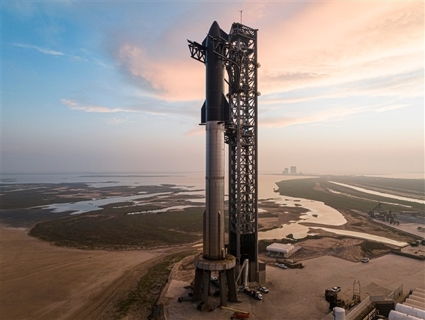

# SpaceX星舰北京时间今日21时许重新发射：目前系统一切正常

快科技4月20日消息，前两天，被称为人类最强火箭的SpaceX星舰首飞测试失利。

据马斯克介绍， **星舰发射推迟的原因是压力阀被冻结，且短时间内无法恢复工作，所以在发射倒计时40秒时突然停止。**

根据SpaceX官方消息， **他们将在今晚再次尝试发射，发射窗口为北京时间4月20日21时28分-22时30分。**

**截至目前为止，星舰所有系统一切正常。**

此次尝试发射的星舰火箭(B7)、飞船(S24)、超重型助推器将构成真正完整版的星舰，将进行轨道级飞行测试(OFT)，目标是低地轨道(LEO)，尝试绕地球飞行一圈，最后在夏威夷附近的太平洋上海上着陆。

星舰(Starship)将是有史以来最高、最强的火箭，高度达120米(大约40层楼)，地球轨道运载能力超过100吨，可将货物与宇航员送往地球轨道、月球、火星甚至更远的深空。

同时，它也是第一个可完全重复使用的火箭，执行任务后返回发射场，和猎鹰9号火箭的一级相似，使用四个不锈钢栅格舵控制姿态落点。

星舰由两部分组成， **一级助推器“超重”(Super Heavy)高度约69米，配备多达33台第二代海平面版猛禽发动机，**
液氧/甲烷推进剂，每台推理2000千牛(204吨)。上级“星舰”(和系统同名)高度约50米，配备3台海平面版猛禽发动机、3台真空版猛禽发动机。

