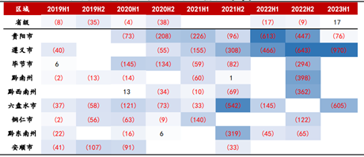

# “无力化债”哭诉文后，贵州省化债迎重磅支持，再现贷款重组可能性大

**财联社4月20日讯（编辑 杨斌）**
据贵州发布官微，4月18日贵州省政府与中国中国信达资产管理股份有限公司签署合作协议。作为国内不良资产处置龙头之一，中国信达将为贵州高质量发展贡献力量。上周，贵州省政府发展研究中心刊发“无力化债“的文章曾引发关注。目前，贵州省城投平台存量债总额为3180亿元，2023年、2024年分别到期726亿元、1026亿元。对于贵州省的债务化解，机构认为未来出现局部银行贷款重组的可能性更大。

**联手不良资产处置龙头，贵州省化债迎重磅支持**

4月18日，贵州省委书记、省人大常委会主任徐麟，省委副书记、省长李炳军在贵阳会见中国信达资产管理股份有限公司（简称“中国信达”）党委书记、董事长张卫东一行，共同出席《贵州省人民政府中国信达资产管理股份有限公司战略合作协议》签约仪式。省领导吴强、陈少波，中国信达党委副书记、总裁梁强参加。

徐麟表示，当前贵州坚持以高质量发展统揽全局，奋力推动贵州高质量发展实现新跨越。希望中国信达继续关心支持贵州发展，更好实现互利共赢。张卫东表示，中国信达将充分发挥自身优势和功能，进一步深化与贵州的务实合作，为贵州高质量发展和现代化建设贡献力量。

早先4月17日，贵阳市人民政府、贵安新区管委会与中国信达资产管理股份有限公司贵州分公司、信达地产股份有限公司签署《贵阳市人民政府贵安新区管委会中国信达资产管理股份有限公司贵州省分公司信达地产股份有限公司战略合作协议》

中国信达是我国四大不良资产处置公司之一，此番联手不良资产处置龙头，或为贵州省化解债务增添重要力量。

**此前发文无力化债，贵州省平台未来两年到期债券近2000亿**

贵州省的债务状况令人关注。4月12日，贵州省政府发展研究中心曾刊发《化债工作推进异常艰难，靠自身能力已无化债方法》一文，引发热议。目前，此文已被删除。

该文表示，近期，省政府发展研究中心财税金融研究处先后赴贵阳贵安、遵义、毕节六盘水等地开展了化解贵州地方政府债务情况专题调研。调研发现，债务问题已成为摆在各地政府面前重大而又需解决的问题，但
**受制于财力水平有限，化债工作推进异常艰难，仅依靠自身能力已无法得到有效解决**
。下一步，调研组将根据了解到的实际情况和各市县反映的突出问题，积极向国研中心争取智力支持，为化解贵州地方政府债务提出差异化、可操作的建议。

根据国盛固收首席分析师杨业伟的数据，目前贵州省城投平台存量债总额为3180亿元，其中省级存量债为604
亿元，主要集中在贵州高速、贵州交通和贵州水投；市级存量债为1111亿元，主要集中在遵义道桥、贵阳城投和遵义交旅投。未来几年，贵州省城投债券到期压力在2024年最大，2023年、2024年和2025年到期总额分别为726亿元、1026亿元和690亿元。

具体来看，据企业预警通，贵州高速公路集团有限公司（简称“贵州高速”）是贵州省资产规模最大的城投平台，存量债余额248亿元，贵州交通建设集团有限公司（简称“贵州交通”）存量债余额131.2亿元，贵州省水利投资(集团)有限责任公司（简称“贵州水投”）存量债余额75亿元。地市级平台中，贵阳市城市建设投资集团有限公司（简称“贵阳城投”）存量债131.28亿元，遵义道桥建设(集团)有限公司（简称“遵义道桥“）存量债200.72亿元，遵义交旅投资(集团)有限公司（简称”遵义交旅“）存量债80.96亿元。而园区级平台贵州贵安发展集团有限公司存量债多达324.47亿元。

除了债务总量规模较大外，民生固收首席分析师谭逸鸣指出，贵州省下辖诸多主体不仅债务压力较大，且高成本的融资较多，债务利息覆盖压力愈发增大；且存在非市场化发行，一二级倒挂现象严重（一二级倒挂幅度=发行时票面利率-
上市后首次有估值日估值）。另外，贵州的非标逾期等信用负面事件仍然频发，定融发行仍在继续。

_图：近年贵州省各区域一二级倒挂情况（bp）（资料来源：民生固收，财联社整理）_

_图：贵州省近年非标逾期事件数（次）（资料来源：民生固收，财联社整理）_

**化债屡获支持，效果仍有待观察，贷款重组再现的可能性较大**

就在此次贵州省与中国信达联手之前，4月14日，贵州省与国务院国资委签署《国务院国资委贵州省人民政府关于支持贵州在新时代西部大开发上闯新路战略合作框架协议》。根据协议，双方将在共同推进西部大开发综合改革示范区建设、现代化产业体系建设、巩固拓展脱贫攻坚成果样板区建设等方面深化合作，建立联席会议、信息沟通等贯彻落实机制，确保取得务实成效。

贵州省近年在债务化解方面屡获国家部委支持。2022年1月26日，国务院印发《关于支持贵州在新时代西部大开发上闯新路的意见》（国发〔2022〕2号），文件提出“按照市场化、法治化原则，在落实地方政府化债责任和不新增地方政府隐性债务的前提下，允许融资平台公司对符
合条件的存量隐性债务，与金融机构协商采取适当的展期、债务重组等方式维持资金周转”。

2022年9月9日，财政部印发《支持贵州加快提升财政治理能力奋力闯出高质量发展新路的实施方案》 (财预(2022]
114号)，贯彻了国发2号文加大对贵州的财政资金支持、防范化解政府债务风险等方面的要求，并在产业支持、财政制度方面进一步作出细化安排。

2022年12月30日，遵义道桥发布公告称推进银行贷款重组。银行贷款涉及债务规模约为
156亿元，在债权保全的前提下，银行贷款重组后，贷款期限调整为20年，利率为3.00%/年至4.50%/年，前10年仅付息不还本，后10年分期还本。遵义道桥贷款展期事件被视作贵州乃至全国城投平台化债的一次积极尝试，且取得了成效，短期提振了市场信心。

不过，信心的维稳存在不确定性。杨业伟指出，遵义道桥2022年12月展期后，贵州省净融资逐渐上升，融资压力有所缓解，但融资约束尚在。申万宏源固收首席分析师孟祥娟针对4月14日贵州省政府与国资委签订的协议指出，本次协议签订对贵州省经济发展有一定助力作用，但对于后期化债效果如何，仍需继续关注。

关于贵州省未来化债可能的方向，谭逸鸣认为，考虑到当前的债务压力，贵州其他区域的主体不排除有针对银行贷款进一步做重组优化的可能性，但范围和力度上不一定像遵义道桥这样全面重组，
**针对局部主体的局部债务进行重组的概率较高** 。杨业伟也认为，贵州省银行类 **金融机构在“议展期”方面可能可以进一步提供支持**
，以保证贵州省公开债的刚兑，银行来继续展期并且降低利率的可操作性较大。另外，贵州省的社融在全国范围内较低，大型商业银行和股份制商业银行的敞口在贵州省较低，银行较为容易接受在此区域展期造成的损失。

（财联社 杨斌）

