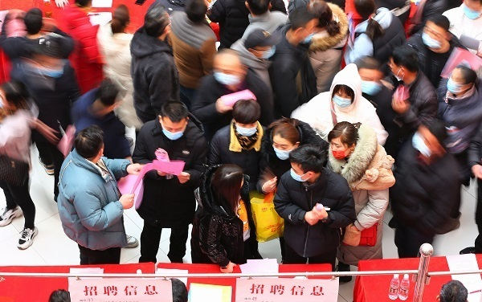
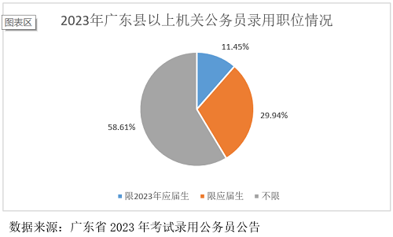

# 一年有20万研究生未按期毕业，想“延迟就业”的人越来越多

作为一名某985高校社科类专业的硕士研究生，王琪近日时常陷入纠结：是否申请延期毕业？“感觉目前求职并不顺利，实在不敢轻易选择毕业离开学校，要不延毕到明年再试一下？”

近年来，我国高校毕业生数量逐年增加，2023年更是高达1158万人，这是继2022年之后，国内高校毕业生数量再次破千万。因为学业和就业压力等多方面原因，一些毕业生开始考虑是否要申请延期毕业的问题。

这种现象在研究生群体中更为明显。虽然在接受高等教育的学生群体中，研究生的整体数量并不占多数，但其规模也在逐年增加。

国家统计局2月28日发布的《2022年国民经济和社会发展统计公报》显示，2022年研究生教育招生124.2万人，毕业生86.2万人。普通、职业本专科招生1014.5万人，毕业生967.3万人。

2022年实际毕业的研究生数量超过了86万人，比2021年（77.2万人）多出近9万人，比2016年（56.39万人）更是多出了约30万人。

实际上，这个数据体现的是当年实际毕业的研究生规模，而还有一部分“预期毕业”的研究生在当年并未真正毕业。

教育部每年公布的教育统计数据中包括当年实际研究生毕业人数与下一年的预期研究生毕业人数，因此能够观察每年非按期毕业研究生的具体情况。

由于数据更新具有一定的滞后性，根据目前所公开的最新数据来看，从2016年至2021年，我国研究生的非按期毕业率（非按期毕业率=（预期毕业人数-
实际毕业人数）/预期毕业人数）逐年上升，由2016年的21.14%增长至2021年的24.21%。

以2021年为例，当年实际毕业研究生数量为772761人，而当年预期毕业数量为1019619人，换言之，当年有超过24万名研究生没有按期毕业。

在整个研究生群体中，博士研究生中非按期毕业学生的数量较多，在2016年至2021年的五年间基本占比在60%以上。硕士研究生非按期毕业率由2016年的不到10%增长至2021年的15.56%，变化较为明显。

每年有如此之多的研究生非按期毕业，其原因是什么？

某高校一位负责研究生延期毕业申请事务的老师告诉第一财记者，虽然存在中途退学和其他一些意外情况，但延期毕业是导致预期毕业人数与实际毕业人数有出入的最主要原因。

因博士研究生所承担的科研压力更重，博士研究生延期毕业的情况更为常见，从数据上看能达到六成以上。某高校人类学二年级博士研究生小陈对第一财经记者表示，“以我们专业来看，从田野调查实践到论文发表的各个环节都存在不可控因素，延期毕业还挺常见的。”

造成硕士研究生延期毕业的原因则较为多样，如论文未能如期过关等，但出于就业考量而主动申请延期毕业的情况也逐渐增多。在知乎上，关于硕士研究生“延期毕业”的讨论开始增多，且其关注的重点也逐渐从因未达到毕业要求的“被动延毕”，开始转向到考虑到个人发展与就业求职的“主动延毕”。

这几年高校毕业生就业压力的逐渐增大，也助推了部分毕业生选择延期毕业。在3月份的国新办发布会上，人力资源和社会保障部副部长俞家栋表示，2023届高校毕业生的规模将达到1158万人，促进就业的任务更加繁重，将坚持把促进青年特别是高校毕业生就业摆在更加突出的位置，强政策、拓岗位、优服务、兜底线，与有关部门一起做好这项工作。

_新华社图_

从最新的统计数据上看，高校毕业生面临的就业压力较为明显。4月15日，国家统计局新闻发言人、国民经济综合统计司司长付凌晖表示，3月份，16-24岁青年人失业率19.6%，比2月上升1.5个百分点，就业结构性矛盾比较突出，青年人失业率上升主要是由于今年应届大学毕业生开始进入劳动力市场寻找工作所导致的。

“对于一些结构性矛盾，如青年人失业率问题，还要关注，继续加大对青年特别是高校毕业生的就业帮扶，促进就业持续向好，尤其要尽快加快产业升级步伐，提供更多高质量的就业岗位。”付凌晖说。

正在上海某985高校数学专业就读的研究生侯佳，按学制的规定本可以去年毕业，但出于想进入金融行业的意愿，他希望多花一年的时间去积累行业实习经历，因此选择申请延毕，从而“变身”为2023届毕业生。

在拿到几家券商offer后，侯佳认为“这是一种用较低的试错成本争取更高就业回报的选择”。

学生主动申请延期毕业，基本上可以保留学籍，实际毕业之时，仍可被认定为应届生。能够保留应届生的身份，也让那些选择延期毕业的群体消除了日后求职上的顾虑。

应届生身份在求职市场上的重要性，时常体现在考试报名与简历投递等环节中。公务员与事业单位的招考会专门设置仅限应届毕业生报考的职位，大多企业也会开展面向应届毕业生的校园招聘。而且，以应届生身份入职，在落户机会、职位选择及后续发展培养上会有更多的便利。

以2023年广东省县级以上机关所开放并接受报考的公务员职位为例，总计5982个职位中，有685个职位仅接受2023年应届生报考，1791个职位开放给两年内未落实工作单位的应届生报考，这两类职位占职位总数的41.3%。

虽然身份上还是应届生，但招聘机构是否会对延期毕业的同学一视同仁？

一位曾在多家上市公司人力部门工作过的人士表示，不会因为延期毕业这个情况就放弃履历不错的候选人，但会更重视候选人的延期毕业原因和这期间的个人经历。

另一位供职于深圳某知名通讯公司人力资源部门的人士则表示，即便同样是应届生，我们在面对延期毕业的候选人时会更慎重，做选择时会有更多的考虑。

部分单位在招考时除了参考毕业年份，也会参考学生就读专业的学制年数。如山东某市在选调生招考专项计划的公告中明确表明，不接受除博士研究生之外非“按规定学制如期取得”毕业证书和学位证书同学的报考。

延期毕业的利弊确实很难提前评判，这或许是王琪纠结的主要原因。面对当下较为复杂的现实环境，个人更需主动应对。

曾考虑过延期毕业、但后来还是按时毕业并入职广东某大型国企的汪敬认为：“虽然延期毕业也是一个选项，但人生没必要在某一个阶段浪费太多时间。只要一直不停止努力，总会发生好的事情。”

（应采访对象要求，文中人物皆为化名。）

