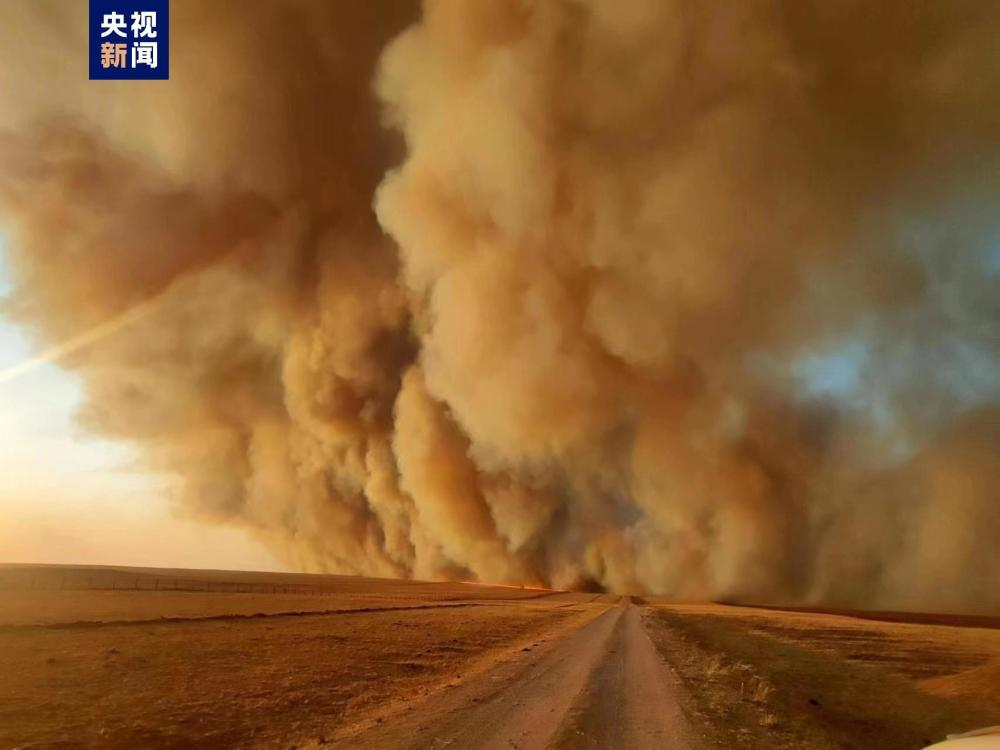
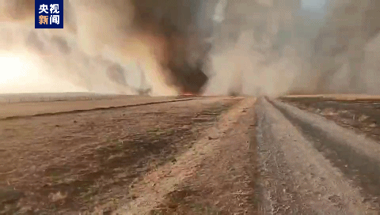
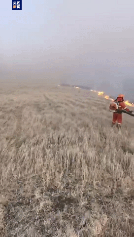

# 中蒙、中俄边境突发入境草原火灾 森林消防部门已前往救援

来源：央视新闻客户端

记者从内蒙古自治区生态与农业气象中心卫星遥感科获悉，4月20日11时20分，根据卫星遥感监测显示，新巴尔虎右旗境外有异常高温点，距内蒙古边境约17公里，高温区为七级西北风。境外火仍在燃烧并进一步向内蒙古方向发展，火场为六级西北风，距离边境约5公里。

4月20日12时47分，内蒙古呼伦贝尔市新巴尔虎右旗克尔伦苏木西北处，蒙古国境内发生草原火灾。15时15分，蒙古国境内草原火已蔓延至我国边境。火场植被主要以针茅草为主，西北风6-7级，温度4℃。15时50分，接呼伦贝尔市应急管理局商请，内蒙古森林消防总队呼伦贝尔市支队动用152人27台车前往实施救援，目前森林消防队伍正在行进当中。

此外，4月20日13时许，内蒙古呼伦贝尔市满洲里中俄边境俄罗斯境内发生草原火灾。15时许，俄罗斯境内草原火已蔓延至我国边境。火场植被主要以针茅草为主，西北风7-8级，温度-3℃。17时，接呼伦贝尔市应急管理局商请，内蒙古森林消防总队呼伦贝尔市支队动用150人25台车前往实施救援，目前森林消防队伍正在行进当中。

18时40分，据卫星遥感监测显示，新巴尔虎右旗境外火与满洲里境外火仍在燃烧，火场上空为五级和六级西北风。

（总台记者 张扬）

