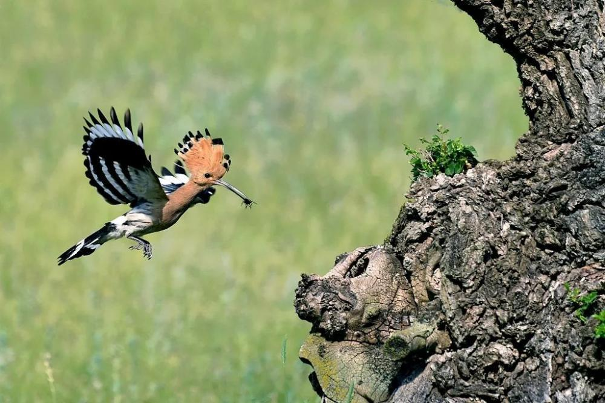
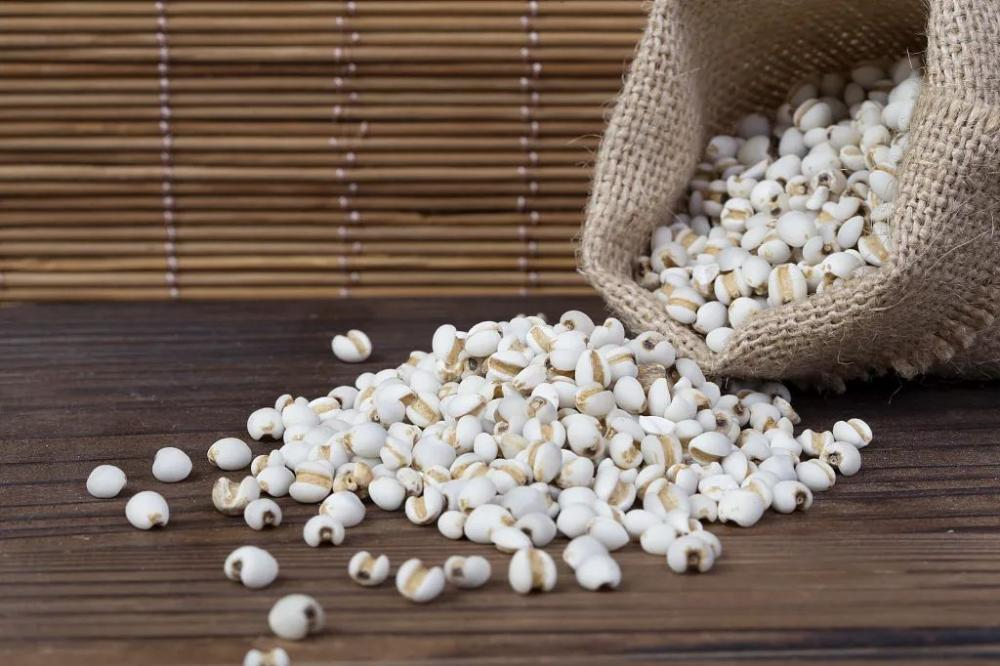

# 今日谷雨：超25省份将开启冷暖逆转 多地气温降幅可超20℃

“谷雨”是中国传统二十四节气中的第六个节气，也是春季的最后一个节气。俗话说“清明断雪，谷雨断霜”，谷雨过后，意味着寒潮天气基本结束，气温回升加快，降雨量也逐渐增加。

谷雨，谷得雨而生也。谷雨是“雨生百谷”的意思，谷雨前后，田中的秧苗初插，作物新种，此时尤其需春雨的润泽，有利于农作物的生长。

俗话说“春雨贵如油”，谷雨时节，来一场及时雨，给急切渴望好雨的人们，带来希望，带来了满满的恩泽，带来了内心的喜悦和兴奋之情。

**谷雨三候**

**一候丨萍始生**

在谷雨到来的几天里，因降雨增多，浮萍会快速地生长、茂密起来，绿油油的成片，彷佛漂在水上的一块美丽画布。那些平时缺少绿意的水塘、河畔、湖面等等，如今会是一派繁荣景象。

**二候丨鸣鸠拂其羽**

民间一般认为，鸣鸠即布谷鸟。谷雨时节，布谷鸟也蠢蠢欲动起来，不住地抖动浑身的羽毛，苍翠的山峦间总是随处可以听到“布谷”“布谷”的阵阵鸣啼声。而“布谷”又与“播谷”谐音、近义，提示人们不要耽误农时播种的意思。

**三候丨戴胜降于桑**

戴任又名戴胜，是一种小鸟，栖息于农家常种植的桑树与麻树之中。它虽然叫起来不甚悦耳，可满身的漂亮羽毛却能吸引人的眼球：头上的羽冠长而阔，呈扇形，棕红色或粉红色，有黑斑或白斑点缀其间，彷佛是一顶绝美的皇冠。而每年谷雨时，人们继而可见戴胜鸟飞临桑树的枝头。

**谷雨习俗**

**饮茶**

南方谷雨有摘茶风俗，传说谷雨这天的茶喝了会清火、辟邪、明目等。所以不管这天是什么天气，人们都会去茶山摘一些新茶回来喝。

**食香椿**

谷雨前后是北方香椿上市的时节，这时的香椿醇香爽口营养价值高，有“雨前香椿嫩如丝”之说。

**赏牡丹**

谷雨前后是牡丹花开的重要时段，因此，牡丹花也被称为谷雨花、富贵花。“谷雨三朝看牡丹”，谷雨时节赏牡丹已绵延千年。

**走谷雨**

古时有“走谷雨”的风俗，这天青年妇女走村串亲，有的到野外走一圈就回来。寓意与自然相融合，强身健体。

**谷雨养生**

**防“湿邪”伤身**

医学专家表示，谷雨节气后空气湿度逐渐加大，因此需防“湿邪”侵袭伤身。注意开窗通风、加强保暖，不要着凉，多晒太阳，适当运动。

**避免接触过敏源**

谷雨时节风大沙多，外出时尽可能选择浮尘较轻的时段；多喝水，适当多吃些清肺、润肺食物。此外，谷雨前后，杨花柳絮随风舞，很容易引起鼻痒、鼻塞、咳嗽和皮肤过敏等症状。户外活动，也要做好防护。

**健脾是关键**

谷雨一过，春季就要过去。此时，肝脏气伏，心气逐渐旺盛，是身体补益的好时机，应适时进食补血气的食物，但不能像冬天一样大补，应根据个人体质，食用一些益肝补肾的食物，还可多吃健脾胃、去湿食物，如香椿、黑豆、薏米、山药、鲫鱼等。

**超25省份即将开启冷暖逆转**

中央气象台预计，从19日开始至22日，一股冷空气迅速东移南下，给我国中东部大部地区带来大幅降温降雨过程。20日起激烈的冷暖逆转正式开启，我国超25省区市将经历气温“过山车”，不少地方气温降幅可超过20℃。

气象专家提醒，未来10天，南方大部地区都将持续降雨天气。

20日，冷空气将会先东移，21日到23日逐渐南下。到了21日，降温向南转移到山西、陕西、河南、湖北西部。总体来看，这轮冷空气过程，最高气温下降最明显的区域集中在陕西、山西、河南、湖北西部，部分地区降温可达20℃以上，甚至是25℃以上。

20日夜间到21日，在山西、陕西、宁夏、甘肃、青海等地可能会出现雨转雪，降雪可能将持续两到三天。

南方大城市中，23日将降至13℃，最高气温起伏也超20℃，当地小伙伴们将上演“精分式”穿衣。

内蒙古、西北大部地区、东北地区中南部、华北、黄淮以及江淮、江南大部、四川盆地至重庆和贵州中北部等地则将坐上家常过山车，最高气温起伏普遍会在10~20℃之间。降温之前，江南多地的最高气温攀升至30℃以上，不少气象观测站还出现35℃以上高温，但降温后，这些地方最高气温普遍都将降至20℃左右甚至更低，浙江大部、江西北部、湖南中部等地最高气温累计降幅普遍都在15℃以上。

另外，黑龙江中部和南部、吉林西部、辽东半岛、青海中部和西部、西藏大部、华南大部等地最高气温的起伏多在5~10℃左右，将体验到小型过山车。

而在强冷空气鞭长莫及的西藏东北部、川西高原、云南大部、海南等地，最高气温起伏基本在5℃以下，平稳的游客小火车走起。

此次降温过程中，全国多地前期气温明显偏高，降温会更明显，同时大部地区还将出现大风、降水天气，一周就能体验春如四季，冷暖差异十分明显。中国天气网提醒，激烈的冷暖逆转马上开启，建议大家根据气温变化及时调整着装，提前翻出厚衣服，外出可采取洋葱式穿搭法，避免着凉感冒。

综合来源：央视新闻、中国天气网、中国新闻网、CCTV4、 今日经典文摘

编辑：杨雁琳

责编：吴忠兰

审核：冯飞

