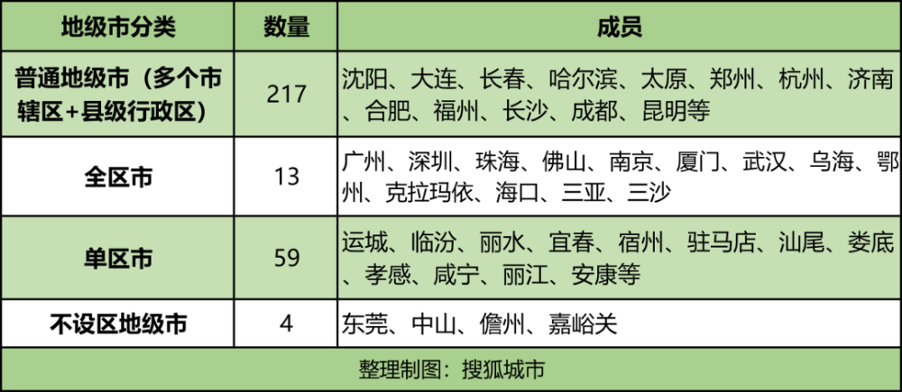
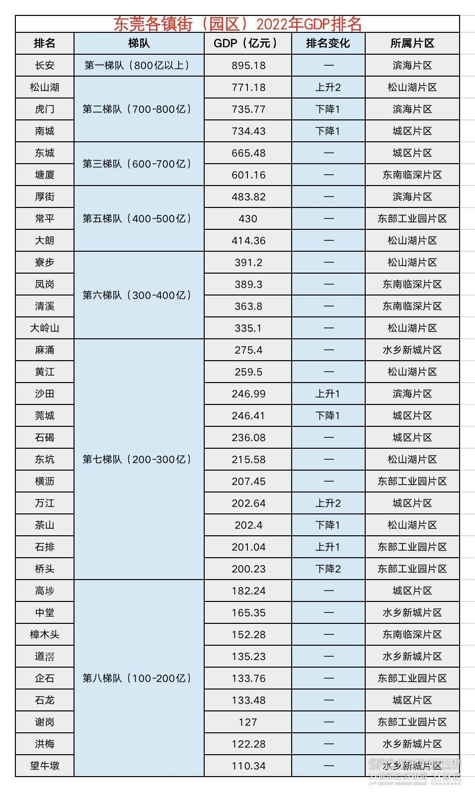

# 全国多了一批“镇级市”？上百个建制镇GDP总额超过100亿元

**文|凯风**

电影《私人订制》里，范伟曾扮演过一个“镇级市领导”。

影视剧显然只是玩笑，但“镇级市”不再是传说。

01

“镇级市”，再次登场。

据澎湃新闻报道，日前，河南南阳市出台培育 **“镇级小城市** ”试点工作实施方案，选取了13个县市的11个镇作为“镇级市”探索试点。

众所周知，我国的城市行政体系，从上到下大致可分为 **“直辖市-副省级市-地级市-县级市”** 四个层次，并无“镇级市”之说。

就连县，也只是被视为半城半乡的管理单元，不能完全被视作城市，遑论镇级市？

作为世界人口第一大国，我国虽然拥有2800多个县级单位、3.85万个乡镇及街道，但严格意义上的 **城市只有691个。**

根据《中国城市，8大趋势》一文分析，以行政区划来看，根据中国统计年鉴，目前我国共有4个直辖市、15个副省级市、278个地级市、394个县级市。

值得一提的是，在作为行政区划时，副省级市往往被纳入地级市的范畴，但讨论行政层级时，更宜与地级市分列。

如果以城区人口进行分类，目前我国共有7个超大城市、14个特大城市、14个I型大城市、71个II型大城市，其他都是中小城市。

无论按照哪种方式进行分类，都无镇级层面的城市之说，既无镇级市的行政区划，也无镇级市的城区设置。

然而，“镇级市”改革，确实有其存在的必要性及迫切性。

02

镇级市，究竟是什么？

前两年，浙江龙港镇改为龙港市，被认为是 **“镇改市”** 的破冰之举。

但这里的龙港市，并非“镇级市”，而是从建制镇升格为省辖县级市，由温州市代管，相当于行政级别跃升，属于特例。

而我国 **台湾省，倒是镇级市的存在** ，如彰化县彰化市、新竹县竹北市，属于名副其实的县辖市。

与之对比，这一次 **河南探索的“镇级市”，并不涉及行政级别的提升** ，仍旧是县辖之下的镇级单位，只是作为小城市来进行打造。

换言之，即使成了镇级市，行政级别仍然是镇级，而非县市级。

但是，镇级小城市，将会按照城市进行对待，不仅有望获得大量的 **县级管理权限** ，而且还有可能按照城市规模来 **调整人口及土地规划**
，进而获得更大的发展空间。

之所以如此，原因在于，乡镇更多作为农业管理单元，承载的人口和产业极其有限。

随着经济发展，一些卫星镇、特色镇或中心镇有了独当一面的产业，人口不断聚集，乃至达到了一些中小城市的规模， **“小马拉大车”**
的问题愈发凸显，镇级建制难以适应发展需要。

在珠三角和长三角，一些中国百强镇GDP总量高达八九百亿元，常住人口规模多达数十万乃至近百万人，超过很多县乃至西部的地级市，不能再视作简单的乡镇来看待。

所以， **强镇扩权** 就成了必须，“镇级市”正是其中积极的探索。

03

事实上， **“镇级市”改革并不是第一次出现。**

早在10多年前，有关部门就曾表示，将推进镇区常住人口10万人以上建制镇的设市工作，增加城市数量。

2019年，国家发改委再次发文指出，稳步增设一批中小城市，落实非县级政府驻地特大镇设市。

不过，特大镇设市，究竟指的是设立 **“镇级市”** ，还是升级为 **“县级市** ”，并无明确说法。

在此期间，广东、浙江、江苏、陕西、福建等地纷纷推进强镇改革，有的对强镇进行扩权，有的直接探索“镇级市”，还有的将镇升格为县级市。

作为中国最年轻城市之一的浙江龙港市，就是这一改革的产物。

龙港，原本隶属于温州市苍南县，作为一个普通乡镇而存在，但由于纺织、印刷等产业发展势头强劲，面积不断扩张，人口持续涌入。

在设为县级市之前，龙港镇的面积已经高达183.99平方公里，人口从5000多激增至38.2万，相当于一个中等城市的体量。

因此， **龙港先是通过强镇扩权** ，获得了县级管理权限，并最终在2019年升级为 **县级的龙港市** ，完整“镇改市”的创举。

当然，这只是特例，由于行政区划调整牵一发而动全身，直接将镇升格为县级市的案例可谓少之又少。

04

相比而言，强镇扩权成了许多地方的主流选择。

在广东，一些经济强镇实力远超过龙港镇，但仍旧只是镇的建制，但在管理权限，与县并无差异。

**东莞，是全国四个仅有的直筒子市之一** 。所谓直筒子，说的是市级之下不设县也不设区，直接辖镇。

目前，东莞共下设4个街道28个镇，这些镇街中，有15个晋级全国百强镇之列，经济实力最强的长安镇GDP总量达895亿元，常住人口超过80万人。

与之对比，在全国300多地级市中，还有100个不及这一水平，而GDP超过这一水平的县也只有50多个。

**东莞的镇域经济如此强大，为何不升格为县或县级市乃至市辖区？**

一个原因是，东莞发展太快太猛，从一个农业县变成县级市再升级为地级市，只用了几年时间，镇级在一开始没来得及调整。

另一个原因是，直筒子市，少了一个环节，更加扁平化，拥有行政成本低和执行效率高的特点，且与东莞的 **“一镇一产”** 的格局相适应，也就没了调整的必要。

然而，建制镇终究级别太低，对于一个万亿GDP、千万人口大市来说，难以拉得动经济发展的大车。

为此，早在2009年，广东就开启了 **强镇扩权** 改革，赋予这些特大镇以县级管理权限，事权、财权、行政权全面下放，并在行政级别上予以高配。

不过，前些年，东莞也传出设立镇级市、镇改区的消息，但最终都未能成行。

如今，对于东莞的强镇来说，名份上究竟是镇还是区乃至市，都不重要。毕竟， **谁都不会拿豆包不当干粮。**

这些强镇，不是城市，胜似城市。

05

镇级市改革，路在何方？

这两年，我国的城镇化开始出现一些变化，从鼓励大城市扩张到严控省会扩大规模，从支持撤县设区、撤县设市到稳妥调整行政区划、严控撤县建市设区。

可以看到，最近一年，除了 **西藏两地因特殊需要完成撤县设市** ，绝大多数的撤县设区(市)都遭遇搁浅。

之所以出现这一变化，原因是新冠疫情暴露出大城市治理的短板，而人口和资源过度集中不利于协调发展。

所以，这种背景下，镇级市改革的空间或许并没有想象的那么大，但仍值得期待。

**其一，“镇级市”这一行政区划，大概率不会出现。**

10多年前，有专家曾预测镇级市将成为我国第5种市级行政级别，但一直未能落地。

究其原因，我国城市的行政级别本来就过多过繁，再多一个层级，既不符合精兵简政的需要，镇级市与县之间的关系也难以协调。

**其二，镇级小城市，或将批量出现** ，但只会局限于一些拥有特色产业或人口规模庞大的经济强镇。

全国共有2万多个建制镇，其中人口超过20万的多达50多个，GDP总量超过100亿的有100多个之多，这些强镇都不乏成为“小城市”的潜质。

其三，有地方在高歌猛进，有地方出现了“逆城市化”现象，东北2地首现 **“撤街设镇”的逆向改革** 。

根据《东北撤街设镇，山西缩减铁饭碗》一文分析，撤街设镇的背后，核心原因是人口减少，城市收缩，逐渐达不到设立街道的标准。

从积极的层面看，从街道回到建制镇，虽然没了城市的身份，但会获得一定的独立发展权，且容易“争取乡村振兴项目支持”。

当然，中国城镇化方兴未艾，且面对经济与人口的双重拉力，大中小城市究竟如何协调发展，一切都有可能。

