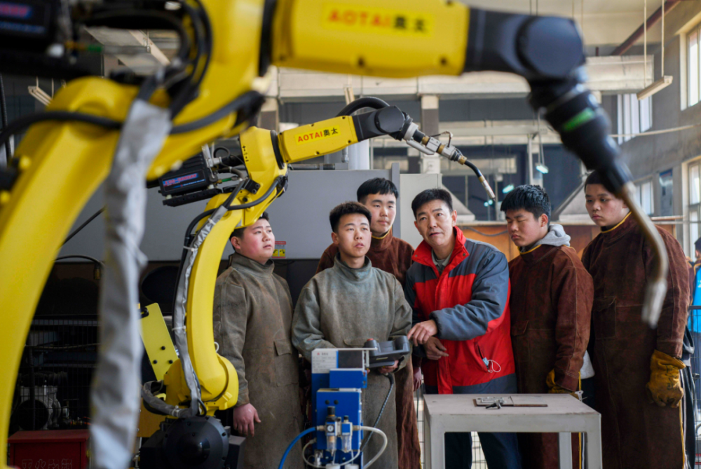

# 全国青年失业率19.6％，该怎么破局？专家解答

_▲这是4月16日拍摄的南京大学2023届毕业生春季双选会现场。图/新华社_

**文 |朱克力**

国家统计局日前公布数据显示，3月份，全国城镇调查失业率为5.3%，比上月下降0.3个百分点。但值得注意的是，16-24岁劳动力调查失业率升至19.6%，较2月提升1.5个百分点，创2022年8月以来新高。

青年人就业状况关系到整个社会的稳定与发展大局。作为新技术、新产业的主要创造者和接受者，其就业成长影响到相关产业发展和社会机会创造。青年人失业率过高不仅对经济发展产生不利影响，也容易引发一系列社会问题。

对此，国家统计局新闻发言人表示，青年人失业率上升主要是由于今年应届大学毕业生开始进入劳动力市场寻找工作。从下阶段情况看，随着经济恢复，用工需求扩大，青年人失业率会逐步改善。

**三重因素叠加推高青年失业率**

失业是一个社会问题，同时也是一种经济现象。从宏观看，当前就业市场的复杂性和不确定性在于，青年人失业率高企并非某个单一因素所致，而是由周期性、结构性和摩擦性因素“三重叠加”推高而来。

结构性因素包括人口结构变化、经济结构调整和产业升级等。

例如，在制造业向智能制造、高端制造转型的过程中，随着技术进步和产业升级，一些传统制造业企业丧失竞争力甚至倒闭，部分行业和职业的需求量减少，而新兴产业所需要的技能型人才又供给不足，也会导致结构性失业的出现。

周期性因素源自经济周期的波动。经济高速增长带来需求增加，企业扩岗，失业率下降；一旦经济增速放缓则需求下降，企业减员，失业率上升。

我国经济在增速换挡过程中，一些传统行业和产业的产能过剩问题显现，直接影响企业效益，进而抑制劳动力市场需求，导致求职人数下降。

摩擦性因素也是导致当前失业率高企的一大原因。由于劳动力市场供需的不平衡，例如求职者的职业技能和经验与用人单位的岗位要求不匹配等原因，使之难以找到合适的工作或转换合适的岗位。因其就业弹性较大，不易通过传统的失业统计数据来反映。

由此，综合而言，随着经济结构调整和传统人口红利消失，年轻人就业市场的竞争变得更加激烈。

加之受前期疫情影响，部分行业和企业经营遇到较大冲击，尽管目前经济处于恢复阶段，但用工需求尚无明显增加，一些岗位仍然可能减少招聘、降薪甚至裁员，这些都导致眼下失业率居高不下。

近年来高校毕业生数量连年增加，教育部数据显示，2022年全国高校毕业生人数首次破千万，2023年全国高校毕业生规模预计1158万人。不少大学生不愿从事低收入或者低技能的工作，更看重工作稳定性、福利和发展机会等因素，而且一些毕业生缺乏职业技能和经验，难以适应当前就业市场需求，一时找不到与自身技能和经验相匹配的工作，也是推高年轻人失业率的重要因素。

不容低估的是，一些短期突发因素可能会对中长期就业产生深远影响。前期疫情令诸多行业遭受重创，不少企业停产停工，导致青年人就业市场需求骤减，同时一些毕业生的就业计划被打乱，为本就不明朗的就业形势增添了更多的不稳定性。

当然，在以上诸多成因当中，产业升级趋势下的人力资本鸿沟，是造成青年人失业率高企的根源。

近年来，创新经济的发展和产业升级的加快，使就业市场对人力资本的需求结构发生了较大变化，部分岗位与工作场所正在消失，大量劳动力需要重新流入就业市场，而前期疫情等因素导致的经济下行造成需求疲弱，叠加了劳动力供给量的激增，从而进一步激化了人力资本供给与需求的不匹配。

_▲3月28日，在兴隆县职教中心，学生在进行机器人焊接实训。图/新华社_

**稳就业需多管齐下标本兼治**

就业是民生之本，关系到广大民众的生计。青年人是社会的未来和希望，在当前经济形势下解决好年轻人就业问题，对于保障民生、维护社会稳定和促进经济发展意义重大。稳就业尤其是青年人就业，需要政府、企业和劳动者共同努力。

面对青年人失业率的居高不下，中央和地方在持续关注，政策端也在不断加码。4月以来，两次国务院常务会议均将稳就业列为主要议题之一。

根据国常会部署，目前高校毕业生就业已进入关键阶段，要不断优化完善相关稳就业政策，加大对吸纳高校毕业生数量多的企业的政策、资金支持，深入实施“三支一扶”等计划，推动应届毕业生多渠道就业。

与此同时，要着力破解结构性就业矛盾，采取务实管用措施稳定制造业、外贸企业等就业规模，突出就业导向、优化高校专业设置，面向市场需求提升职业教育和技能培训质量。

此外，还需强化宏观政策、产业政策等支持，通过扩大有效需求、提振市场信心、稳定企业经营带动更多就业，推动就业增长与经济发展互促共进。

稳就业是一项系统工程，需要多部门齐抓共管协同发力，多管齐下标本兼治。

人力资源和社会保障部最近印发《2023年高校毕业生等青年就业创业推进计划》通知，其中提到十项具体行动，如稳定机关事业单位、国有企业等公共部门招录（聘）规模；在高校毕业生集中的城市每周至少举办一次专业性招聘；将有培训意愿的青年全部纳入职业培训服务范围，开展新兴领域职业技能培训，等等。

工信部和教育部也于近日联合发布通知，启动2023年全国中小企业网上百日招聘高校毕业生活动。

活动期间，各地高校毕业生就业工作部门和各高校将主动邀请中小企业进校招聘，加大进校招聘开放力度。还要求各地中小企业主管部门和高校毕业生就业工作部门创新开展线上对接、入校招聘、入企体验、直播带岗等活动，提高高校毕业生与中小企业对接成功率。

就各级政府而言，需要出台更加具体、更有针对性的政策措施来支持年轻人就业，同时也要加强对政策的监督和评估，以确保政策有效性。

应加强职业技能培训以提高年轻人就业能力和竞争力，包括加强对职业教育和职业培训投入，建立更多职业技能培训机构，提供更多培训课程。要加强对创业的支持以提高就业机会和收入水平，通过提供贷款担保、税收优惠等政策来支持年轻人创业。

需要指出的是，政策的生命力在于落实，政府促进就业政策与其他宏观政策之间实现协同耦合，才能更好落地。

在实施稳就业政策的同时，更不能忽视市场的力量。

当前，我国灵活就业人员已达到2亿人左右，大量新业态工种纷纷兴起。从固定就业到弹性就业，从雇佣就业到灵活就业，从专业型就业到复合型就业，传统就业向新型就业转换的多元图景已然形成。

为此，要积极发挥民营经济的就业蓄水池作用，包括激发各类市场主体尤其是平台企业在引领发展、创造就业、国际竞争中大显身手。

撰稿 / 朱克力（国研新经济研究院创始院长、CiNE首席研究员）

编辑 / 迟道华 徐秋颖

校对 / 刘军

