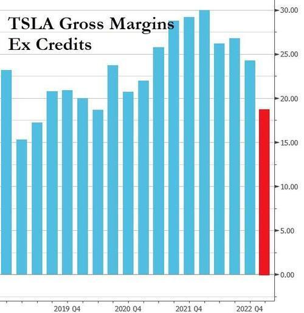
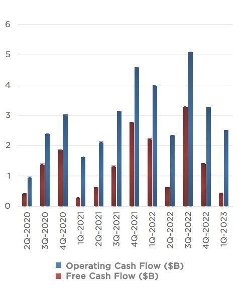
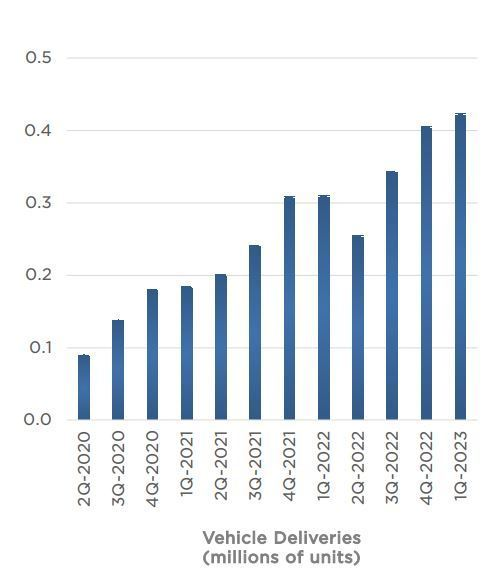

# 减价的后果：特斯拉一季度净利润暴跌24％，盘后股价跌超4％

4月19日周三美股盘后，电动汽车巨头特斯拉公布了2023年第一季度财报。

由于报告期内特斯拉在全球主要市场轮番大幅降价，导致营收虽同比增超20%，但盈利同比降超20%，核心汽车业务毛利率跌至21.1%，至少刷新两年最低，盘后股价跌超4%。

在备受关注的一季报发布前，特斯拉公布了今年在美国第六次降价的消息，Model 3和Model Y等“平民最畅销车型”降价幅度在4.7%-6%，令Model
3后驱版的最低售价正式跌破4万美元。

特斯拉自2019年三季度以来首次EPS同比下跌，营业利润率低于预期

财报显示，特斯拉今年一季度营收233.3亿美元，同比增24%，基本符合市场预期的233.5亿美元。调整后每股收益EPS为0.85美元，同比跌21%，不过也基本符合预期的0.86美元。

特斯拉营收较去年四季度创新高的243.18亿美元环比下跌4%，这也是自2019年三季度以来首次调整后EPS同比下降，均受到一季度全球车型降价的拖累，上季EPS曾同比大涨40%。

公司一季度GAAP净利润为25亿美元，低于市场预期的26亿美元，同比跌24%；非GAAP净利润29.3亿美元，同比跌22%，比去年四季度减少近12亿美元，比一年前减少8亿美元。

投资者最关注降价如何影响毛利率。一季度特斯拉汽车业务毛利率为21.1%，低于去年四季度的25.9%和去年一季度的32.9%。去年四季度的汽车毛利率已为两年最低。

一季度营业利润率11.4%，同比降近780个基点，去年四季度为16%，去年一季度为19.2%。原本特斯拉这一衡量盈利能力的指标在汽车行业名列前茅，去年达到16.8%，是传统车企的近三倍。

一季度整体毛利率为19.3%，同比跌近980个基点，去年四季度为23.8%，去年一季度为29.1%，逊于预期的21.2%。但有分析师称，特斯拉的毛利率水平在汽车行业仍遥遥领先。

特斯拉表示，“新工厂未充分利用”压低了利润率，加上原材料、大宗商品、物流和保修成本增加，车辆平均售价降低，4680电池的生产成本增加，以及向传统汽车制造商销售碳排放积分的收入减少，都导致盈利能力较去年同期下降。

按照收入分类，公司核心的汽车业务收入在一季度达到199.6亿美元，同比增18%、环比跌超6%。能源业务收入翻倍至15.3亿美元，同比增148%。储能系统部署增长360%至3.9
GWh。

上海工厂已接近满负荷运行数月时间，Model Y在欧美畅销，自由现金流骤降80%

特斯拉在财报文件中称，公司运营利润在行业内处于前列，所产车辆成本正在降低，减价之后，运营利润率仍按可控的幅度下降， **未来不排除继续涨价或降价：**

“考虑到特斯拉汽车通过自主驾驶、快充、连接能力和服务的潜在生命周期价值，近期定价策略考虑了单位车辆长期盈利能力。”

电动皮卡Cybertruck处于2023年稍晚投产的正轨之上。继续在下一代平台的开发方面取得进展。上海工厂已经成功地接近满负荷运行数月时间。

跨界休旅车Model
Y是第一季度欧洲最畅销车型，以及当季美国不含皮卡的最畅销汽车。公司维持全年车辆产量预期在180万辆不变，即复合年均增长率50%，略逊于市场预期的184万辆。

**值得注意的是，**
特斯拉一季度经营现金流为25亿美元，减去资本支出后的自由现金流同比骤降80%至4.4亿美元，远逊于市场预期的32.4亿美元，去年四季度的自由现金流为14.2亿美元。

以毒舌著称的金融博客Zerohedge发现，不算碳排放积分的销售收入5.21亿美元，特斯拉整体毛利率是新冠疫情崩盘以来首次跌破20%门槛，而且一季度自由现金流也将为负值。

特斯拉财报电话会应关注什么？

特斯拉曾在去年四季报中警告面临经济不确定性和利率走高的影响，今年一季度其在美国、欧洲、中国和其他亚洲市场多次大幅降价以吸引买家，令毛利率和利润走势成为财报关注焦点。

今年1月份的四季度财报电话会上，公司首席财务官Zachary
Kirkhorn表示，特斯拉可以在2023年将汽车毛利率保持在20%以上，投资者希望了解管理层对今年余下时间利润率的具体评价，不少华尔街分析师都认为，年底前汽车毛利率将不可避免地跌破20%这一关键门槛。

由于去年四季度特斯拉总收入约86%来自汽车销售和向传统汽车制造商销售碳排放积分，投资者还希望了解汽车降价后的订单活动和需求。马斯克在年初大幅降价后曾称“订单几乎是生产速度的两倍”，只要管理层证实“需求依旧超过供应”便能有效提振股价。

其他关注焦点还包括：原定于今年夏天开始生产的电动皮卡Cybertruck最新进展、上个月特斯拉投资者日透露的第三代汽车平台最新信息，以及更多在墨西哥建造最新超级工厂的时间表。管理层对后续定价策略的解读也备受关注，这些策略看起来变幻莫测，今年降价之余也会涨价。

长期追踪特斯拉动态的电动汽车网站Electrek称，由于Cybertruck明年才会量产，应该不会对特斯拉2023年的营收产生实质影响。在利润率下降的当下，投资者将希望了解特斯拉自动驾驶计划的最新情况，该计划过去有助于提高利润率。也许特斯拉会披露更多最新款更便宜汽车的规划。

一季度特斯拉在美国、中国、欧洲等主要市场大幅降价

今年在特斯拉最大的美国市场降价六次后，其基本款Model 3的价格已经累计下调了11%，基本款Model
Y的价格下降了20%，整体美国车型的降价幅度最高达到25%，以应对需求疲软、利率上升和日益激烈的电动汽车市场份额竞争。

马斯克曾在年初表示，“价格对电动汽车的销售非常重要”，降价是希望对普通消费者产生影响，“我们的目标是让特斯拉汽车尽可能便宜”。也有分析指出，由于本周起申请在美国购买电动车的7500美元全额税收抵免优惠条件收紧，特斯拉试图通过直接降价来应对减少的激励措施。

据媒体统计，Model 3和Model
Y这两款特斯拉在美国最受欢迎车型的基础配置价格已恢复到2021年水平，当时公司的年度营业利润率为12.1%，预计特斯拉一季度营业利润率会回落至该水平附近。去年特斯拉营业利润率高达16.8%，在汽车行业名列前茅，是传统车企的近三倍。

而在特斯拉第二大市场中国，今年1月在“国补”退出后，该公司率先打响新能源汽车“价格战”的第一枪，Model 3和Model
Y降价2万至4.8万元不等，均降价超10%，创下特斯拉中国售价历史新低。中国内地市场尚未参与本月的特斯拉全球降价潮，但有报道称4月22日本周六特斯拉或降价，调整后Model
3起售价将低至18.69万元，Model Y起售价降至21.59万元。

特斯拉至少两个季度产量大于销量，华尔街担心不降价就没需求

但全球多轮强力降价行动，并没有带来同样显著的销量增长，或者说无法达到华尔街的高预期。

今年一季度特斯拉生产汽车超44万辆，交付超42.2万辆且同比增长36%，产销均创公司纪录新高，但交付环比近增加了4%，远低于去年四季度17.8%的环比增长。

而且，今年一季度特斯拉的产量高出交付量近1.8万辆，更昂贵的Model S 和 X
车型产量几乎是销量的两倍。这令投资者担心，如果不进一步降价，特斯拉将无法保持增长。

马斯克曾预计，2023年特斯拉将交付180万辆电动汽车，最多可能交付200万辆。交付180万辆将代表比2022年高出约37%，但前提是“如果今年顺利，没有重大的供应链中断或大问题”。

去年四季度，特斯拉汽车交付量约40.5万辆，全年交付汽车约131万辆，均创下交付量纪录，但仍不及市场预期和特斯拉设定的140万辆目标。去年四季度汽车产量近44万辆，超过交付量。

一季报发布前，华尔街怎么看？

摩根大通分析师Ryan Brinkman担心降价将拖累特斯拉和其他电动汽车制造商的盈利能力：

较低的价格对特斯拉来说总体上是负面的，对传统汽车制造商如通用和福特来说负面性较小（鉴于他们当前可能会在电动汽车上暂时损失更多的钱，但有其他利润来抵消这些损失）。

而对与特斯拉竞争的纯电池电动汽车制造商（如Rivian）来说是最负面的，因为他们也可能会在电动汽车上损失更多钱，且没有其他地方的利润来抵消这些损失。

在财报发布前，Evercore分析师希望了解第二季度交付情况以及订单积压是否增加的任何迹象。Guggenheim分析师Ronald
Jewsikow本周研报称，特斯拉在美国降价表明对这家电动汽车制造商的“需求放缓”：

我们所有的需求趋势研究都表明，进入3月后需求放缓，所有车型的等待时间显著缩短，库存也在增加。

由于3月份的订单低于供应量，我怀疑在美国的降价是否足以提振销售，因为需求环境仍然具有挑战性，风险偏向下行。

在特斯拉四月初降价之后，我们下调对其2023财年的收入、EBITDA和每股收益预期，但仍维持了对特斯拉105美元的目标价，重申对特斯拉股票的卖出评级。

Bernstein Research 分析师 Toni Sacconaghi
Jr.称，特斯拉正在对其最长交货时间的车型降价这一事实表明，其他降价可能会随之而来。

摩根士丹利分析师Adam
Jonas称，如果继续降价，叠加银行业危机对消费者的连锁反应、EV竞争加剧和经济增长放缓，特斯拉汽车毛利率至少为20%的目标可能在随后的几个季度难以实现。

