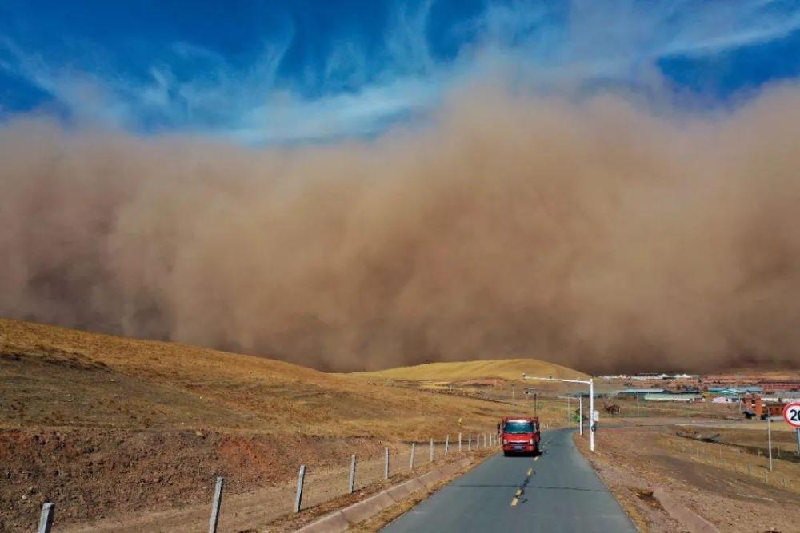

# 北方今年第10次，“卷土重来”的沙尘暴能根除吗？

当今年沙尘暴袭击北京时，27岁的北京人刘松说，“久违了！”在他的印象里，大规模的沙尘天气已很多年没有再出现过。他形容，有一种“死去的记忆开始袭击我”的感觉。

中央气象台4月19日18时继续发布沙尘暴蓝色预警，预计4月19日20时至20日20时，内蒙古中西部、新疆南部和东部、甘肃大部、宁夏、山西、河北西部、北京等地的部分地区有扬沙或浮尘天气，其中，新疆南部、甘肃东部、宁夏中部、陕西北部等地局部有沙尘暴。

据国家林业和草原局监测数据，近20年，中国春季（3~5月）沙尘天气总体上呈现次数减少、强度减弱趋势，已由上世纪60年代年均21次减少到近10年年均8次，沙尘日数平均每10年减少1.63天。不过，受访对象都感觉到，近两三年，沙尘天气又“卷土重来”。

北方已迎来今年以来第10次沙尘天气过程。今年国内发生的沙尘天气过程，频次为近10年来同期最多。根据《中国气象灾害年鉴（2020）》的数据，近20年来，3月至4月平均出现沙尘天气的次数为7.8次，今年4月尚未结束，次数已超平均值。

2019年，美国国家航空航天局（NASA）发布的一项研究结果显示：全球从2000年到2017年新增的绿化面积中，约1/4来自中国，中国贡献比例居全球首位，其中一部分就源于沙区绿化。这种背景下，该怎么理解近年来沙尘暴天气的“故态复萌”？

_3月20日，甘肃张掖市山丹马场境内遭遇沙尘暴袭击。图/中新_

**或进入新的沙尘暴活跃周期**

4月19日，甘肃多地出现大风沙尘天气，酒泉、白银等地发布沙尘暴黄色预警。航班出行服务APP飞常准发布的信息显示，当日，兰州中川机场能见度400米，至中午12时，返航、备降航班超过100架次。

沙尘暴是干旱和半干旱地区的常见气象灾害。强风就像“扫地机器人”一样，将地面大量的沙子和灰尘从干燥土壤上卷入大气，将它们带到数百至数千公里之外。沙尘天气强度通常以水平能见度区分，由轻至重依次分为浮尘、扬沙、沙尘暴、强沙尘暴和特强沙尘暴5个等级。浮尘或扬沙天气的水平能见度在1公里至10公里之间，沙尘暴水平能见度小于1公里，强沙尘暴水平能见度小于500米，特强沙尘暴则小于50米，俗称“黑风”。

文献资料显示，全球沙尘暴两大主要源区是以撒哈拉沙漠为主体的非洲沙漠和亚洲区域。亚洲地区有三个主要的源区，分别是蒙古国、中国西北的塔克拉玛干沙漠和周边区域，以及位于中国内蒙古西部以巴丹吉林沙漠为主体的源区。

中国工程院院士、中国气象科学研究院研究员张小曳向《中国新闻周刊》介绍，中国北方有着170多万平方公里的沙漠区域，而邻国蒙古南部也分布着30多万平方公里的戈壁和沙漠，因为这些沙源地的存在，中国是世界上受沙尘暴天气影响最深的国家之一。

中国气象科学研究院的学者在4月发表的最新论文中指出，中国沙尘天气传输主要有5条路径，其中西北路径较为复杂、覆盖面积最广。它始于境外的蒙古国与境内沙地（包括内蒙古西部乌兰布和沙漠、库布齐沙漠），随着冷空气自西北向东南行进，将沙尘输送到西北、华北、黄淮、江淮等地。并且，西北路径也是造成国内历年沙尘天气最主要的输送路径，占近20多年来沙尘天气的38.5％。

生态环境部3月召开的例行新闻发布会上，生态环境部大气环境司司长刘炳江介绍，今年3月以来，国内沙尘天气偏多，一是因为下垫面利于沙尘活动。2022年蒙古国降水较20年同期偏少，沙源地植被覆盖较差；而且，3月以来，蒙古国南部和中国西北地区，气温较常年同期偏高5~8度，这导致冻土层沙土快速融化，同时沙源地基本无降水，地表无积雪覆盖，导致大范围地表裸露。

二是气象条件有利于沙尘传输。今年蒙古气旋强度偏强、冷空气活动较多，在冷空气东移南下过程中，强烈的大风，为沙尘粒子的卷扬进入高空提供了有利的气象条件。

过去40年，中国北方地区沙尘天气频率呈缓慢下降大趋势。然而，据国家气候中心气候预测室数据，2018年至2022年期间，北方平均的沙尘天气总次数和沙尘暴次数都多于2013年至2017年的平均数。

2021年3月，北方多地遭遇沙尘暴的侵袭，当年3月16日，中央气象台对其定性为，“此次过程达到强沙尘暴强度，为近10年来我国出现的最强沙尘天气过程”。根据生态环境部消息，那场沙尘暴中，北京市PM10浓度在短时间迅速上涨，1小时内涨了4倍，达到6450微克/立方米；城六区的PM10浓度更是达到8108微克/立方米。

“前几年，大家感觉沙尘暴越来越少了，以为沙尘暴消失了，但从近两三年来看，沙尘暴天气这两年慢慢又多了起来，处于一个震荡趋势。”
国内一位大气科学学者在接受《中国新闻周刊》采访时表示。

近几年频繁的沙尘暴天气，是否意味着我们进入了沙尘活跃期？对此，受访专家们表示还无法给出准确判断。“气候系统里面有个周期性的变化，但是这种周期性的变化现在实际上并不是特别清楚，基于几年的短期情况，很难判断出趋势。”中国科学院大气物理研究所副研究员吴成来告诉《中国新闻周刊》。

张小曳认为，从季风活动角度来看，我们可能进入到了一个新的沙尘活跃期。他进一步分析说，冬季风有50~70年的一个大周期。中国1970年代这10年间，沙尘暴灾害比较严重，之后沙尘暴的发生处于下行趋势；大的周期当中，冬季风还有20~30年的中短周期，这一过程中，2002年北京出现过波及范围非常大的沙尘暴，此后风一直处于变弱的过程中。如果按照50年的周期来看，2020年代是一个新周期的开始。

吴成来也观察到这种变化。2018年以来，地表风速增强，很大程度上可能是周期性的一个变化，但这还需要进一步研究。他说，由于整个沙尘源区的范围很大，具体到不同的区域，还要看当地地表情况、地理环境等，而这种不同区域的差别有时也会很大。

**蒙古国何以成沙尘暴重灾区？**

2021年3月中旬，当中国遭遇“十年最强沙尘暴”时，在蒙古国，多省发生暴风雪和特大沙尘暴等灾害性天气，风速达到每秒20米。今年4月17日，蒙古国国家气象与环境监测局再次发布强沙尘暴预警，正在该国西部和西北部地区形成的强沙尘暴将从18日起席卷蒙古国全境。

蒙古国是中国沙尘暴天气的重要“策源地”。比如，今年3月19
~24日的强沙尘暴过程中，根据卫星观测，21日上午，在蒙古国南部可观测到明显的沙尘分布，此后沙尘范围不断扩大。

吴成来说，具体到某个地方贡献多少，实际上不是很清楚。因为沙尘暴上游的情况都是通过卫星观测所得，能够掌握一些总体的特征，比如说大气中的沙尘含量等，但由于沙尘暴移动过程会伴随着起沙和沉降，因而某个地面的沙尘被卷起多少这样的信息，需要更一手的数据。

近十年来，蒙古国内戈壁地带一年中发生的沙尘暴次数，比20世纪60年代增加了4倍。2021年，蒙古国自然环境和旅游部气候变化司司长恩赫巴特接受新华社专访时谈到，蒙古国是受全球气候变化影响最大的国家之一，沙尘暴的发生率正呈上升之势。

蒙古国大部分国土被草原覆盖，北部和西部多山脉，南部为戈壁沙漠。在该国南部区域，很多省份的名字都带有“戈壁”二字。整体来说，张小曳指出，在蒙古国主要的沙尘源——其南部39万多平方公里的土地上，主要并不是由于近些年来人类活动破坏了地表，让沙尘活跃了起来，事实上这里人烟稀少，而沙漠和戈壁就在那儿。

蒙古国位于中高纬度的内亚草原，全境深居内陆远离海洋，属于温带大陆性气候区。雪上加霜的是，天然的地理位置、全球气候变化等原因，让这一区域的自然条件变得更加恶劣。

2020年11月，一篇发表在《科学》杂志上的论文《东亚内陆气候越过临界点变得骤热干燥》中提到，过去20年间，以蒙古国为中心的东亚内陆地区出现了前所未有的“热浪-
干旱”并发现象，这一变化明显超出了自然变化范围，并形成了一种恶性循环：土壤干燥加速了当地的高温，高温又加剧了土壤水分的下降。

过去80年中，蒙古国的平均气温上升约2.25摄氏度，远高于全球平均气温上升速度，同一时期，蒙古国年降水量减少7％~8％，特别是春夏等暖季降水量减少幅度十分明显。截至目前，蒙古国总土地面积的76.8％已遭受不同程度的荒漠化，情况还在恶化。据官方数据，过去10年是该国近80年中经历的最热的10年，干旱、炎热导致1244条大小河流、湖泊干涸或断流。

不过，4月14日，在联合国政府间气候变化专门委员会（IPCC）第六次评估报告宣讲会上，IPCC专家翟盘茂表示，目前关于临界点和不可逆现象的研究还远远不够，想要得到结论，需要不同研究者、用不同方法，从观测、机理、模式等多方面提供多重证据。

翟盘茂表示，虽然蒙古干热条件长期存在并加剧，会对土地植被覆盖造成影响，然而在气候变暖背景下，很多中高纬度地区还存在植被和降水增加的趋势。

1998年，为给国际干旱区自然资源开发、生态修复、环境治理等提供科学支撑，中国科学院新疆生态与地理研究所成立。李生宇是该研究所一名正高级工程师，2018~2020年，他牵头执行了一个国际科技合作项目，名为“中蒙草场荒漠化防治技术合作研究与示范”，并于2019年多次前往蒙古国开展调研和试验研究。

他告诉《中国新闻周刊》，蒙古国南戈壁北部是一个草原带，受全球气候变化及当地经济开发活动的影响比较大。他实地调研发现，这些区域草原退化非常明显，荒漠化重心有北移倾向，增加了蒙古国的沙尘源地，这是一个新的问题。

蒙古国是世界第二大内陆国家，仅次于哈萨克斯坦，不过，相较之下，其人口仅330万，是世界上人口密度最低的主权国家。畜牧业产值约占该国农业生产的90％，每4个蒙古人中就有1人从事畜牧业，这一比例比蒙古国内任何其他行业要高。

2019年底，国际货币基金组织发文指出，蒙古国的畜牧业曾是国民经济的主要引擎，现在面临着气候变化和过度放牧的威胁。自1990年以来，牲畜数量增加了三倍，达到7000万头，大大超过了土地的承载能力。该机构研究还指出，蒙古的过度放牧与全球羊绒价格飙升有关，同时也与缺乏适宜的土地使用法规或草场管理标准有关。

游牧原本是对草场负担比较小的一种人类活动，不过，李生宇说，受到国际山羊绒贸易需求的推动，现在当地不仅过度放牧，而且偏好养殖山羊，山羊这种动物会贴近地面吃草，甚至将草根刨出来吃，对草原的破坏比较大。另一方面，与国内草场规定不同，蒙古国的牧场是公用的，这就导致了一种“公地悲剧”，大家都想最大可能地利用牧场，但并不在乎对其可持续利用。

采矿是另一个问题。蒙古国拥有丰富的矿产和煤炭资源，被称为“煤矿业的沙特阿拉伯”。依靠矿业生产和外国采矿公司的投资，蒙古国获得了前所未有的经济增速，2012年跨入中等收入国家行列。至2019年，矿业总产值占据蒙古国GDP的23.8％，矿产品出口占总额比例超过70％，并有逐年增加的趋势。

李生宇说，很多煤矿分布于蒙古国南部戈壁，且都是露天矿。露天矿开采需要剥开表面的土层，开采范围非常大，而且也没有采用多少环境保护措施，一旦遇到干燥、起风的天气，挖出来的尘土随风飞扬。而且，采矿改变了地下水或者河流等条件，加剧了草场生长环境的恶化。

从2007年开始，中国科学院便与蒙古国就沙漠化防治展开合作研究，通过在当地考察，给出治沙经验。2013年以来，原国家林业局组织林科院荒漠化研究所等科研院所为蒙古国举办荒漠化防治研修班，促进中蒙治沙经验互学互鉴。

“受多种因素影响，蒙古国沙尘暴进入一个新的活跃时期，未来需要大量研究。蒙古国野外研究站、监测设备和仪器等相对缺乏，十分不利于研究工作开展。”兰州大学土木工程与力学学院教授、西部灾害与环境力学教育部重点实验室主任黄宁曾谈到。张小曳曾作为联合国专家前往蒙古国调研，他说，中国气象局和蒙古国长期合作，帮助对方建观测站，但是那边无力投入人、财、物，观测站维持是一个非常松散的状态。

**对抗沙尘暴：人类能做什么？**

32岁的北京人韩彬也注意到，更早先几年，北京春天很少受到沙尘暴的侵扰。他将这种好天气归功于中国的治沙成就。当近两三年北京等城市再次遭遇沙尘暴时，一些人提出疑问：这些年来的植树造林为何没能挡住沙尘暴？

1978年，以“绿色长城”为名的三北防护林计划开始实施，成为中国防风治沙的标志性工程。三北地区分布着中国的八大沙漠、四大沙地和广袤的戈壁，总面积达149万平方千米，约占全国风沙化土地面积的85％。

在那之后，中国相继启动退耕还林还草、天然林保护、京津风沙源治理等重点生态工程；法律层面，出台了《中华人民共和国防沙治沙法》，制定了沙化土地封禁保护区补助、生态公益林补偿、草原生态保护补助奖励等政策。

“在全球众多受沙尘暴影响的国家中，中国政府是真正花力气来开展防沙治沙的国家之一。”李生宇说，中国投入大量资金，成立了很多专业的管理机构，也有大批科学家从事相关科学研究。张小曳也指出，可能和邻国相比，中国的努力和付出是最多的，这是要肯定的。

荒漠化治理方面，中国可以称得上是全球标杆。然而，多位受访专家指出，对荒漠化治理到底多大程度上减缓了沙尘暴污染，需要更谨慎的分析。

在中国面积最大的沙漠塔克拉玛干沙漠，中国气象局乌鲁木齐沙漠气象研究所研究员霍文等人2022年发表的一篇研究发现，在沙漠的中心区域，人工绿地最大可降低70％左右的近地面风速。霍文告诉《中国新闻周刊》，防护林工程有利于防止荒漠化推进，还可以改善土壤环境，降低近地面风速，是克服风沙灾害性天气的良好的人工干预手段；此外，植被根系更容易让土壤保持水分，减少蒸发，产生“锁水”功能，使得地面起沙变得不易。

不过，当来自蒙古的冷空气卷着沙尘南下，向中国境内扫来时，霍文说，这些空气影响的是数千米的高空，它的高度已经不是三北防护林可以阻挡的。二三十米高的防护林可阻挡部分地表的粗沙，但远不能挡住被大风带上高空的沙尘颗粒。但是，防护林体系可以减少沙尘传输路径上的“沙尘接力”，依然有重要生态意义。

吴成来的一项研究工作，除了监测沙尘暴天气，还包括对沙尘暴的演变进行复盘、分析，以了解一些主要的沙尘暴事件发生机理、主要的驱动因素等。2000年以后，他带领的团队对2001~2017年间东亚地区沙尘活动下降的原因进行了分析。

这篇文章2022年发表在《自然通讯》上，研究显示，地表风速减弱贡献了这一时期沙尘活动下降的46％，起主导作用；土壤变湿以及植被绿化贡献了剩下的54％。其中，植被绿化的贡献率大约为30％，包括人类的植树种草工程，也包括自然生长的植被。从这个意义上来说，人类的治沙工程所能起到的作用远小于气象要素变化的影响。

有观点认为，来自大量干涸湖泊和荒漠化土地更细沙尘，是更重要的沙尘源，但没有得到应有重视和积极治理。不过，张小曳说，这些更细的沙尘起沙通量是比较大的，但是相比沙漠的传统沙尘源区，其所占比例很小。通量是指单位时间、单位面积能够释放到大气当中的沙子。

与公众的乐观不同，很多从事荒漠化治理、沙尘暴研究的学者们，反而都强调的是，人在面对沙尘暴问题面前之渺小、根除沙尘暴之不可能。

相比较其他空气污染，沙尘暴天气是一种自然占主导力量的现象，它已经存在了数百万年以上，如果不是人类的好恶，它甚至很难被称为“灾害”。正如有学者所指出的，每年来自非洲撒哈拉沙漠的沙尘中有约2800万吨沙尘漂洋过海到达南美洲，给亚马孙热带雨林带来约2.2万吨磷肥，从而滋养和弥补热带雨林损失的养分；数百万年的尘降是北方深厚黄土层的来源，也“滋养”了日本海、北太平洋区域的渔场。

相比较浩瀚的沙漠、戈壁面积，中国几十年来的努力所“点绿”的，只是非常小的一部分。国家林草局今年3月的官方通报中提到，近年来，中国荒漠化、沙化土地面积持续缩减，防沙治沙工作取得了较好成效。但中国仍有257.37万平方公里荒漠化土地和168.78万平方公里沙化土地，特别是大面积的沙漠和戈壁始终是巨大且永久性的沙尘源。

“总体来讲，在沙漠的边缘、靠近河流的地方，我们做了一些治理的工作，然而，这也就是占了170多万平方公里沙漠当中的6％~7％。从根本上来说，绝大部分沙漠都处在极度干旱区，年均降雨量都是几十毫米甚至更少，人类的影响是非常微弱的。”张小曳向《中国新闻周刊》强调。

另一边，治沙过程中一些不科学、不理性的行为，反而对生态环境起到了反作用。中国科学院西北生态环境资源研究院研究员、沙漠与沙漠化研究室主任薛娴在接受媒体采访时谈到，近年来，由于防护林的植被单一、密度过高，导致防护林出现退化、死亡的情况。

一位在基层从事治沙工作的学者在接受《中国新闻周刊》采访中谈到，现实中，治沙工作依然存在较多问题，“我们可能还是过多强调防沙治沙和植树造林的新增面积，甚至把它变成了一个行政指标”。

张小曳说，如今，在科学界，对沙尘暴的研究已经从对其科学的认识转向了如何防治沙尘暴，尤其是预报、预警。在他看来，未来，人类能改变的比较有限，而更加精确的预报和预警，则可以减缓沙尘暴对社会和个人的危害。

“沙尘暴是大尺度的陆表过程，涉及气候变化和区域人为活动。”前述从事多年治沙工作的基层研究人员希望，公众不要因沙尘暴重访就全盘否定中国多年来的防沙治沙成绩。也许，在下一次沙尘暴来临的时候，我们还会思考：怎么才能更好地防沙治沙？而普通人能做的，可能只是关闭门窗、减少出门、戴好口罩。

（实习生李金津对本文亦有贡献，文中刘松、韩冰为化名。）

发于2023.4.24总第1089期《中国新闻周刊》杂志

杂志标题：沙尘暴“卷土重来”

记者：彭丹妮

