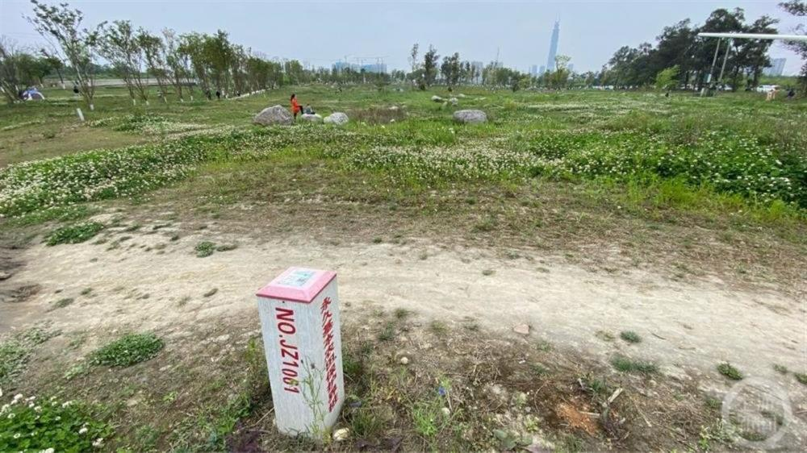

# 四川成都小区被“拆绿还耕”引关注，媒体：该问问谁将耕地变成了绿地

极目新闻评论员徐汉雄

3月底以来，四川成都多位市民在当地问政等平台反映情况称，自己所在小区附近的绿地以及当地花费重金打造的“环城绿道”拆除了绿化植物，种上了小麦、玉米等农作物，“修好的绿地景观花费了不少钱，用都没用几天就拆了，完全是浪费公帑。”（成都多处“拆绿还耕”：网红绿道边种上10万亩农作物）

上游新闻记者从多个部门获悉，相关市民反映的“拆绿还耕”现象确实存在，但均属于按照政策要求推动复耕，不存在违规之处。

相关人士称，涉及整改项目的土地，并不涉及土地性质改变的问题，“从一开始都是耕地，复耕复垦里面的复字就是恢复的意思，并不涉及土地性质的改变。”除了绕城绿道，成都城区内多地也在推动“复耕复产”工作。

也就是说，这些“拆绿还耕”并没有错，是正常的复耕行为，要说有错，就是耕地原本就不该被“绿化”了。

_成都环城生态区范围内的基本农田保护界桩（图源：上游新闻）_

“中国14亿人口，每天一张嘴，就要消耗70万吨粮、9.8万吨油、192万吨菜和23万吨肉。要满足如此庞大的消费需求，每年的粮棉油糖菜播种面积大概稳定在23亿-24亿亩，如果按1.3的复种指数倒推计算，耕地必须保持在18亿亩。”这是2022年3月，农业农村部部长唐仁健在全国两会“部长通道”给出的推演，以此说明18亿亩耕地是“底线”。

18亿亩耕地少不得，不能少，因为事关大家的吃饭问题。现实情况是，虽然这个底线是守住了，全国耕地达19.18亿亩，但10年间耕地地类减少了1.13亿亩，人均耕地面积不到世界平均水平的40%。耕地的底线已退无可退，推动复耕是应有之义。

以成都市所在的四川成都平原来说，这里一向被称为“天府粮仓”，但“耕地非农化非粮化”问题一度严峻。2021年公布的第三次国土调查数据显示，与“二调”数据相比，成都平原耕地面积10年时间减少了40%。面对严峻形势，四川重拳出击，坚决遏制耕地非农化非粮化势头。四川省国土资源系统的相关人士表示，坚守耕地底线是当前自然资源系统内一项重大工作，目前各地对于已经建成的公共设施进行“纠偏”拆除，是保护耕地工作的具体执行。

在这个背景下，成都“环城绿道”拆除绿化植物，推动复耕，也就是形势使然，守住耕地底线的应有之义。“纠偏”没有错，群众要问的是，耕地上的公共设施当初是怎么建上去的？当初是谁将耕地变成了绿化景观的？群众更担心的是，复耕别又是一阵风，昨天是“耕地变绿地”，今天是“绿地变回耕地”，明天别又搞成耕地再变绿地，如此来回折腾造成的浪费，才更令人心惊心疼。

从网络上也可以看到，群众对推动复耕并没有意见，但对一些不切实际的“复耕”
则难以理解。诸如，原本种植茭白苗的田被清理，只能种水稻，有的将鱼塘填了复耕，有的到缺乏水源的坡地上搞“高标准农田”建设。有网友总结道，有的地方是“良田上建房，山上种水稻”。

群众反感的是这种形式主义，因瞎折腾造成的无谓浪费。守住耕地底线，重在守住不乱折腾的底线，宜耕则耕，宜林则林，宜绿则绿，从实际出发，实事求是，才是真正对耕地负责，对民生负责。

（来源：极目新闻）

