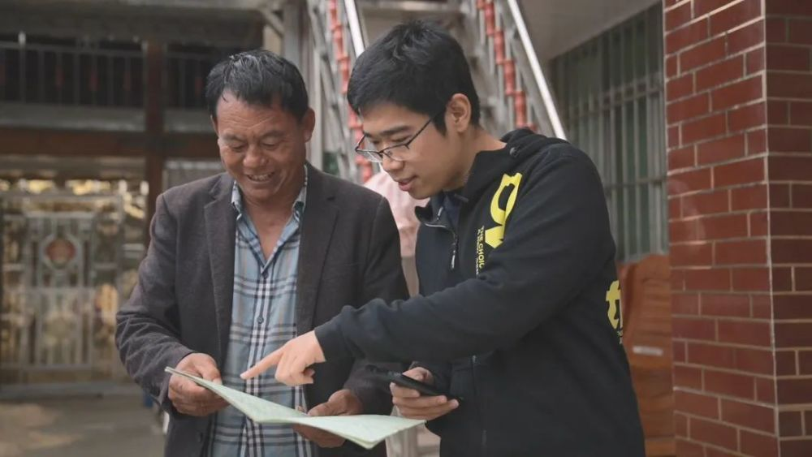
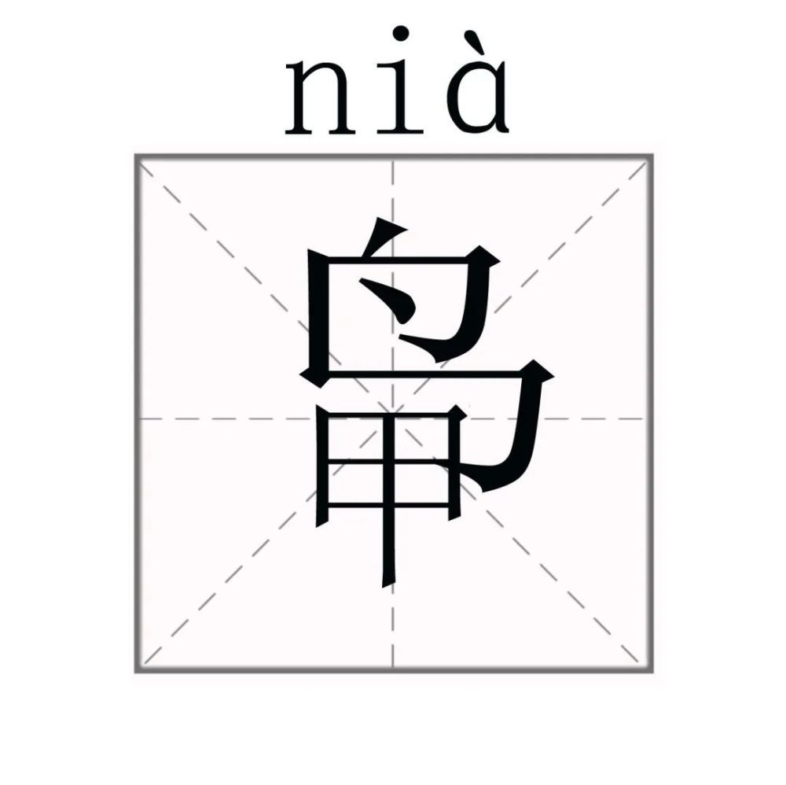
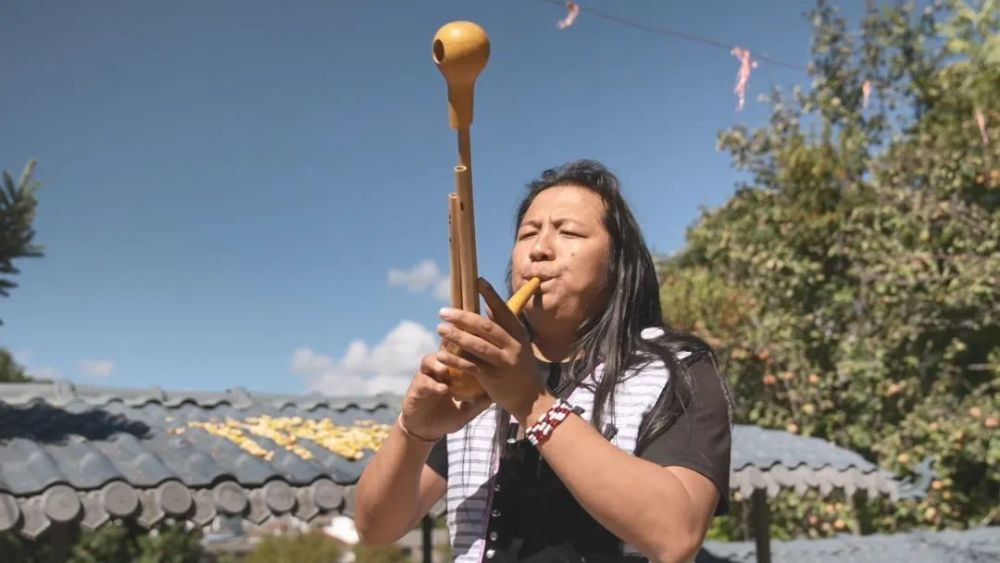
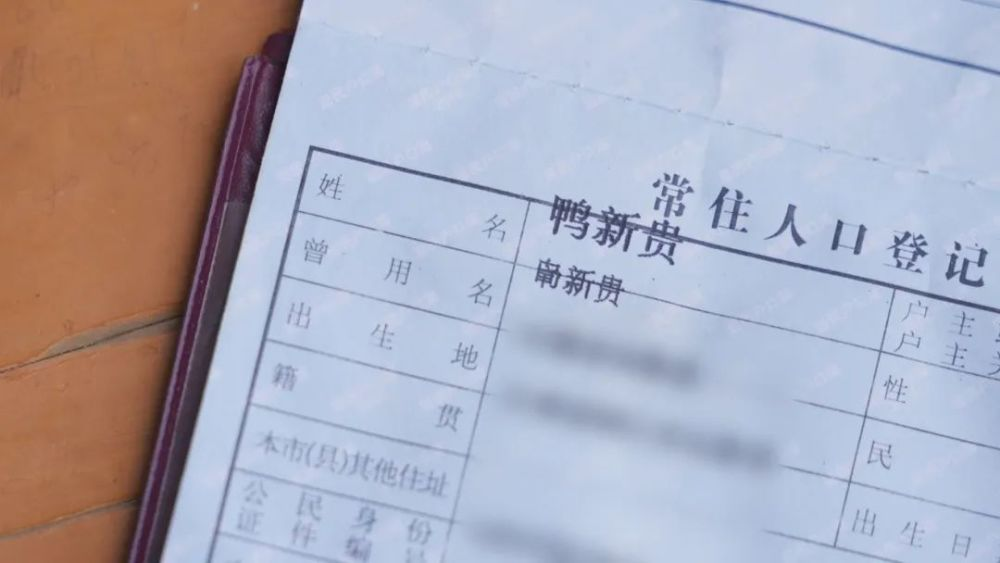
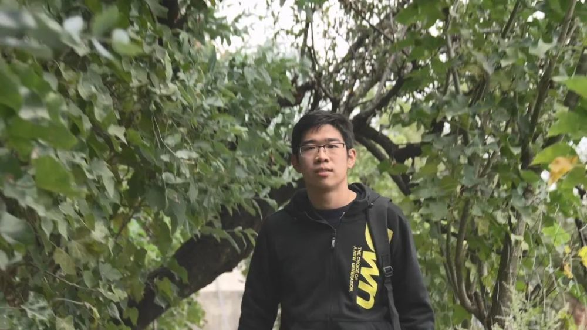
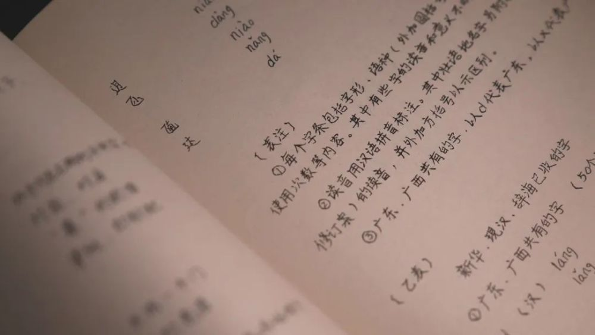
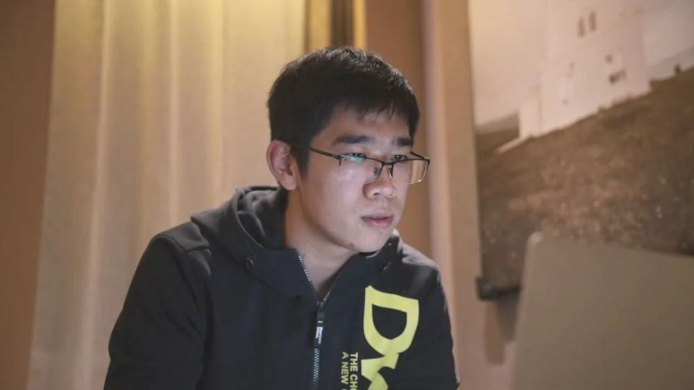

# 因姓氏太罕见，全村老少集体改姓“鸭”：不改手机银行卡都用不了

消失的字

寻找一个即将消失的文字，不是一件容易的事。

云南永胜县，一个距离丽江一百多公里的小县城。三千多米的高山，被金沙江的几条支流包围。目的地河腰村就在其中一座大山的深处，从县城出发，到了山路的入口，还要一直往海拔两三千米之上再行驶十几公里，直至走完一段段惊险的盘山公路，抵达大片蓝绿色桉树丛之中，零落在苍茫大山之中的人家。

鸭新贵的家就在这片山谷之中。他52岁，是当地一位傈僳族的村民。从出生开始，他几乎没有离开过这个地方。他的家有一个宽敞的大院子，养了许多牲口，门口还有一大片肥沃的菜地。每年收割一次山里的桉树树脂，收成就够家里半年的开销。日子循环往复，几乎不会有任何变化。直到十月底的这一天，一个特地从外地前来寻找他的年轻人，出现在了山脚下。山路难找，年轻人需要他骑摩托车前来引路。

_鸭新贵与王谢杨_

寻找他的人，王谢杨，一个24岁的大学毕业生，如今的身份是生僻字研究者。他穿着连帽卫衣，背着黑色书包，身上还有多少稚气。但在生僻字领域，他已经做了四五年的研究，寻找了将近六百多个生僻字。那些出现在地名、人名中的生僻字，是他寻找的关键——这些字由于过于特殊罕见，往往在国际汉字标准Unicode里，还没有自身存在的编码。这意味着，因为缺少计算机语言里通用的编码，一个字可能存在于人们生活的书写与口语之中，但无法在互联网的世界里流通。如此一来，这些字不仅会消失，且与之相关的一部分人，一旦要与外界世界，与互联网产生关系，必将受到息息相关的影响。

而眼下，在云南这个偏远的高山上，正有一个他想要寻找的答案。

鸭新贵不姓鸭。“鸭”只是前几年更换二代身份证时，系统无法输入他的姓氏，无奈更替的一个字。他姓nia，第四声，很遗憾以当下的技术，我们还没办法在屏幕上直接显示出这个字，但可以这样想象，这个字上半部分是少了一横的“鸟”，下半部分是“甲”，组合起来的那个字——nia，在傈僳族的语言里，就是鸟儿的意思。

“我们祖祖辈辈都姓nia。”

“小时候，我们住在比这里更高的山上，屋顶总是有许多鸟儿。”

“我的妈妈她们会在傈僳族衣服上绣鸟儿的花纹，但她去世了，衣服也没有保存下来。”

和这里大多数傈僳族村民一样，鸭新贵常年讲傈僳语，普通话只能做一些简单的表达。在过去，他也几乎没有向人解释自己的姓氏的来历，nia字的一部分，也随着字形的更替，消失在了他们的生活之中。在半腰村，通过当地更多人的讲述，王谢杨收获了nia字背后，属于这个独特姓氏的更多故事——

他们是鸟氏族的后代。在更老一辈的传说里，那种长得像鹰隼的鸟类，如同天上的星星一般，庇护着这里的一代又一代人。人们崇拜它，纪念它，更深刻的联结，是让它们存活在自己的姓氏之中。朱丽凡，一位丽江当地的傈僳族文化研究者告诉我们，傈僳族讲究氏族文化，崇拜动物植物，崇拜万物神灵。过去音译成汉字的nia字，就是这种崇拜的延续。一段浪漫的，神性的过往。

_傈僳族文化研究者朱丽凡_

但鸭新贵只保留自己的姓氏到了48岁。换身份证了，必须使用同一套系统，原本没有联网，甚至用手书写的方式行不通了。如果不改名字，他连平时到银行取钱，在微信上注册账户都没法进行。于是在那一年，据他回忆，全村仅有的一百多个nia姓人家，先后到派出所更换了自己的姓氏。既然nia字打不出来，那就拆开，鸟和甲——鸭子的鸭吧。没人知道这个“鸭”字最初是谁约定的，为什么是鸭不是鸟？没有其他办法了吗？他们有些说不出口的别扭和尴尬，但也只是收下了自己的新身份证，骑摩托回山里去了。

从那时开始，这些鸟氏族后代开始改姓“鸭”。nia字就这样消失了。

找字的人

那一天，因为语言的阻碍，听不懂傈僳语的王谢杨与鸭新贵没有太多深入的交流，但他知道了，鸭新贵算是拥有过nia姓氏的最后几代人。村里的老人，大都离世了，而后来的年轻人，因为多数只读到小学、初中，对姓氏，对自己的过往也难有更深的了解。他们面对的是更现实的一些难处。村里的另一个nia姓年轻人告诉王谢杨，因为改成了“鸭”姓，上小学的儿子曾经一直闹着，要更改姓氏。

离开前，王谢杨还经过了鸭新贵的祖坟。就在走出家门口没几步路的小坡上，被浓密的绿草遮盖着，周围长满了南瓜。因为如今的墓碑都是电脑打印的，nia字打不出来，墓碑上，那个特殊的鸟氏族姓氏，也只能替换成了“鸭”。

那是鸭新贵去世多年的爷爷。

后来王谢杨说，看到那块墓碑，他心里说不出滋味。寻找、研究生僻字这些年来，在云南这个几乎隐没于山中的小村子，王谢杨第一次看见一个生僻字对于具体的人的影响。

_王谢杨_

王谢杨对生僻字的兴趣源于儿时翻阅字典的爱好。他不是家境宽裕的小孩，小时候没有电脑和游戏机，与他作伴的是几本厚厚的汉字词典。汉字给他带来了少有人能领略的乐趣，比如，品型字，三个口是品，三个金是鑫，“那三个虎是什么？”他在随身携带的纸上写下问我。“它念mao，意思还是老虎，有的地方管老虎叫大猫。”

听他讲述起来，研究一个生僻字的过程有时候就像破案。比如有个地方叫che（二声）家铺，字体打出来，上面是一个“生”，下面一个“死”，两者之间取同一个横的笔画，后人将此字解释为，一种处于生死之间的状态。听起来挺像那么回事。可后来王谢杨在大量阅读其他古籍的过程中，发现这个所谓的生死之间，原来就是“臭”字的变体字。演变过程说来就复杂了，大致就是人们在文字流传过程中，因为书写习惯、笔迹的差异，久而久之把“臭”字的旧体字——“臰”写变形了。

拯救生僻字的计划则是从大学开始的。在搜索生僻字的过程中，王谢杨发现，一本涵盖了大量地名用字的字符集《信息技术信息交换用汉字编码字符集第八辅助集》里，许多地名用字在Unicode中都没有编码，它们没有音，没有义，在电脑中当然也无法显示。

Unicode，可以理解为计算机语言中的“世界语”。无论应对何种语言，计算机只通过识别编码的数字认识每一个文字。也就是说，如果一个字在Unicode中没有自己独有二进制编码，那么它就无法在计算机中显示出来。汉字同样如此，如今中国国家标准与Unicode对接——要让一个汉字存活，首先要在Unicode中为其确立一个位置。

比如山东省菏泽市郓城县有人递交的字，“钅”字旁加一个“丰”字，读作bèng，该字是提交者家族传承数百年的姓氏。因为没有属于自身的Unicode编码，这个字无法在当地人的生活中流通。

像王谢杨这样的生僻字研究者，全国只有不到二十人，其中大多数是汉字爱好者。发现一个生僻字未被Unicode收录后，这些研究者能做的，是收集足以证明一个字仍然存在并继续使用的资料，比如与该字有关的身份证件、当地的地名标识等。但无论如何，这个过程都枯燥而漫长，按照Unicode审核周期，每两年一次的申请中，中国大陆只能提交约1000个字，这些字符汇总之后，一层一层的审核之后，又一个五年过去了。

王谢杨觉得时间很紧。他算了算，除了上文提到的《第八辅助集》里仍未编码的863个字，还有隐没在全国各地的那些不起眼却重要的地名用字，满打满算要完成所有的工作，“还需要20年时间。”

也有人说，一个字被废弃了，听起来似乎不算什么大不了的事。可在多年前翻看文献的那些时刻，那些生僻字背后更多的东西，注定让王谢杨走上了这条路——那是满满一页具体的村落名字：王家ma、范家ma、苗家ma、樊家ma、下郭家ma、大槐树ma……那是散落在河南汝州、登封、孟津、宜阳等地近百个具体的村子。“你想想这一个字会影响到多少人？你假设是200个村，一个村20个人，4000人。”

_《福建
广东 广西 地名生僻字表》_

也是从那个时候开始，寻找生僻字，真正从过去那种纯粹的乐趣，进入了王谢杨真正想投身的事业当中。他当时还在天津大学读化工专业，可以想见的未来是，在化工厂里枯燥地对着化学反应原理设计反应工程，过一种最常规的工科毕业生的生活。然而，生僻字的世界里有他更加着迷的东西，复杂，多样，暗含着文化与历史的密码，同时，“也真正会影响到一个个具体的人的生活。”

虽然只有24岁，但很多时候王谢杨说话时都给人一种平静和沉稳的感受。聊天过程中，他手中那张巴掌大小的纸上，双面都被他写上了各式各样的生僻字例子，有的是因为有趣，有的是因为有用，他的大脑中似乎也已经组装了一个大型的字库，一个字的写法、用意，及其源远的来处，已经经由他日复一日痴迷地阅读与寻找，刻在了脑子里。后来我在王谢杨的知乎上看到他曾写下一句话：如果你想问我为什么非要考证这些汉字，我只能引用英国登山家乔治·马洛里的一句话回答：“因为它就在那”。

因为那些字就在那里，王谢杨想让它们继续存在。

赶在遗忘之前

很长一段时间里，关于“nia”字的最后一点痕迹，只存在于由“鸟”和“甲”组成的生僻字中。它是否还在当下生活中被使用，包括王谢杨在内的许多人，都不得而知。

刘芳是腾讯搜狗输入法的研究员。作为数字世界最基础的沟通工具，输入法团队常在后台反馈中收到用户的需求，比如某个生僻字，怎么都没法打出来，生活中的某个时刻，总会因为这样的缺失受到影响。正是这些留言，让他们越发意识到一个字对于一个人难以想象的重要性。它们微小，却不能忽略。

去年3月以来，刘芳跟团队一起，推动了搜狗输入法生僻字输入键盘的研发，让人们即使不知道一个字的读音，仅凭字形也能打出它。她和同事也一直在收集用户打不出来的生僻字。

在找寻生僻字的过程中，刘芳认识了王谢杨。王谢杨把“nia”字推荐给刘芳。刘芳想知道，这个字究竟对一个地方、一个人有怎样具体的影响。但搜索资料的过程中，刘芳发现，在已有的网页资料里，几乎很难获得关于这个字的踪迹。它或许已经消失了？或许经历时间的推移，这个姓氏已经彻底离散、被人遗忘？

在真正找到nia姓人之前，答案不得而知。于是他们开始了这次漫长的旅途。

生僻字的寻找过程总是充满着许多变数。有的时候一个字在古籍资料里记载，在旧时的地方志里出现，到了当下早已改弦易辙，甚至连痕迹都没有留下。有一次，王谢杨曾托朋友前往海南儋州，找一个只有当地方言里曾出现过的字，也是某个村落的名字。但那位后来失败而归。

_王谢杨提交的生僻字
“biang”字_

还有一个故事发生在江苏宿迁。在宿迁以南的泗洪县，一个名叫维头村的地方，一位乡村语文老师坚持多年，在每一届新生到来时，教给他们关于家乡最重要的知识：这里原来叫zhuai（第三声）头村，一个土，一个只，写作“土只”。指的是旧时季节性的小河流过，人们用一根根木棒搭起的摇摇晃晃的小桥。在当地的县志里记载，这位老师退休前，发现《辞海》《新华字典》里依然没有收录这个字，深觉遗憾。“咱村儿那么大”，他希望自己归属的地方，在历史的河流中有一个位置。后来刘芳看到这个故事，给当地单位打了电话，寻找后文。但那位老师，那位心里牵挂这个zhuai字的人，却没有任何线索，无声无息。

王谢杨研究多年，当然知道对于许多生僻字而言，在时间进程中沉默地流变，更替，消逝，是再自然不过的事情。但他说，对于一个个具体个体而言，“但只要有人还在乎这件事，珍惜这个字，我就希望自己做的事，能为他们得到一个结果。”

后来，在nia字的寻找线索一度中断的时候，刘芳在手机地图上发现，在永胜中六德乡附近，一家沙子厂的名录下就有一个手机号。而且，终于不是空号。这家沙子厂的厂长，后来给她找来了一位傈僳族的朋友。由此，刘芳知道了更具体的河腰村，更精确的目的地。与nia姓人会面的事终成定局。

他们的归属

如果一切顺利，按照正常的流程，王谢杨要把这些证件收集起来，作为证据提交给负责制定汉字编码标准的IRG（表意文字小组）。他已经做了这件事情。这一次见到鸭姓村民，他的另一个收获是确定了这个字的读音，他发现，那种鸟儿的名字，是介于n和l之间的某种读音，而不是过去被记载的，lia。

到今年为止，王谢杨已经通过各提交源向IRG提交了500多个地名用字。只不过，递交的流程不知道要等待多久。每年都有太多的字要审理，这不是他能决定的事情。

去年六月初，腾讯搜狗输入法团队曾发起一场生僻字的征集，了解生僻字到底在日常生活中对人们有什么样的影响。常年在技术这一端与输入法中的字体打交道，他们更多时候从产品的视角出来，打量和审视一个个文字。没想到的是，那一次的征集发布后，不到一天时间，他们就收到了来自用户的160多条反馈。

那些生僻字来处各异，遍及人们的日常生活。一位牙科医生告诉他们，医学里有一个字，一个牙，一个合，读作二声he，代表上下牙接触的动作。但他们无法在电脑和手机上把这个字敲出来，写病历时，只能用其他文字代替。还有一位工科专业的博士说，几年前他在撰写一篇论文，即将在顶级期刊发表时，却被一个小小的生僻字问题卡住了，是代表一种能量参数的“㶲”，在当时，他还无法用输入法打出。

但在所有生僻字的征集中，留给他们印象最深的，是人们对某个字的情感，其背后，或许是他们一段重要的生命经历。一位女孩在一张白纸上，用清秀的字迹写下了一首儿歌，那是小时候堂哥教给她的，她只知道发音和字型，后来却怎么也打不出这些字了。她的堂哥已经去世了，她希望留下这些字。

很长一段时间里，王谢杨几乎靠着一种理性的逻辑去推动生僻字的工作，他认为只有缜密的逻辑与证据，才能让那些即将消逝的生僻字留存。但真正到了海拔三千米以上的nia家村，在大山深处的村落里见到一个个被迫改姓的nia姓村民时，王谢杨说，还是在情感上受到了一种强烈的冲击。

_旧身份证上手写的nia姓_

那是质朴的，不善言辞的普通人，一张张地掏出自己过去几版身份证，用墙角的白色石灰在地上刻下自己原本的姓氏，nia，告诉他：

“我姓nia，我家祖祖辈辈都姓nia。”

一个字背后，是一种独特的归属与确认，很多时候，包含着我们的来处。

郭小武是中国社会科学院语言研究所的研究员，研究甲骨文、辞书学和文字学等领域。在北京的办公室，他告诉我们，研究文字多年，他知道一个字的变更会给人们的生活带来许多现实影响，比如邮政、公安、医疗、中外交流，“这些领域他们会遇到非常多的困惑。”

_中国社会科学院语言研究所研究员郭小武_

但文化研究的视角也让他看见了文字对人之存在，更加深远的影响。那是人们在更广阔意义上，与自己过往历史的连接。“有一些生僻字，它的文化背景非常深，也非常讲究。你知道一个事物，如果你知道了它的系统性、连续性的时候，就是人的乐趣所在。它有了联系，就不再是孤立的。”

“比如这个nia字，有近400多年的历史。对于那些云南村里姓nia的村民，这也意味着他们的人生有了历史的归宿。”郭小武说。

从nia家村回来的路上，我们接到了一位当地中学老师的电话。他也是nia姓氏族的后代，在丽江的另一个县华坪工作。因为平日里从事教书工作，他普通话流利，相比起河腰村的村民，这位老师在电话里更加热切地表达了自己作为鸟氏族后代的身份认同感。“我们崇拜它们，对它们抱有感恩之心，就认定了自己是鸟氏族。如果你们来华坪具体了解，你们可以进入到那个村子里面去。”

挂电话前，像过往告别每一个nia姓人那样，王谢杨告诉那位老师，乐观的话，只要再等上大概一到两年，他就可以在手机里，打出自己的姓氏。真正在身份上换回原来的名字，需要更长的时间，五到十年。但总归有了一个好的开始。

2022年7月，新增了1.7万生僻字的《信息技术 中文编码字符集》（GB
18030-2022）强制性国家标准发布，今年8月1日正式实施。腾讯搜狗输入法也联合多方发起“汉字守护计划”，向更多人征集和他们息息相关的生僻字，并推动这些汉字在数字世界能被打出来，用起来。也许，换回生僻字姓氏的那天，会比想象中更快到来。

后来我看到了他们那次通话的文字整理。原来那位住在华坪县，与一百公里之外的鸭新贵相隔着上百公里的老师，并没有选择姓鸭，而是在另一个更换的名字里，用同音的文字，保留了自己过往的印记。

“我姓亚。”他说。

◦ 文中刘芳为化名。图片均来自谷雨工作室联合搜狗输入法出品纪录片《寻找姓“鸭”的人》视频。

作者 | 杨宙 编辑 | 金赫 出品 | 腾讯新闻 谷雨工作室

版权声明：腾讯新闻出品内容，未经授权，不得复制和转载，否则将追究法律责任。

