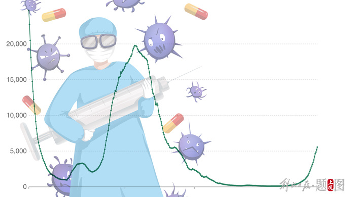
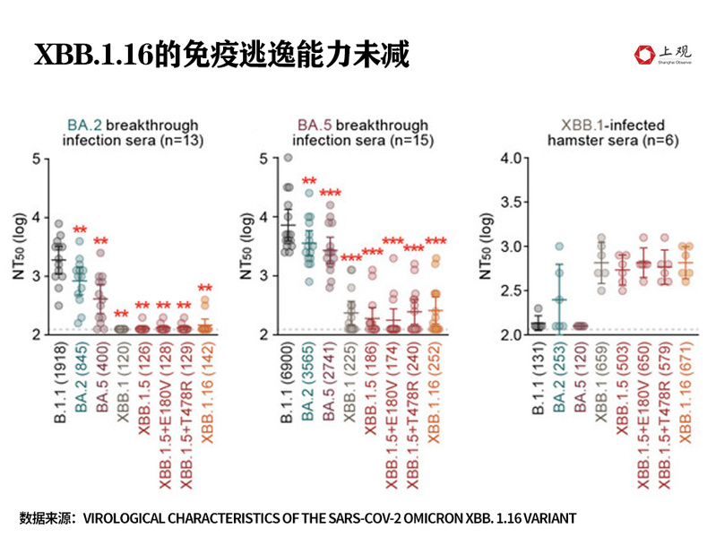
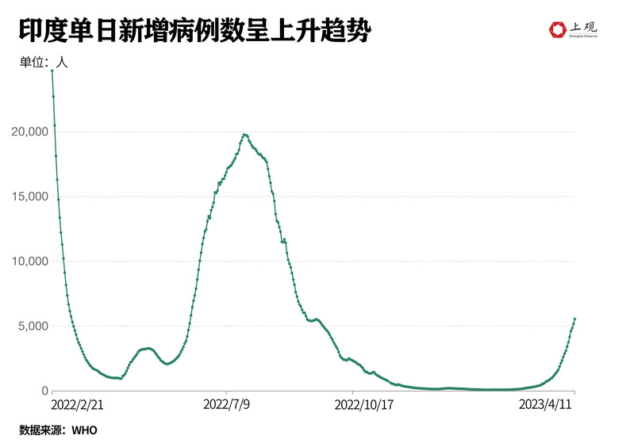
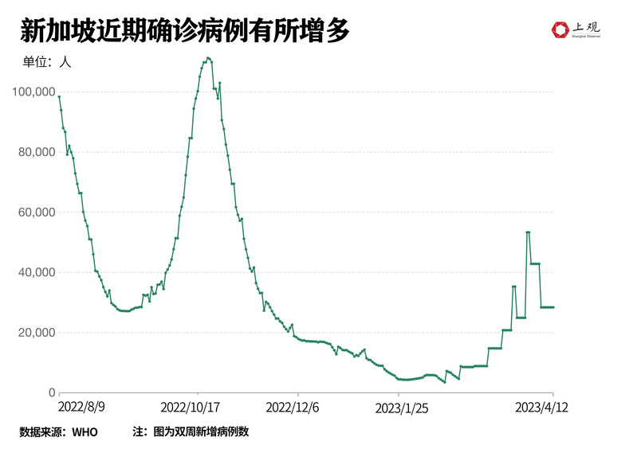

# 新毒株席卷印度，会引发中国第二波疫情吗？不必过于担忧

当全球都逐渐遗忘新冠病毒、重返常态生活后，印度部分地区却又开始推行“强制佩戴口罩”的指令。只因为一株被称为“大角星”的新型毒株XBB.1.16再度席卷而来。

那么，作为邻国，我们会受影响吗？

**或有小规模感染**

从各项数据来看，小规模感染似乎难以避免，但不至于大面积扩散。

为什么说“难以避免”呢？ **这与XBB.1.16的特性有关。**

XBB.1.16是奥密BA.2.10.1和BA.2.75的重组或杂交变体， **传染性远高于此前毒株。**

根据日本东京大学医学科学研究所4月初发表的预印本【1】论文，XBB系毒株的传播速度已高于BA.4/BA.5，而XBB.1.16的Re值又分别是XBB.1和XBB.1.5的1.27倍、1.17倍之多。

不仅如此， **XBB.1.16的免疫逃逸能力也并未衰退**
，与XBB.1、XBB.1.5相近。这也就意味着即使有感染史，或接种疫苗，都有可能再次感染XBB.1.16。

印度的感染数据也验证了这一发现。

早在2021年，印度病毒学家雅各布·约翰便称，印度是世界上首个战胜新冠疫情的国家，已有超过90%的人口感染了病毒，进入全体免疫阶段。

但近一个月来， **印度新增感染人数激增** 。根据印度卫生部公布的17日公布的数据，目前印度单日新增病例数已超过1万例，创近8个月来新高。

并且，尽管今年1月下旬才在印度被发现，但根据GISAID的数据， **目前XBB.1.16已扩散至全球34个国家/地区**
。除印度外，新加坡病例也有所增加，XBB.1.1占新增病例的30.43%。

而根据中国疾病预防控制中心发布的《全国新型冠状病毒感染疫情情况》，截至4月15日，国内已有15例XBB.1.16和2例XBB.1.16.1。

那么，为什么说不会发生大面积感染呢？ **因为国内尚在前一波疫情的“保护期”内。**

一般来说，感染过新冠病毒的患者，在3至6个月体内具有较强的抗体，再次感染的概率较小。相比中国，印度已过了抗体有效期，前一波疫情在去年7月前后，距离现在已有超半年的时间。

**因此，即便XBB.1.16在国内传播，应该也不会出现印度这类激增状况。**

**更易引发结膜炎**

XBB.1.16的症状会更严重吗？更易致死吗？

目前尚未有相关研究，但若按照此前病毒的变异逻辑，传播速度更快的XBB.1.16， **危险性不会高于此前毒株，与XBB系毒株相近。**

来看看印度的情况： **XBB.1.16并未导致更多重症与死亡病例。**

根据一份印度马哈拉什特拉邦的统计，在4月15日，该区域共有6047名感染病例，5.1%的患者需要住院，而需要重症病房的患者仅有0.8%，不到50人。

**也仅有2例死亡病例与XBB.1.16有关。**

目前，印度的7天动态病死率也没有出现较大涨幅，虽高于去年低值（0.2%左右），但也远低于此前峰值，也处于下降趋势。

如果硬要说差异的话，与此前毒株相比， **XBB.1.16似乎更容易诱发结膜炎** ，造成感染者红眼、瘙痒等不适。

尽管如此，面对新冠病毒，也不要掉以轻心，特别是老年人或有基础疾病的患者，完善疫苗接种，出现症状后及时就医。

【1】Yamasoba, D., Uriu, K., Plianchaisuk, A., Kosugi, Y., Pan, L., Zahradnik,
J., ... & Sato, K. (2023). Virological characteristics of the SARS-CoV-2
Omicron XBB. 1.16 variant. bioRxiv, 2023-04.

