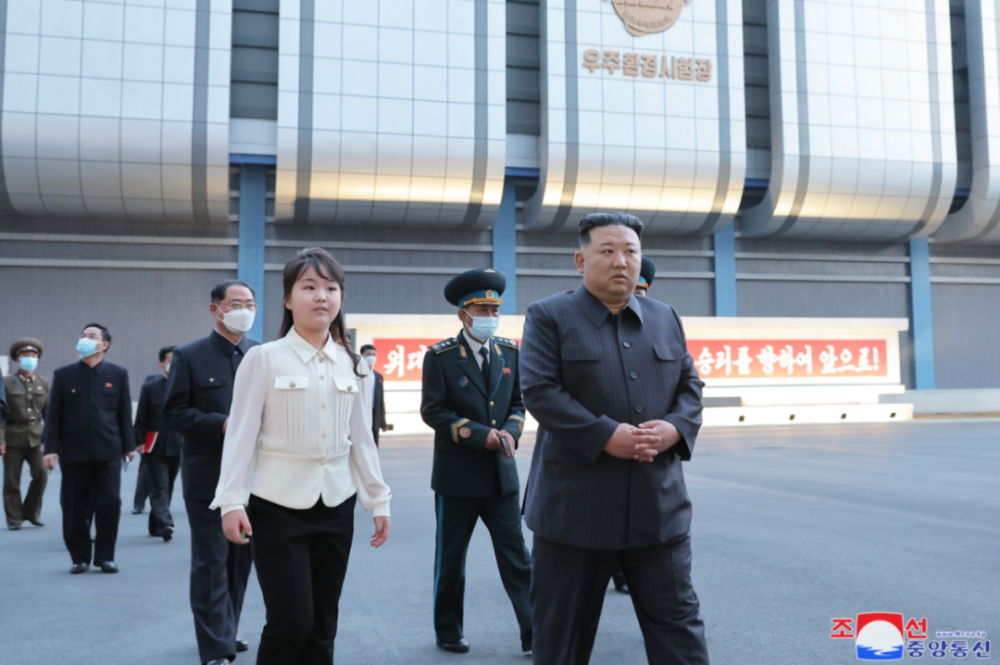
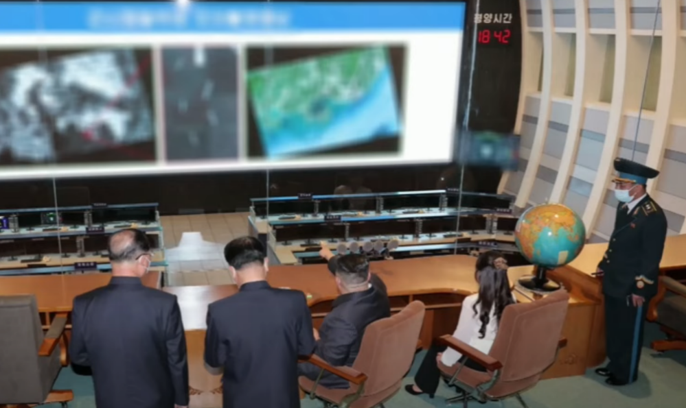
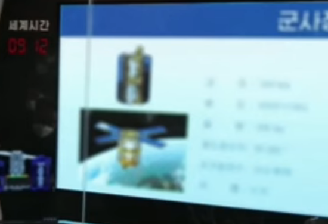
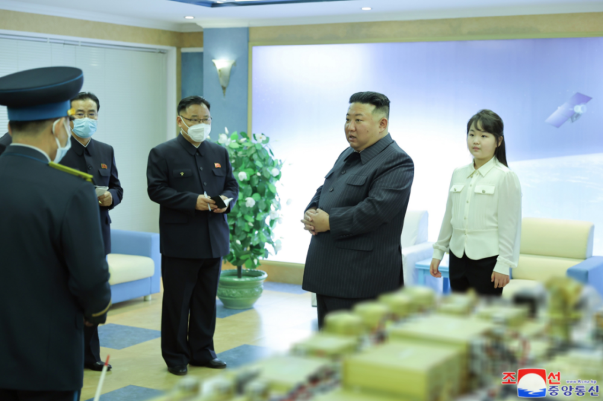

# 朝鲜公布将如期发射军事侦察卫星，美日韩：反对

4月18日，朝鲜国务委员会委员长金正恩对国家宇宙开发局进行现场指导，并指示如期发射已制作完成的“军事侦察卫星1号”，强调其是“最重大而先决的任务”。侦察卫星对于朝鲜核反击体系的重要性何在？

_金正恩携女视察朝鲜国家宇宙开发局_

朝中社4月19日报道称，金正恩前一日视察朝鲜国家宇宙开发局，敦促组建非常设性的卫星发射筹备委员会，以如期发射“军事侦察卫星1号”，并要求未来部署多颗侦察卫星，以增强侦察和情报收集能力。这是金正恩自去年3月以来时隔1年多再次对国家宇宙开发局进行视察。劳动党中央委员会书记朴泰成、军需工业部副部长金正植等干部，以及多名工程师和专家陪同视察。金正恩的女儿金主爱也同行。

金正恩在视察时指出，朝方发射侦察卫星是面对韩美军事行动出于正当防卫采取的举措。他说，美国正在将核航空母舰、核战略轰炸机等大量战略武器调遣至半岛周边地区，几乎是常态化部署，使韩国成为对朝侵略的前哨基地和战争的火药库。在这种情况下，获取并运用军事侦察手段，是比什么都重要的最优先任务。

**随着朝鲜核导研制能力大大增强，包括用于核打击的新型武器试验已升级到多年未见的水平，侦察卫星的到来将使朝鲜如虎添翼。**
美联社评论指出，朝中社报道重点关注最近几个月部署在韩国的航母和远程轰炸机等美国军事资产，但没有提到美国本土的潜在目标。这可能意味着，朝鲜打算利用侦察卫星识别包括美国军事基地在内的韩国关键目标。

特约评论员石宏对深圳卫视直新闻表示，侦察卫星对朝鲜来说最大的意义就是让朝鲜的眼睛变得更亮，一颗侦察卫星完全可以覆盖整个朝鲜半岛，包括日本很大一部分。这样一来，就使得朝鲜对于东北亚地区的战略情报得到很好的提升，发现了美韩的战略部署之后，朝鲜再去采取任何应对措施，它变得更加游刃有余了。不仅如此，也将使得朝鲜战略武器的威慑力大增。

外界推测，卫星至少300公斤以上

朝中社在4月19日的报道中，公开了一些大型显示器的画面，当中介绍了军事侦察卫星1号的照片和数据等。放大照片后，虽然看不清参数，但可以看到卫星的形状是六边形，上端带有4个太阳能电池板。据推测，其重量至少在300公斤以上。

韩国专家认为，从目前朝鲜开发的火箭技术水平来看，完全可以将200-300公斤重的卫星体送入地球轨道，但从卫星轨道准确移动到目标位置并在地面控制卫星，需要高难度的技术和尖端设备，而自主研发这些技术并非易事。不过韩联社指出，有消息称朝方近期与俄罗斯进行国防合作，卫星技术水平或许出乎各方意料。

值得注意的是，朝中社在报道中没有详细说明军事侦察卫星1号的预定发射日期。分析人士认为，从近期宣布成功试射高超音速导弹、新型固体燃料洲际导弹，再到准备发射侦察卫星，朝鲜方面正在按照自己制定的日程逐步提高国防力量，逐一实现军事战略关键目标，以“强对强”原则应对美韩施压。

得知朝鲜要发射卫星，美日韩：反对！

朝鲜公布将如期发射军事侦察卫星后，引发美日韩一致反对。韩国外交部4月19日敦促朝鲜撤回发射军事侦察卫星1号的计划，称韩政府将在维持稳固的韩美联合防卫态势的同时，“与国际社会携手合作，让朝鲜为其非法挑衅付出代价”。美国政府和军方高层官员当地时间18日一致表示将采取强硬应对措施，驻韩美军司令官保罗·拉卡梅拉声称，“如果朝方继续进行敌对行为，我们已经做好应对准备”。日本内阁官房长官松野博一19日在记者会上就表示，“即使是卫星，如果朝鲜利用弹道导弹技术强行发射，将明显违反安理会制裁决议”。

韩媒称，在4月26日即将举行的韩美元首会晤中，尹锡悦和拜登将重点讨论加强延伸威慑执行力。延伸威慑是指，美国运用核保护伞、导弹防御系统等手段保护韩国免受核攻击及威胁，把防卫本土的核威慑延伸到防卫盟友的程度。韩总统室一名高官20日向媒体透露，韩美两国仍在就延伸威慑进行收尾阶段的磋商。

另据路透社4月19日报道，尹锡悦表示，为应对强烈的核攻击，韩美应该准备比“北约式拥核”更强有力的核遏制举措。他还透露，为了应对朝鲜威胁，韩国在强化监视、侦察、情报分析能力的同时，还在开发超高性能武器。韩国《文化日报》19日称，尹锡悦所指的“超高性能”可能是能够瘫痪朝鲜防空网和无线指挥通信体系的电子战机和电磁脉冲、能够瘫痪电力网的断电炸弹以及被称为“怪兽导弹”的韩国“玄武5”。此外，韩国正在研发的高超音速导弹，目前处于机体推进技术研发和外观设计阶段。

特约评论员石宏表示，超高声速武器要打击朝鲜的战略目标，其实难度很大，因为朝鲜在过去这几十年时间里边，关键的设施都已经地下化了，这就使得韩国很难去把朝鲜关键的目标摧毁掉。另外一方面就是朝鲜很多常规武器并不是很依赖于电子系统，这就使得韩国要想去压制朝鲜的电子系统，反而难度还变得更大了。美国本身就有很强大的电子战能力，对于朝鲜都没有形成非常强大的威慑，更何况韩国自己去研发类似的武器，能够起到的作用是比较有限的。

作者：刘立平，深圳卫视直新闻主笔；金子尧，深圳卫视直新闻记者

