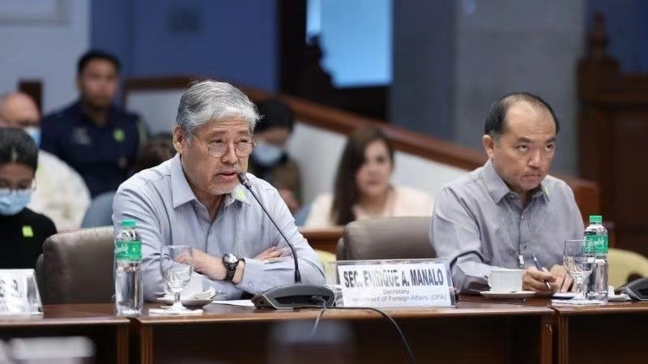

# 菲外长解释：不会允许美国在菲军事基地存放用于涉台海行动武器

_菲律宾外长在议会上发言，图自《菲律宾星报》_

【环球网报道】综合《菲律宾星报》、《联合早报》19日报道，菲律宾外交部长马纳罗当天在议会上表示，菲律宾不会允许美国在菲律宾军事基地存放被用于涉及台海军事行动的武器，也不会允许美军舰机在菲基地补充燃料、维修或重新装备。

菲律宾与美国今年2月同意扩大2014年美菲《强化防务合作协议》，菲律宾将额外开放四个军事基地供美军使用。美国在菲律宾可用的军事基地因此增至九个。《菲律宾星报》报道称，菲律宾参议院4月19日就美菲《强化防务合作协议》展开听证会。会上一名参议员提出关于美国可能在菲律宾的基地藏匿武器的问题，并提到美国2023财年《国防授权法案》中的一项条款授权为台湾建立所谓“区域应变军备库”。

报道称，马纳罗就此在会上回应说，“我们不会允许与此前达成协议的活动类型不符的任何行动或物品”，“《强化防务合作协议》不针对任何国家，目的范围限于菲律宾”。

《联合早报》称，根据协议，美国可在菲律宾的军事基地进行联合训练、预先部署设备、建造设施，但不可长期驻军。菲律宾总统马科斯4月10日向中方保证，美国可使用的菲律宾军事基地不会被用于发动进攻，华盛顿的防务安排旨在加强菲律宾的防御。马纳罗在听证会上说，菲律宾当前的外交政策是“跟所有人交朋友”，因此“与此不相符的任何事情都与我们的立场不一致”。这也意味菲律宾不会允许美军军舰飞机在菲律宾军事基地补充燃料、维修或重新装备。

关于菲律宾额外开放四个军事基地供美军使用，菲律宾总统马科斯3月曾表示，根据和美国签订的《强化防务合作协议》，4个新的军事基地将位于菲律宾的不同地区，包括面向南海的一个省份。中国外交部发言人汪文斌此前表示，我们一贯认为，国家间的防务安全合作应当有利于地区和平稳定，不应针对第三方或损害第三方利益。美方出于一己私利，抱持零和思维，不断在本地区加强军事部署，是在加剧局势紧张，危害地区和平稳定。地区国家应当对此保持警惕，避免被美裹挟利用。

