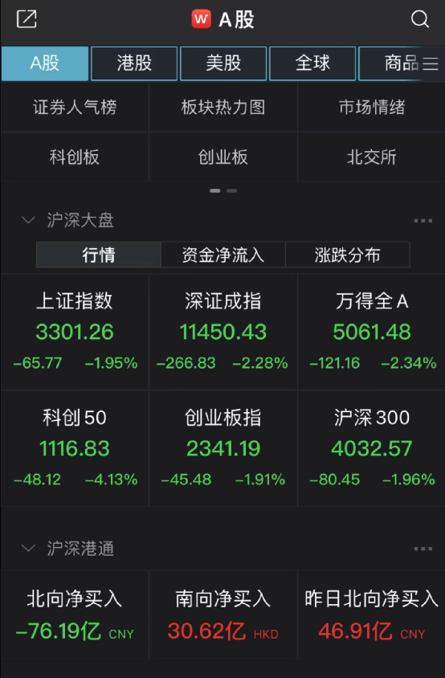
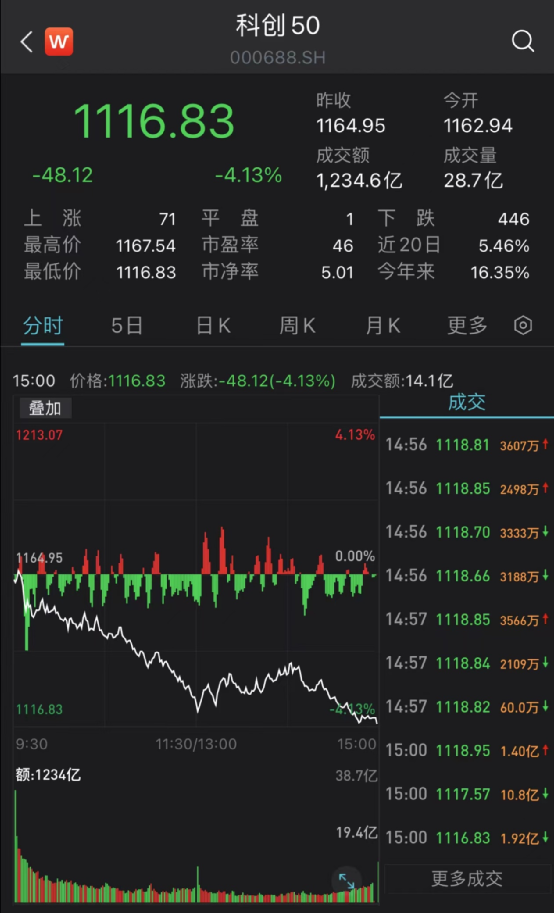
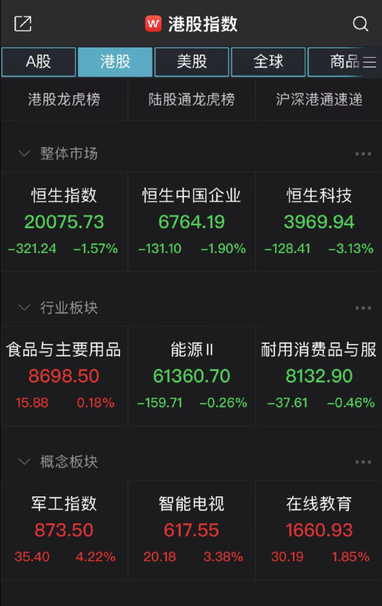

# A股大跌北向资金净流出76亿，发生了什么？10多家基金火速解读

中国基金报记者 曹雯璟 方丽

周五A市场以大跌来结束本周的交易，整体出现大跌，AI、半导体等热门赛道全线哑火。

从数据来看，几乎所有的主流指数都在下跌。4月21日，上证指数收于3301.26点，下跌1.95%；深证成指、创业板指分别下跌2.28%、1.91%。尤其是科创50指数，跌幅超过4%。两市成交额1.22万亿元，相比前一个交易日明显放大，北向资金净流出76.19亿元。

港股市场也表现不振，恒生指数、恒生国企指数的跌幅均超过1%，恒生科技大跌3.13%。

从行业板块来看，申万一级行业仅军工小幅上涨，其他均下跌；其中计算机、电子、传媒、通信等TMT板块领跌，跌幅均超过4%；其他跌幅较高的包括非银金融、社会服务、商贸零售等。

此次突然大跌究竟什么原因导致？TMT后续还有上涨动力么？如何看2023年的投资机遇？中国基金报记者第一时间联系包括南方、博时、创金合信、海富通、银华、长城、招商、恒生前海、摩根士丹利华鑫、兴业、西部利得、光大保德信、中信保诚、诺安基金等10多家基金公司，这些公司认为，前期积累较多涨幅、部分传闻等成为市场大跌的主要原因。

谈及后市，多数人士认为，短期调整不改A股上行趋势，目前国内经济数据强劲，企业盈利有望在二季度重回上行，将对A股形成基本面支撑。同时，随着美联储加息周期步入尾声，美元指数和美债收益率的下行趋势将得到强化，加上强劲的出口将对人民币形成支撑，在此环境下，外资有望回流A股。相对来说，人工智能等热门赛道投资价值依然很大。

**多因素积累造成今日大跌**

谈及今日市场大跌，多家基金公司认为，市场前期累积较多涨幅，受部分传闻影响下跌。

南方基金表示，市场前期累积较多涨幅，下行风险较大，盘中出现利空传闻，配合市场形成下跌。由此引发市场对产业发展的担忧，而北上资金也在加速流出。再加上前期在人工智能和数字经济驱动下TMT板块已经积累较高涨幅，部分投资者在可能的利空消息影响下集中抛售出逃，导致TMT板块全面大幅下跌。下跌主要由市场的下行风险与利空传闻带来的情绪叠加形成。

博时基金表示，今日A股大幅回调，核心还是由于今年以来，A股震荡上行，曾一度逼近3400点，市场有一定的回调压力；并且前期A股市场的波动率也处于过去几年的低位水平，市场波动率有放大的需求。4月以来，市场成交额均在万亿之上，成交量能较前期明显放大，市场情绪也有所回暖，板块轮动依然快速。3月金融和经济数据显示，国内经济在稳步修复中、但也面临一定的压力。随着五一小长假的临近，旅游需求将迎来集中释放，也有望进一步促进消费的修复。当前海外的局势整体仍偏动荡，不确定性因素较多。相对而言，A股市场面临的宏观环境更加友好，相对更具投资价值，其中长期向好的趋势不变。在短期没有重大政策利好以及显著增量资金的情况下，A股短期将呈现震荡走势，受益政策支持的行业板块或将更受资金青睐。

银华基金研究部表示，今日A股跌幅较大，主要受内外因素综合影响，并且近期热门的TMT板块大幅下跌拖累较多，具体原因包括：第一、近期市场对美国下半年通胀再起以及美联储5月加息的担忧再度上升，中美关系也受到市场高度关注。

第二、中国人民银行召开2023年一季度金融统计数据有关情况新闻发布会，表态2023年信贷投放以及社会融资规模增长将保持平稳，引发市场对未来央行可能引导“控节奏”，信贷投放可能放缓的担忧。

第三、近期为A股一季报密集披露期，从自上而下看，一季度A股可能面临一定压力，经济复苏初期工业品价格仍在走低，并且存在部分刚性费用的因素，可能带来利润率下行压力，A股非金融盈利可能出现负增长，未来披露的业绩低于预期的公司可能增加。其中TMT板块仅电信运营商一季度盈利确定性增加，计算机和传媒虽然在防疫优化后基本面边际改善，但改善幅度有限，整体仍然低迷；半导体库存去化压力较大，一季度业绩可能为双位数下滑。

第四、TMT板块连续上涨后，获利回吐压力逐渐加大，AI主题连续上涨后受到监管关注，昨日部分相关的公司密集披露股票交易异常公告，声明自身主业与AI关联不高或短期并未参与，提示二级市场投资者注意参与风险。同时近期TMT板块受到产业资本减持金额明显增加，拟减持公告数量也明显增多。

兴业基金表示，从目前的情况来看，下跌原因有：（1）在极致分化的行情中，成交量维持在万亿附近波动，因此存量博弈的资金面下，数字经济和人工智能板块前期盈利资金在节前有兑现需求；（2）近期对疫情的担忧再起，因此或对经济复苏的预期又有波动。

海富通基金FOF投资部王舜尧表示，经过前期上涨后，市场已进入了高波动的区间，出现单日大跌是较合理的现象。在今年市场偏向存量博弈的环境下，资金之间的行为可能不会保持一致，单边上涨难以持续，板块轮动可能会比较频繁。经过充分换手，行情才更有往上接力的可能，下跌后可关注超跌反弹的机会。

长城基金宏观策略分析师汪立表示，今天A股放量下跌，主要是突发两大利空：一是疫情扰动再起，疾控局称近期输入病例中新冠XBB.1.16的占比增加，引发市场对新冠病毒变异后二次感染的担忧。

二是海外政策风险担忧加剧，受此冲击，AI+板块大幅回调。但无论是疫情反复风险，还是AI+限制政策，对盈利的实质性影响偏低。两大事件利空冲击对当下的市场影响短期主要体现在风险偏好上。短期市场避险情绪带动下，相关热门板块阶段性进入到一定的调整阶段。

但随着经济的持续回暖，市场的风险偏好也会进入到修复状态。尤其是五月美联储加息到达阶段尾声后可能带来的北上增量资金对相关板块的支持值得关注。

市场主线仍在中字头和AI+之间轮动，二季度资金、政策和基本面三重催化下的中特估和AI科技主线仍值得逢低布局。

摩根士丹利华鑫基金表示，今日领跌板块为前期上涨较多的科技股。台积电在业绩说明会上下调业绩预期，并将库存去化时间延长也带来了市场对半导体的悲观预期。除此之外，计算机、传媒等活跃品种也受到重挫，可能的原因是AI近期波动较大，赚钱效应有所下降，而家电、新能源等发布业绩后开始受到资金的关注，对交易拥挤的AI造成分流。半导体与AI共振下跌带来市场情绪快速回落。因此，我们认为科技股下跌的主要原因并非外部因素导致，而是强势上涨后的正常回调。

创金合信TMT行业研究员郭镇岳从下跌原因看，短期市场受传闻影响，叠加相关板块在此前成交过于火热，积累了一定的涨幅，短期资金存在获利了结的需求。极致交易往往会成为市场情绪的放大器，前期热门个股今日跌幅均较大，市场恐慌情绪蔓延。不过目前看相关行业基本面并未出现重大变化，以TMT为例，尽管行情调整幅度超出市场预期，但基于基本面看，随着各厂商对AI大模型的推出，应用爆款的出现以及经济复苏带来的需求拉动，我们对科技行业投资机会仍然乐观。市场整体而言，当下总量政策以稳为主，宏观环境的修复趋势已经明确，但持续超预期的修复和强刺激政策也缺乏基础，预计市场短期仍将维持向下有底、向上有顶的震荡格局。

**对后市不悲观**

对于后市，南方基金表示，展望未来，短期调整不改A股上行趋势：第一，一季度国内经济数据强劲，显示国内经济基本面处于有序改善的上行通道中，随着社融增速转正，企业盈利有望在二季度重回上行，将对A股形成基本面支撑。

第二，业绩披露结束后，业绩最糟糕的阶段结束，市场会开始布局景气改善的方向。

第三，5月很可能是美联储最后一次加息，随着美联储加息周期步入尾声，美元指数和美债收益率的下行趋势将得到强化，加上强劲的出口将对人民币形成支撑，在此环境下，外资有望回流A股。

银华基金表示，市场无需过于悲观，风格可能逐步均衡。当前宏观环境仍相对有利于市场：一方面，经济和金融等前瞻数据继续支持复苏前景。3月新增信贷增长再度超出市场预期并且连续3个月强劲增长，金融数据作为前瞻指标有望逐步体现未来经济活动的改善，一季度经济数据也如期强劲反弹。另一方面，政策环境有望保持相对积极，在经济尚未出现持续性走强迹象之前，政策仍有望延续“稳中求进”的基调，重点关注4月中下旬可能召开的政治局会议。

兴业基金表示，展望后市，我们认为：从大势来看，下跌之后二季度依然可以积极逢低布局：（1）二季度国内政策预计延续呵护，外部高利率环境的压制也在缓解；（2）A股在盈利回升预期的带动下，估值修复预计还未结束。

海富通基金FOF投资部王舜尧表示，今年整体是中性偏乐观。在去年低基数的基础上，今年很多行业、个股预计都有业绩的边际改善；在今年弱复苏的预期下，资金面预计是偏宽松的状态，市场预计不会出现大的流动性风险，非常大幅回调的可能性比较低一点，所以市场震荡带来的机会也是可以去关注的。

恒生前海港股通精选混合基金经理邢程表示，只要中国经济增长复苏整体向好和美联储加息周期接近尾声的趋势保持不变，市场的吸引力和修复方向并未逆转。尽管港股市场短期可能会受到A股与美股潜在波动的扰动，但其当前抵御波动的能力也更大。考虑到市场存在下行防护，中期上涨空间则更多却决于企业在盈利端的修复。

西部利得基金表示，展望后市，短期存量博弈下，市场表现相对极致的风格，叠加五一假期临近，节前资金面整体偏紧，短期流动性压力之下市场或将迎来调整。刨除假期资金面因素，在经济弱复苏、流动性整体处于呵护状态之下，市场结构性行情有望持续演绎，市场震荡上行的趋势有望延续。

光大保德信基金认为，中国经济今年依然在上行通道中，居民消费在明显改善，政策也比较友好，一季度社融创历史新高，这一指标领先我国的投资需求，预示后面经济修复仍将继续。而资金角度看，美联储也将结束加息，国内流动性比较宽裕。市场的短期波动并不等于持续下跌的信号，经济持续修复的基础并未发生根本改变，建议以积极心态应对。

**相对看好人工智能、地产链、消费等**

站在目前阶段去看市场，不少投资人士认为人工智能存在投资机遇。

南方基金表示，行业配置方面：第一，AI+扩散行情，从全年来看，在流动性环境改善和人工智能新兴产业趋势下，AI+大概率仍是全年的交易主线，短期TMT可能向智能硬件扩散；

第二，地产链，目前一手房二手房均边际改善，加上保交楼仍在推进，可选消费复苏弹性较大的方向可以关注家电、家居、消费建材。

银华基金表示，配置方面，TMT板块受益人工智能产业趋势支持，但短期业绩兑现难度较大，经历前期过快上涨后临近一季报披露期，影响因素逐渐复杂，获利回吐可能导致板块波动加大。随着中国增长复苏得到更多数据验证，行业基本面逻辑可能重新重要于主题逻辑，关注经济修复主线，如泛消费板块中的家电家居、食品饮料、医药等。主题方面关注一带一路、国企估值重塑等。

兴业基金表示，从配置来看，3月以来极致的数字经济和AI行情已经松动，而经济偏弱复苏预期下，新的主线难以迅速形成，需要一定时间，建议以逢低布局为主。其中，医药、消费、中字头、有色金属等板块可择机配置。

创金合信基金首席策略分析师王婧表示，对于国内资产来说，总量政策以稳为主，政策空间充足，宏观环境趋向稳定向上，降低了A股系统性风险。但强刺激和强复苏的预期也难实现，因此市场整体仍趋于震荡，上下都有天花板。投资策略上轻总量重结构，目前投资主线已逐步清晰，低估值高股息为底色的中特估，以及政策和产业趋势双驱动的人工智能双主线，逐步形成一致预期，进入震荡上行阶段。当前可逢低关注医药、港股等底部布局机会，阶段性关注黄金和养殖等投资方向。

海富通基金FOF投资部王舜尧表示，短期相对比较看好今天跌的较少的几个板块，如医药、消费等。这类板块前期涨幅不高，整体蕴含的风险相对较低。另外建立在去年低基数基础上，这些板块在最近季度可能会有数据上边际的改善。

招商基金认为，随着国内短端利率快速回落，且美国紧缩金融周期进入尾声，投资者的流动性预期处于改善阶段，而国内二季度经济数据有望继续修复，这将使目前股票市场或仍处在结构性做多的窗口期。对于TMT板块，美国高科技企业在国内芯片等方面投资比较少，实质性影响有限，加之该板块当前处于产业投资早期阶段，目前其交易结构阶段性拥挤属于正常现象，我们应该更多地关注其产业逻辑的持续性和后续催化因素。总体而言，从2023年整体来看，我们根据新产业趋势，重点挖掘A股市场中增长前景明确的中小成长标的；在行业层面上，我们将重点关注人工智能、数字经济、自主可控等信息科技领域，以及医疗保健板块的业绩边际改善带来的投资机会。

恒生前海港股通精选混合基金经理邢程表示，综合来看，我们认为目前市场估值水平的吸引力在逐步显现，中期来看市场或在波折中上行，国内经济增长政策变化以及美联储政策路径值得关注。从节奏上，在风险溢价修复结束和估值修复接近完成后，我们判断盈利预期将对接下来市场的反弹路径和上涨空间将起到更为重要的影响。在此背景下，我们将重点关注互联网、医药生物、可选消费等成长赛道。

汇丰晋信新动力基金、2026生命周期基金
基金经理闵良超表示，2023年我国经济的核心增长点最有可能来自于消费。随着消费场景的恢复和居民的信心修复，我们认为消费有望迎来较高增速的增长。同时中央经济工作会议中把扩内需作为重要战略，不管是中央层面还是地方政府层面，未来可能会出台一系列的稳经济、促销费的政策。因此消费有望成为拉动2023年中国经济的最重要的驱动力。除此以外，部分周期行业原料在外而需求在内，有望在受益于全球通胀降温的同时，享受到国内经济修复带来的业绩弹性，其中的结构性机会可能同样值得关注。

摩根士丹利华鑫基金表示，科技股高位回调与复苏线下行带来了市场的大幅下跌。展望未来，我们依然保持对市场的乐观判断。一方面尽管经济复苏的预期有所降低，但复苏方向明确，新冠二次感染即便有影响也将远小于去年，经济不存在下行的基础；另一方面当前政策积极友好，流动性保持宽松，美联储加息接近尾声，市场风险偏好有望持续提升。近期上市公司陆续公布了一季报，从全年角度，我们认为上市公司业绩增速将呈上行态势，这将为市场的表现提供坚实的支撑。

西部利得基金表示，结构上，今年内外部环境变化相对稳定，经济逐渐恢复和外部交流逐步展开或仍是大方向，围绕科技和一带一路等领域的机会或仍将持续受到市场的高关注，建议关注后续政策端的变化和产业趋势、技术迭代的变化。制造、消费和周期领域，关注有基本面边际向好驱动的细分方向，以及周期板块关注经济向好背景下估值抬升可能带来的投资机会。

光大保德信基金表示，行业上来看，因为增长预期中性，海外流动性偏温和，所以还是整体偏向成长性资产的机会。但是TMT高关注度下，波动率较大，可以关注一些其它板块补充。消费比较有机会，去年Q2居民出行受限，对于可选消费压制较多，最近出行行为改善，可以寻找相关受益标的，如旅游酒店航空和地产后周期的耐用品消费。

中信保诚基金表示，1、与高质量发展相关，有望景气上行的资产：数字中国、信创、绿电运营、制造业进口替代；2、面临产业共振，低估值的央国企资产：建筑出海、绿电运营、绿氢、运营商；3、对于经济弱复苏定价不充分的资产：生物制品、电商快递、通用制造、消费电子等。

诺安基金表示，向后看，当前数据呈现经济还在复苏前期，通缩观点并不成立。此外，伴随着中央提出大兴调研之风，领导人近期密集在地方考察调研，其中科技自立自强能力、建设现代化产业体系均是领导关切的重点。当前在板块交易上出现极致的分化，预计市场机会也在筹码大幅调整之后慢慢显现。建议关注成长板块重点关注医药，同时在数字经济内部重点关注与硬件和算力相关的半导体、通讯设备。

