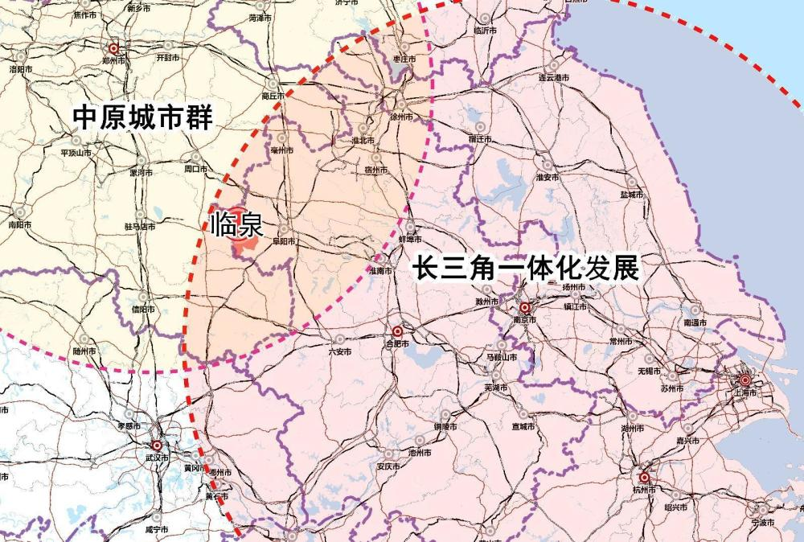
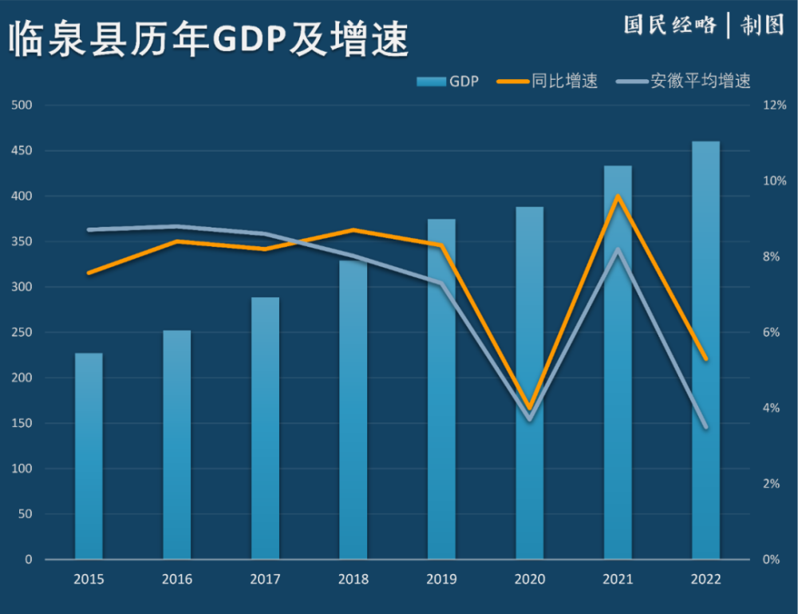

# “中国第一大县”人口回来了？曾向全国输出超6万名外卖骑手

**文|凯风**

这两年，全国最火爆的地方，不是一二线，而是广大的三四线地区。

前不久， **山东淄博** 借助烧烤一夜爆红，接力以“北上广深曹”出圈 **的曹县** ，成为全网热度最高的城市。

而在中部，也有一座曾经以“杂技之乡”闻名的 **人口第一大县——安徽临泉县** ，由于小店经济走热、年轻人回流、县域崛起，频频获得央视等主流媒体的关注。

三四线城市，何以成了焦点？

01

全国共有2843个县级行政单位，除去977个市辖区，还有 **1800多个县和县级市。**

同样是县，规模大相径庭。大则超过200万人，与一些中西部的地级市相当；小的只有十多万乃至几万人，不及北上广深的一些大型社区。

目前，全国户籍人口超过200万的县及县级市只有3个：安徽临泉县、广东普宁市、广西桂平市。

如果考虑全部县级行政区，广东普宁市是全国户籍人口第一大县。不过，县级市不同于传统的县，虽然级别相同，但县级市往往被视为城市管理单元，主要发展二三产业，与一般县城有了区别。

严格来看，单论县的话， **安徽临泉** 是全国唯一户籍人口突破200万人的县城，为名副其实的 **户籍人口第一大县** 。

根据官方数据，2022年，临泉县户籍人口达230万人，远超位居其后的江苏沭阳县、广西博白县，位列各大县城之首。

然而，作为中国户籍人口第一大县的临泉，还有另一重身份： **劳务输出第一大县。**

230万户籍人口的临泉，常住人口只有165万人，这意味着还有60多万人外流到了其他地区，尤以江浙沪“包邮区”为最。

在临泉的外出务工人员中， **仅美团骑手就有6万多人，在全国600多万骑手大军中位居前列，堪称“骑手第一县”。**

事实上，不只是临泉，整个安徽省都是人口外流的重点区域。

根据七普数据，安徽流向省外的人口为1152万人，占常住人口的18.9%，总量仅次于河南省。

然而， **这一局面正在发生逆转，人口开始纷纷回流。**

最新发布的2022年统计数据显示，安徽常住人口达6127万人，相比前一年增长14万人， **人口增量仅次于浙江，位居全国第二。**

如果扣除自然人口负增长，单看机械流入人口，安徽人口的回流规模接近20万人，而这已不是第一次流入，2015年至今整体回流了近百万人。

临泉县也是如此。高峰时期，临泉县在外务工的人员多达80万到100万之多，接近一半人都在外漂泊过。

如今这一数字已经减少了60万左右，大量人口开始回流。

临泉的常住人口也一改下滑态势，七普数据显示， **2010年-2020年，临泉县常住人口增加了11万人。**

值得一提的是，这些回流的人口里，出现了不少年轻人的身影。回乡回家创业，成了他们普遍的选择。

02

人口，为何开始向县城回流？

这背后，主要得益于 **“硬基建”** 与 **“软基建”** 的双重突破。

硬基建，说的是公路、铁路等基础设施。改革开放之初，中国的铁路只能覆盖一些大城市，高速公路更是付之阙如，一些偏远县城连国道、省道都没有。

经过几十年的狂飙式发展，如今全国已有 **18个省实现了“县县通高速”，8省完成了“市市通高铁”** 的拼图，安徽正是其中之一。

过去10年，安徽能成为发展最快的省份之一，除了集体加入长三角城市群带来的政策助力之外，先于一众发达省份成为 **“市市通高铁”第二省**
，且高铁里程稳居全国第二，无疑也是不容低估的因素。

与安徽省相比， **临泉县更能感受到大基建带来的“洪荒之力”。**

过去，由于地处豫皖两省交界，且远离省会，临泉县被戏称为“安徽的西伯利亚”，“外无出路，内无道路，招商无望，引资无方”之下，人们只能纷纷外出务工谋求生路。

如今，临泉县早已告别没有高速、高铁的历史。

2015年，临泉县第一条高速开通，目前第二条高速正在建设中；2019年，郑合高铁开通，
**临泉与合肥、郑州的通达时间缩短到1小时左右，从而跻身两大省会经济圈** ，一改过去的区位劣势。

有观点认为，高铁贯通是把双刃剑，固然能改变落后地区的交通面貌，但也会加剧大城市对中小城市的人口虹吸效应。

其实不然，人口流动本身就是相互的。有人涌入大城市，自然也有大城市的产业向劳动力充足且成本更低的县城导入，而往来越是频繁，大城市的商业模式和新业态也更容易在县城落地生根。

合肥庐阳区与临泉共建的 **临泉庐阳现代产业园**
，就是典型案例。这一产业园本身是基于扶贫性质的产业帮扶而来，但在当地区位改善、人口回流的支撑下，呈现出巨大的增长潜力。

数据显示，最近5年来，产业园区主要经济指标年均增幅30%以上，创造就业岗位3000个，已成为县域发展的强劲引擎。

而一度作为贫困县的 **临泉县，这几年经济突飞猛进，GDP增速接连跑赢全省和全国。**

交通改善，区位优势凸显，产业有了起色，自然会带动人口回流。

03

与硬基建相比，“软基建”的作用同样不容低估。

**软基建，指的是数字基建** 。坊间常说中国是 **“基建狂魔”**
，逢山开隧、遇水架桥并不令诧异，但4G、5G、宽带等网络基础设施在短短10多年就在全国上下普及开来，堪称奇迹。

无论是北上广深的繁华CBD，还是偏远山区的乡村，互联网早已遍布每一处角落。

如果说传统时代的电网、铁路和公路，让全国连线成网；互联网时代的数字技术，更进一步打破地缘、区位和行政级别带来的悬殊，消除了不同地域的信息鸿沟，让大中小城市回到同一竞争起点。

**数字经济最显著的特征，当属互联网平权。** 无论是电商还是直播，无论快递外卖还是即时零售，在县城与大城市可谓毫无二致。

在这种背景下，在外闯荡多年的临泉人，得以将大量来自城市的生活模式、消费业态和新经济产业生态，移植回县城，从大城市的骑手，摇身一变为县城创业者。

临泉县发改委主任宋伟接受央视记者采访说，随着交通设施的改善和无线网络的全覆盖，县城的新业态和新经济快速发展， **尤其是市场主体方面，每年新增1万多家。**

这其中，小微商户和个体经营者占大头。美团数据显示，临泉县入网的外卖商户差不多有1200家左右，周边的骑手500名左右，近三年商品的销售额翻了将近一倍。

借助平台经济，不仅传统的商超、便利店、餐厅扩大了消费半径，而且类似猫咖馆、美术班、剧本杀、围炉煮茶、新式烘焙店等新业态更是层出不穷。

**传统业态的平台经济化，意味着更广阔的市场；新业态的诞生，意味着更多的就业机会和岗位**
。而与一二线城市同样的消费业态，也让广大的县城青年享受到消费升级的利好。

一家县城街头仅有六十平方米的二十年老店，在平台经济助力下成为连接千家万户、满足消费者“万物到家”需求的零售新业态。

前不久， **央视《新闻联播》就报道了这样一家触网经营的临泉超市** ，指出“促就业、扩消费，新业态、新模式正为地方发展注入着新动能”。

有了新平台、新业态带动的巨大商机，大量常年外出务工的人回来了。一些人变成了老板，一些骑手不用背井离乡就能在家送外卖，有人在县城开了第一家平价猫咖馆，还有人通过直播将家乡的产品外销到全国各地……

最近有个名词颇为流行，即 **“小镇创业家”** ，与常见的“小镇做题家”形成了直接对比。

过去小镇苦于资源人脉匮乏、技术限制而难以留住人才， “小镇做题家”或许是唯一的出路。

如今，有了互联网和平台经济的助力，从小镇到县城，创业之风迅速蔓延，带动了本地产业和消费的日益繁盛。

**数据显示，过去5年，临泉县城城区面积扩展了三倍，市场经济主体（零售户、个体工商户）增加了3万多户，多数都集中在新业态领域。**

随着 **互联网和平台经济下沉，本地零售持续繁荣，人口开始回流，进一步刺激消费下沉和就业下沉** ，这又为县城公共设施的完善创造了更大可能。

这是一个难得的正向循环，也为县域经济的崛起提供了一条可复制之路。

04

几十年前，中国县城曾经一度引领过时代发展潮流。

当时，苏南模式、珠江模式、温州模式、晋江模式层出不穷。在经济学家的眼中，以县际竞争为代表的地区竞争，是经济奇迹得以产生的重要原因之一。

不过，随着大城市化建设如火如荼，人口纷纷涌向经济强市，中心城市、都市圈和城市群成了经济和人口发展的重心。

如今，时光轮转， **县城再一次重回高光时刻。**

去年，中央发文推进以县城为主要载体的城镇化，国家发改委更是表态 **“县城建设是扩大内需的重要引擎”** 。

今年2月发布的中央一号文件也指出，要 **全面推进县域商业体系建设**
。加快完善县乡村电子商务和快递物流配送体系，建设县域集采集配中心，推动农村客货邮融合发展，大力发展共同配送、即时零售等新模式。

毕竟，中国2800多个县城，占了全国9成以上国土面积，承载了6成以上户籍人口，创造了40%左右的GDP总量， **庞大人口规模意味着超大市场优势。**

无论是基于城乡协调发展的要求，还是出于国内大循环重要性日益凸显的现实，抑或打造新的经济增长极的考虑，县城的重要性都在与日俱增。

由于资源禀赋、区位优势和发展基础大相径庭，县城的发展，不可能都靠自力更生，更需要来自各方力量的参与。

顶层设计必不可少， **数字技术的“上山下乡”不可或缺，来自平台经济的支持尤为重要。**

受益于国家的战略部署，当前中国的县城已经普遍建设成为基础设施发达、公共配套完善、信息畅通的现代化县城。

而基于这些硬实力发展即时零售、本地零售等新经济，实现县城经济内循环，则需要地方政府、市场主体和零售平台的同频共振。

这是县城发展前所未有的机遇，也是无数人改变自身命运的机会。

