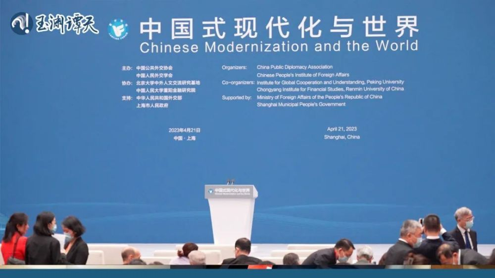

# 中国前驻美大使崔天凯：美国想跟中国对话，不能只靠说

​如果要用一个词来形容最近的中国外交，那就是频密。在过去的一个月里，算平均数，几乎每三天都有一个国家的高层代表访华，不仅如此，在北京，中东国家还实现了世纪和解。今天，谭主来到外交部主办的蓝厅论坛现场，许多国家的朋友又一次齐聚。正像国务委员兼外交部长秦刚所说，作为世界上最大的发展中国家，中国始终胸怀天下。论坛现场，有不少人表达了对中国外交下一步行动的期待。对此，谭主也在会场找到了一位资深外交官，中国前驻美大使崔天凯。从中国式现代化聊起，他分享了自己对中美关系，对中国外交“下一步”的理解和认识。

**谭主：过去一个世纪，很多国家对现代化的想象都来自美西方。我们提出的“中国式现代化”，是不同于西方现代化的发展道路。您曾是任期最长的驻美大使，在您与美国的交往经验中，有哪些亲身经历让您感受到了中国式现代化与西方现代化的不同？**

**崔天凯：**
我觉得我们所有人对现代化的认识都经历了一个过程，最早可能把现代化等同于工业化。我们使馆原来有一幅很有名的画，画的是山、水、树林，但是在一个地方画了很多烟囱，还在冒烟。当时的画家画绿水青山的时候一定要画几个烟囱上去，这说明当时对现代化的认识是有局限性的。

_2023年4月21日，“中国式现代化与世界”蓝厅论坛在上海“世界会客厅”举行_

同时，有些区别可能不是那么可见的，不像工厂烟囱这种有形的东西，比如说一些制度性的东西，还有一些理念性的东西。原来听美国人说，所谓“三权分立”、选举制度，这好像就是现代化。但现在大家认识也很清楚，这个认识也是片面的。

因为很多国家曾经学过美国，后来凡是生搬硬套学习美国制度的，没有一个成功的，然后这些国家又被美国贴了标签，叫“失败国家”。实际上失败不是这些国家自己失败，它可能生搬硬套西方这一套不成功才失败。

刚才我在会上也讲，这些美西方国家本身走到现在，也出现了问题，你看美国现在政治极化，社会撕裂，两党之间掐得恨不得你死我活。美国原来跟我们讲的那一整套的东西，好像不是那么回事。

那么这也给很多人带来一些思考，到底什么是现代化？新中国成立到现在70多年，改革开放40多年，经过我们的实践，特别新时代的十年，我们慢慢总结出一条自己的道路，就是习近平总书记在二十大报告中讲的中国式现代化，“既有各国现代化的共同特征，更有基于自己国情的中国特色”。我相信经过这二三十年，我们还不断会有新的经验总结，实践会不断提供新鲜东西，我们会不断提升归纳到理论层面。显然，我们走出一条跟他们截然不同，而且成功的道路。

**谭主：您在美西方国家交流的过程中，他们是否主动提起过“中国式现代化”？他们是怎么说的？**

**崔天凯：**
对我们讲的中国特色社会主义道路，他们很多人的理解，还是片面的，有相当一部分人还存在着误解误判。有的人就拿美国这一套来套我们的情况，觉得套不上，那就是不对。这当然是一种很狭隘、很片面的思维方式，但是现在在美国还有很大的影响。特别是它的一些精英分子、媒体成天在给老百姓灌输这些东西。最明显的就是美国政府老在说“现在是民主对威权”，把这么大的世界，200来个国家，一切两半，这是“民主”，那是“威权”。

我都问过美国人，我说你的好多盟友究竟是“民主”还是“威权”，他都说不清楚。但他就在给老百姓灌输，在国际上在制造这样一种叙事——这并不符合实际情况。我希望他们对中国的道路、理论、制度、中国的文化要有更深入的了解，然后他们才能读懂什么是“中国式现代化”。‍‍

**谭主：近期，中国外交非常“忙”。不仅迎来“外交热”，接待了密集访华的多国领导人，本次蓝厅论坛也为多国嘉宾提供了面对面交流的空间。有学者评价，中美关系很重要，但对中美双方来说，并不是唯一的外交关系。您如何看待这个观点？**

**崔天凯：** 当然，世界上那么多国家，不可能只有中美关系，各国之间都有各种关系，除了双边的，还有多边的，还有地区的。

但不管怎么说，中国、美国这两个这么大的国家，作为世界前两大经济体，两国还都是联合国安理会常任理事国，在世界上也有各自的重要性。这两个国家之间按理说应该有更多的交往，包括政府之间的交往，包括高层的交往，这种交往应该是相当频繁的，相当经常的，但是现在很难做到这一点。

我觉得这里面主要有两个问题：

第一个就是能不能真正做到相互尊重。两个国家之间交往跟两个人之间交往一样，如果不是平等相待，相互尊重，怎么交往下去？但是美国有些人，他的习惯思维就是说我要强势来对付你，言下之意他是强势，就要把对方打成弱势。用他们的话说就是要从实力地位出发来和你交往，老是这种心态，不能平等相待，不能尊重对方，怎么交往。

而且我一直认为，真正自信且真正有力量的人，不需要把“实力”成天挂在嘴上，你整天说，你就真的那么有实力了？

中国有句古话叫“智者不惑，仁者不忧，勇者不惧”。你要是智者、仁者、勇者，你不需要每天把实力挂在嘴上，这么说可能正是心里没底的表现。我觉得这是影响中美交往，包括高层交往一个很重要的原因。

第二个，就是能不能做到言而有信。我们现在经常看到这样的现象，中美之间有一次正式的交往，甚至相当高层级的交往，然后美国表态好像也还可以，讲了几个不，几个无意，回过头去马上就提升跟台湾的官方关系，马上就继续卖武器给台湾，甚至帮台湾在国际上去搞什么国际空间，然后抹黑中国，然后是脱钩断链，制裁中国企业，就干一系列的事情。你说的一套做的一套，何以取信于人？如果官方的高层沟通会晤，你说的话不能取信于人，这些交往还有什么意义？我觉得这两个问题如果不解决，会继续影响中美之间的交流。

**谭主：实际上，美国最近一直在释放希望对话的信号，对此，境内外媒体都在讨论一个问题，目前中美高层的对话是否还是有必要的，如果对话，还能解决什么问题。针对这种讨论，您怎么看？**

**崔天凯：** 不对话肯定解决不了问题。对话如果没有诚意，不能平等相待，也不见得能解决问题。

原来美国人很喜欢说一句话，他嫌中美之间对话多了，他说我们不能为了对话而对话。现在回过头来看，我们也可以跟他说同样的话，你如果没有诚意，没有一个平等相待的态度，那光为了对话而对话也没有多大意义。

**谭主：不知道您有没有关注昨天晚上耶伦关于中美经济关系的演讲。她上来第一条强调的是国家安全的问题。在您看来，为什么美国要把国家安全摆在中美经贸关系前面这么重要的位置去讲？**

**崔天凯：**
美国现在实际上把国家安全的概念泛化了，什么都扣上国家安全，这样就没有人敢反对，好像你置国家安全于不顾。但是国家安全应该是个有明确定义的概念，如果什么都是国家安全，真正的国家安全上哪里去了？这种泛化是很有害的，也维护不了美国真正的国家安全。

但是美国现在他有这个政治需要，他要打压中国，要跟中国脱钩断链，因为这些事情第一不符合事实，第二也违背客观的经济和科技发展的规律，他拿什么东西来证明他需要做这些，就拿国家安全，一个大帽子一扣，说你这违反市场规律，违反世贸组织的规定，但科技发展应该要大家合作。

**谭主：最近我们玉渊谭天刚发了一篇关于“去美元化”的评论。目前，很多学者在说“去美元化”，不知道您怎么理解“去美元化”的“去”字？**

**崔天凯：**
我觉得为什么很多人愿意谈论“去美元化”？实际上一个很重要的原因就是美国在很大程度上滥用了美元作为国际主要储备货币的地位，包括它的长臂管辖，单边制裁，全是利用这个，这么做实际上很大程度是在透支美元的信用。

很多国家现在不放心了，说你一会儿割韭菜了，一会儿说要把我在你这的资产要没收了，要冻结了，我还是少放点，我想办法弄点别的资产，实际上是美国自己的一些所作所为在推动所谓“去美元化”。

当然“去美元化”不等于说以后美元就不用了，美元还是世界主要货币，只不过要去掉这种不公正不合理的做法。另外这个过程应该是个比较长的过程，是一个历史过程，不是一天两天几年时间就能完成，它是一个渐进的过程。

**谭主：不久前，中国外交促成了一件大事。中沙伊三方发表联合声明，宣布沙伊双方同意恢复外交关系。随后，基辛格评价：“中国以‘和平缔造者’的角色改变了国际外交的职权范围，并朝着成为创建世界秩序的参与者的目标迈出了重要一步。”
您如何看待基辛格博士对中国外交的这个评价？**

**崔天凯：**
我觉得如果说跟这些中东国家的历史交往，甚至利益融合等等方面来讲，我们不一定超过美国。因为美国在这些国家的利益还是很深厚的，对它们影响也很大，这些国家很多地方也对美国有一定的依赖性。

那么为什么我们能够推动他们走向和解，美国就没有做到？我觉得这主要可能不是一个能力问题，主要是有没有这个“心”的问题。因为我们在国际上是主张和平的，主张要共同发展，主张国家之间不管大小，相互尊重、平等相待。所以我们就有这个心，有这个诚意去推动这些国家想办法来和平解决他们之间的争端，能够坐到一起找到一个可解的办法。

并不是说我们给了他们多少钱，或者我们跟谁定了同盟，我们也从来不搞军事同盟。或者我们对他施加了很大压力搞胁迫，然后只能听我的，并不是这样。心诚则灵，美国不是没有这个能力，美国从它的对这些国家政治影响、经济影响、军事影响，你要论这些东西，他们的能力比我们还强，但问题有没有这个推动和平的心？有没有推动和解的心？我觉得这是一个区别。

