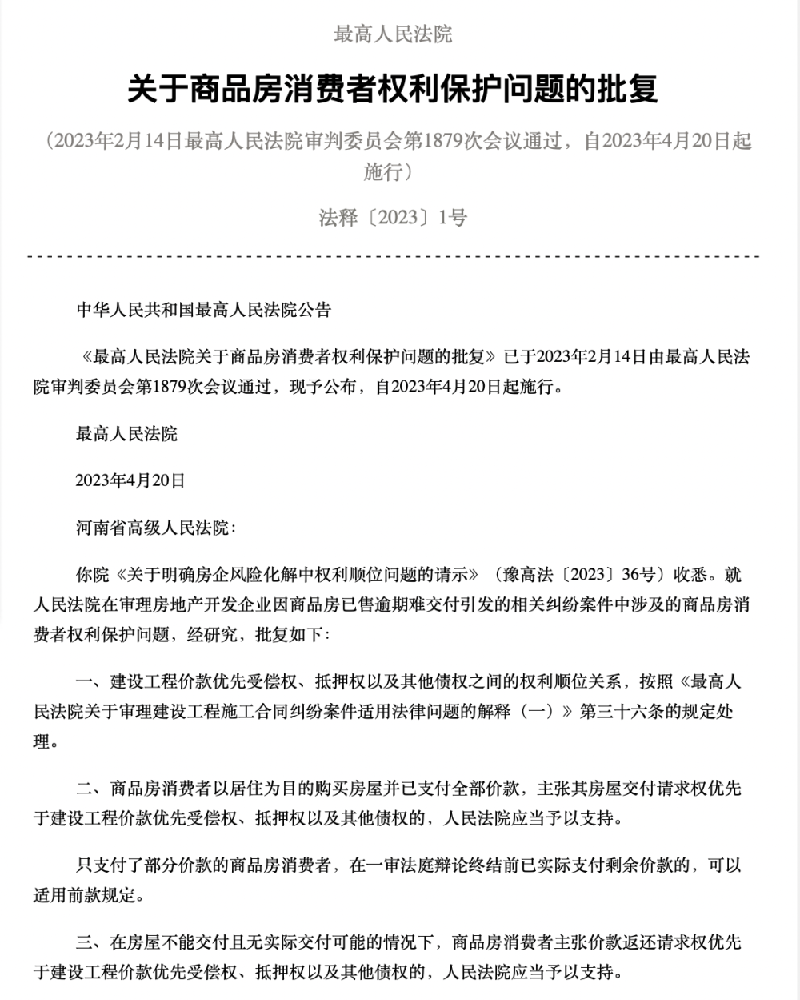

# 买到烂尾楼“钱房两空”？最高法明确优先保护购房者权益

近年来，因房企资金紧张引发项目停工，购房者买到烂尾楼的风险有所加大。在现实中，如果项目出现烂尾趋势，金融机构、施工方、购房者都要主张权益时，谁来保护较弱势的购房者？

4月21日，人民法院报公布《最高人民法院关于商品房消费者权利保护问题的批复》，明确提到：在房屋不能交付且无实际交付可能的情况下，商品房贷消费者主张价款返还请求权，优先于建设工程价款优先受偿权、抵押权以及其他债权的，人民法院应当予以支持。

在业内看来，这份批复的内容意义重大，对不幸买到烂尾楼的购房者来说，终于有了“免死金牌”。

**优先维护购房者权益**

据悉，此次批复是针对河南高级人民法院的相关问题做出了答复。此前河南高院提交了《关于明确房企风险化解中权利顺位问题的请示》，请示涉及商品房已售逾期难交付引发的购房者权利保护问题。

北京金诉律师事务所主任王玉臣解释称，遇到烂尾楼或开发商负债累累时，银行要行使抵押权，施工单位要行使工程款优先受偿权，业主也会主张要求交房或退房款，多种债权会出现冲突。而抵押权和工程款优先受偿权有明文规定，业主的优先权并没有特别明确的规定，散见在一些最高院的观点和执行的相关规定中，对购房人而言有失公平。

最高法这份批复，则明确了购房人的两大优先权：房屋交付请求权、主张价款返还请求权。

首先，商品房消费者以居住为目的购买房屋并已支付全部价款，主张其房屋交付请求权优先于建设工程价款优先受偿权、抵押权以及其他债权的，人民法院应当予以支持。只支付了部分价款的商品房消费者，在一审法庭辩论终结前已实际支付剩余价款的，可以适用前款规定。

通俗来说便是，相较于兑现工程款、抵押权及其他债权，开发商要首先集中资源“保交房”。

王玉臣表示，房屋交付请求权的行使，需要满足三大前提条件：商品房消费者以居住为目的，一般适用于住宅，且不是为了投资；购买房屋并已支付全部价款，即使是只支付了部分房款，只要在一审法庭辩论终结前已实际付清尾款，同样适用；房屋要达到交付使用条件。

最高法还表示，在房屋不能交付且无实际交付可能的情况下，商品房消费者主张价款返还请求权优先于建设工程价款优先受偿权、抵押权以及其他债权的，人民法院应当予以支持。也就是说，如果房屋无交付可能，开发商应优先满足购房者退款的主张。

王玉臣称，价款返还请求权，也有一个前提条件：房屋不能交付且无实际交付可能，比如彻底烂尾，实在是建不起来，购房合同的目的已经无法实现，这个时候只能解除合同，要求返还房款。此外，不论是付了多少购房款，都应当享受相应的优先权。

综合而言，在与烂尾楼相关的债权排序上，购房人的请求权是排在首位的，其次是建设工程价款优先受偿权，第三是抵押权，最后是其他债权、也就是常说的普通债权。

在王玉臣看来，最高法这份批复有明确的法律及现实意义。首先，以司法解释的方式明确了购房人的优先权，为相关案件提供明确的裁判指引。现实层面，为解决烂尾楼、开发商爆雷案件中债权如何处置提供了明确指引，一定程度上提升老百姓对楼市的信心，有利于楼市复苏。

易居研究院研究总监严跃进认为，过去对于开发商、银行、建筑商等权益维护问题，主要把建筑商、工程商、设备商、材料商等排在首位，现在遇到购房者、退房者和建筑商等涉及权益优先的问题，明确了优先保护退房者的权益，政策务实、对各地处理保交楼事件具有非常好的指导意义。

**32城半数逾期项目已复工**

自去年7月份多地出现“停贷”事件以来，“保交楼”逐渐成为楼市政策的重点。

去年七月末，保交楼首次被写入政治局会议文件。此外，住建、财政、央行等多部委联推2000亿政策性银行专项借款，并已基本投放至项目。央行方面还表示，将面向6家商业银行提供2000亿元再贷款，为商业银行提供零成本资金，以鼓励其支持保交楼工作。

各地政府也积极行动，郑州、南宁、湖北分别设立100亿、30亿、50亿元纾困基金；同时，积极争取国家政策性银行专项借款，支持已售逾期难交付住宅项目建设交付。此外，还有返还未动工项目土地款，优化预售资金监管等动作，助力推动保交楼。

到2022年末，各地房企停工问题得到一定缓解。据CRIC调研数据，截至2022年12月31日，32个典型城市重点监测的290个项目中，一半以上已经复工，仍有126个项目处于停工状态。

分能级来看，二线城市停工项目套数达307819套，总建面达3567万平，因购房者按揭比重较高，销售和房价下行压力更大。中西部城市如武汉、西安、郑州、昆明等停工项目所涉尚未交付套数均在3万套以上；漳州、淮安、盐城等停工项目所涉尚未交付总建面，也达到100万平方米以上。

值得注意的是，郑州、昆明等城市因政策起步较早、纾困力度较大，目前多数项目均处于部分复工和全面复工状态，郑州复工项目占比接近9成。

从房企竣工端也可见积极进展。国家统计局数据显示，2023年前2月房屋竣工面积同比增长8%，仅次于2022年12月，为2022年以来次新高，显示“保交楼”已取得一定实质性成效。

但克而瑞研报也表示，部分地区纾困资金审批流程长、支取困难、覆盖面有限等问题还亟待解决，不少项目继续停工或表演式复工也客观存在，保交付、稳民生依然任务艰巨。

克而瑞建议称，对销售进度超过50%，开发商因监管过严导致监管账户中的资金被占用，无法顺利支付工程款的项目，应适度松绑预售资金监管，确保工程正常运行，同时加速其预售证审批进度，允许开发商继续卖房，以卖房的房款优先支付工程款，从而促进其形成良性循环。

二是销售进度过半，开发商因违约、爆雷等原因无力承担后续工程费用，可采取专项借款模式、郑州纾困基金模式、巧妙利用第二支箭、第三支箭等模式改善和支持项目复工。对尚处于开工初期，销售进度不足10%且所处城市楼市行情较为惨淡的项目，建议在风险可控范围内允许购房者退房。

