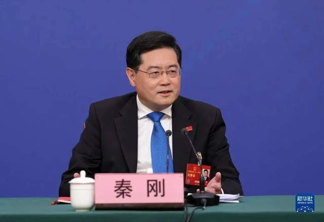
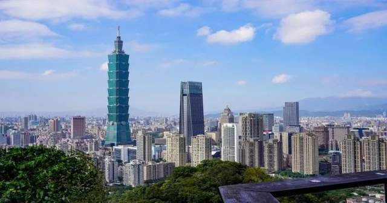

# 关键时刻，秦刚出访菲律宾

_资料图_

**直新闻：应菲律宾外长马纳罗邀请，国务委员兼外交部长秦刚将于4月21日至23日访问菲律宾。刘先生，您认为，秦刚为什么会在这个节骨眼上访问菲律宾？**

**特约评论员 刘和平：**
确实，最近一段时间以来，中美两国在争取菲律宾上进行了一系列紧张而激烈的博弈战。中方不仅派出外长秦刚访菲，而且不久前还邀请马科斯总统访华。而美方在美菲关系尤其是美菲军事关系上，更是下了血本，不仅进一步密切了美菲军事同盟关系，而且砸重金在菲律宾多建了四个军事基地。

为什么中美两国不约而同如此重视菲律宾？我认为，这实际上是中美两国围绕着台海局势而展开的威慑与反威慑、包围与反包围战略的一部分。这些年来，中方的绕台军演的真正目的，就是要针对“台独”势力而在台湾外围构建一个流动性的战时包围圈，以达到既封锁“台独”又阻止境外势力援助的目的。而在这个过程中，美方其实也没有闲着，他们试图在中方战时包围圈的基础之上，企图围绕着台海局势构建一个范围更大且永久性的包围圈。这个大包围圈的南面是美军驻菲律宾的军事基地，东南面是美军驻澳大利亚的军事基地，东北面是美国驻日本与韩国的军事基地，西面则是美军在新加坡的军事基地。而且在我看来，在美国围绕着台湾而构建的大包围圈中，菲律宾的战略地位不亚于日本，日本控制了解放军从东通往太平洋的出口，菲律宾则控制着解放军从巴士海峡通往台湾东部外海的出口。因此，假如搞掂了早前在中美两个大国之间左右摇摆的菲律宾，那美国针对台湾而构建的大包围圈也就成型了。

**直新闻：那您认为，面对美方围绕台湾构建大包围圈的举动，中方可以采取什么手段来进行反制呢？**

**特约评论员 刘和平：** 我认为，中方可以采取的手段有三个——

第一个就是要真正从根本上解决中菲南海主权争议。大家可以看到，最近一段时间以来，虽然美菲关系尤其是美菲军事关系的确是取得了很多突破性的进展，但是美国拉拢菲律宾的手段其实既不新鲜也不高明，采用的仍然是进一步挑起中菲南海主权之争的手段，并以帮助菲律宾争夺南海主权的名义扩大了在菲律宾的军事存在，并最终完成了拜登政府围绕着台湾而构建的大包围圈的最后一块拼图。因此，南海局势跟台海局势其实是联动的。中国要防止美国进一步利用南海问题离间中菲关系，必须要尽快完成“南海各方行为准则”的谈判工作，以从根子上解决南海主权纷争问题。

第二便是晓之以利，利益的利。也就是进一步加大中菲在经贸上的合作，包括尽快启动中菲在南海资源上的共同开发，以共同的利益来拴住中菲关系。

第三还是要晓之以利，这个利则是利害的利。光有利益纽带还不够，还得要讲明其中的利害关系。中国要明确告诉菲律宾，美国进一步密切美菲军事同盟增加美军在菲律宾的军事基地，其真正的目的，并不是为了帮助菲律宾争夺南海主权，而是醉翁之意不在酒，为了在台湾外围构建一个大的军事包围圈，以便从菲律宾方向军事介入台海战争。那么根据相关国际法，将来一旦这种情况出现了，那就意味着菲律宾已经自动参与到了台海战争当中，那么这里面的后果究竟是什么，菲律宾一定要事先考虑清楚。

值得注意的是，在秦刚抵达菲律宾前夕，迫于中方的压力，菲律宾外长马纳罗已经表示，不会允许美军利用驻菲军事基地介入台海战争。这虽然是一个积极的进展，但是中方还是要进一步提醒菲律宾，未来一旦台海战争爆发，美军是否利用驻菲军事基地介入台海战争，就不是由菲律宾说了算的，而是由美国说了算的。因此，菲律宾还是要进一步掂量其中的后果。

作者丨刘和平，深圳卫视《直播港澳台》特约评论员

