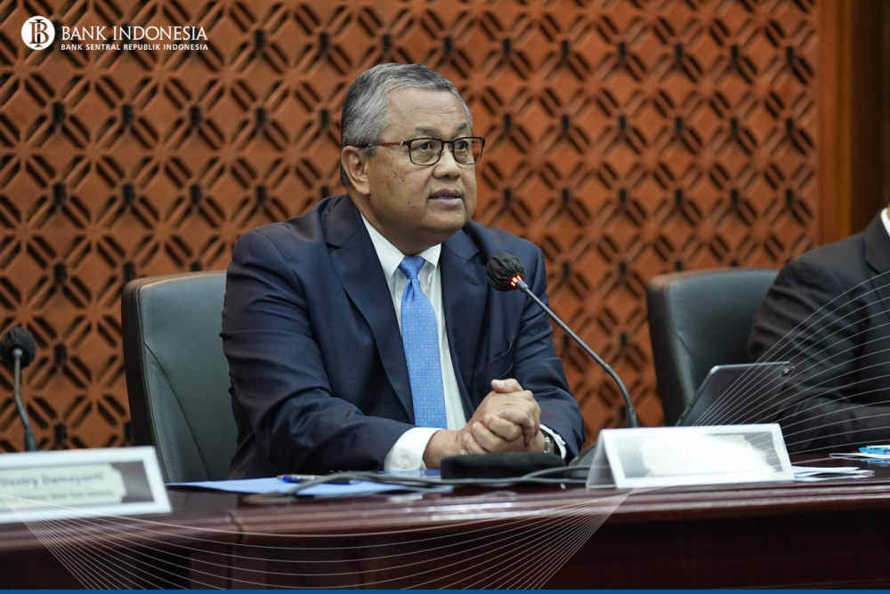
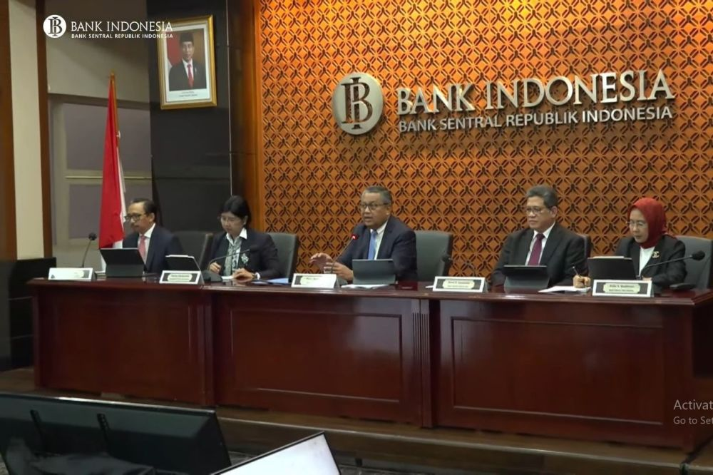

# 印尼央行行长：推进去美元化，已与中国等四国实现本币交易结算

（观察者网讯）“去美元化”和“本地货币交易”近一段时间在东南亚地区成为热词。在4月18日的新闻发布会上，印度尼西亚央行行长佩里·瓦吉约表示，印尼正推进“去美元化”和结算货币多样化进程。

据佩里·瓦吉约透露，目前，印尼已经与中国、日本、马来西亚和泰国四国实现本币结算，同时正在计划与韩国央行合作以在5月份实现“本地货币交易”。此外，印尼还将增加与东南亚地区的本币结算国家数量。

_CNBC印尼版和印尼媒体报道截图_

据印尼媒体“KOMPAS”新闻网报道，在当地时间18日举行的发布会上，印尼央行行长佩里·瓦吉约表示，印尼正在继续努力减少对美元的依赖，推动“本地货币交易”进程。

“这是‘去美元化’的工作之一”，佩里·瓦吉约坦承，印尼决定在国家间的交易结算中，“多样化地使用美元以外的货币”，目前印尼已经发起并实施了这一计划。

“KOMPAS”称，自2017年以来，印尼已与马来西亚、泰国、日本和中国合作使用本地货币结算，这意味着印尼在与这四个国家的贸易交易和投资结算中开始弃用美元。此外，印尼银行正计划与韩国央行合作，在5月份实现“本地货币交易”。

发布会上，佩里·瓦吉约补充说，除韩国外，印尼还将增加与东南亚地区的本币结算国家数量。

另据美国消费者新闻与商业频道（CNBC）印尼版报道，佩里·瓦吉约还在发布会上介绍称，印尼与他国的双边投资贸易不需要使用新的货币。他提到，金砖国家（巴西、俄罗斯、印度、中国和南非）也在做同样的事情——推动“去美元化”。

_印度尼西亚央行行长佩里·瓦吉约18日出席发布会，图自印尼媒体_

印尼央行高级副行长德斯特莉·达玛扬蒂补充说，印尼商界欢迎本币结算。截至目前，参与“本地货币交易”（LCT）的企业已有2014家，较去年的1740家大幅增长。今年1月和2月，中国、日本、马来西亚和泰国与印尼本币结算的交易量约为9.57亿美元，这意味着以美元结算的交易量平均每个月减少约4.8亿美元。

“如果再加上韩国，‘本地货币交易’就能真正帮助我们减少对美元的依赖”，印尼曼迪利银行首席经济学家安德里·阿斯莫罗表示，正在多国发生的“去美元化”是一种自然的转变，否则在美元遭遇冲击时，其他国家的经济也会受到影响。

早在去年2月份的二十国集团（G20）财长和央行行长会议上，印尼财政部长丝莉·穆利亚尼就表达了对“去美元化”的支持。她当时指出，实现“本地货币交易”对推动印尼的经济复苏非常重要，尤其是在全球存在很多不确定性的情况下。

_印尼财政部长丝莉·穆利亚尼（资料图）_

一段时间以来，东南亚地区国家不断讨论本国正在进行的“去美元化”进程。各国认为，由于美元持续走强削弱了当地货币，该地区的经济体都在采取各种措施来降低风险。

在今年1月10日新加坡智库尤索夫·伊萨东南亚研究所（ISEAS Yusof-Ishak
Institute）举办的一场论坛会议上，新加坡前外交部长杨荣文就说：“美元是对我们所有人的诅咒。如果你把国际金融体系武器化，就会有更多的替代品取代它，美元将失去其优势。”

3月28日，东盟国家财长和央行行长会议在印度尼西亚举行。印尼新闻杂志《时代周刊》（TEMPO）报道称，会议将讨论通过“本地货币交易”（LCT）计划减少对主要货币的依赖，这也是对此前已在东盟成员国之间启动实施的“本地货币结算”（LCT）计划的扩展。

4月4日，刚刚结束访华行程的马来西亚总理安瓦尔称，他在中国访问时公开提出成立“亚洲货币基金组织”，因为亚洲国家经济实力已今非昔比，马来西亚“没有理由继续依赖美元”了。安瓦尔补充说，马来西亚央行已经就双边贸易可用林吉特和人民币结算一事与中方进行谈判。

此外，中国、俄罗斯、印度、巴西等国也正积极推动“去美元化”，在跨境贸易和投资中加强本币结算。尽管美国仍“嘴硬”称美元没有遇到任何实质性竞争，但路透社援引环球银行金融电信协会（SWIFT）1月数据指出，美元在国际支付总额中的份额已降至40%。

而早在去年3月，国际货币基金组织（IMF）副总裁戈皮纳特（Gita
Gopinath）就预警，美西方对俄制裁，可能会鼓励使用其他货币的较小贸易集团的出现，从而削弱美元的主导地位。她当时告诉英国《金融时报》，虽然美元仍将是全球主要货币，“但出现较小水平的分裂，肯定是很有可能的”。

马斯克近期也称，国际社会出现的“去美元化”趋势“是一个严重的问题”。他分析称：“美国的政策过于强硬，使得各国都想要抛弃美元……再加上（美国）政府开支过大，这迫使其他国家承受了我们很大一部分的通货膨胀。”

4月17日，欧洲央行行长克里斯蒂娜·拉加德指出，随着更多国家倾向于增持人民币，对美元和欧元的依赖有所下降，不应再将美元和欧元的国际货币地位视为“理所当然”。她还称，中美竞争“加剧紧张局势”将动摇美元“统治地位”。“制裁行动当然会使俄罗斯和伊朗等国想要找一种替代货币。”

本文系观察者网独家稿件，未经授权，不得转载。

