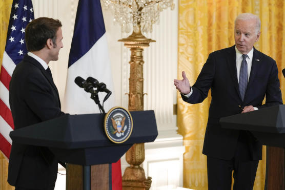

# 外媒：拜登与马克龙通话讨论后者访华之行，但在台海问题上说法不一

【环球网报道 记者
索炎琦】据路透社、法新社报道，美国总统拜登与法国总统马克龙当地时间周四（20日）进行通话，双方讨论了马克龙本月初的访华之行，意在缓和美法因此行而发生的紧张局势。不过，路透社注意到，双方在通话后的各自声明中围绕台海问题说法不一，凸显分歧。

白宫20日声明显示，“（美法）两国领导人讨论了马克龙总统近日对中国的访问”；同日发表在爱丽舍宫网站的法方声明称，此次通话为两国元首例行通话，马克龙在电话中向拜登介绍了此次访华之行的成果，此外还提及俄乌冲突，“从中期角度来看，中国可以根据《联合国宪章》的宗旨和原则，在帮助结束冲突方面发挥作用。两位领导人就继续为此目的与中国政府接触的重要性达成一致，”法方声明写道。

_去年12月1日，拜登在华盛顿白宫为来访的马克龙（右）举行国宴_

值得注意的是，路透社发现两份声明的不同之处，即在台海问题上说法不一。白宫在声明中宣称，“双方重申了维护台海和平稳定的重要性”。但是，爱丽舍宫在声明中没有直接提及“台湾”字眼，只是说双方同意“在印太地区维护包括（支持）航行自由在内的国际法”。路透社对此评论称双方声明形成“鲜明对比”。

对于美法两国总统此次通话，法新社解读称，这为华盛顿和巴黎提供了一个机会，一个缓和解决因马克龙访华之行而导致美法关系紧张的机会。不过，路透社表示，在此前因台海问题发表了不同观点而惹恼盟友后，法方20日的这份通话声明没有提及台湾，可能将再次引发一些国家的不满。

_去年12月1日，拜登（右）和马克龙在白宫举行联合新闻发布会_

据美国“政治新闻网”欧洲版本月9日报道，在结束为期3天的访华之行后，法国总统马克龙在返回法国的专机上接受媒体采访时表示，欧洲必须加强战略自主性，顶住成为“美国追随者”的压力，并避免卷入中美在台湾问题上的对抗。马克龙表示，欧洲面临的“巨大风险”是其陷入“并非属于我们的危机当中”，这些危机阻碍欧洲建构战略自主性。他呼吁欧洲在防务等领域减少对美国的依赖。这番表态获得欧洲主流媒体和不少政客的积极评价。

此外，据法国24小时新闻电视台12日报道，马克龙当天在阿姆斯特丹与荷兰首相马克·吕特举行联合记者会。会上，谈及台湾问题，马克龙再次表示，他的立场“非常明确”，法国和欧洲在台湾问题上的立场一致，支持“维持现状”，一个中国政策没有改变，寻求和平解决台湾问题。

