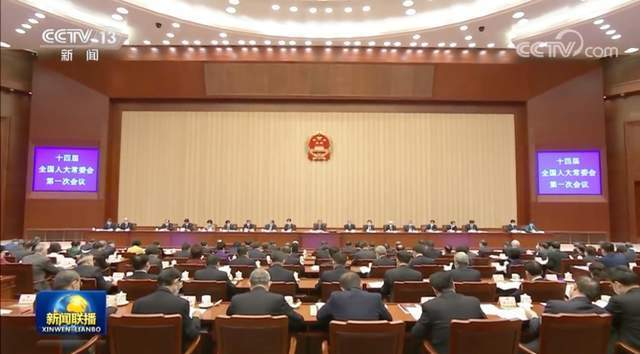
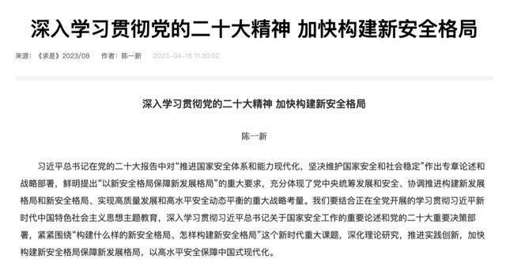
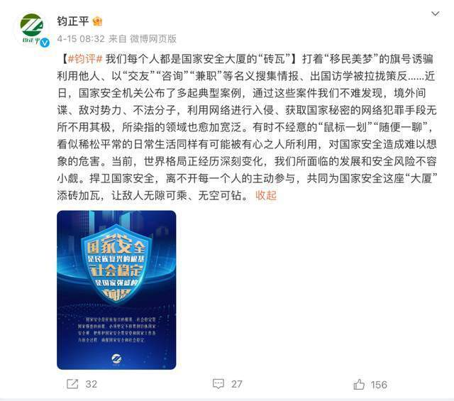

# 形势极为严峻！新一届人大常委会将召开会议，反间谍法修订草案拟三审

**撰文 | 蔡迩一**

下周，十四届全国人大常委会第二次会议将在北京举行。

4月21日，全国人大常委会法制工作委员会举行记者会。这次记者会提到，下周，反间谍法修订草案将提请三审。

在今天的发布会上，提到当前反间谍斗争形势时，全国人大常委会法制工作委员会发言人臧铁伟用了四个字， **“极为严峻”。**

**当前反间谍斗争形势极为严峻**

臧铁伟介绍，“十四届全国人大常委会第二次委员长会议决定， **十四届全国人大常委会第二次会议4月24日至26日在北京举行** 。”

这是本届全国人大常委会第二次会议。

一个月前（3月14日），十四届全国人大常委会第一次会议在北京人民大会堂举行。

那次会议，分别经表决，任命刘俊臣、郭振华、何新、胡晓犁、欧阳昌琼为十四届全国人大常委会副秘书长。

即将召开的第二次会议，将审议几部法律草案，其中一个就是“反间谍法修订草案”。

一个背景是，中央对反间谍工作一直高度关注。反间谍法是我国贯彻落实总体国家安全观的第一部重要法律。

据悉， **现行反间谍法前身是1993年制定的国家安全法** ，主要规定的是国家安全机关履行的职责，特别是反间谍方面的职责。

2014年，在原国家安全法的基础上，修订出台了反间谍法。

那为什么现在又要进行修订？

臧铁伟说，
**“当前反间谍斗争形势极为严峻，传统安全威胁与非传统安全威胁相互交织，各类间谍情报活动的主体更加复杂、领域更加广泛、目标更加多元、手法更加隐蔽。”**

他说，此举是“新形势下落实总体国家安全观和加强反间谍斗争的需要，是 **推动反渗透、反颠覆、反窃密斗争** ，确保国家安全的有力法治保障。”

**国家安全部部长陈一新此前发文**

就在几天前（4月16日），刚刚履新不久的国家安全部党委书记、部长陈一新在《求是》杂志撰写了《深入学习贯彻党的二十大精神 加快构建新安全格局》一文。

文中他写道，当前国际形势复杂严峻、国际斗争日趋激烈，体系对抗成为大国博弈的显著特征。

“对内，以维护政治安全为根本， **严厉打击敌对势力渗透、破坏、颠覆、分裂活动** ，切实防范化解重大风险，确保政治安全、社会安定、人民安宁。对外，
**防范反击外部对我极端遏制打压，加强海外安全保障能力建设**
，落实全球发展倡议、全球安全倡议、全球文明倡议，弘扬全人类共同价值，推动构建人类命运共同体。”

他还提到，要 **科学立法** ，统筹推进国内法治和涉外法治，加强重点领域、新兴领域、涉外领域立法，不断 **充实法律“工具箱”。**

政知君注意到，在严惩间谍等犯罪分子方面，法院也在持续发力。

今年3月7日，最高法在报告中首次点名台湾间谍。

当时，时任最高法院院长周强在作工作报告时特别提到，
**审理施正屏、李孟居、李亨利、沙塔尔·沙吾提等案件，严惩间谍、窃密、资助危害国家安全犯罪活动、妄图分裂国家的犯罪分子。**

就在几天前，国家安全机关公布了一批危害国家安全典型案例，其中包括航天科研人员在国外访学被间谍策反等，官方还公布了办案现场视频。

**新增内容**

特别值得一提的是，近些年来，关键信息基础设施领域遭网络攻击窃密的事件不断发生。

据新华社此前披露，2020年以来，国家安全机关工作发现，我国有关电信运营商、航空公司等单位内网和信息系统先后多次出现越权登录、数据外传等异常网络行为，疑似遭受网络攻击。

去年， **西北工业大学遭网络攻击** 一事曾备受外界关注。

2022年4月，陕西省西安市公安机关接到一起网络攻击的报警，西北工业大学的信息系统发现遭受网络攻击的痕迹。

之后，调查发现，美国国家安全局（NSA）下属的特定入侵行动办公室（TAO）多年来对我国国内的网络目标实施了上万次的恶意网络攻击，控制了相关网络设备，疑似窃取了高价值数据。

上述调查报告揭露了美国NSA长期以来针对包括西北工业大学在内的中国信息网络用户和重要单位开展网络间谍活动的真相。

报告显示，一直以来，
**美国国家安全局针对我国各行业龙头企业、政府、大学、医疗机构、科研机构甚至关乎国计民生的重要信息基础设施运维单位等机构长期进行秘密黑客攻击活动。**

据臧铁伟介绍，下周即将三审的反间谍法修订草案，拟完善关于网络间谍行为的规定。

臧铁伟说，
**“针对信息网络的特点，明确间谍组织及其代理人等针对国家机关、涉密单位或者关键信息基础设施等的网络攻击、侵入、干扰、控制、破坏等活动，属于间谍行为。”**

另外，修订草案三审稿还将增加救济程序，规定经采取相关措施，涉及间谍行为的网络安全风险或者信息内容已经消除的，有关部门应当及时作出恢复传输和相关服务的决定。

**资料 ｜ 新华社 人民网 中国人大网等**

**【版权声明】本文著作权归政知新媒体独家所有，未经授权，不得转载。**

