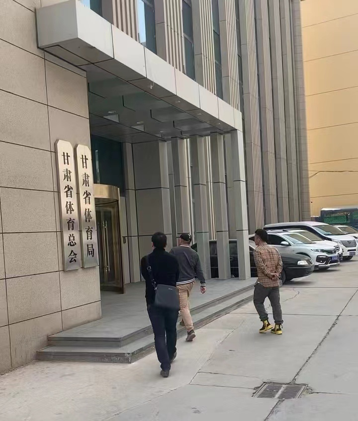
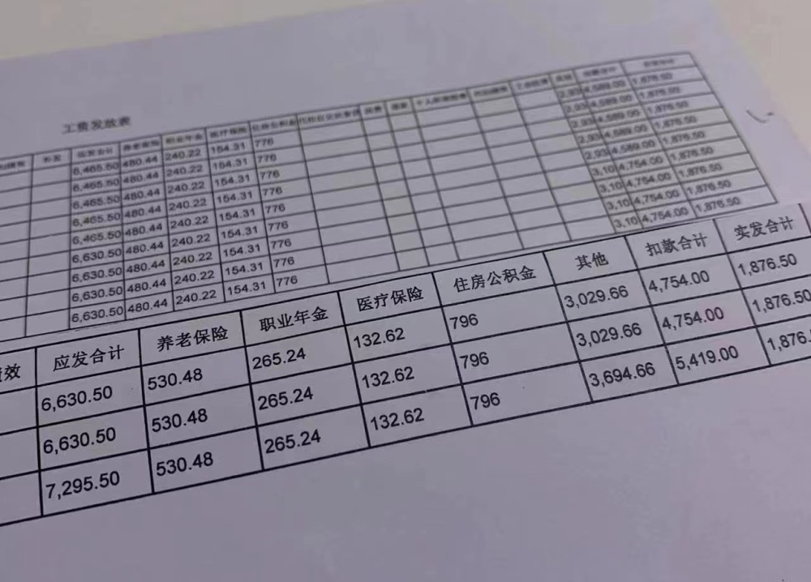

# 甘肃19名在编退役运动员工资被扣发，到手仅剩四分之一，体育局回应

**全额拨款事业编制人员多次涨薪，他们却分文未涨，工资财政全额拨付，体育队却按照24年前的文件扣发。**

甘肃省优秀退役运动员属全额拨款事业编制，他们的工资福利由省财政厅全额拨付。然而，近日19名甘肃省体育工作第一大队的在编退役运动员向华商报大风新闻实名投诉，自2014年全额拨款事业编制人员多次涨薪，但他们却分文未涨，至今仍只拿1000元至2000元不等。

全额事业编工资近10年分文未涨

今年45岁的退役运动员刘新德曾代表甘肃省多次参加全国性古典式摔跤大赛，获得过青少年比赛的冠军。“当时甘肃省的政策就是能拿到全国青少年比赛的冠军，就给转正。”刘新德说，“1997年我在第八届全运会时受了伤，韧带撕裂，无奈回来以后申请了退役。”

_改成这些退役运动员曾代表甘肃省参加全国比赛取得了不俗成绩_

刘新德解释，甘肃省没有亏待他们这些退役运动员，即便退役离队给他们还保留了事业编制。“队里和体育局给我们的定位就是退役待安置。1998年离队还给发着工资，每月大概500元，我在外还干些零散工，至少养家糊口不成问题。”

刘新德回忆，在2014年之前，队里发的工资还陆续有涨幅，但之后工资几乎没有任何变化。他向华商报大风新闻记者出示了由银行提供的从2017年10月至今的工资明细清单：2017年10月，工资入账1886.50元。2018年1月，工资入账1876.50元。“我印象中，从2014年左右每月就发1800元左右，但银行没法给我提供2017年10月之前的流水。”

华商报大风新闻记者从刘新德社保账户中发现他的缴存基数却一直涨，2014年10月缴存基数为4621，2017年1月缴存基数为5046，2020年1月缴存基数为6136元，2023年2月缴存基数为6631元。

应发工资到手里仅剩四分之一

据记者了解，甘肃省至少在2016年、2018年、2020年对事业编制工资标准进行了三次调整，从2014年至今工资涨了多次。

这些退役运动员从甘肃省体育工作第一大队要来了各自的工资条，这一看更是令他们难以置信。

这些退役运动员中，多次代表甘肃省获得全国性古典摔跤冠军、入选国家队并在国际比赛取得过好成绩的布仁朝格图工资最高，每月工资实发为2559元。然而他从队里拿到的工资条上却是这样的：（以2023年3月为例）岗位工资2280元、薪级工资5460元、高原15元、地差12.5元、基础绩效1162.80元、奖励绩效
775.20
元。应发合计为9705.50元。扣款项为：养老保险685.68元、职业年金342.84元、医疗保险171.42元、住房公积金1028元、其他4918.56元，扣款合计为7146.50元。

华商报大风新闻记者注意到，这些退役运动员的工资条都存在类似的情况，其他扣款项要扣走应发合计的约一半，导致他们实际拿到手的工资只占应发合计的四分之一左右。

更令大家不解的是，队里给提供的2022年1月至今的工资条上，2022年6月薪阶工资涨了165元，2023年3月岗位工资涨了200元，薪阶工资涨了935元，因为其他扣款项目随着工资涨幅也在相应上涨，导致他们这些年拿到手里的工资分文未涨。

为啥扣，扣多少？体育局、队里答复：根据1999年文件扣发

甘肃省体育局及体育工作第一大队向华商报大风新闻记者解释，这些运动员属于退役待安置运动员，目前未在岗工作。扣发工资是政府文件要求。

_数名退役待安置运动员前往甘肃省体育局咨询工资常年不涨的问题_

1994年7月6日，甘肃省体育运动委员会出台的《关于工资制度改革后退役运动员工资发放暂行办法》中规定，在队待安置期间，又在本单位未从事任何工作的退役运动员基础津贴可按全额发放。成绩津贴按比例发放，超过三年以上未安置按照30%发放。

1999年甘肃省人民政府文件甘政发（1999）83号文件就退役运动员安置问题给出了意见。对为甘肃省体育事业做出突出贡献的退役运动员，在工作安置上给予优先照顾。退役运动员待安置期间体育基础津贴按比例发放。超过两年的不再发放。

算不到一起的基础津贴和成绩津贴

自工资改革后，事业编制人员工资结构发生了变化，目前的工资单中已经没有了基础津贴和成绩津贴项目。

甘肃省人社厅工资福利处及队里解释，现在的岗位工资就是原来的成绩津贴，薪阶工资就是原来的基础津贴。绩效工资，只有在岗位上工作才能领，所以待安置运动员没有绩效工资。

以2022年1月刘新德岗位工资1130元，薪阶工资3370元计算。按照队里和人社厅的解释，他实际拿到手的是30%的岗位工资为339元，以及足额的薪阶工资3370元。扣除福利代缴1650.97元，到账工资应该为1719.03元。

按照甘政发（1999）83号文件，退役运动员吴阿勇属于不发基础津贴只享受100%的成绩津贴。2022年1月吴阿勇薪阶工资为3700元，扣除福利代缴1599.57元，到账工资应该为2100.43元。

_刘新德的工资常年因其他款项扣款，每月拿到手仅有1876.5元_

而刘新德真实到账为1876.50元，吴阿勇真实到账1060元。这些退役运动员按照以上两种方式无论怎么算，也无法和实际到手的工资吻合。

“扣我们工资可以，但得把账给算清楚。咱不能算出了一笔糊涂账呀。”退役运动员说。

甘肃省人社厅工资福利处一负责人告诉记者：“原来的政策（甘政发(1999)83号文件）和新的工资制度改革中间没有前后衔接，确实是个问题。”

钱在哪，干啥用？扣的钱放在资金池里数额还不小

今年2月16日，甘肃省体育局主要负责人组织相关处室人员接待了这些退役运动员。

“财政按照人头拨下来以后，我们发放的时候按照83号文件，该发的都发了，没发的在财务账户上，谁都没拿去。”体育工作第一大队负责人解释。

甘肃省体育局主要负责人称，他了解到好几个训练单位确实有这么一个资金池。“数额还不小，在这放着的。”他说，“咱们的审计还是比较严的，这个钱在，你们不要过度担心。”

在座谈中甘肃省体育局主要负责人对这笔钱该用于何处也做出了说明。“在83号文件中也提到了安置运动员，每年要提出计划安置经费，但财政没有单独列出。所以把这部分钱留在了单位，作为下一步解决和安置退役运动员的一个资金池。”

面对退役待安置运动员们的种种疑惑，甘肃省体育局主要领导对体育工作第一大队负责人说：“下一步，将提高政策执行透明度。解决运动员社保，运动员缴多少，队里缴多少，争取财政能解决多少，缺额多少，要有一个明白账。”

体育队解释：办理社保，钱还不够

甘肃省体育工作第一大队向华商报大风新闻解释，这些退役待分配运动员自2014年工资没有变化是由于2014年事业单位施行养老保险制度，对工资标准进行了较大额度调整。但由于当时运动员无法纳入保险，按照上级主管部门意见，将当时所有停训运动员工资实发数暂时冻结，实发工资数保持不变，待养老保险工作完成后，再根据实际情况重新补发。

目前，甘肃省体育局已解决运动员纳入社保的问题，体育工作第一大队承诺，已着手保险缴纳及工资清算，近期将完成这项工工作。

“长达十多年甚至二十余年，处于在编无岗待分配状态，我们这些退役运动员不是不想在岗工作，而是体育局没有岗位安排我们工作。”一位退役运动员说。

华商报大风新闻记者了解到，甘肃省近年来一直着手解决退役运动员的后路问题，也有数百名优秀退役运动员带着编制走进了校园，成为体育老师。

“目前还剩一些在编的退役运动员因为只有中专文凭，长期处于待分配状态。”甘肃省体育局有关负责人称，“根据相应岗位会为他们组织相关岗位培训，帮助他们尽快从事新的工作。”

**华商报大风新闻记者 谢涛 文/图 编辑 杨德合**

**（如有爆料，请拨打华商报新闻热线029-88880000）**

