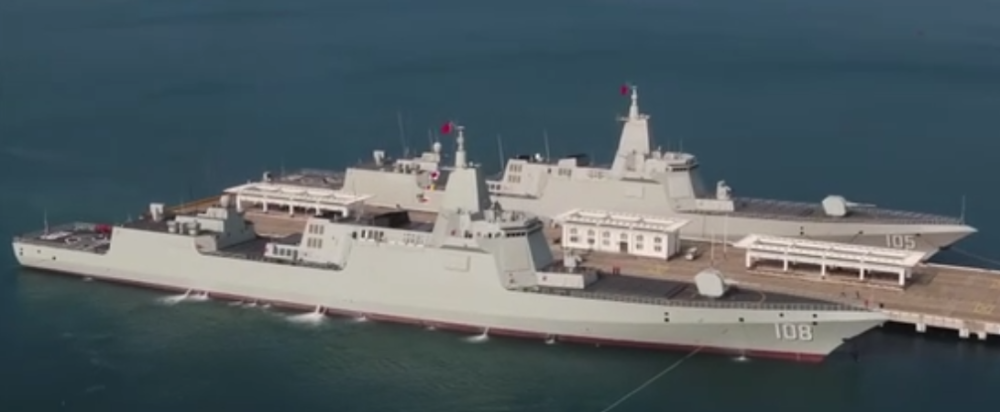
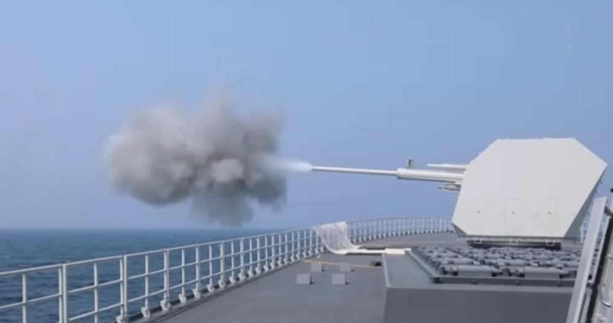
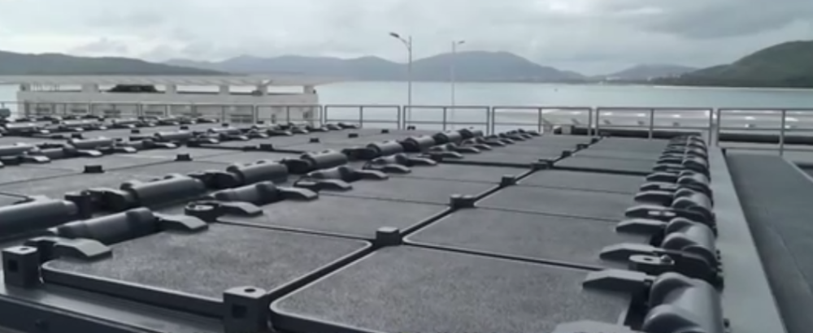

# 第8艘055型驱逐舰咸阳舰官宣亮相，055万吨大驱已有8艘

据4月21日播出的央视国防军事报道，第8艘055型驱逐舰“咸阳”舰，舷号108，已经入列，这意味着055万吨大驱已有8艘服役。近日，央视军事记者在南部战区某基地见到了最新入列的“咸阳”舰。该舰与另外两艘055型驱逐舰，舷号105“大连”舰，和舷号106“延安”舰，停泊在同一港内。

_108“咸阳”舰和105“大连”舰同框
图片来源：央视国防军事_

_130毫米舰炮开火瞬间
图片来源：央视国防军事_

_055型驱逐舰上的导弹垂直发射系统
图片来源：央视国防军事_

此前，@人民海军
微博在人民海军成立74周年之际，发布了7艘055型驱逐舰的演习和航行视频，分别是101南昌舰、102拉萨舰、103鞍山舰、104无锡舰、105大连舰、106延安舰和107遵义舰。

