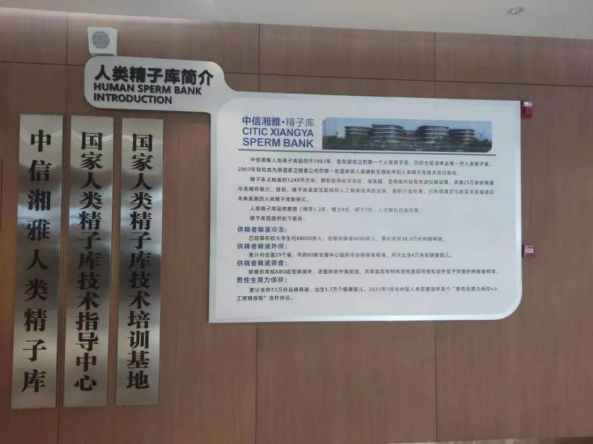
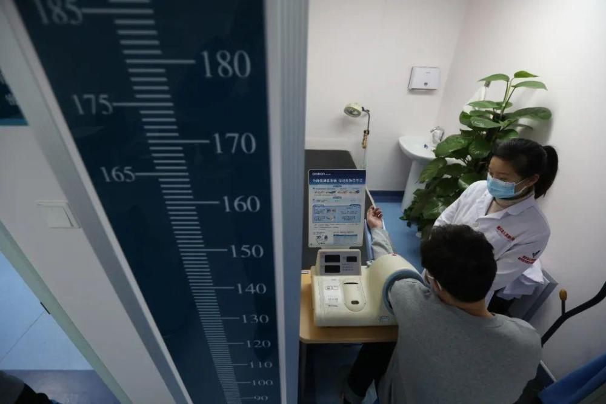
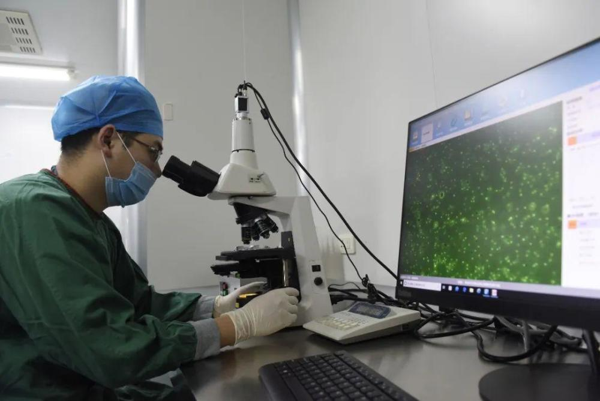
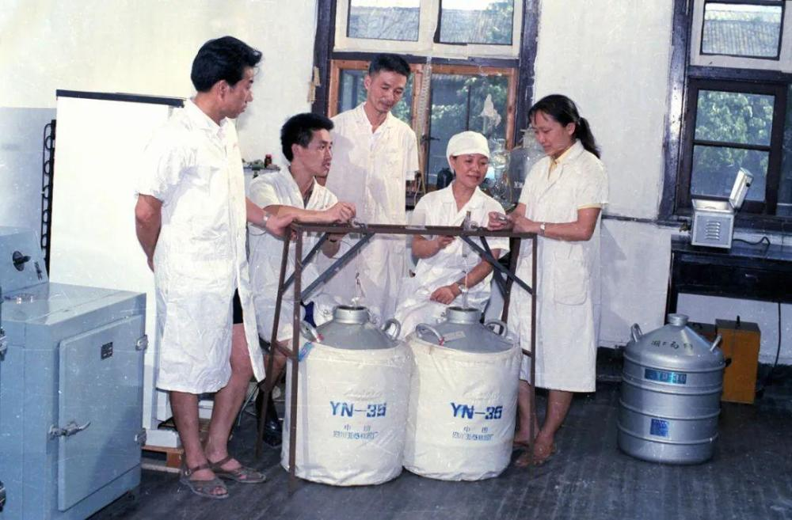
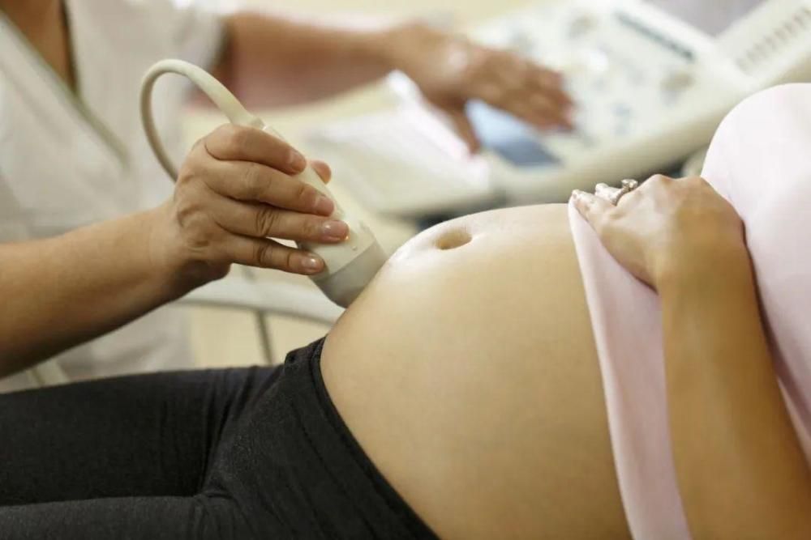
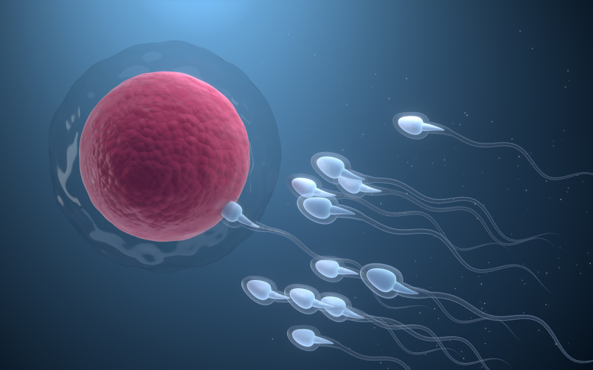

# 精子库内挤满捐精者，合格率却不高，有失败者哭诉“没钱吃饭了”

**4月初，在各地一度传出“精子紧缺”消息的春天，每日人物来到了中国最大的精子库——湖南中信湘雅精子库，与两位生殖医学领域的顶尖专家，聊了聊关于中国男人精子的话题。**

**这两位专家分别是卢光琇和黄川。今年已经84岁的卢光琇，是我国著名生殖医学与医学遗传学家，她同时也是中信湘雅首席科学家、终身荣誉院长；而中信湘雅医院的精子库组长黄川，作为副研究员，她一直工作在生殖医学领域一线，获取了关于中国男人精子质量的第一手信息。她如今的工作重心之一，是研究如何能更好地保存中国男人的精子。**

**经历了3年疫情之后，各地精子库坐不住了。从今年2月开始，云南、陕西、山东、北京等多个省份，像接龙一样接连发出捐精倡议，许多省份甚至把“捐精益处”与“千元补助”红字标粗，只为了吸引更多的人。**

**然而，各地精子库也发现，捐精者是多了，但合格率却不高。“只有两成志愿者精子合格”的热搜引发热议，不少人纳闷“难道是中国男人不行了？”**

**包括近日，“你接受另一半捐精么”的话题依然上了热搜。这一话题，源于一位清华博主，发了自己陪同未婚夫，前往北医三院捐精的视频。但在讨论区里，有六成以上的人选择“不接受另一半捐精”，再次出现争议。**

**精子似乎是个经久不衰的话题。而我们，也希望在这次全国规模最大、成立最早的人类冷冻精子库的探访中，寻找到人们想要的答案。**

**文 |** 高越

**编辑 |** 易方兴

**运营 |** 岩蕊

5000元的诱惑

对你来说，5000元意味着什么？

对于一些捐精志愿者，尤其是大学生而言，这个诱惑确实不小。平均5000元的捐精补助，相当于一个轻薄的笔记本电脑、一个iPhone手机，或者一次四天三夜的短途旅行。

只是，这个诱人的“果实”，并不是人人可以摘到。

最近2个月，中信湘雅医院的精子库组长黄川，和同事们过了一个“假淡季”，她们比捐精旺季时还忙。

所谓旺季，通常指的是放假前。那时候，一天能有一百多人来捐精，黄川说，这是因为，“回家之前，大学生们都想先搞一笔钱”。

但现在，“反季节”的旺季出现了。

自打捐精倡议书发出后，这个春天，精子库内一直挤满了人。周一人最少，从周二开始逐渐增多，每天有三四十人。等到周末，人更加多了，一天就有一百多人。

_▲
捐精前的检查。图 / 视觉中国_

在来捐献的志愿者中，大部分人瞄准的是5000元的捐精补助——这也无可厚非，只不过，真正能够将这笔钱拿到手的人并不多。

“三四十人里，往往只有六七人可以检测合格。”黄川说。

这么算来，合格率的确只有约二成。

有些时候，她们确实会遇到精子出现问题的捐献者，比如无精症，但医生们不敢说得直接，只能委婉地暗示，“有机会可以去男科门诊看一下”，言下之意是需要治疗。

但更多的时候，只是单纯质量不合格。一般来说，如果第一次质量不合格，还可以再尝试两次。医生们也安慰捐精者，一次捐精并不能作为评判标准，可以试着调理生活作息，再来重新尝试。

很多人相信自己，只要调整作息，“下次一定没问题”。然而，其中的不少人，就算三次捐献机会用光了，也还是不达标。

这就意味着，捐精彻底以失败告终。黄川说，有一回，一个捐精失败者甚至当场哭诉，“说自己没钱吃饭了”。

精子合格率不到2006年的一半

“中国男人的精子质量，是不是真的在下滑？”

这个问题，让黄川有些无奈，她经常会被这么问。她一般会解释，“话也不是这么说”，接着再详细说明，“精子库的捐精标准，要比常规精子的要求高出很多”。

显微镜下，正常精子像蝌蚪一样，头部呈椭圆形、带小尾巴，约长60微米，分头、颈、中、尾四部分，合格的精子是充满活力的，它们会摇动尾巴、四处游动。

与多年前相比，精子库的精子合格率的确在下滑。中信湘雅曾经公布过数据，2006年，合格率是45.9%，此后的八九年间，数字一直在下滑，直到2015年落到谷底，是17.7%，后来，略有上升，直到现在，一直持平在20%左右，还不到2006年的一半。

作为入选精子库的必经之路——捐精，整个过程就像是高考。“考生”需要考核多个科目，包括精液量、酸碱度、精子数量和精子活力等，每个科目都要达标。

常规精子水平是“本科线”，要满足1500万精子浓度，和32%精子活力的标准，也就是说，只要超过这个数值，就算是“过线”。

但捐精标准就像是“一本线”，树立了更高的标准，满足条件的人也更少。这个“分数”被确定为6000万精子浓度，和50%精子活力。

介于二者之间的精子，上不了“一本”，没法进行捐精，但并不影响“读本科”，依然算是常规精子水平。

_▲
精子样本质量分析。图 / 视觉中国_

同时，就像报考飞行员需要测试视力一样，想要捐精，也需要有额外的“复试标准”，是要考验精子的耐寒能力，保障冷冻复苏后，精子活力依旧超过40%。

层层闯关后的精子，才能正式入选，成为那20%中的一份子，可以对外供应。

现如今，男性精子质量，已经成为了生育的一大问题。根据中国人口协会、国家卫健委数据，中国育龄夫妇的不孕不育率已经达到12%-15%左右，其中四成是男性因素，多是因为精子数量减少、质量下降。

卢光琇认同，精子质量的下降与人的生活习惯有很大的关系。精子是脆弱的，也是经历波折的，它从精原细胞发育开始，要经历漫长的“历劫”过程，很多因素都会对它产生影响，比如环境，饮食、熬夜、压力和吸烟。

_▲ 卢光琇正在和病人沟通。图 / 受访者供图_

除此之外，新冠疫情后，上海精子库也曾经发现，精子质量有受到病毒的影响。

这个问题，黄川和湖南省疾控一起进行了一项研究。她选择了十几位正在阳性的患者，分别检测他们阳性后3个月、6个月的精液。

结果显示，他们的精液中确实存在一些病毒片段，但已经不具备致病性。好在，一般在6个月后，这些病毒片段能够被代谢掉，精子质量也会有所回升。

向牛的精子库学习

至今，作为中国最大的精子库，中信湘雅精子库已经招募过大学生四万余人，累计冻存38.8万份精液。与其他地方不同，今年春天，这里不仅不紧缺，还会支援别处。

这些精子，目前都储存在医院四楼的精子冷冻库。冷冻库内，摆放着一排排液氮罐，存放着十万份供精者的精子样本。

某种意义上，这十万份精子，有可能在未来成为数以万计的人类。为了保证安全和质量，医院还为液氮设置了探头，提供远程报警。而为了尽可能保证操作的低温，精子库正在尝试使用机器人，取代人力取精导致的温度波动。

对人类的延续来说，精子库的存在意义非凡。它能够解决许多无精症、少精症男性的问题，在建成全国第一家人类冷冻精子库后，很长一段时间里，卢光琇她们为全国提供了75%的精子。直到现在，医院门诊里，每天有一半以上，都是全国各地赶来看病的患者。

_▲
放置精子液氮罐的仓库，分为三个区域。_

但很少有人知道的是，在四十多年前，精子库建立之前，无法生育的男性还是一群“隐形人”。以至于很多时候，不能生孩子的帽子，常常扣在了女性身上。

状况的改变始于一封信。

1981年，卢光琇正在广东做外科医生，她的父亲，也是中国遗传学奠基人卢惠霖，向她转递了一封信，寄信人是一位无精症患者。他在信中说，为什么牛都能有动物精子库，人却没有。他想当爸爸，愿意接受捐精，做第一个实验者。

卢光琇很受触动，她去了北京郊外的一家牛的精子库，学习如何冷冻精子，学成后，扛着液氮罐上火车，不停地向周围人解释，这是水蒸气、不会爆炸，就这样，一路扛回了长沙。

_▲
1983年构建的早期改良冷冻精子库。图 / 受访者供图_

但很快，她遇到了问题，那就是没有精子，没人愿意实验，向临床要也要不来，卢光琇只能动员自己的丈夫，进行捐献。

整整一个晚上，卢光琇一直守在冒气的液氮罐旁边，第二天一大早，终于得到了中国第一份冷冻人类精子。后来，中国第一个人类冷冻精子库，在1981年建成了。随后，第一例人工授精婴儿也诞生了。

“我只要985博士生的精子”

与捐献者相对，天平的另一方主体，是求精者，也叫受者。他们不能与精子库的医生接触，但他们的需求，与医生们的工作息息相关。

很长一段时间内，中信湘雅精子库的办公室外每天都守着一对让医生们“头疼”的访客，他们是一对本科毕业的夫妻，男人一米七左右，女人一米六出头。夫妻俩的诉求很简单——求精。

之所以“头疼”，一是因为按照规定，他们不能跟求精者见面；另一个是因为，他们的要求太高了。无论对谁，女人只有一句话：“我只要985的博士生，身高2米！”医生一再解释，“真的没有”，但“博士”“2米”就像是两个深深印在她身上的标签，撕也撕不下来，一直不肯让步。

最后，医生们不停寻找、协商，才为她找到了一名身高一米八以上的985硕士生，作为合适的供精。

医生们很无奈，如此千方百计地满足需求，是因为精子库已经从卖方市场变成买方市场了。“过去精子少，都能用出去，不想要也没有了。但现在，精子库数量多了，竞争大了，就变成买方市场了，开始提条件了。”

这样一来，精子间有了“鄙视链”。

最重要的是血型。在选择供精时，黄川常常被女方要求，“选择一个和丈夫血型相同的捐献者”，这是因为精子，是一个家族血缘间的纽带与印记，“相同血型，孩子长大后更不容易发现”。

_▲
纪录片《生门》剧照。图 / 豆瓣_

2016年，二胎政策后，一天内精子库就接到了上百个电话，许多夫妻想要再次使用同一个捐献者的精子，生一个二胎，为的是“让两个孩子具有血缘关系”。

另外，长相也是个标准。一个是长得像，黄川常常听到令她哭笑不得的需求——“找一个跟我老公长得像的”。出于双盲原则，捐献者的长相不能公开，在过去，这一点医生往往无法满足。

如今，精子库引进了相似人脸匹配的技术，可以选出与求精者最相似的供精者，给出80%或50%的结果。

只是，数字是冰冷的，求精者依旧难以感知，全靠自己想象。精子库只能继续改进，用数据库记录了1万多张虚拟的东亚男性面孔，将匹配结果转化成虚拟人物，一一展示给对方看，就像是捏脸游戏。

而且，想要帅气的捐献者，是很多人的诉求。曾经，有一位求精者给医生发了一堆小鲜肉明星的照片，“按照里面哪一个都行”。

面对这类需求，黄川她们只能细化标准，把长得帅，换成双眼皮、大眼睛，这类客观的条件。

在层层标准筛选之后，剩下最基本、最朴素的需求，还是身高和学历。如今，大多数精子库的标准存在共识，身高要165CM以上，学历是高中和大专毕业，但在现实需求下，标准往往会被推高，比如北京不仅要求170CM以上，还需要体重指数小于30；广东省更注重学历，一律要求本科毕业。

“这也是没办法。”黄川感叹。

一个捐献者，最多给5个女性受孕

在精子库中，有一条双盲规则。精子的来源、去向，都是隐私。

卢光琇从医四十多年，数不清看过多少患者，直到现在，她已经84岁了，还在坚持看门诊，只不过，每天只看一位。在这么多的人中，她一直记得那位特殊的患者。

那是2010年，一位年轻的女性在丈夫的陪同下敲响了门，告诉她，自己是人工授精的婴儿。卢光琇很惊讶，按照保密原则，父母不应该告知孩子自己的来历。对方告诉她，父亲去世了，自己流过产，输卵管不通，不能怀孕。母亲说：“可以去找卢医生，我们有缘，她会帮助你的。”

在医院的走廊里，有一面展区，上面贴着精子库各个阶段的发展史，丈夫在“第一个人工授精婴儿”的展面上，认出了这是自己妻子小时候的照片。那一刻，她得知了自己的来历。

在卢光琇眼里，这是一种奇妙的缘分，精子库里第一个人工授精的婴儿，27岁的时候，再次找到她，通过试管手术，成为了母亲。

只是，卢光琇并不期待看到这种缘分，相反，她希望有更多达成共识的保密。

在选择阶段，每个来寻求人工授精的夫妻，卢光琇都会让他们签署同意书，这份无法被公证的文件，将保障他们成为法律意义上的父亲和母亲，共同抚养孩子、履行责任。卢光琇也会劝告他们，选择供精这件事，最好只有两个当事人知道，连自己的父母都不要说。

另一条伦理规则是：“一个捐献者，精子最多只能供给5个女性受孕。”

_▲
医生给孕妇做超声波检查。图 / 视觉中国_

这是人口学家测算过的数字，不能超额。精子库外供数量庞大，为了保障数字，每外供出一份精子，黄川和同事们就要进行一次追踪。反馈单上的数据必须明确：是否受孕、是否妊娠，一一记录清楚。

这是为了防止出现近亲结婚的可能性。多年前，有一位供精出生、长大的女孩，找到门诊，拿着自己父亲和男友的身份证，要求医生查询，男友的父亲有没有可能是当年捐献精子的志愿者。

虽然结果并不是，但这引起了医生们的反思。如果就是如此凑巧，该怎么办？如实相告的话，违反了精子库的双盲原则；但如果不告诉，就会导致双方近亲结婚。

目前，国内精子库还没能建立有效的共识避免这一问题，医生们只能根据供精者管理系统，义务地为子女提供婚前咨询服务，进行后代追踪，并在查询基础之上，建议他们去进行亲子鉴定。

虽然这样的情况，出现的可能性微乎其微，但外供时，黄川和同事，会尽量划分开地域，“多找远的地方发”。

冷冻精子

但不是每个家庭都能接受别人的精子。

“更多的人还是想生属于自己的孩子。”卢光琇说。

这些年，她遇到过遗憾的故事。比如，有一对夫妻，两人都很高，长得也精神。妻子怀过一次孕，当时不想要，就流产了。但后来，丈夫得了腮腺炎，引起了睾丸的炎症，破坏了精子，无法生精。

两个人找到卢光琇，但当时技术手段无法解决，只能使用供精。只是，夫妻俩还是想生自己的孩子，无法接受。

这对夫妻的问题，放在如今已经有了办法解决，那就是稀少精子冷冻技术。这项技术，中信湘雅精子库从2015年就在研究，它可以帮助一些传统意义上无精症的男性患者，通过显微取精的方式，找到微量精子、甚至是单精子，再试管生育。

这似乎是如今精子库转型的方向——从鼓励捐精，到提倡冷冻精子、进行生育力保存。

_▲
医生将检验合格的精子放入液氮罐冷冻保存。图 / 受访者供图_

在过去，冷冻精子一般是为两种人准备的，一种是需要放化疗的病人。曾经，有一位需要化疗的患者，治疗前，进行过冷冻精子。他病愈后，准备做试管婴儿，但妻子却反复流产，后来才发现，是化疗导致精子里的染色体出现了问题。

这个时候，卢光琇想起他还有一份冷冻精子，赶紧解冻使用，这才让他的妻子成功受孕，生下了健康的孩子。

黄川也见过最小的一个冻精者，只有15岁。他在进行白血病的化疗前，预备冷冻精子，这也是他第一次排精，虽然精子量很少，但还是发现了精子，可以成功冷冻。

黄川和同事做过调查，有些肿瘤科医生会跟患者科普这个问题，并建议他们在放化疗之前去做生育力保存，但这并没有形成共识。

还有另一种冷冻精子的，是从事危险职业的人。卢光琇常常去高校开讲座，有时讲男性生殖，有时鼓励捐精。这几年，她还把讲座开到了消防大队，存精子十年，通常需要几万块钱，但那一次，她主动提供100个冷冻精子的免费名额，供消防员们报名使用。不过，当时收效不大，最终只有一个消防大队的人选择冻精，理由也是因为无精症。

由此可见，国内对于生育力保存的重视度还远远不够。有的时候，人们只有在一些特殊情况会选择冷冻精子，比如，有一对异地夫妻，妻子决定做试管，丈夫就决定提前冷冻好精子，如此一来，即使他不在身边，妻子也可以独自完成试管流程。又比如，许多家长在孩子出国前，会选择冷冻一份孩子的精子。

现在，卢光琇一项重要的工作就是科普“生育力保存”。从2020年开始，卢光琇开始做短视频，鼓励大家“让我们35岁的时候，还能用自己25岁的精子和卵子生孩子”。

毕竟，在她看来，年轻人如今更喜欢晚婚晚育，中国也已经过了人口红利期了。

文章为每日人物原创，侵权必究。

