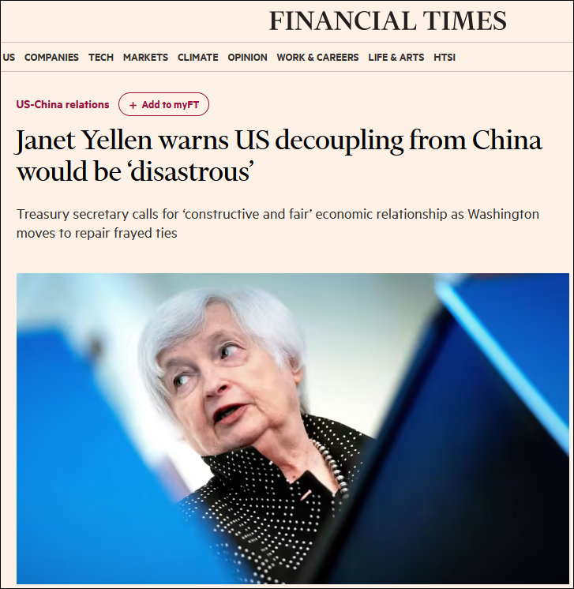
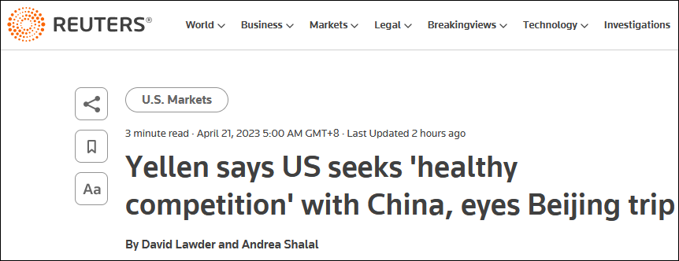

# 美财长耶伦：美国与中国脱钩将是“灾难性” 中美应建立必要经济关系

【文/观察者网
熊超然】当地时间4月20日，美国财政部长耶伦在约翰·霍普金斯大学高级国际研究学院发表讲话，阐述拜登政府的主要目标和政策。在当前中美对抗态势加剧和关系恶化之际，耶伦明确表示，世界上最大的两个经济体应当建立“必要的”经济关系。

据英国《金融时报》、路透社报道，耶伦在讲话中呼吁，中美之间建立的经济关系应当是“建设性和公平的”，美国做出任何与中国“脱钩”的努力都将是“灾难性的”。她还称，美方针对中方的所谓“国家安全措施”并非旨在扼杀中国经济和获取竞争优势，拜登政府不寻求“赢者通吃”的竞争。

尽管如此，耶伦同时声称，美国仍将“保护其国家安全利益”，并暗示可能会对中国采取更多行动。对于美国针对中国的半导体出口管制等措施，她仍嘴硬辩称是在“保护某些技术不被中方窃取”，符合美方“至关重要的利益”。

有美国智库专家解读认为，耶伦这番讲话是迄今为止有关拜登政府对华战略最全面的阐述，标志着渗透在两国关系中所谓“宿命论”（fatalism）和“大国竞争”（great
power competition）意识的转变。讲话中，耶伦依旧表达了希望访华并同中方官员会面的想法。

对于中美关系和美方近期“求对话”的想法，中国外交部此前已明确表示，中美关系不是你输我赢、你兴我衰的零和博弈，中方不回避也不惧怕竞争，但反对以竞争定义整个中美关系。美方应当拿出诚意，同中方相向而行，以实际行动推动中美关系重返正轨。

_《金融时报》报道截图_

“当我们的切身利益受到威胁时，美国将坚持自己的立场。”耶伦还说：“但我们并不寻求让我们的经济与中国‘脱钩’。（中美）两国经济的完全分离对两国都是灾难性的。这将破坏世界其他地区的稳定。”

据报道，耶伦在发表这番言论的同时，也评价了当前中美关系。“我们的关系显然处于紧张时刻。”耶伦说：“我的目标是清晰和诚实，消除噪音，基于清醒的现实，谈论这种重要的关系（中美关系）。”

《金融时报》指出，今年2月，“流浪气球”事件导致中美两国缓和紧张关系的努力失败，两国关系陷入一段时间以来的“最糟糕时刻”。目前，中美之间的紧张关系加剧，尤其是在台海问题上。此外，美国还正试图通过限制中国半导体产业等方式来遏制中国的崛起。

耶伦认为，中美两国需要有能力“坦率地”讨论“棘手的问题”。“就大国之间接触的轮廓进行谈判是困难的，但如果中国也愿意发挥自己的作用，我们可以找到前进的道路。”

_耶伦在约翰·霍普金斯大学高级国际研究学院发表讲话_

报道称，尽管耶伦呼吁中美应当建立“健康的经济关系”，并在宏观经济和气候变化等领域进行合作，但她同时声称，美国将继续与其盟友一道合作，抵制所谓的中国的“不公平经济政策”。

“尽管我们的针对性行动可能会产生经济影响，但动机完全是出于我们对自身安全和价值观的担忧。”她坚称，美国并没有试图削弱中国，并非是想获得经济上的竞争优势。

与此同时，耶伦声称，拜登政府不寻求“赢者通吃”的竞争，坚信“在一套公平规则下的健康经济竞争中”，中美两国会随着时间的推移从中受益。

而在谈到美国针对中国的半导体出口管制等措施时，耶伦如此辩称，“保护某些技术不被中方窃取”，符合美方“至关重要的利益”，但这“并非有意扼杀中国的经济和技术现代化”。

同时，耶伦还暗示，美国正准备对中国采取更多行动，《金融时报》认为这可能“进一步激怒中国”。比如，耶伦提到，美国政府正在考虑一项计划，以“限制美国对具有重大国家安全影响的特定敏感技术的某些对外投资”。

对于耶伦的这番讲话，路透社援引美国战略与国际问题研究中心（CSIS）中国问题专家斯科特·肯尼迪（Scott
Kennedy）的解读观点称，她的讲话是迄今为止有关拜登政府对华战略最全面的阐述，标志着渗透在两国关系中所谓“宿命论”和“大国竞争”意识的转变。不过，肯尼迪同时声称，这不是呼吁美国要回到以前“无条件接触”的政策上。

_路透社报道截图_

据报道，在讲话中，耶伦依旧抛出了“求对话”的意愿。她表示，计划“在适当的时候”访问中国，并同中方官员会面，以“负责任地”管理两国关系。不过，美国财政部方面并没有提供有关访问时间的具体细节。

此前，中国外交部发言人毛宁曾指出，中方一向认为，中美关系不是你输我赢、你兴我衰的零和博弈。中美各自取得成功，对彼此是机遇而不是挑战。宽广的地球完全容得下中美各自发展，共同繁荣。中方不回避也不惧怕竞争，但我们反对以竞争定义整个中美关系，打着竞争的旗号对一国进行污蔑抹黑，限制别国的正当发展权利，甚至不惜损害全球产业链供应链，这不是一个负责任大国的所为。

另一位中国外交部发言人汪文斌则表示，中美之间保持着必要沟通。我们认为，沟通的价值和意义在于增进理解、管控分歧，不能为沟通而沟通。美方应当拿出诚意，同中方相向而行，以实际行动推动中美关系重返正轨。

**本文系观察者网独家稿件，未经授权，不得转载。**

