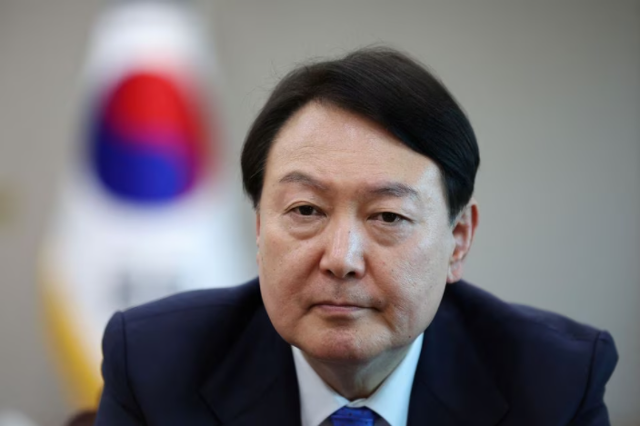

# 访美前递“投名状”，出格的话一路狂飙，韩方还要倒打一耙？

**面对事事坚持“美国优先”的拜登政府，面对只会把自身利益放在首位的美国，韩国的非理性行为，最终只能让自己受伤。**

韩国总统尹锡悦近来的说辞越来越大胆。19日，他在接受媒体采访时，不仅暗示可能向乌克兰提供军事援助，还在台湾问题上大放厥词。对此，中国和俄罗斯方面很快发出了警告。

在外界看来，尹锡悦此番表态恰逢访美前夕，因而不排除向美示好的意图。只是，韩国一系列“亲美”的言论和举动，非但不能换来美国的回报，还让自己陷入了尴尬又被动的境地。

**尹锡悦向美国递“投名状”？**

19日，尹锡悦因在接受采访时的几番言论，一口气得罪了两大邻国。

在涉乌问题上，尹锡悦表示，如若乌克兰平民在冲突中遭到大规模袭击，韩国对乌克兰的支持将不止于人道主义和经济援助。有媒体认为，这表明尹锡悦为韩国可能向乌提供军事援助“打开大门”，标志着他首次改变反对军援乌克兰的立场。

针对尹锡悦的表态，俄罗斯方面很快做出反应。俄总统新闻秘书佩斯科夫警告，韩国如果向乌克兰供应武器将意味着间接卷入冲突。俄外交部发言人扎哈罗娃表示，任何向乌提供武器的行为，都会被俄视为“公开敌对的反俄行为”，这样做不仅会损害俄韩关系，还会影响俄对半岛局势的立场。俄前总统梅德韦杰夫则反问道：“如果朝鲜出现了俄最新武器，韩国民众会怎么看？”

_韩国总统尹锡悦近日接受了路透社采访。图源：REUTERS_

面对俄罗斯的施压，韩国总统办公室急忙做出了解释，称尹锡悦给出的是所谓的“常识性和原则性的回答”，韩国对乌援助内容没有变化。

在台湾问题上，尹锡悦妄言称，这“就像韩朝之间的问题一样，应将其视为全球性问题”。

对此，中国外交部发言人汪文斌20日在例行记者会上明确表示，解决台湾问题是中国人自己的事，不容他人置喙。希望韩方切实遵守中韩建交联合公报精神，恪守一个中国原则，审慎处理台湾问题。

针对中国外交部20日的回应，韩国外交部第一次官张虎镇“召见”中国驻韩国大使邢海明表示了强烈抗议，称中国外交部发言人的表态是“外交失礼”，中方应作出努力不让此事给两国关系带来不必要的障碍。

21日，中国外交部强调，针对韩方就台湾问题发表的错误言论，中方已分别在北京和首尔向韩方提出严正交涉，全面阐述中方立场，强调一个中国原则是中韩关系的政治基础，要求韩方恪守中韩建交联合公报精神，在台湾问题上谨言慎行。

在 **辽宁大学国际经济政治学院副教授李家成** 看来，尹锡悦就援助乌克兰做出的最新表态是其首次“官宣”这样的立场，这暗示着韩国军援乌克兰的可能性。

“一方面，鉴于发表此番言论是在尹锡悦访美前夕，因此传递出向美国递‘投名状’的感觉。”李家成说，“另一方面，这或许也与‘泄密门’事件曝出美国监听韩国等盟友的风波有关。因为监听内容中疑似包括‘美国向韩国提出军援乌克兰的要求’，但倍感压力的韩国出于综合考虑，此前一直采取间接援助乌克兰的方式。而尹锡悦这一表态则释放出可能会对乌进行直接援助的意味，从某种意义上来说，他可能也想借此证明，被曝的监听内容中，有关“美国要求韩国提供军援”是虚假的，韩国没有受到来自美国的压力。”

**访美难以获得预期效果**

20日，韩国国家安保室公布了尹锡悦的访美行程。本月24日至30日，他将对美国进行为期7天的国事访问，并于26日出席在白宫举行的韩美元首会谈。

但尹锡悦在访美前的言论却引发了韩国国内的担忧。《韩民族新闻》评论称，在韩国所处的国际形势下，总统公开发表这些言论非常不恰当。

李家成认为，尹锡悦此次访美或不会达到韩国方面所预期的效果，而韩国一味对美示好也很难得到来自美国的回报。

首先，美国政府近日发布《通胀削减法案》细则，销量靠前的韩国电动汽车被排除在可以获得补贴的电动汽车名单之外。美国这一做法，会对韩国电动汽车在美国市场的销售造成很大冲击。

在韩国半导体向美出口已成断崖式下跌的情况下，电动汽车被韩国视为出口美国的主力产品。从尹锡悦在此次访美前组建了大规模经贸代表团不难看出，韩国对美有这些经济方面的诉求。但美国的主要考虑是让韩国企业来美投资砸钱，并非是让韩国企业在美获利。

_拜登2022年5月抵达首尔，对韩国进行了为期三天的访问。图源：alarabiya_

其次，韩国国家安保室第一次长金泰孝日前表示，期待以美国监听韩国风波为契机，将韩美情报同盟提升至“五眼联盟”的水平。但美国监听韩国的行为如若属实，本质上反映出美国对于韩国的不信任。因此，金泰孝的想法实现可能性微乎其微，可以看作是韩国对美国的一种奢望。

“今年是韩美同盟成立70周年，从形式上看，美国总统拜登对尹锡悦此次访美颇为重视，安排了高规格接待。但总体而言，尹锡悦此次访美实则象征意味更甚。”李家成补充道。

韩国政府在靠近美国的路上“疾驰”，让韩国国民的忧虑与日俱增。20日，韩国民众在总统府前举行集会，抗议“韩美日军事同盟”，呼吁政府将“萨德”反导系统撤出韩国。

李家成认为，韩国的“亲美”举动已不能单纯从国家利益层面来解读。前不久，韩国方面表态称“韩美同盟不是利散则尽的关系”。这或许代表尹锡悦政府对美外交的首要考虑因素是价值观或意识形态，而非国家利益。面对事事坚持“美国优先”的拜登政府，面对只会把自身利益放在首位的美国，韩国的非理性行为，最终只能让自己受伤——这次韩国电动汽车被美排除在可以获得补贴的电动汽车名单之外就是一个信号。但美国对韩国的态度或许会有一定好转。毕竟，尹锡悦政府对促进韩日关系而做出的努力，以及其他一些按美旨意所做出的举动，正是美国所乐见的。

李家成指出，从长远来看，韩国单方面倚重美国的做法并不符合韩国的国家利益。如果韩国继续在某些问题上紧随美国、肆意妄为，甚至不惜牺牲与其他国家的关系，最终吃亏的也只能是韩国自己。

**出品 深海区工作室**

**撰稿 王若弦**

**编辑 深海默**

