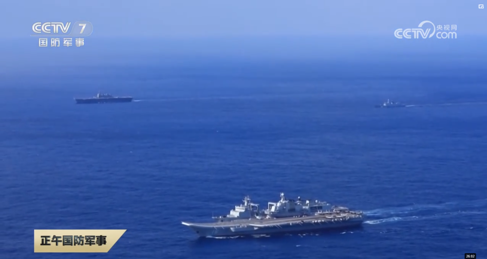
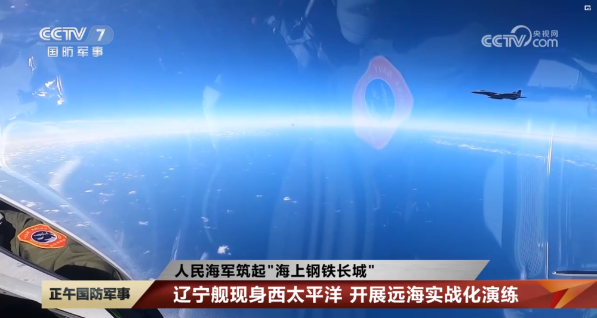
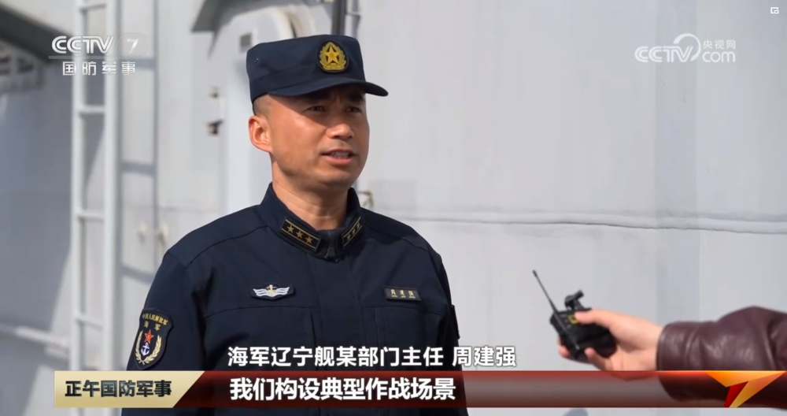
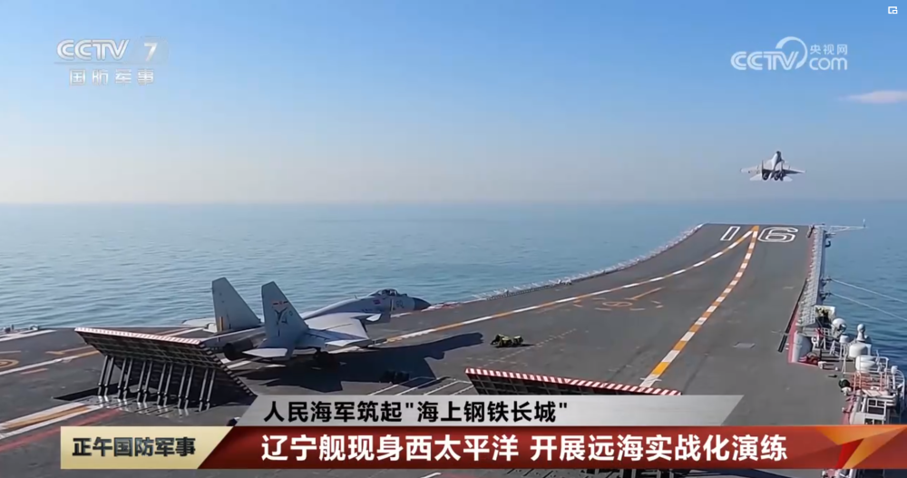
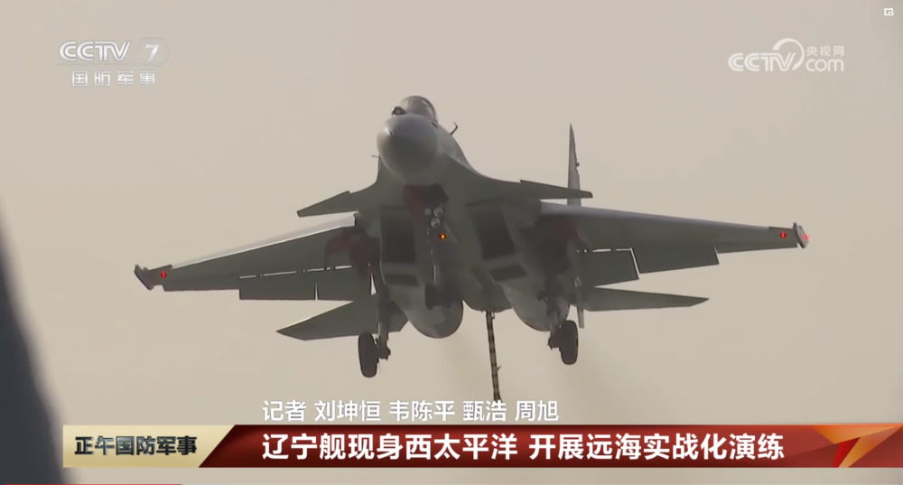
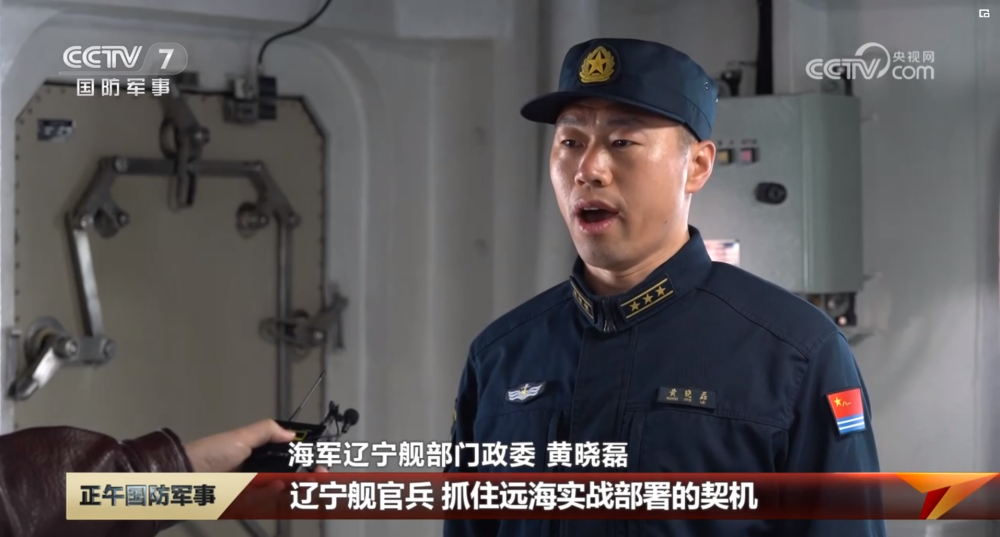
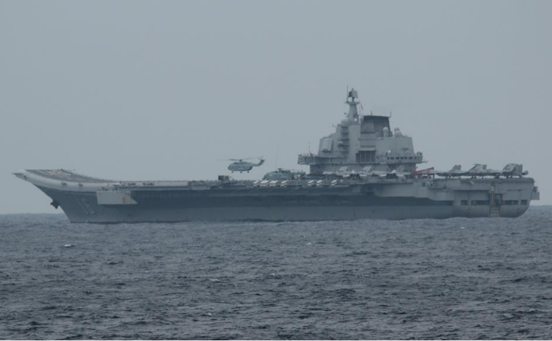
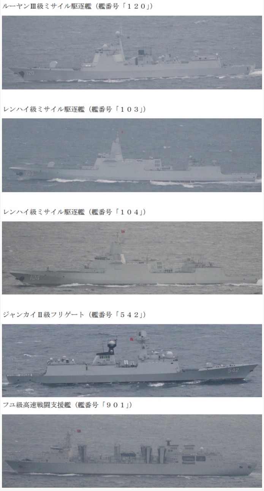

# 辽宁舰开展远海实战化演练期间，外军舰机持续抵近侦察和跟踪监视

【文/观察者网 王世纯】今年是人民海军成立74周年，央视“正午国防军事”栏目4月21日的报道中发布了一组我辽宁舰舰载机监视外军F-15战机的画面。

训练中，辽宁舰常态保持警戒战备值班体系，以及武器装备待战状态，多次组织防空反潜等科目训练。期间，外军舰机持续抵近侦察和跟踪监视。辽宁舰官兵稳慎处置，有效应对，在面对面较量中精准掌握海空态势，持续检验战法训法。

_日本海上自卫队“出云”号直升机驱逐舰跟踪我辽宁舰编队
图源：正午国防军事_

_我舰载机监视外军F-15
图源：正午国防监视_

报道称，74年来，人民海军不断推进主战装备建设，潜艇最大自给力战备远航，水面舰艇远海训练，航空兵远程奔袭成为常态。随着实战化训练向远海远域不断拓展，人民海军已经成为捍卫国家主权，维护国家海洋权益，应对多种安全威胁的，完成多样化军事任务的海上钢铁长城。

报道提到，本月初，东部战区组织环台岛战备警巡和“联合利剑”演习，海军山东舰航母编队参加了此次演练。而就在近日，另一艘航母辽宁舰还在西太平洋某海域，开展了防空，反潜等多科目训练，锤炼航母编队的远海体系作战能力。

西太平洋海域，深蓝色的海面一望无垠。随着一级战斗部署拉响，辽宁舰各战斗人员迅速就位，一架架歼-15战机展开机翼喷出烈焰一飞冲天。

海军辽宁舰某部门主任周建强这样说：“我们构设实战化部署场景，突出远海实战化部署实战实训，坚持体系用兵动态塑势和战训耦合，在实战环境中练指挥、研战法、摸底数、强能力。锤炼航母编队远海体系作战能力。”

训练中，辽宁舰常态保持警戒战备值班体系，以及武器装备待战状态，多次组织防空反潜等科目训练。期间，外军舰机持续抵近侦察和跟踪监视。辽宁舰官兵稳慎处置，有效应对，在面对面较量中精准掌握海空态势，持续检验战法训法。

海军辽宁舰部门政委黄晓磊说：“辽宁舰官兵抓住远海实战部署的契机，聚焦战斗力提升，以时不我待只争朝夕的精神状态，来拖创新，攻坚克难，不断把航母事业向前推进。”

据日本防卫省统合幕僚监部网站1月2日通报，1月1日，辽宁舰与包括2艘055型大型导弹驱逐舰在内的4艘驱护舰和1艘补给舰，结束了为期半个月的西太演训，经冲绳本岛和宫古岛之间的宫古海峡返回东海。

_日本统合幕僚监部发布的我辽宁舰编队照片_

