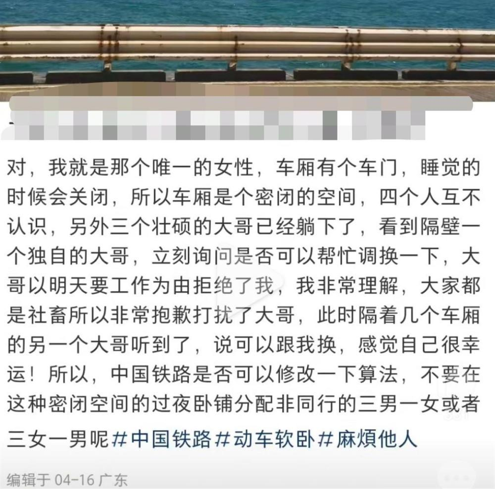
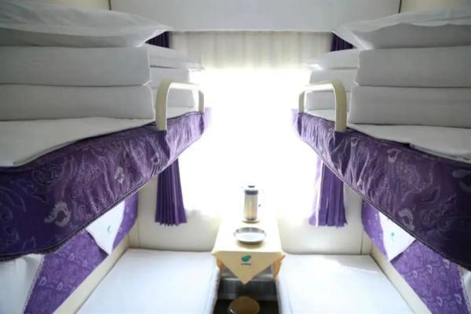

# “软卧车厢分配3男1女”网友吵翻了，曾试行“女性包厢”但匆匆退市

旅客列车的软卧席位应如何安排？

根据多家媒体报道，日前，一名女子发帖吐槽软卧车厢分配3男1女。帖文最后呼吁，铁路部门是否可以修改算法，不要在密闭空间的过夜卧铺分配非同行的3男1女或3女1男。

对此，铁路12306工作人员回应称，暂无按性别分配的功能。如果乘客不满意车厢安排，可以看看其他车次位置，或者看看其他交通工具。

上述帖文激起舆论热议，多家媒体对此形容为“网友吵翻了”。一方观点指出，“3男1女”“3女1男”这种分配确实有些尴尬。另一方则认为，公共交通不可能满足每个人的要求，遇到这类问题可以与其他人商量换下位置。

**舆论纷争**

根据央广网发起的一项网络投票，截至4月22日11时30分许，75%的参与者认为应该按乘客性别安排车厢，25%的认为“没必要，觉得不舒服可以自己调换”。

在极目新闻评论员看来，很多时候，乘坐长途火车的时间并不短，尤其是夜间，环境比较昏暗，相较于男性而言，女性因为体能先天弱势，本身更容易受到各种侵害。软卧包厢又是4个铺位一组的封闭式车厢，单独跟三个男性待在其中，会觉得惴惴不安，尴尬难受，是完全可以理解的。在注重个人安全的当下，女性能有这样的自我保护意识，应该鼓励和提倡，而不是冷嘲热讽。

文章称，单就女性安全而言，封闭式的软卧，开放式的硬座和硬卧，都可能会有潜在的安全风险，再先进的购票系统，也无法甄别和筛选那些心怀不轨的人。但让乘客能够选择“同性别包厢”，绝不仅仅是像有些人说的，只是为了满足女性的优越感，而是通过个性化的服务，尽可能地满足不同旅客的个体需求，让他们免于尴尬和不安，从而提升整体的出行体验，这对任何性别、年龄、出行状况的旅客而言，都是有好处的。

关于火车卧铺按性别分配席位或车厢的讨论，并非首度出现。

2022年8月29日，一则“女生自述坐硬卧疑遭骚扰”的视频冲上热搜。当事人讲述，凌晨3点，一名30多岁的男子以充电为由，坐到下铺女生的床铺，并且摸女生的脚。期间列车员多次提醒该男子不要坐在女孩床上，但该男子等过道没人后，又坐了过来。

这则新闻的评论区中，就有网友提出了“火车卧铺出个男女分开的车厢”的建议。

对此，天目新闻刊发文章指出，开辟男女分开的车厢，是“治标不治本”。

文章称，首先，男女分开住，表面上解决了女性的安全问题，但它只是将女性短暂地保护起来，无法真正从源头上遏制问题的发生，也无法从根源上消除女性的安全焦虑。因为不仅是列车车厢，比如地铁、公交车，甚至大街上，女性都有可能遭遇骚扰，是否也要建议开辟女性专属地铁、专属公交车，甚至女性专属道路呢？存在危险是客观事实，但这种提议不仅让社会陷入一种恐慌，也会让我们在实现两性平等的道路上越走越远。其次，如果火车卧铺将男女车厢分开，假如男乘客多于女乘客，女性卧铺车厢还有空位，很多男乘客却买不到车票，怎么办？有票没法卖，反倒加剧节假日“一票难求”的现象，给列车运行添麻烦。

**短暂试行**

中国铁路运输史上也出现过专门开辟的“女性包厢”。

2006年，原铁道部曾要求在京沪线的Z5/6、Z21/22次列车上开设“女宾软卧”。当时的“女宾软卧”专门针对的是独自一人乘火车的女性乘客。上海至北京的Z6、Z22次列车每天分别在列车一个车厢内预留2个软卧包房(8个铺位)。由于女宾软卧包间为女性“专用”，所以，只要每个包间有一张票售出，该女性专用包厢即可成行。

如果开车前一天整个包房的铺位都没卖出去，就会将整个包房的车票转到公用窗口发售。此外，“女宾”专用包厢票办理退票时，系统会自动将车票返回留待后来“女宾”购买。

2006年2月7日，京沪Z6次直达列车从上海出发，3号软卧车厢预留的两个包房成为这条线路上首次开设的女性专用包房。不过，在中国首个女士专用包房中，只坐了两名乘客。

综合多方资料来看，客流问题正是“女宾包厢”迅速夭折的主因。

据北京媒体报道，自开设专窗后，北京站卖出的“女宾包厢”票寥寥，最终大部分车票都转到普通窗口出售，售票情况不佳。“诞生”不到十天，北京站停止对外销售“女宾包厢”的软卧票。一名工作人员称，“我们曾经在直达专售区设立了‘女宾包厢’售票专窗，如今这个窗口已经恢复卖普通车票了。”

铁路方面称，本想“女宾软卧包厢”先在京沪线上试点，然后再逐步推广。但从售票情况来看，推行“女宾软卧包厢”的时机尚不成熟，所以铁道部决定将其取消。

不过，《记者观察》同年援引一名铁路职工的观点称，市场培育需要时间，女性专用包厢推出之时，正逢春运，春节刚过，很多人的出差计划都没有安排，买票的人相对较少，不应由此认为女性专用包厢“叫好不叫座”。

在早年有关话题的讨论中，有跟车乘警指出，包厢旅客素质良莠不齐，而且包厢门一关，服务员又不能随便打扰旅客，难免给一些素质低下的旅客以可乘之机。即使没有安全问题，一女和三男在一间，或者三女一男在一个狭小的空间，的确不舒服。旅客遇到类似问题，可以向列车员提出调整，只要条件允许，列车员都会帮助调整。另有业内人士反映，乘火车的人太多，火车还有中途上下客的情况，如有男乘客中途下车，又上来一女乘客怎么办呢？

“女性专用包厢”虽然草草收场，但铁路部门有关人士称，对单身女性的照顾仍将继续，如有女性要求换位，列车会尽量满足要求。

铁路客运包括普通旅客列车和高铁动车组列车，普通旅客列车硬座、硬卧主要满足中低收入群众基本出行需求，具有一定的公共服务、公益性特征。高铁动车组及普通旅客列车软座、软卧主要满足旅客较高品质出行需求。

2015年，铁路部门率先在部分高铁动卧列车上试水“女宾专有包房”。根据公开报道，供售票员使用的系统内设置了可勾选的“女宾”选项，但网购车票时并没有“女宾专有包房”的相应选项。“女宾专有包房”车票只能在车站售票大厅窗口购买。

另有部分普通旅客列车也推出了所谓的“女宾包房”服务。例如，Z206次列车的资料介绍道，针对独自出行的女性旅客，如果觉得旅途中与男性旅客同住包厢不便，可向乘务人员申请，根据实际情况调整到只有女性乘客乘用的“女宾包房”，享受更加人性化的列车服务。

也就是说，这并非售票系统上的设计，而是依赖于现场协调。

那么，按性别来分配软卧车厢席位，到底有无必要？

在极目新闻近日报道中，武汉大学城市安全与社会管理研究中心副主任、特聘教授尚重生认为，按性别来分配车厢售票，不仅没有必要，而且没有可操作性。

尚重生表示，即便软卧可以关门，但车厢内本质上仍属于公共空间，同车厢的乘客也大概率都是陌生人，在公共空间相处，本就无需尴尬。而且不论是“3男1女”或“3女1男”，陌生人之间一般也不会产生共同犯罪的意图。相反，在公共场合，几个陌生人还会起到互相制衡的作用。如果乘客真的觉得非常尴尬，可以和其他乘客协商换位置。

另外，尚重生认为，按照性别分配车厢实际上也没有可操作性，不仅会增加售票系统设置上的成本，而且也会给后续管理增加麻烦。“比如中途有人下车，车厢还剩下3个女孩子，这时剩下的一个位置要怎么出售才合理？还有春运、小长假期间，火车票本来就紧张，假如一个车厢的票已经卖给了3个男的或者3个女的，剩下一个位置又要怎么分配？”尚重生表示，“再比如夫妻同行，原本在同一车厢更方便，实施男女分厢后，可能又需要单独申请或与其他乘客协调。综合各种情况，车票反而更加难分配。”

