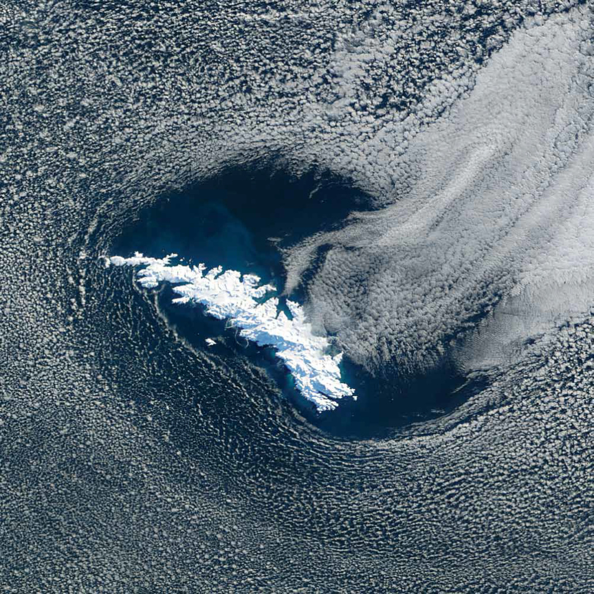

# 世界地球日｜卫星视角带你瞰地球之美

今年4月22日是第五十四个“世界地球日”，主题为“珍爱地球，人与自然和谐共生”。地球是人类赖以生存的唯一家园。人与自然是生命共同体，只有处理好人与自然的关系，维护生态系统平衡，才能守护人类健康。

_梅岑河的淡水与北冰洋的海水交汇，俄罗斯。_

1960年，美国对地球进行了第一次卫星观测。几十年来，卫星以独特的视角观看地球的陆地、海洋、冰川、山脉等地貌，以及奇特的形状、颜色和纹理。这些图像不仅展示了地球之美，也让我们看到了魅力非凡的家园。

_阿克帕托克岛，加拿大。_

_阿尔及利亚沙漠，阿尔及利亚。_

_昆仑山脉和阿尔金山脉之间的冲积扇，中国。_

_贝尔彻群岛，加拿大。_

_博格达山脉，中国。_

_邦贝托卡湾，马达加斯加。_

_伯德冰川，南极洲。_

_卡内基湖，澳大利亚。_

_卡维尔盐漠，伊朗。_

_埃隆戈地块，纳米比亚。_

_花园城市，美国。_

_冰川与被洋流卷起的冰山，格陵兰岛。_

_卡拉哈里沙漠，南部非洲。_

_堪察加半岛，俄罗斯。_

_拉里奥哈，阿根廷。_

_勒纳河三角洲，俄罗斯。_

_穆桑达姆半岛，阿曼。_

_密西西比河，美国。_

_纳斯卡线，秘鲁。_

_纳米布沙漠，纳米比亚。_

_浮游植物，波罗的海。_

_皮纳卡特火山场，墨西哥。_

_落基山山沟，加拿大。_

_南乔治亚岛，南大西洋。_

_叙利亚沙漠，西亚。_

_提克豪环礁，法属波利尼西亚。_

_冯·卡尔曼·沃蒂斯上的云层旋涡，南太平洋。_

_扎格罗斯山脉，伊朗。_

_瓦特纳冰川和冰盖，冰岛。_

世界地球日（The World Earth Day）
即每年的4月22日，是一个专门为世界环境保护而设立的节日，旨在提高民众对于现有环境问题的认识，并动员民众参与到环保运动中，通过绿色低碳生活，改善地球的整体环境。地球日由盖洛德·尼尔森和丹尼斯·海斯于1970年发起。

**图文来源：新华社、人民日报、NASA、视觉中国**

(本文来自澎湃新闻，更多原创资讯请下载“澎湃新闻”APP)

