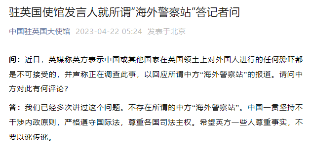

# 中国驻英国使馆发言人就所谓“海外警察站”答记者问

来源：中国驻英国大使馆

**问：**
近日，英媒称英方表示中国或其他国家在英国领土上对外国人进行的任何恐吓都是不可接受的，并声称正在调查此事，以回应所谓中方“海外警察站”的报道。请问中方对此有何评论？

**答：**
我们已经多次讲过这个问题。不存在所谓的中方“海外警察站”。中国一贯坚持不干涉内政原则，严格遵守国际法，尊重各国司法主权。希望英方一些人尊重事实，不要以讹传讹。

