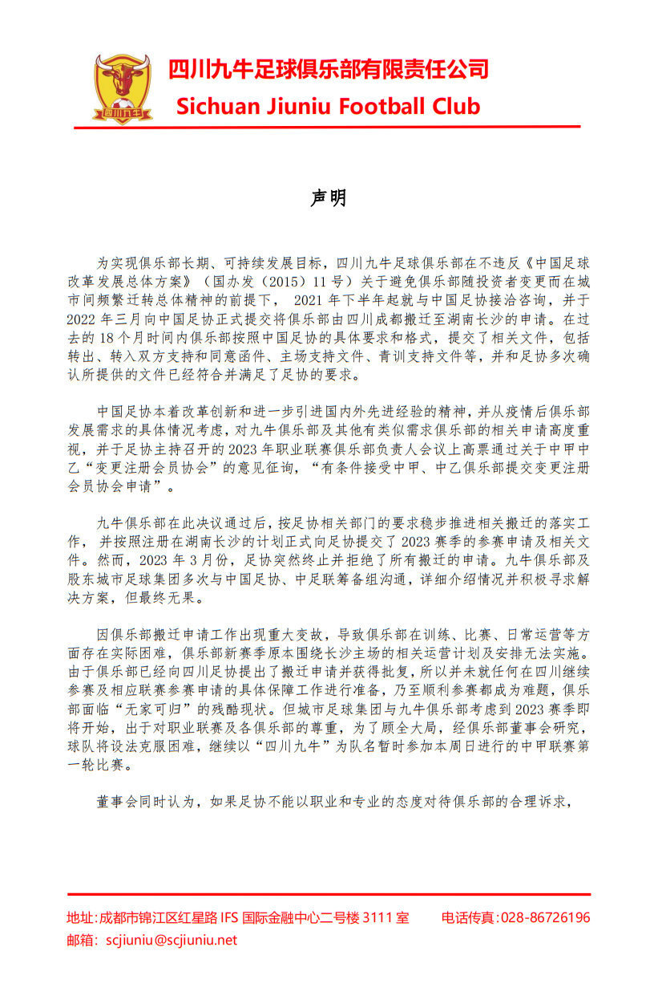
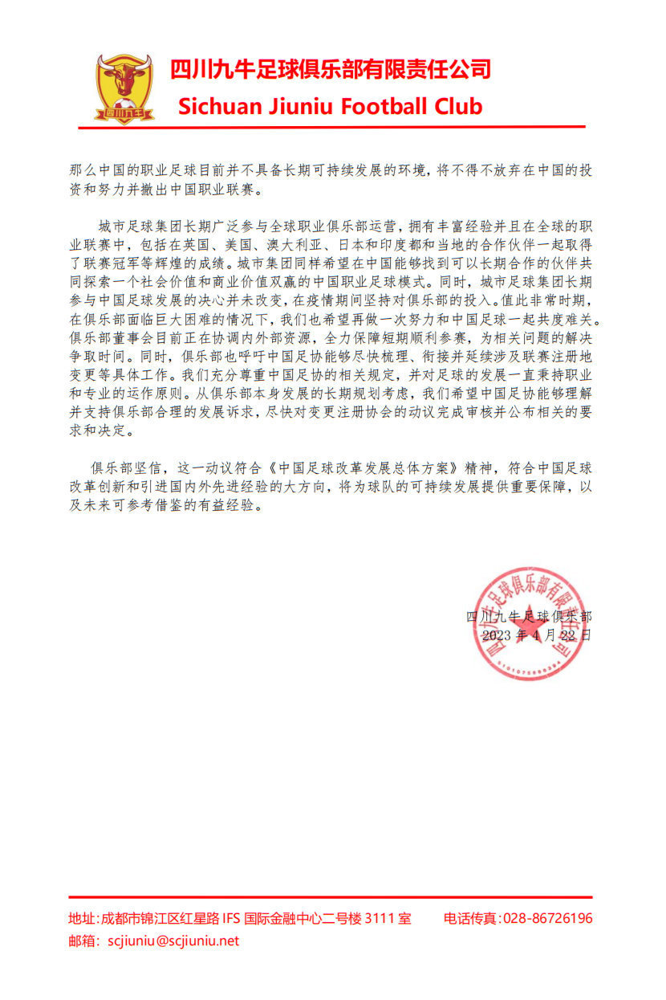
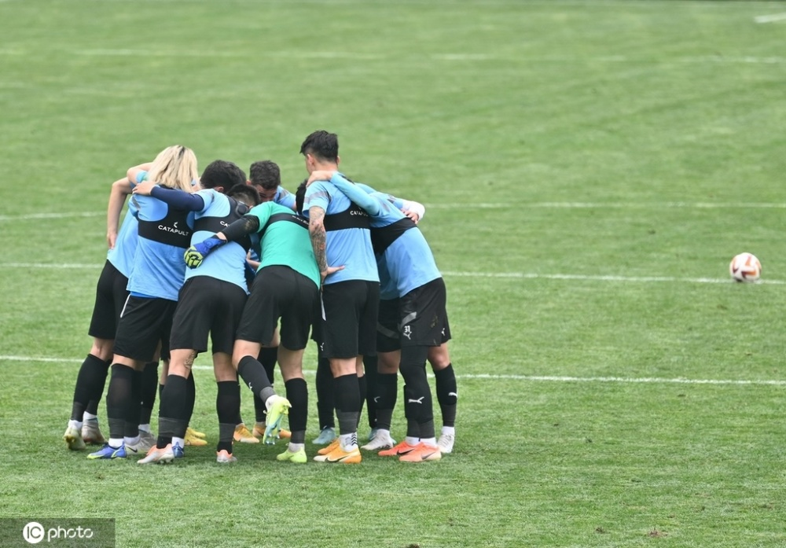

# 中甲四川九牛：足协拒绝俱乐部搬迁，或考虑退出职业联赛

22日上午，中甲四川九牛俱乐部官方发文，表示中国足协拒绝俱乐部搬迁至湖南长沙，导致俱乐部在运营层面出现困难。

**“如果足协不能以职业和专业的态度对待俱乐部的合理诉求，俱乐部将不得不放弃在中国的投资和努力并撤出中国职业联赛。”**

据此前报道，新赛季中甲联赛开赛前，四川九牛俱乐部官方宣布球队完成换帅，原主教练塞尔吉奥-洛贝拉正式离任，原助理教练赫苏斯-
塔托升任球队代理主教练。2022赛季，四川九牛34战18胜3平13负排名中甲第7，没有完成俱乐部赛季前制定的冲超目标。

