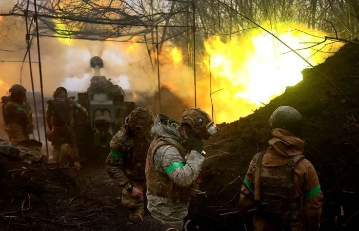

# 俄罗斯：确认本土遭到来自乌克兰的20多次炮击

参考消息4月22日消息：据俄新社4月22日报道，俄罗斯库尔斯克州州长罗曼·斯塔罗沃伊特当天在“电报”社交平台上说，乌克兰军队袭击了库尔斯克州的雷利斯克区。

他写道：“确认来自乌克兰的20多次炮击。定居点没有毁坏和人员伤亡，但供电网络受损。”

这位州长说，奥别斯塔村、洛科季村和新伊万诺夫卡村供电中断。待安全之后，维修队就会开始抢修。

来源：参考消息 编辑：郑楚翘

