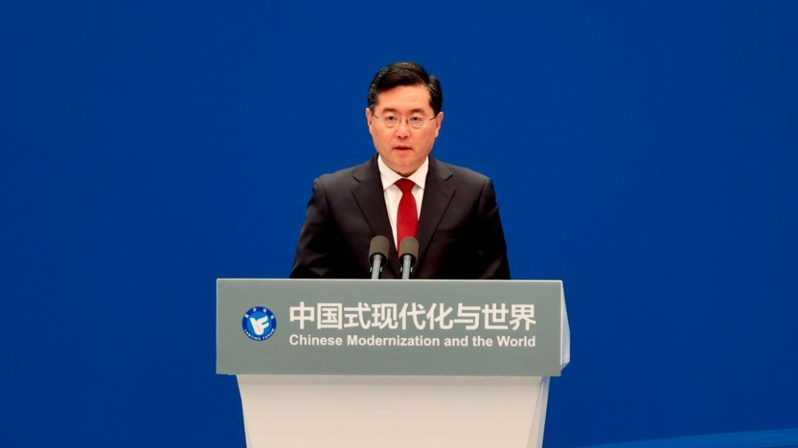

# 外交部蓝厅论坛与蓝厅记者会隔空联动，台湾问题成重要联结点

4月21日，在上海召开的蓝厅论坛与在北京举行的蓝厅记者会，形成了隔空联动，而联结点包括台湾问题。

在蓝厅论坛上，国务委员兼外长秦刚强调， **台湾自古以来就是中国领土不可分割的一部分，两岸同属一个中国，这是台湾的历史，也是台湾的现状。**
台湾回归中国是二战后国际秩序的组成部分。 **中国的土地收回来了，就绝不会再失去。** 战后国际秩序建立起来了，就绝不允许被颠覆。
**谁要在中国主权安全上搞动作，我们绝不退让。在台湾问题上玩火者必自焚。**

在蓝厅记者会（外交部例行记者会）上，外交部发言人汪文斌指出，
**什么是台海现状？那就是海峡两岸同属一个中国，台湾是中国领土的一部分，中国的国家主权和领土完整从未分割。是谁在试图改变这一现状呢？**
不是中国大陆方面，而是不断推进“渐进式台独”、大搞“去中国化”、在国际上制造“两个中国”“一中一台”的 **“台独”分裂势力，**
是不断虚化掏空一个中国原则、大肆对台出售武器、叫嚣“今日乌克兰，明日台湾”的 **外部干涉势力。** 他们才是破坏台海现状的罪魁祸首。

**秦刚为何在蓝厅论坛上强调台湾问题？**

值得注意的是，本次蓝厅论坛的主题为“中国式现代化与世界”。秦刚为何会在讲述中国式现代化的场合谈台湾问题？对此，我们可以从多维度来看。

首先不妨先来看秦刚的蓝厅论坛主旨演讲所蕴含的信息。

秦刚演讲的主题是“中国式现代化 世界的新机遇”。在演讲中，秦刚直指，去年10月份召开的中国共产党第二十次全国代表大会，擘画了中国未来发展的蓝图，明确提出
**以中国式现代化全面推进中华民族伟大复兴。为了完成这个中心任务，中国外交责无旁贷。** 对此，秦刚谈到了中国外交的5个“更加”。

在“我们将更加坚决地守护国际秩序”中，秦刚表示，
**最近，我们经常听到一些奇谈怪论，声称中国挑战“基于规则的国际秩序”“试图用武力或胁迫方式单方面改变台海现状”“破坏台海和平稳定”。这些言论违背起码的国际常识和历史正义，其逻辑是荒谬的，其后果是危险的。**
中国作为二战中伤亡最大的反法西斯盟国之一，作为第一个在联合国宪章上签字的创始会员国，我们把捍卫联合国权威、维护二战后国际秩序看成自己的神圣职责。在遵守联合国宪章宗旨和原则、国际法和国际关系基本准则方面，中国的记录是最好的。
**我们无需有的国家或国家集团提醒。是谁对联合国合则用、不合则弃，是谁在破坏国际秩序，是谁在搞霸权霸凌霸道，自有公论。**

随后，秦刚进一步强调台湾问题的历史经纬，指出台湾回归中国是二战后国际秩序的组成部分。中国的土地收回来了，就绝不会再失去。

深圳卫视直新闻注意到，在涉及中国式现代化为全球发展带来的新机遇时，秦刚首先谈的便是经济领域。秦刚指出，今天的中国，已成为140多个国家和地区的主要贸易伙伴，每天有3.2亿美元中国直接投资走向世界，每月有3000多家外资企业落户中国。过去十年，中国对全球增长的带动超过七国集团（G7）总和。
**随着中国14亿多人口整体迈入现代化，这个规模将超过现有发达国家人口总和，中国必将给世界经济提供更强大动力。**

南京大学台湾研究所所长刘相平表示， **从中国式现代化的五个基本特征看，**
完全可以包容台湾的现代化。大陆发展进步特别是经济、科技实力等持续增强，为两岸交流互补、合作共赢不断注入强劲动能。
**台湾的前途在大陆，台湾应该和大陆一起携手推进现代化进程，增进人民的福祉。**

台湾《中国时报》社论认为， **“中国式现代化”愿景，将为台湾参与大陆现代化过程提供舞台。**
“台湾深度参与大陆现代化建设，早已是既成事实。过去40年赴大陆投资的台商，从传统制造到高科技产业都能与时俱进，创造出两岸共荣大局。”

另一方面，本次蓝厅论坛的参会规模也透露出另一则信息——金砖国家新开发银行行长、巴西前总统罗塞夫，埃及前总理沙拉夫等80多名外国政要、中外知名专家学者和工商界代表以及外国驻华使节、国际组织驻华代表、国际媒体代表出席。

不难看出，
**秦刚的话，既是说给世界各国听的，同时也是说给广大台湾同胞听的——中国式现代化是两岸共同的现代化，民族复兴路上台胞不应也不会缺席。而针对当下存在的一些涉台“杂音”，秦刚也须在国际化场合上再次严正表明中方立场，驳斥谬论，以视正听。**

**蓝厅记者会为何也强调台湾问题？**

就在蓝厅论坛召开的同时，蓝厅记者会上也有多个问题涉及台湾，相关题眼均与涉台“杂音”有关。

近日，韩国总统尹锡悦在接受采访时就台海问题表示，我们同国际社会一道，坚决反对以实力改变现状。汪文斌在20日蓝厅记者会上应询时强调，
**台湾问题纯属中国内政，是中国核心利益中的核心，解决台湾问题是中国人自己的事，不容他人置喙。汪文斌进一步指出，朝鲜和韩国都是已加入联合国的主权国家。朝鲜半岛问题与台湾问题的性质和经纬完全不同，根本不具可比性，这是众所周知的事实。希望韩方切实遵守中韩建交联合公报精神，恪守一个中国原则，审慎处理台湾问题。**

针对中方回应，韩国外交部第一次官张虎镇当天召见中国驻韩国大使邢海明表示强烈抗议，称中国外交部发言人的表态是“外交失礼”。4月21日，汪文斌在应询时再次表明中方严正立场，强调“
**针对韩方就台湾问题发表的错误言论，中方已分别在北京和首尔向韩方提出严正交涉，全面阐述中方立场，强调一个中国原则是中韩关系的政治基础，要求韩方恪守中韩建交联合公报精神，在台湾问题上谨言慎行。**
中方维护自身主权和领土完整正当合理、坚定不移，希望韩方切实恪守一个中国原则，同中方一道以实际行动维护中韩关系健康稳定发展。”

据韩国《京乡新闻》报道，韩国最大在野党共同民主党党首李在明21日在国会召开紧急记者会，要求尹锡悦贯彻韩国不介入台湾问题的原则，并警告其言论会导致令人难以承受的外交恶果。

中国社科院亚太与全球战略研究院研究员、中国周边战略研究室主任王俊生对深圳卫视直新闻指出，尹锡悦涉台消极表态在韩国历届政府上极为少见，而这既与韩国对外政策有关，也与当下韩国自身定位有关。

“尹锡悦政府强化与美国的同盟关系，看起来是在韩美同盟大的框架下布局对华外交。尹锡悦政府很清楚美国在台湾问题上的做法，因此在台湾问题上也动作不断。尹锡悦政府将韩国定位为‘全球枢纽国家’，鉴于美日以及欧洲相关国家插手台湾问题，韩国也东施效颦，借此凸显其国际地位。此外，鉴于尹锡悦政府上台后中国对发展中韩关系高度重视与高度期待，尹锡悦再三以怨报德看起来其对华外交存在一种‘斗气’情绪意味，其对华认知不符合客观实际。”王俊生说。

除韩国外，近日在日本落幕的七国集团（G7）外长会同样发出涉台“杂音”，称“反对中国试图以武力为背景单方面改变台海现状，并确认了台海和平稳定的重要性”。汪文斌对此强调，有关国家应当认识到，台湾问题是中国的内政，不容任何外部干涉。

王俊生指出，在台湾问题上，不存在任何模糊、妥协空间。近期，中方的密集表态也是针对美西方包括其“跟随者”错误言行的最新反应。

作者丨何王子彧，深圳卫视直新闻驻京记者

编辑丨李怡，深圳卫视直新闻主编

排版丨盘思仪，深圳卫视直新闻编辑

