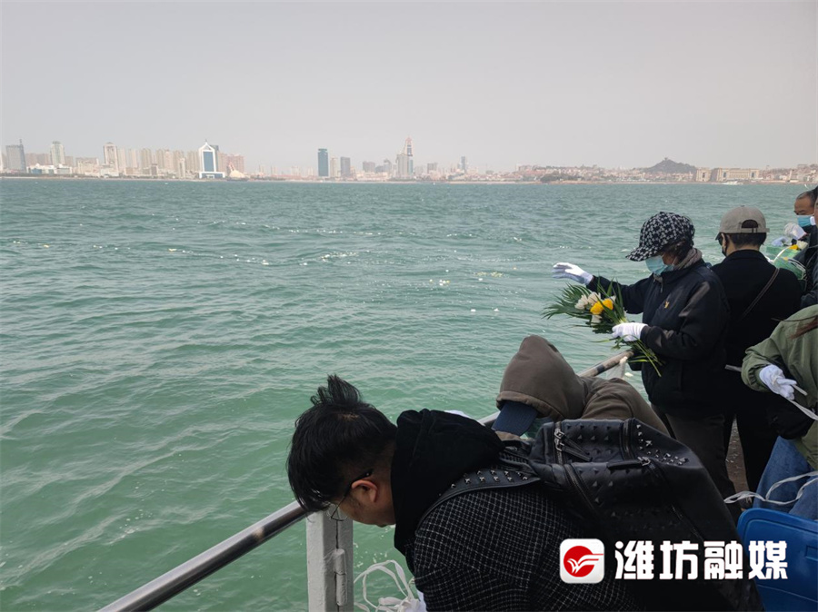

# 多座内陆城市近期举行集体海葬，为何都选在青岛海域？

据内蒙古呼和浩特市民政局消息，为了鼓励和引导群众移风易俗，自觉实行节地生态安葬，满足群众对节地生态安葬服务的需求，经研究，决定于2023年5月9日-10日在青岛海域举行骨灰集体海葬活动。海葬服务实施中产生的相关费用由民政部门承担；逝者亲属的交通费、食宿费等费用自理。

另外，陕西省民政厅和西安市民政局今年将联合举办陕西省首届公益性海葬（骨灰撒海）活动，计划于4月底在青岛市举办。

在山东省内，4月20日，91位来自济南的逝者在亲人的祈福中，伴着芬芳的鲜花魂归青岛海域……

这些内陆城市举行海葬，为何都选在青岛？

据山东省民政厅社会事务处处长潘红春早前介绍，青岛市是全省最早开海葬的城市，承担了济南等内陆城市的海葬任务。

从上世纪90年代初开始，青岛市率先在全国开展骨灰撒海活动。据《半岛都市报》报道，初期，市殡葬管理所不知找过多少条合适的客轮，但对方一听说要搭载骨灰，无一例外因“晦气”而婉拒。接下来的1992年和1993年，海葬仪式被迫中断。没人会料到，起因竟是找不到一条可以搭载逝者骨灰及家属的船只。后来，租用过单位班船，租用过园林旅游公司的小客轮“青岛号”，直至现在租用了固定的运营客轮，大家已经接受了这一绿色生态殡葬理念，再也无人因“晦气”而拒绝或者抱怨。找船只如今看来微不足道，但当时足以见证当时的破冰之艰。

报道回顾道，三十年来，青岛海葬从无到有、从小到大、稳步发展，从大规模、单一集中的集体大规模海葬走向常态化、小规模、个性化的多元模式，从单纯海葬走向了“葬”“祭”并重，从最初以本地市民为主到覆盖全国，并已与济南、潍坊、淄博、呼和浩特等地建立了长期合作关系。

在海葬合作和辐射范围方面，青岛市殡仪馆最先是与淄博进行合作海葬，后来是济南、潍坊、日照。2019年5月22日，与内蒙古呼和浩特市合作在青岛举行海葬，22具骨灰撒入大海，标志着青岛与兄弟城市间合作海葬又迈出了新的一步。同年，青岛民政部门还表示将与新疆乌鲁木齐民政部门积极接洽，对接海葬合作事宜。

_潍坊在青岛举行2023年春季生态海葬活动_

报道称，在海葬覆盖区域和人群上，目前青岛海葬已经覆盖到国内除港澳台之外的所有省级行政区域。在参加青岛海葬的人群中，既有土生土长的青岛普通群众，也有解放前参加革命工作的老党员、老同志，更有在青岛服过役的革命军人，还不乏海外华侨和国际友人。他们都充满着对大海的向往和眷恋，充满着为子孙后代多留碧海蓝天、多留绿水青山的责任和情感。

另外，时任青岛市民政局局长王凯曾表示，青岛在蜿蜒730公里的海岸线上，有大小49处海湾，60多座岛屿，算得上是北方最好的海域，推行骨灰撒海，有很好的地理优势。

2021年一项统计数据显示，2003年至今，青岛与济南、淄博、潍坊、日照和呼和浩特五市合作海葬逝者1633人。近5年，外地在青岛集中和有组织的海葬数量占到了15%。

生态环境部海洋生态环境司曾于2022年6月介绍，人体骨灰是我国相关法律法规明确允许海洋倾倒的物质类型之一，也符合相关国际公约规定的情形。“海葬”活动需要在指定区域开展，我国现有专门服务于“海葬”活动的生态处置倾倒区3个（青岛、日照、长江口），其他在用的倾倒区也可用于开展“海葬”活动。

山东日照拥有专门的生态处置倾倒区，为何早前还与青岛合作？

日照新闻网早前报道提到，2018年初，一篇《日照市开展海葬服务活动公告》的发布，为日照开启海葬破局之路。同年4月，日照市首届骨灰撒海活动举行，因尚未获批撒海区域，这次海葬活动由日照市殡葬管理所与青岛市殡葬管理所共同承办，在青岛海域举行。之后，在相关部门及领导的支持下，国家海洋局北海分局在日照海域划定日照海葬专用区。

今年4月6日，日照市举办第六届海葬公祭活动。31位逝者的亲属在日照市殡葬服务中心工作人员的引导下，分两批乘船出海，在日照万平口东南部海域，将亲人的骨灰缓缓放入大海。自2018年以来，日照市已举办六届海葬公祭活动，共有2000位逝者的骨灰撒入大海。

在青岛等地的实践过程中，也有市民从环保角度对海葬提出了质疑。

时任青岛市民政局社会事务处处长郭可凰曾解释，火化遗体的温度一般在800℃到1200℃之间，如此温度下，有害病菌根本无法存活，所以即便是逝者生前携带有传染性极强的肝炎病毒或是结核病毒，都会被杀死，骨灰撒入大海后，不会使病毒传播，“此外，鱼的问题就更不用担心了，我们选择的抛撒海域距离市区很远，并随着洋流的流向直接进入外海，不可能回流到青岛海域。”

辽宁省在黄海、渤海有五处指定骨灰撒海海域，省民政厅也曾于2020年解释，遗体火化是在1000摄氏度到1200摄氏度高温态度下进行焚烧，任何有害病菌无法存活，火化产生的骨灰，属于无机物碳酸钙，不属于有毒有害物质。辽宁省年均骨灰撒海6000份左右，每份骨灰约重500克，每年撒入海洋的骨灰只有3吨上下，相对于流入海洋的泥沙量、海洋生物死亡自然产生的物质以及国家允许倾倒的废弃物而言数量极少，同时考虑海洋自身的稀释能力，海葬骨灰对海洋的影响可以忽略不计。

海葬需求的增多，也引发了当地人的思考。

其中在2022年年末，青岛市政协委员、青岛二中教师王林就带来了《关于打造海葬城市特色，撬动海葬旅游市场的提案》。

他提出，一方面加大对市民选择海葬的宣传和引导，提高海葬者家属出席活动的费用减免额度，吸引内地市民选择到青岛举行海葬，并到重点城市设立宣传和业务办理点；另一方面要打造海葬城市特色，带动旅游等相关产业，增加网上祭祀等方式，选择合适地点建立“骨灰撒海纪念碑”，方便群众追思。

另外，《舟山日报》早前刊发的评论文章提到，陕西作为一个看不到海的内陆省份，与青岛市合作，这一消息告诉我们，公益性海葬日渐深入人心，舟山打造面向全国的海葬基地恰逢其时。

“我市实施公益性海葬多年，设施、服务日益完善，社会影响力不断扩大。与此同时，我市还拥有举世闻名的佛教圣地和风景名胜区，对海葬意向者具有一定的感召力。”文章梳理道，打造面向全国的海葬基地，要进一步优化基础设施、提升服务能力，为骨灰撒海、海上祭奠营造最庄严体面的仪式感，并为逝者亲属提供便利化、人性化的一条龙服务。在此基础上，还应像招商引资一样积极主动地做好对外推介，不断扩大影响力，积极谋求与内陆城市合作，想方设法做大海葬服务业。

