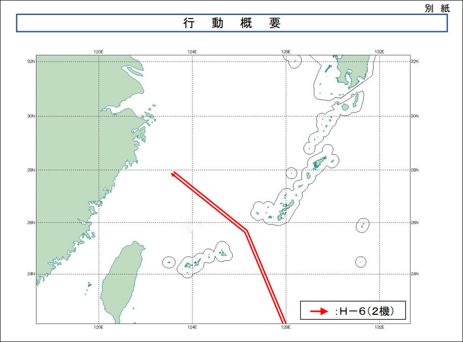
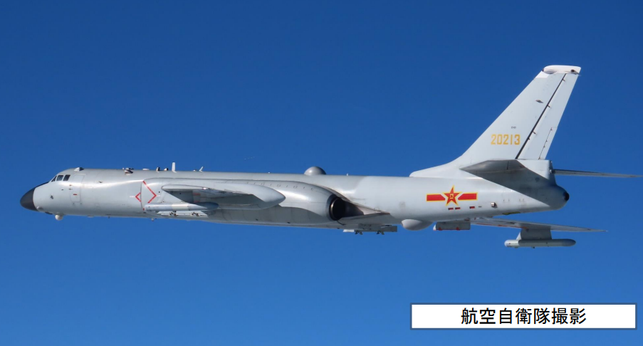
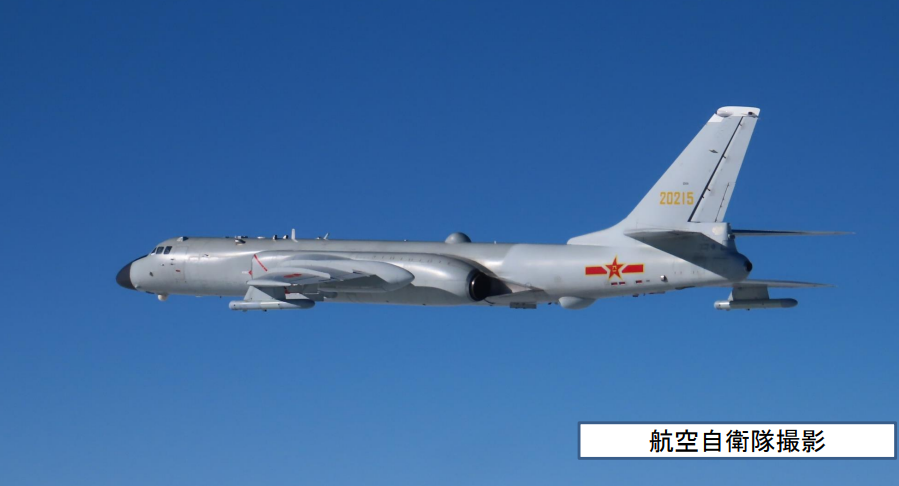

# 日防卫省：解放军两架轰-6轰炸机从东海飞越宫古海峡

（观察者网讯）4月21日，日本防卫省统合幕僚监部发布消息称，解放军2架轰-6轰炸机当天下午从东海飞越宫古海峡上空，向东进入西太平洋。在太平洋完成训练后，这两架轰-6又再次飞越宫古海峡上空回到东海。

统合幕僚监部称，日本航空自卫队西南航空方面队的战斗机紧急出动进行监视。

_日本防卫省公布的解放军两架轰-6轰炸机行动轨迹。图自日本防卫省官网。_

_日本防卫省公布的解放军两架H-6轰炸机。图自日本防卫省官网。_

