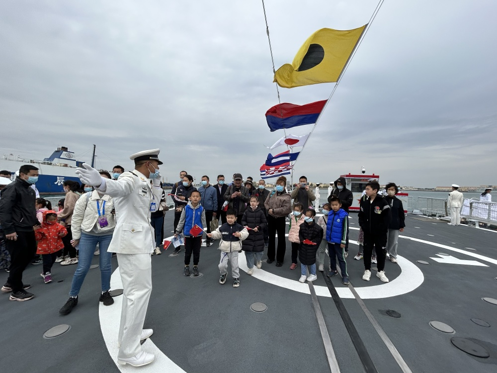
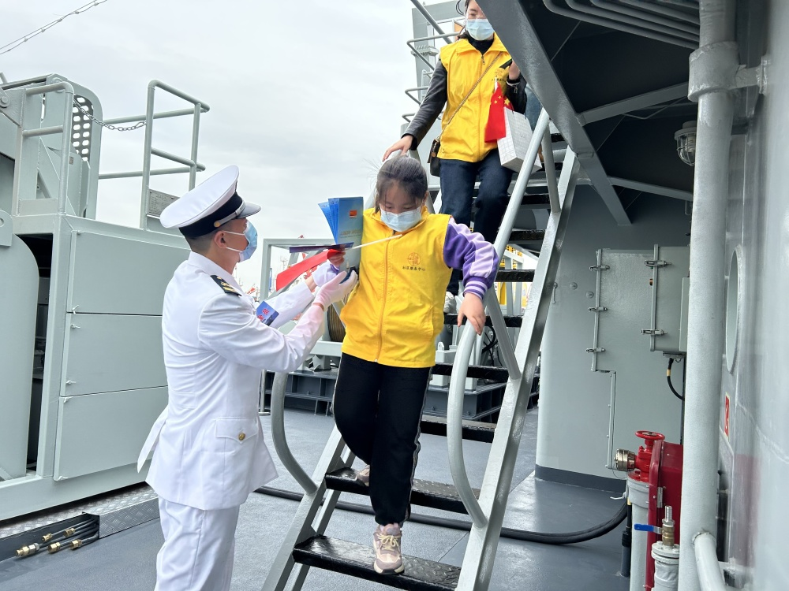
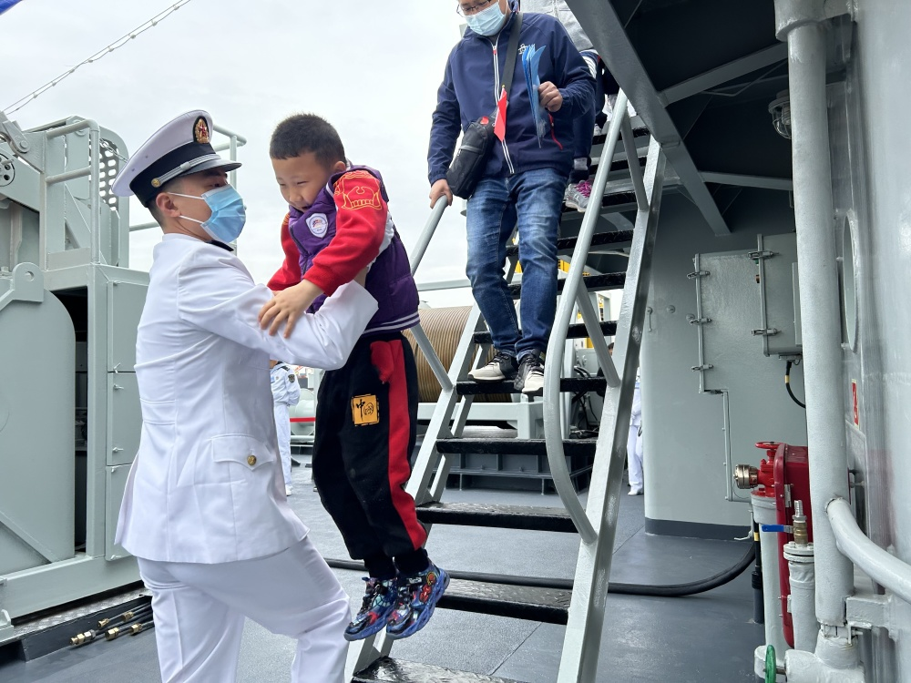
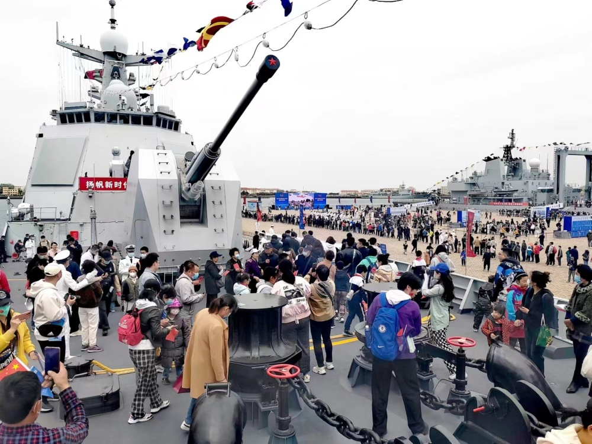
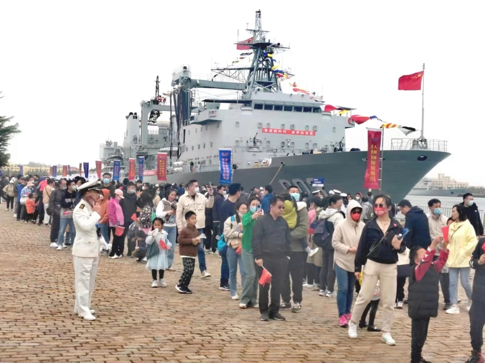
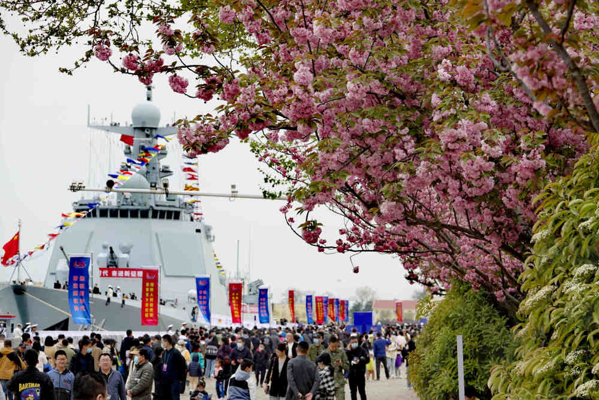
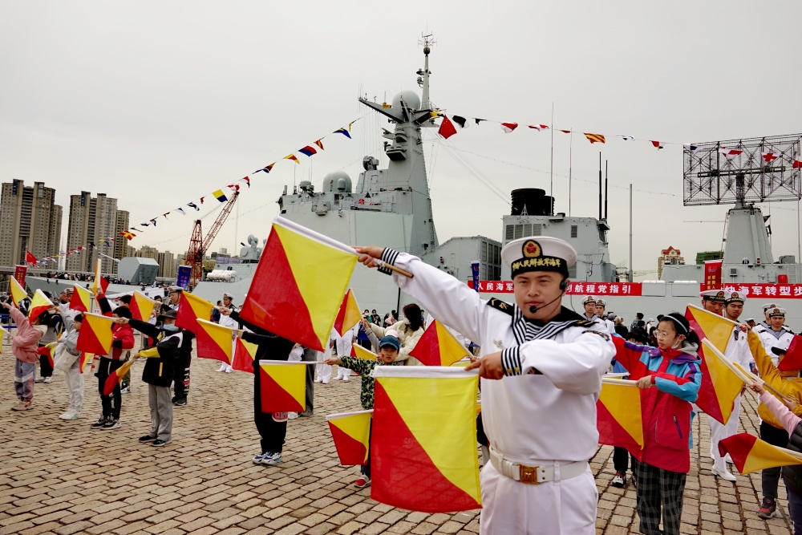

# 时隔数年之后，中国海军现役战斗舰艇再度对公众开放

_图为观众在开封舰参观。（郭媛丹
摄）_

22日，青岛港3号码头，彩旗飘舞，人声鼎沸，时隔数年之后，中国海军最先进的现役战斗舰艇再度对公众开放。一大早持票参观的民众就在码头排队等候，虽然天色阴冷但现场气氛特别火热。在记者采访中，本次青岛港码头展示的三舰一船中开封舰热度最高，这也是该型导弹驱逐舰首次向公众开放。

_洪泽湖船官兵帮助参观小朋友避免发生意外。（郭媛丹
摄）_

_洪泽湖船官兵帮助参观小朋友避免发生意外。（郭媛丹 摄）_

_22日上午开封舰上，临近中午参观人数越来越多。_

_观众排队登舰。（王松岐
摄）_

_青岛港3号码头人头攒动。（王松岐
摄）_

_国际信号兵教小学生学“旗语”。（王松岐
摄）_

