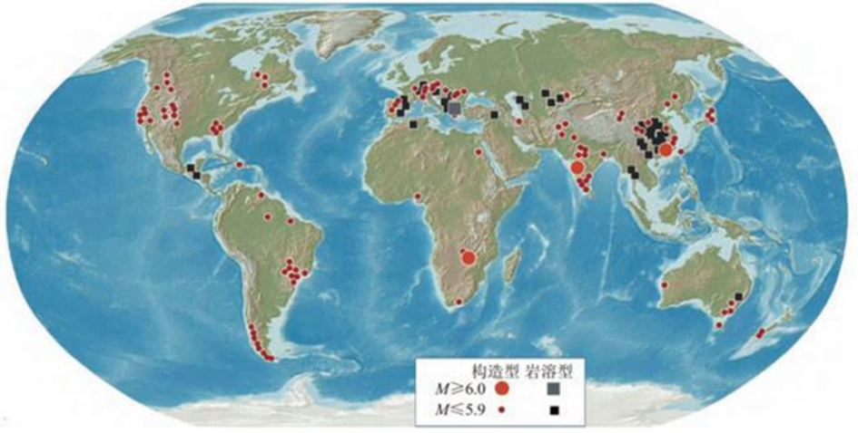
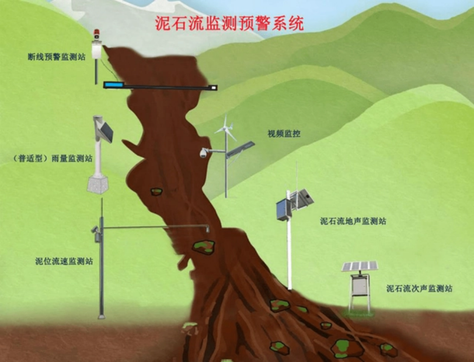
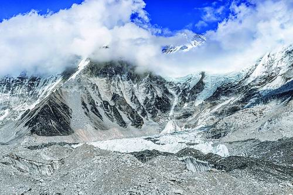
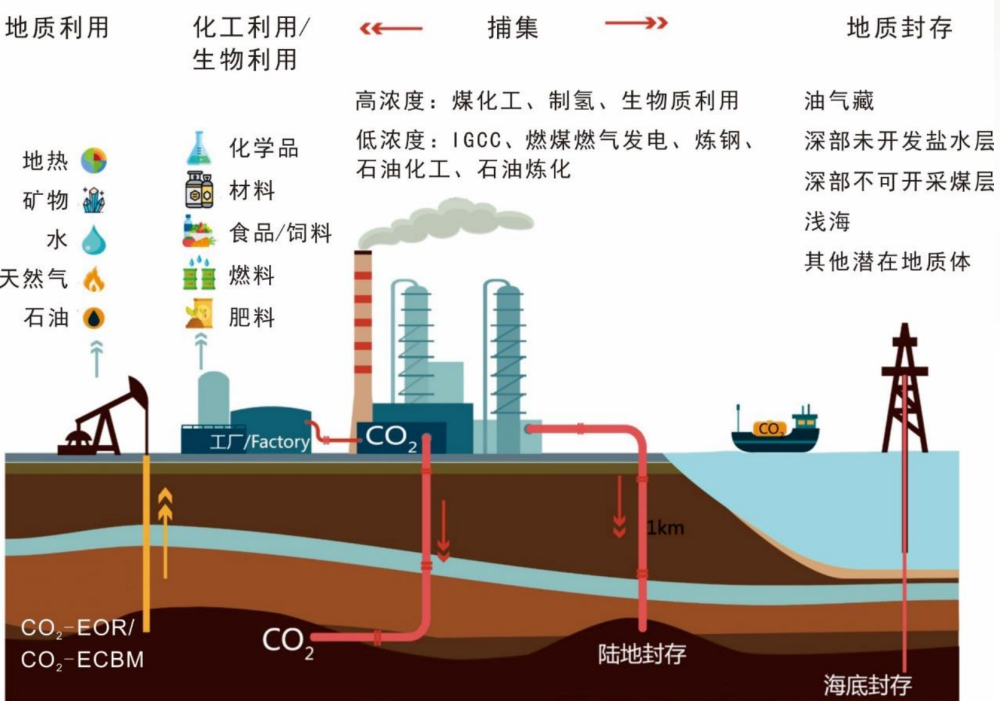

# 极端天气常态化，中国如何应对不断叠加的自然灾害？｜地球呼叫

中国发布的《第四次气候变化国家评估报告》显示：我国是受全球气候变化影响最敏感的区域之一，升温速率高于全球平均。其中一个较为明显的表现就是气候变化加剧。在这种情形下，我国的自然灾害情况会有哪些变化趋势和特征？

4月22日世界地球日，腾讯新闻科学对话中国地质调查局中国自然资源航空物探遥感中心地质灾害调查监测中心主任童立强、中国地震局地震预测研究所研究员陈会忠、中国地质调查局油气资源调查中心战略规划室主任包书景，共同探讨人类应该如何面对不断叠加的自然灾害。

核心要点：

  * _1_ 我国近10万座水库中真正有过水库诱发地震情况的只有47座，且地震强度很小，大家不必过于担心。在建设水库之前也要做好地质活动断层探测，评估地震发生风险，让我们更放心利用水资源来提供清洁能源。
  * _2_ 喜马拉雅山脉与南北两极共同组成地球三极，对全球气候格局和地域分异起到支配作用，它也是垂直地带性、纬度地带性与经度地带性的交叉地域综合体，对中国和周边地区影响很大。
  * _3_ 把CO2（二氧化碳）存放在特定的一种自然或人工“容器”中，利用技术手段长时间与大气隔离封存，可达到控制CO2 的目的，森林、海洋、地层、化学反应器等都可以作为封存CO2的“容器” 。

一、水库诱发地震以及滑坡泥石流，滑坡泥石流如何预防？

**一起来唠科** ：近些年来，围绕河流建立的水电站和大坝工程不断在增多。
**在气候极端变化的情况下，洪灾量级可能也会提升，各种大坝的安全性是否需要重新考量？原本作为防洪的水坝，会不会反倒可能成为潜在的风险来源？可能引发地震吗？**

**陈会忠**
：全国水力发电水库目前约有9~10万座，为我们提供大量清洁能源。若我们坚持大量煤炭石油发电，势必增加空气中二氧化碳浓度，加剧全球变暖。因此，水力等清洁能源非常重要。

**当然，也有人提出“水库地震”问题，确切地说应该叫“水库诱发地震”。今年**
3月8日凌晨，广东省河源市发生4.5级地震，这次地震就由河源的新丰江水库诱发。1962年该大坝完成蓄水后发生过一次6.1级地震，震中烈度达到8度，震源深度小于5km，造成7人死亡、63人受伤，成为世界上为数不多的大于六级的水库地震之一。

**目前认为，水库地震的诱因主要有两个：一是库水自身重力载荷作用，二是库水的下渗作用。**
水库下有断裂，水会顺着裂缝下渗并对断层产生不同应力，改变岩石孔隙形状，进而改变地下岩石结构强度，容易引发地震。
**但我国近10万座水库中真正有过水库诱发地震情况的只有47座，且地震强度很小，大家不必过于担心。**

**当然，我们在建设水库之前也要做好地质活动断层探测，评估地震发生风险，让我们更放心利用水资源来提供清洁能源。**

_全球发生过的水库地震分布（图源：网络）_

**一起来唠科：** 我国是世界上泥石流灾害最严重的国家之一。
**气候极端变化情况下，我国可能加剧泥石流和山体滑坡风险的高发地区有哪些？这些地区有什么特点？滑坡和泥石流的主要危害有哪些？如何预防和应对？**

**陈会忠：**
今年2月内蒙古阿拉善盟发生煤矿事故，内蒙古地震台网完整记录了煤矿开采堆放的废渣下滑造成大滑坡的全过程，发现该滑坡由两次事件组成，第一次滑坡很小，20多秒后的第二次大滑坡滑下来的巨量土方造成大量人员伤亡和设备损失。

**滑坡是由于山体陡峭或滑坡体表面较松软，在重力作用下产生巨大位移；泥石流则是大量降雨泡软了区域内土壤，水流夹杂着石头泥沙流下坡。**
滑坡和泥石流主要集中在我国西南的云贵川藏、西北的陕甘晋和东南的闽鄂湘等地，大量降水、冰雪冻融、地震带来的塌陷和决堤、人类开矿修路等活动，都可能引发滑坡和泥石流。比如人类大量砍伐树木造成水土流失，或树种不合适反而造成土质松软；我国西南和中部南北地震带的地震属于板内地震，是地震活跃地区；我国西南和东部属于东部季风区，夏天降水丰富，这都大大增加重力作用，导致山体松动滑坡。

如何预防滑坡和泥石流？

**第一，要对群众进行科普。**
陡峭山体旁易发生滑坡泥石流，滑坡前会有小崩塌和破裂声以及山体渗水，动物会有异常。遇到滑坡要躲避到高处，往泥石流两边的山坡上跑，不要顺着泥石流方向往沟里跑。

**第二，要对易发泥石流和滑坡地带进行勘探和监测预警。**
这需要我们对危险地区的位移、降雨量、地声、次声、土壤含水率、地下水位、等要素进行实时监测。有异常或突发状况设备自动报警。

_泥石流监测预警系统（图源：网络）_

二、喜马拉雅冰川加速融化，我国能源痛点问题何解？

**一起来唠科：**
2020-2022发生三重拉尼娜现象，使得近三年的升温幅度被一定程度减缓。但随着拉尼娜事件结束，我国今年迎来新一轮的厄尔尼诺事件的可能性增大，遭遇“干旱+高温“热浪的风险也在提高。其中尤其值得关注的，是喜马拉雅山区的冰川加剧融化问题。
**喜马拉雅地区的灾害情况大致如何？它在生态中有着怎样的重要性？它出现的诸如冰川消融等问题，会对中国和周边地区产生怎样的影响？**

**童立强：** 喜马拉雅地区自然灾害种类很多，包括地震、泥石流、雪崩、山洪及气象灾害。

其中，喜马拉雅山地区的泥石流包括三种类型，冰湖溃决型、雨水型和滑坡崩塌型。由于喜马拉雅地区地壳活跃，多发地震，对地表有破坏，切割深、坡度大，常发大规模滑坡。近两年金沙江就堵过两次，对云南影响很大，甚至有将近十米的洪水。

在喜马拉雅地区，冰雹不太常见，但2018年的一次冰封堵塞导致雅鲁藏布江断流三天，对印度平原影响很大。

**喜马拉雅山脉与南北两极共同组成地球三极，对全球气候格局和地域分异起到支配作用，它也是垂直地带性、纬度地带性与经度地带性的交叉地域综合体，是印度恒河源头，对中国和周边地区影响很大。**

近五十年来青藏高原暖湿化显著，增加冰湖溃结等自然灾害的数量和规模。2000年以来就有十次大型灾害，爆发周期和剧烈程度都陡增，并有向西北方向扩展的趋势。

**青藏高原的喜马拉雅山和喀喇昆仑冰川融化问题较严重，根据我们的遥感调查，与2005年相比，青藏高原冰川总体呈退缩趋势，总面积减少约1500平方千米，退缩率约为3.75%，快速消退区主要分布在帕米尔高原等地区，喀喇昆仑东南段冰川面积则明显扩张。**

_位于珠峰登山大本营附近的昆布冰川（图源：科学网）_

此外，青藏高原还由于极端气候和暖湿化出现“涨水”的新问题，青海盐湖等也出现这一现象，不排水湖变成排水湖，水就可能蔓延，一旦地质条件允许即可溃决，会带来大规模灾害。

**一起来唠科：** 去年的“干旱+热浪“，导致不少地区都出现过电力供应问题，西南地区还出现了限电。
**我们有哪些手段可以实现电力资源的不足？我国目前的能源结构如何？我国能源在资源储量和需求之间的矛盾和痛点是什么？在能源使用方面，如何平衡发展与生态？**

**包书景：** 近年来我们的能源需求不断增加，消费还是以煤炭为主，占了58%，其次是石油和天然气
**。在干旱气候水电不足的情况下我们电力紧张，还可以通过光电、交叉火力发电、天然气发电等方式补足电力。**
我国也大力重视核电，在安全基础上进行选址和发展。随着我国能源结构调整和新能源发电途径增加，我国的能源保障能力也会持续提高。

我国能源储备较丰富，有煤炭、石油、天然气和可再生风电、光伏发电等各种能源，但我们也面临一些问题，
**一个是自然界资源开发利用需要时间，一个是我国清洁能源比例有待提高、能源结构需要调整。**
在非常规油气资源领域我们也在加速开发，比如页岩气这种清洁能源在我国蕴藏较丰富，在新疆大概有100多万立方。但由于其很致密，开发难度大，需要我们采取水平和分散压力技术，目前已成功开采一部分。美国企业从上世纪八十年代到今天通过页岩油和页岩气的开发，实现了油气复兴和能源独立，
**我们也可以通过对油气地质条件和开发技术的深入研究，实现页岩油、页岩气、致密油和致密气等的大规模经济开发，提供更多能源保障** 。

_发达经济体新能源发电量占比趋势（图源：网络）_

三、气候在极端化，个人、社会和政府还可以做什么？

**一起来唠科：面对越来越极端化的气候，我们需要提前做哪些适应和准备工作？如何建立完善监控预警系统？在防范风险方面，个人、社会和政府可以做哪些准备？**

**包书景：** 极端气候发生与地球气候周期变化、人类活动排放二氧化碳和甲烷等都有关。基于此，
**我们首先要优化能源结构，改变以煤为主的现状，提高天然气、风电、光伏、核电等清洁能源消费比例**
；还要降低能源消耗，通过碳达峰来控制碳排量。植树造林、增加碳汇也很重要，我们不仅要想办法控制二氧化碳排放量，更要封存或转化它。比如把CO2存放在特定的一种自然或人工“容器”中，利用技术手段长时间与大气隔离封存，
森林、海洋、地层、化学反应器等都可以作为封存CO2的“容器” 。

_碳封存方式（图源：网络）_

而且，在地下采油采气时注入二氧化碳，既提高油气采收率，又减少二氧化碳，减少气候影响；加强煤层气开发，减少甲烷排出对臭氧层的破坏；清洁利用煤炭，开发利用煤制油和煤制气技术。

**至于个人，则要坚持绿色出行，节省能源，骑自行车或多开新能源汽车。**

**陈会忠：** 应对气候变化人人有责，我们不仅要树立保护地球的理念，还要建立对灾害的监测和预警系统。我们要向公众宣传预警系统原理和功能，
**公众在发出警报时可以及时正确应对，不论遇到多大规模灾害的预警都能做到“闻警即动”，** 这样可以避免很多重大损失。

**童立强：** 我国五千年来的暖寒交替变化都是周期性的，
**我认为我们正处于一个寒暖交替变化的阶段，极端天气较多。我们对地球的认识实际上还很浅薄，要提高认识、加强研究。**

此外， **我们要持续重复开展调查监测，定期提出风险防控类型和区域，通过实地核查划定灾害高风险区** ，预测灾害的可能发生时间和危害程度，进行预警。

对于极端天气，我们人类除了可以减排，很多时候是无能为力的。
**那我们就应该尽可能“避”，远离灾害高发地，并抓好预警治理工作。希望大家也能推广支持监测设备的设置和运行，积极主动阻止对预警监测设备的破坏行为，加强全国范围内预警系统的覆盖。**

**嘉宾简介**

整理：王嘉欣

**版权声明：本文系腾讯新闻《一起来唠科》独家稿件，未经授权禁止媒体转载，但欢迎转发至个人朋友圈。**

