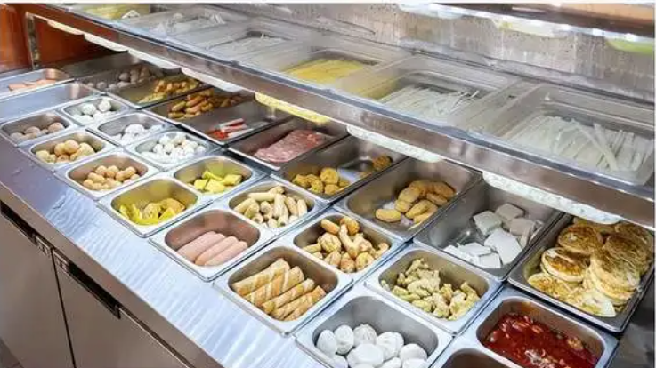
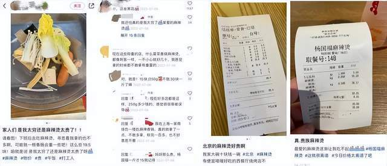
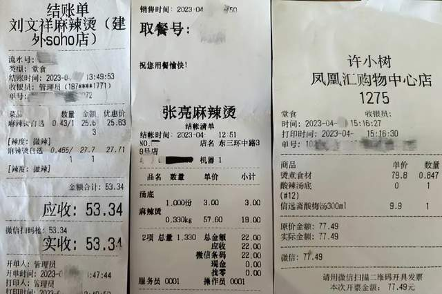
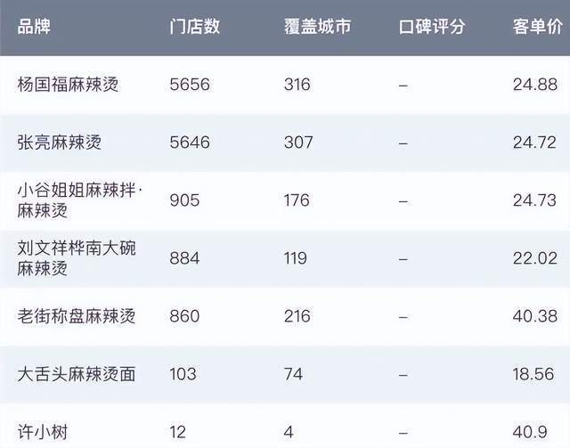

# 现在一顿麻辣烫，吃饱要花70元

“2片牛肉+2、3片肥肠，就要8元。”

许久不吃麻辣烫的阿菲，因为近日“麻辣烫贵”“麻辣烫缺斤短两”等话题频上热搜，便和同事相约来到了单位楼下的麻辣烫·麻辣拌，在切身体验了一把一碗麻辣烫究竟有多贵后，发出了上述感叹。

阿菲表示，难怪现在大家都在嚷嚷，“钱包被麻辣烫刺穿”，确实很容易刺穿。

“我的饭量比较小，那顿饭花了35元左右，和我同行的两位男同事，一碗麻辣烫都花近60元。”

事实上，与阿菲和其同事一样，被麻辣烫价格震惊到的消费者大有人在。

小红书上，ID为“樱桃小丸子”的网友在笔记“家人们，是我太穷还是麻辣烫太贵了”中直言，“下班去吃麻辣烫，拿的不多就要19.5块。”而动辄88元、99元的麻辣烫也并不少见。

_来源/小红书
燃次元截图_

在该网友“晒”出的照片中，燃次元看到，19.5元的麻辣烫，大概有一根香肠、两片娃娃菜、两块面筋、一点金针菇以及两片藕片等。以至于评论区中的网友直言，“这是黑店”“我这饭量估计没有60元吃不饱”。

也有网友指出，“现在这些麻辣烫称重的店，冒菜香锅麻辣烫，都像刺客一样。15元/250g，这不就是30元一斤嘛。”如上述网友所说，燃次元于近日来到了多家称重式麻辣烫门店后发现，“荤素一起称，近30元一斤”似乎已经成了行业标配。

但令网友吐槽的是，麻辣烫不仅贵，还有很多“坑”。

近日，博主“superB太”在视频中直指，“张亮麻辣烫存在缺斤短两现象。一家门店少去皮36克，另外一家店则虚增了82克产品。”尽管张亮麻辣烫对此回应称，“主要由于涉事门店工作人员操作不规范，造成秤重误差，已对上述两门店做出厄令立即整改。”

与此同时，抖音博主“大麦（北漂版）”在视频中提到，因为一次健身后去吃张亮麻辣烫，被价格惊到后，自己带着秤再次来到了该店，没想到，同样的菜品，自己称为0.81斤，店里却称出了1.06斤。

但店里的“小细节”还不止于此。在该博主先后表示“带走-不用打包盒-
要小票”等过程中，同一份麻辣烫，不仅价格发生了改变，从29.9元变为26元，重量也从1.06斤变成了0.97斤。

尽管在去到的7家连锁麻辣烫品牌门店里，燃次元没有遇到如网友所说的菜品“缺斤短两”“前后重量不一致”的情况，但却也有了几个新发现，即“连锁麻辣烫品牌的小票，颇为神秘，要么回收，要么不给”，且“收银台基本不显示重量和价格”。

而越来越贵的麻辣烫背后，或许也寄托着商家对这一街头小吃能走向“高端化”和“品牌化”的希冀，但目前来看，品牌分散的麻辣烫，要实现这一希冀并不容易。

**01**

**吃一顿麻辣烫，需要花多少钱？**

从曾经的6元一份，到现在的60元一碗，麻辣烫的价格可以说早已走在了中式连锁餐饮的前端。

针对消费者的争议，燃次元在一个工作日的中午，先后来到了杨国福麻辣烫建外SOHO店、张亮麻辣烫建外SOHO店、刘文祥麻辣烫炸串国贸店、小谷姐姐麻辣拌·麻辣烫国贸店、大舌头麻辣烫建外SOHO店、老街秤盘麻辣烫东环店，以及许小树麻辣烫凤凰汇店在内的7家不同品牌的连锁麻辣烫店门。

其中，小谷姐姐和老街秤盘因正在进行产品运营上的调整。一位知情人士告诉燃次元，小谷姐姐麻辣拌·麻辣烫国贸店正在重装，“现在在原址上经营的螺蛳粉店，就是之前的小谷姐姐。”

同样正在进行调整的还有老街秤盘麻辣烫东环店，该店的工作人员告诉燃次元，此前售卖的麻辣烫形式现在已经没有了，而且很快门店就改为米粉店了，“但和现在的品牌是同一位老板。”

除这两家门店外，其余5家品牌的麻辣烫门店均处于正常营业的状态。

**尽管5家麻辣烫品牌不同，但售卖形式基本相同，均为“荤素一起混合称重”，且产品单价也大同小异，一斤的价格在30元左右** 。

其中，“最便宜”的是张亮麻辣烫，28.8元/斤，最贵的是许小树麻辣烫，达到了39.9元/斤。其他品牌，刘文祥麻辣烫炸串、大舌头麻辣烫和杨国福麻辣烫的价格分别为29.8元/斤、29.88元/斤和29.9元/斤。

“我是一位资深的麻辣烫爱好者，从杨国福还是6元一份的时候，我就已经开始吃了。到现在，工作餐如果选择在杨国福吃一碗麻辣烫，怎么也需要25-30元左右。”正在杨国福麻辣烫建外SOHO吃午饭的湘彬表示，谈不上便宜，但也不能说特别贵，毕竟很多东西的价格都在上涨，“感觉这已经是吃一碗麻辣烫的均价了，我身边的男同事，基本上都要花费40元左右。”

如湘湘所说，燃次元在杨国福麻辣烫建外SOHO店内观察发现，女性消费者的消费金额大致在25-35元之间，男性相对较高，一般都在30元以上，40元左右的最多，但基本不会超过50元。

_来源/燃次元拍摄_

实际上，50元的价格，还远远不是普通消费者一碗麻辣烫的高价。当日，一位在许小树凤凰汇门店用餐的女性消费者告诉燃次元，自己工作的公司就在凤凰汇的楼上，再加上很爱吃麻辣烫，所以许小树就成为了午餐的高频选择。

“这家麻辣烫品牌比其他麻辣烫品牌还要更贵一些，基本一顿饭都要在60元左右。”说着，该消费者向燃次元展示了她当餐的小票，“烫煮食材0.847kg，67.59元；外加一瓶酸梅汤9.9元，共计消费77.49元。”

除了“贵”，模糊的标价也是消费者吐槽的因素之一。

以杨国福麻辣烫为例，与其他商家明码标价不同，燃次元发现，杨国福麻辣烫并没有在菜品区标明价格。

或许是因为恰逢用餐午高峰，当日店内排队选择菜品的消费者络绎不绝，座位上也几乎坐满了客人。在菜品区大约看了2分钟，并选购了一些东西后，燃次元发现，至少在杨国福麻辣烫建外SOHO门店，并没有菜品的价格。

与此同时，在收银台的秤盘上，虽然有显示已扣除容器的重量0.350kg，但在消费者放上菜品之后，除了显示菜品总重外，并不显示单价和总金额。不仅如此，售卖麻辣烫的杨国福，在免费小料区并不提供麻酱，如需麻酱，需额外付费。

带着好奇心，燃次元把选好的菜品递给了收银员。随后，收银员把小票递给了燃次元，重量0.422/kg的菜品共计25.15元，实收25.10元，总体消费金额基本符合预期。

随后在取餐时，尽管小票被作为取餐凭证收回，但能主动提供小票，也实属不易。毕竟在随后来到的张亮麻辣烫、刘文祥麻辣烫门店和许小树门店里，只有许小树提供了小票。另外两家的收银员在给菜品称重之后，完全没有丝毫主动提供小票的意思。

当然，三家还是有相同之处的， **即消费者在前台结算时，称重台均不显示重量和价格** 。

不过，更为让燃次元意外的是， **几乎没有任何一位消费者对菜品的价格提出质疑，也不会认为不给小票会出差错** 。

一位在刘文祥麻辣烫用餐的女生告诉燃次元， **自己吃麻辣烫时，从不会主动要小票，甚至都不会问价格，“称重之后，就直接扫码支付了** 。”

**02**

**成本上涨是主因？**

对于麻辣烫“越来越贵”的讨论，在行业里摸爬滚打了数年的萧萧有不同的看法。

萧萧是一位独立麻辣烫门店经营者，在他看来， **连锁门店价格上涨是一种很正常的现象**
，“事实上，以单价计算，贵的不只有上述连锁品牌按斤称的麻辣烫，像我们这种串串形式的麻辣烫，其实价格也并不便宜，经常有男性顾客在我的店里，一顿饭消费六七十元。”

不仅如此，这个行业还没有统一的标准。萧萧举例道，“以一个鱼籽福袋为例，我的店里卖4元钱一个，但离我十几公里的县城中，有的卖6元一个，还有的卖8元一个，但实际上，没有人能够说明它到底值多少钱。”

“ **但不能只看到前端价格的上涨，而忽视整个产业链或者原材料成本的涨价**
。尤其是疫情这3年，房租成本、人工成本、原材料成本都在涨。即便是去年解封以后，其实这个价格也并没有回落，而今年这种涨价的趋势也在持续。”

萧萧补充道，“ **季节也会影响麻辣烫的成本** ，比如一些麻辣烫专用的菠菜、油菜等，多会因季节不同而导致价格不同。”

“首先就是，在原材料成本较高的冬天，门店会随着成本上涨而提高产品价格。但到了原材料成本回落的季节，基本上没有门店会跟着降价；其次，像木耳类、土豆片、面筋等品类，这种生物它本身吸水性就强，长时间在水里泡着，重量毋庸置疑会高很多。”

当然，网友也并非没有关注到这一点。知乎上，网友在帖子“麻辣烫论斤卖，荤素一个价的情况下，吃什么最划算？”中提到，“去那里吃荤菜其实是个陷阱。首先荤菜是加工肉类，本就廉价；其次是冷冻批发，水分很大。”

萧萧表示，实际上，称重形式的麻辣烫也是在最近几年才开始兴起的。以杨国福为例，它诞生最初是按份来做麻辣烫的，“最开始我记得是6元钱一份，后来涨到8元，再之后慢慢改成了称重。”

“对于门店来说，尤其是连锁门店，称重最大的好处可能就是模式简单，节省了很高的人力成本。”萧萧补充道，因为门店工作人员只需要把菜洗好，放那就可以了。但串串的不一样，所有的菜品都需要串，这是一个看似简单，但及其浪费时间的工作。

_图/杨国福建外SOHO店
来源/燃次元拍摄_

在萧萧看来，还有一个很关键的点，就是消费者的购买力越来越趋于理性，“我经常去进货的时候就可以很直观地感觉到，今年消费者的购买力普遍在下降，但物价却与之呈相反的状态。这就会让消费者更加直观地认为麻辣烫涨价太快。”

萧萧补充表示， **或许正是因为这些隐性的、不够透明的因素，才让越来越多的消费者觉得，“麻辣烫贵得离谱** 。”

**03**

**品牌分散，高端很难**

实际上，在一些业内人士看来，麻辣烫越来越贵的背后，或许也暗藏着商家对这一街头小吃也能走向“品牌化”，甚至“高端化”的希冀。尽管从目前来看，并不容易。

中国食品产业分析师朱丹蓬就明确表示，尽管国内麻辣烫行业发展速度很快，但依旧处于较为低端的运营阶段，这或许也是行业问题不断的主要原因。

“ **国内麻辣烫行业已经有着超过20年的发展历史，但目前来看，整个麻辣烫还是处于缺乏规范化、专业化、品牌化、资本化以及规模化的运营阶段** 。”

朱丹蓬补充道，不管是张亮也好，还是杨国福也罢，它们确实已经拥有了数千家门店，在国内也被成为“双龙头格局”。但事实上，他们在整个麻辣烫市场里面占比其实很小，整个市场还是呈现出非常分散的一个现状。

浙商证券研究所《麻辣烫第一股，高速扩张掘金2B供应链》报告指出，麻辣烫隶属于中式快餐赛道，按商品交易总额之和计算，中国麻辣烫市场由2016年968亿元增加至2019年1306亿元，CAGR（年复合增长率）为10.5%。受疫情影响，2020年市场规模缩减至1142亿元，同比下降12.5%。预计2025年市场规模将达到1973亿元，2020-2025年中国麻辣烫市场CAGR为11.5%。

上述报告还指出，中国麻辣烫市场集中度高于中式快餐整体，但仍然高度分散，按商品交易总额计算，2020年CR5市占率仅为10.2%，CR2为8.3%。杨国福市占率为4.3%，排名第一，张亮麻辣烫紧随其后。“杨张”之外的麻辣烫连锁品牌众多，但餐厅数量均不足1000家，规模差距明显。

另一组来自窄门的数据显示，目前我国共有490个麻辣烫品牌。在上述燃次元提到的7个麻辣烫品牌中，以门店数量排名，截至4月13日，杨国福麻辣烫、张亮麻辣烫、小谷姐姐麻辣拌·麻辣烫、刘文祥桦南大碗麻辣烫和老街秤盘麻辣烫分别以5656家、5646家、905家、884家和860家门店的数量，位居国内麻辣烫品牌前五名。

大舌头麻辣烫面和许小树的门店数量则少了许多，分别仅为103家和12家。

_来源/窄门数据_

很显然，品牌也看到了现阶段国内麻辣烫市场的巨大潜力，以至于2019年还在对标海底捞的杨国福，到了2021年，就把目光投向了星巴克。

杨国福麻辣烫创始人杨国福曾公开表示，“ **如今麻辣烫在一线城市的价格大约在30元以上，已经相当于一杯咖啡，但星巴克的品牌更为高端**
。”并提到，“希望杨国福形成自己的品牌文化，让消费者吃到麻辣烫也能有荣耀的感觉”。

“但在此之前，不管是老品牌还是新品牌，首要解决的，应该当下麻辣烫行业存在的弊端，比如食品安全、服务意识等。”朱丹蓬直言。

如朱丹蓬所说，食品安全问题一直是麻辣烫品牌难以解决的顽疾。

4月17日，#北京多家网红餐厅有食品安全问题#引发消费者关注。根据话题内容，2023年，北京市、区市场监管局继续在全市范围内对连锁餐厅、“网红”餐厅、美食城等餐饮企业开展食品安全大检查。

在2023年1月以来发布的通报统计存在食品安全问题的连锁餐饮门店数量中，小谷姐姐、张亮麻辣烫、杨国福麻辣烫均“榜上有名”，数量分别为4家、4家和2家。

“除此之外，门店的运营能力、服务能力以及客户黏性等多方面，也都有待提高。”朱丹蓬进一步强调，现阶段，加盟模式的连锁门店管控较弱，只保证供应链的完整性显然还不具备太多的竞争力。

朱丹蓬也表示，整体来看，我国麻辣烫市场尽管现在还处于低端运营的节点，但其以新生代为核心的消费群体的崛起，恰好给了品牌更大、更多的想象空间，市场潜力以及发展前景还是具备的。

燃次元（ID:chaintruth）原创

作者｜曹杨

编辑｜饶霞飞

参考资料：

《杨国福非“福”：数年间吞噬上万名加盟创业者》，来源：桔红潇湘。

*题图及部分内文配图来源于视觉中国。

*文中阿菲、湘彬为化名。

*免责声明：在任何情况下，本文中的信息或所表述的意见，均不构成对任何人的投资建议。

