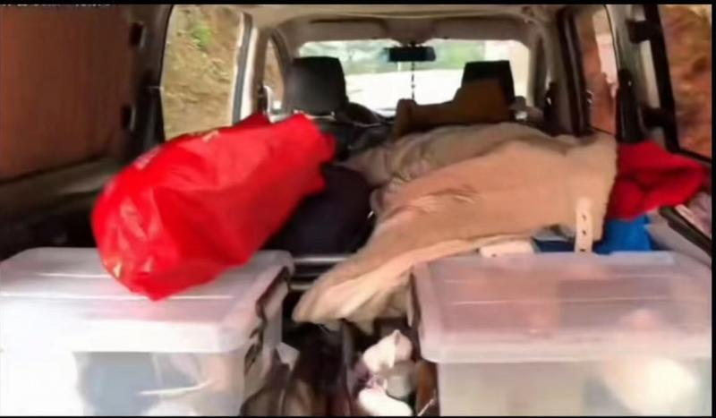
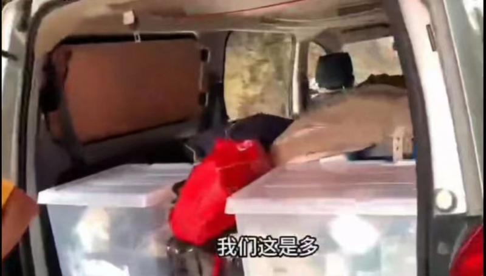
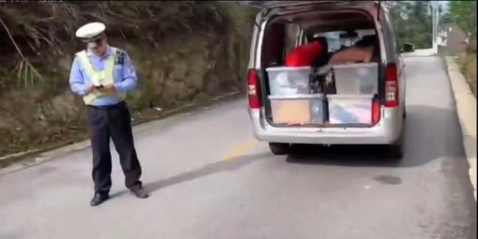

# 网友贵州自驾游被查，因车内装有生活用品被交警认定“人货混装”

近日，有网友自驾游携带大量日用品在贵州剑河县被交警以人货混装为由拦下，视频被传到网上后引发关注。

4月22日，剑河县交警大队工作人员告诉北京青年报记者，已关注到该视频，视频中的车确实属于人货混装，载客汽车除了后备箱和车顶的行李架，其他地方不得载货，但交警采取人性化执法，对其进行了批评教育，未进行处罚。

视频显示，被查驾驶员情绪激动，称车上主要是他们的洗漱用品、衣服、日常用品，而且他们完全没对车上的座位进行改装，只是把座椅靠背放倒了。该驾驶员质疑，“东西放在座位上，放得少的就不是人货混装，他说我们放得多，放得再多，都是我们自己的东西。”

该驾驶员表示，有其他车辆也在后座上放了物品，“别人座位上有东西他不管，我们座位上有东西就管，这是为什么？”现场执勤人员说，另一台车的后座上只是一点随身物品，而该驾驶员后排座位的位置都被堆满了物品，这属于人货混装。该驾驶员及伴侣表示不解，认为他们携带的东西不是用于卖的，不算货，也觉得人货混装的认定就看东西的多少难以服人。

随后，另一穿制服的工作人员到现场解释称，交警上路查车是为了大家的安全，按照规定，该驾驶员车上的货有点多，里面没什么危险物品，都是生活用品，不需要处罚，但要注意安全。随后，执勤人员交还该驾驶员的证件。

4月22日，剑河县交警大队工作人员告诉北青报记者，已关注到该视频，已经向当事人出示相关法律规定并作出解释，当事人也表示理解。

该工作人员解释，视频中车辆的情况确实属于人货混装，法律条文中的“货”就是货物、物品，并非用于出售的才叫货，按照《道路交通安全法实施条例》规定，载客汽车除了后备箱和车顶的行李架，其他地方不得载货，也就是不能放置物品。但实际生活中，不少人会在座位上放置随身物品，例如包包，这种情况一般不属于人货混装，但对于放置随身物品多少属于人货混装，法律条文的规定未详细明确。如果认定人货混装，按照相关法律规定，需对当事驾驶人进行罚款，但对于视频中的驾驶员，交警采取柔性执法，也就是人性化执法，主要以批评教育为主，未进行处罚。

该工作人员提醒，人货混装存在安全隐患，尤其是在车内装了金属制品，在车辆发生碰撞时可能刺穿座椅，出于安全考虑，私家车拉货不建议在后排座位放东西。

文/北京青年报记者 戴幼卿

