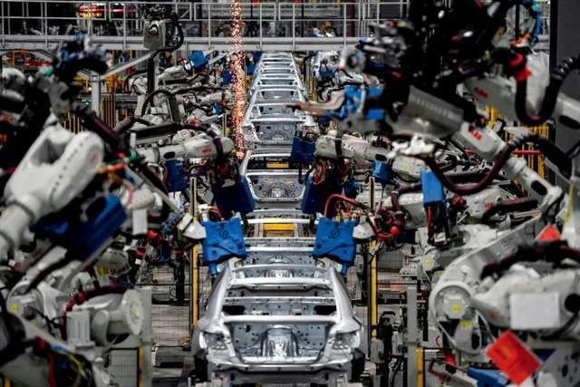
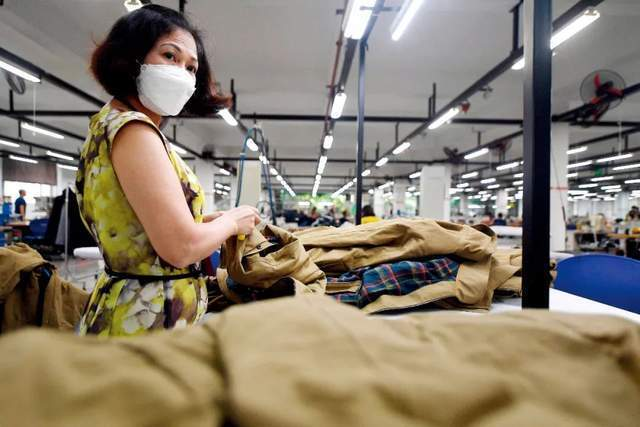
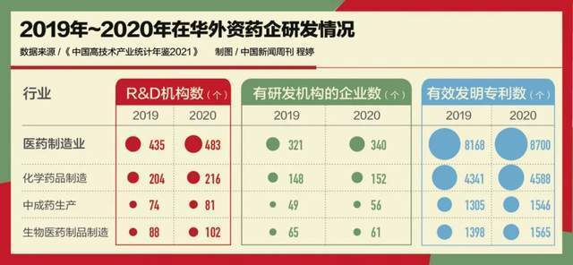
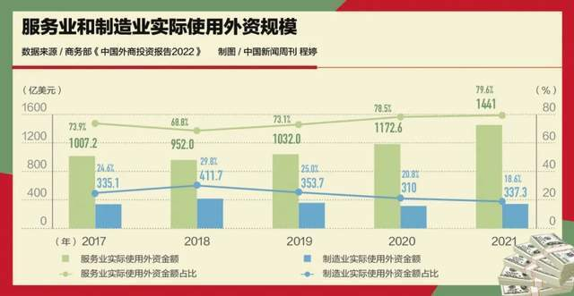

# 苹果手机印度造，可能没那么简单

美中贸易全国委员会会长克雷格·艾伦发现，疫情结束后，外资企业CEO们非常积极地关注着中国市场，但视角发生了改变，“包括美国、欧洲、日本的CEO们，都在努力说服他们的董事会增加在华投资。”

这与疫情三年期间的情况截然不同。“他们以为在中国投资存在风险，而未来回报率有可能会降低，三年疫情让很多高管无法到访中国，没办法到中国看望他们的员工、访问相关客户，这进一步恶化了董事会（对在华投资）的看法。”克雷格·艾伦在3月25日举办的中国发展高层论坛2023年年会上表示。

另据中国美国商会发布的《中国商务环境调查报告》，尽管约74％的受访企业承诺继续深耕中国市场，但自新冠疫情以来，正在考虑或已经开始将生产和采购等环节转移至中国境外的企业数量首次增加了10个百分点。调查显示，近六成受访企业表示，风险管理和严格的疫情防控措施是其公司考虑转移产能的主要因素。

面对诸多挑战，外资企业仍表现出了增长韧性。据商务部统计数据分析，中国引资规模再创历史新高，在2021年两位数增长的基础上，2022年吸收外资继续保持稳定增长，实际使用外资首次超过1.2万亿元，按可比口径同比增长6.3％。以美元计达到了1891.3亿美元，增长8％，引资规模依然保持世界前列。

“大多数外资企业表示中国仍是他们供应链的重要组成部分，他们大多数人喜欢在这里工作。”中国美国商会总裁何迈可告诉《中国新闻周刊》，正在或准备拥抱新市场的公司是什么类型、转移了哪些产能或部门、他们为什么离开，既有共性原因，也有企业自身的考虑，不能一概而论。

**“孔雀东南飞”，未必是坏事**

中印越电子协会（CMA）秘书长杨述成近期刚带领一支120人组成的商务考察团结束在越南的走访，团队全员为中资企业，来自电子、手机、汽车、储能、光伏等多个行业，甚至还有一部分想赴越考察的企业主因为满员而未能成行。

“很多行业企业出海早已开始，并非疫情后才有的现象。”杨述成以智能手机为例介绍说，大多品牌从2015年前后出海，因为国内智能手机市场已趋于饱和状态，而产品端又没有革命性技术出现，不能刺激新的消费需求，因此要到海外寻找新的市场。相比之下，在中国运营的外资企业在其他国家进行市场布局的时间更早、生产更具规模性。

_越南海防市一家企业内的电动汽车生产线。图/视觉中国_

早在2012年10月，三星集团会长李健熙曾访问越南，推动“越南第二工厂”的投资项目。三星电子一位公司高管曾在媒体上透露，在越南建厂的最大考虑因素是“成本”，当时中国的人工费用上涨，价格竞争力下降，而“新工厂设在越南北部的农业大省太原省，不仅与越南主要大城市交通方便，而且劳动力充足，能够降低人力成本。”

截至目前，三星在越南投资了约180亿美元，拥有6家工厂，其中2家专注于智能手机的制造，产品用于供应北美和欧洲市场。2021年，越南产的三星手机占该公司总产能60％，虽然近年来三星一再削减越南智能手机产量，但据越南政府人士消息，2023年越南三星工厂的智能手机产能占比仍在40％。

与此同时，三星在中国的工厂接连关闭。2019年9月底，三星宣布暂停在中国最后一座手机工厂的生产，这家位于广东惠州的工厂成立于1992年，曾是三星全球最大的手机生产基地。随后，2020年8月，三星关闭了在中国的最后一家电脑工厂，2020年11月底，三星又关闭了在天津的电视工厂，这是三星在中国的唯一一座电视工厂。

苹果也在开展在中国以外市场的布局。先是于2020年将部分Airpods的生产线从中国迁移至越南，去年6月，又将平板电脑“iPad”的部分生产由中国转移到越南。另据路透社报道，苹果将在“全球第二大智能手机市场”印度生产iPhone
14。摩根大通分析师预计，到2025年，中国境外生产的苹果产品占比将提升至25％，这些产品包括Mac、iPad、Apple Watch和AirPods。

“中资企业到海外建厂更多是为了提升国际竞争力，而大多数外资企业将部分产能转移到中国以外地区的目的明显不同。”杨述成分析说，这些跨国公司大多将海外市场作为生产跳板，以便将产品出口到欧美日韩等国家。

继佳能去年关闭部分中国产线之后，另一家相机大厂索尼也将大部分相机产线迁至泰国。据日本媒体报道，此前索尼从中国和泰国的2个基地向全球出口，但以后中国工厂将仅生产面向中国市场的产品，在日美欧等中国以外销售的相机几乎全部转为在泰国工厂生产。

“最近一段时期，一些产业看上去有‘孔雀东南飞’的迹象，转移到了东南亚等地区，这里面有多重因素。”在中国发展高层论坛2023年年会上，重庆市原市长黄奇帆分析说，一是美国对华搞贸易战，到现在为止，加征的关税绝大多数仍未取消，很多原来“在中国、为美国”的产业出现了一定程度的转移，转移到东南亚去了，目的是为了取得原产地认证，规避关税壁垒。二是东南亚一些国家的综合要素成本短期内的确有一定比较优势。这些年来中国的土地成本、劳动力成本的确有所上升，这是事实。三是东南亚一些国家如越南加入了不少自由贸易协定，自己也采取了很多力度比中国还大的税收优惠措施。四是《区域全面经济伙伴关系协定》（RCEP）生效后，利用原产地累加规则，一些企业即使搬到东南亚了，也可以免关税进入中国内地市场，即实现“在东南亚、为中国”。

除了电子行业，不少鞋服品牌也在转向东南亚市场。2010年之后，越南逐渐取代中国成为阿迪达斯、耐克等运动品牌的鞋类最大生产地，到2020年，越南生产了阿迪达斯四成的鞋子，耐克一半以上鞋类产品来自越南。

_越南河内市的一家运动品牌服装工厂。图/视觉中国_

“从长远来看，这种现象未必是坏事。”黄奇帆分析，一是转移出去的不少产业是中国自己的民营企业，出于规避关税壁垒的考虑，适当调整布局，无可厚非。二是目前转移出去的企业多以服装鞋帽等对关税壁垒比较敏感的低附加值产品为主，虽有一些电子元器件，多以装配组装为主，这也是适应东南亚国家所处发展阶段所需要的。而对中国主力出口的机电产品等具有一定科技含量的产品，关税壁垒不会形成大的影响。这几年对美出口不降反升就是例证。

三星在关闭惠州手机工厂时发表的一份声明也验证了上述分析。三星表示，其在华产业布局已经转型为符合中国政府指导方向的高端制造产业，（到2020年）前6年在华高端产业持续投资，金额超200亿美元，远高于产业调整的金额，以后也将持续在华进行高端产业的投资。现实中，三星在大量关闭低端制造工厂的同时，陆续在苏州、西安和天津等地部署半导体生产工厂，聚焦高科技领域。

“中国电子手机产业链并没有所谓的转移到海外。”杨述成也表示，走遍印度、越南等亚洲国家所看到的，还是中国的一些低端制造的外溢，高技术含量企业或独角兽基本都在国内，并未到海外投资建厂。

黄奇帆在分析产业转移现象时还表示，随着东南亚这些国家经济增长，本地的需求也会驱动“销地产”的基本逻辑，即“在东南亚、为东南亚”，所以一些跨国公司在东南亚开展布局，也是合理的，自然也会带动原来在中国的配套企业跟着走出去。

他还分析，RCEP产业转移的目的地基本上是RCEP成员国。随着RCEP的实施，中国与RCEP国家将形成日益紧密的产业链供应链联系，将来会出现“在中国，为中国”“在中国，为RCEP”“在RCEP，为中国”“在RCEP，为全球”等多种产销模式。那个时候，中国大市场叠加RCEP大市场、中国的双循环叠加RCEP大循环将深刻改变世界产业链供应链版图。

“中国自2001年加入世贸到现在，对全球价值链的构建起到了核心作用。”彼得森国际经济研究所高级研究员、美国对外关系理事会成员尼古拉斯·拉迪分析说，在美企业无论是服务国内市场还是出口，都依赖于中国的一系列中间品供应、要素供应，所以还不能印证所谓的“全球价值链重构”的故事，“有的时候问题的严重程度可能会被夸大。”
尼古拉斯·拉迪说。

**“为了增强企业供应链韧性”**

去年第四季度初，中国美国商会和普华永道合作，征询了上百家在华美国企业的经营意见，55％的会员单位将票投给了“疫情防控措施”，认为这是2023年美国企业在中国市场面临的第二大挑战，仅次于“日益紧张的中美关系”。尽管防控政策在去年末已经调整。

“到现在为止，来中国的航班、签证依旧没有完全恢复，并且，很多企业在过去三年都经历了供应链风险难关。”中国美国商会总裁何迈可举例说，过去很多美国企业的关键零部件只从中国进口，甚至只由中国的一家企业供应，但因防控需要，供应链不得不中断，那么这家海外企业就只能停产，甚至面临更大的经营风险。

“这些海外企业只是不想再仅仅依赖于一个公司、一个国家或一个地区，那太冒险了。”何迈可说，大多数美商仍会继续保留在华业务，但他们可能同时在考虑增加其他国家或地区的投资，或是寻找新的供应商，让供应链多元化。

美国企业在经营上的另一个变化是“增加库存”，尽管这样增加了生产成本。何迈克介绍说，一些企业因担心再次出现供应风险，宁可提前从中国发货运到美国存储，来确保生产安全。

“全球价值链的空间布局产生了显著变化。”对外经济贸易大学校长赵忠秀在中国发展高层论坛2023年年会上介绍。横向对比，全球价值链趋于区域化、本土化。以美国、日本、欧盟为代表的发达国家和地区展现出强烈的本土化诉求，试图通过推进再工业化解决国内产业空心化困境，降低在突发冲击时对其他国家过度依赖导致的断供风险。

而从纵向看，全球价值链正趋于短链化。赵忠秀表示，发达国家力主“产业回流”，对全球价值链缩短形成了一定影响，同时，新冠疫情的波及面更广、持续时间更长，对更长链条、更多环节的传统价值链分工体系的冲击更加严重和持久。为此，跨国公司逐步收缩全球价值链以保障其供应链安全稳定。

“防疫措施会对一个地区企业的运作和生产造成冲击，而这个冲击会沿着全球价值链像多米诺骨牌一样进行上下游传递，使这个冲击被扩大化。”日本国立政策研究大学院大学教授、对外经济贸易大学全球价值链研究院海外学术院长邢予青表示。他和团队的最新研究成果显示，为避免上述冲击，全球价值链正面临重组，从“传统的以纯粹的经济效益为目标变成多目标发展”，“因为需要考虑到价值链的韧性，即能够抵御自然灾害或者类似新冠病毒这样的灾难的能力。”邢予青说。

“在疫情大流行和地缘政治的多重压力下，跨国公司不得不通过供应来源的适当多元化以及增加库存来增强其供应链的韧性。”商务部原副部长、世界贸易组织前副总干事易小准总结说，但他更担心的是，“少数主要发达国家将经贸问题政治化和泛安全化，他们正在毫不掩饰地推出贸易保护主义措施。”

“其中最具代表性的，就是动用行政手段强推科技产业‘脱钩断链’、胁迫制造业的产业回流和‘友岸外包’，号召盟友打造以意识形态和共同价值观为基础的供应链。”易小准在中国发展高层论坛2023年年会表示，这些违背市场经济规律的逆全球化举措，只会使发达国家失去经济全球化为其提供的低成本、高效率和技术创新的红利，加剧全球性的通货膨胀，却不会保证其供应链的安全。

事实上，许多国家政府和企业已经开始了产业链重构。早在2020年4月，日本政府就推出了“日本企业的供应链改革”。邢予青在中国发展高层论坛2023年年会上介绍说，截至目前，日本负责产业回流工作的经济产业省已经批准了418个项目，日本的贸促会负责产业向东南亚的分布，同一时期日本贸促会批准了103个项目，每个项目的补贴高达50亿日元。

2023年4月11日，观众与日本参展企业工作人员沟通。第三届中国国际消费品博览会除中国外，有日本、韩国、澳大利亚、泰国等10个《区域全面经济伙伴关系协定》（RCEP）成员国的企业积极参与。图/新华

美国去年通过了《芯片与科学法案》，强调强化美国半导体产业供应链安全和维护国家安全，为美国本土半导体制造和其他相关前沿领域的科研活动提供了巨额财政拨款，以及税收抵免等产业优惠举措。

以美资企业为例，《中国商务环境调查报告》显示，亚洲发展中国家和地区、美国是目前两大目标迁移地。另外，与中资企业在墨西哥市场落地寻求开拓北美市场机会呈现出反向趋势，美资企业迁移到墨西哥、加拿大的会员占比从2021年的17％下降到2022年12％，不同的是，有30％的会员企业考虑将产能迁回美国本土，提高了6个百分点。

WTO总干事奥孔乔-伊韦阿拉曾指出，“贸易保护主义、供应链脱钩和治理的碎片化具有极大破坏性，将会带来非常大的代价。”

“当前世界经济所面临的通胀压力已经太高，无论是推动供应链近岸化、友岸化还是产业回流，都将进一步推高已经难以承受的通货膨胀率，使濒临衰退的世界经济雪上加霜。”易小准认为，面对当前各种全球性的危机，各国应当摒弃零和思维，回到多边合作的正确轨道，共同维护一个相互依存、高效和稳定的全球供应链。

**更激烈的国际招商竞争**

一贯以农业著称的越南北江省在今年前两个月完成了7.919亿美元注册投资总额，在吸引外资方面，北江省领先越南全国，占越南注册投资总额近一半，同比增加9.7倍。

越南计划投资部官网显示，2023年前三个月，有67个国家和地区在越南投资，新加坡和中国排在前两名。以北江省为例，前两个月的投资总额中，仅新加坡富联精密科技厂和来自中国的产能为3500兆瓦/年的太阳能电池板厂这2个外商直接投资（FDI）项目，总注册资本已达约7.61亿美元。

越南《人民报》报道称，越南多地发挥基础设施体系优势，着力改善营商投资环境和实施有选择性地引进外资的战略。以海防市为例，各经济区和工业区的FDI项目投资总额近210亿美元，其中一半以上投资于电子产品、手机、计算机制造等高科技领域，22.3％投资于汽车、摩托车、机械设备、工具及零配件制造，将近10％的投资用于物流、基础设施业务。LG、和硕、环旭电子、普利司通等许多世界龙头企业赴海防市投资后，在供应链上吸引了更多卫星项目，形成产业集群，如LG在长裔工业区的生产基地。

“很多中资企业到越南考察后，感觉当地产业链基础还比较薄弱，但受越南招商政策吸引，随着更多外资企业到来，如手机产业链很可能未来在3~5年得以完善。”杨述成预测说。

越南去年批准了《2021-2030年外国投资合作国家战略》，旨在增加来自亚洲、欧洲和美国的外国投资资本份额，为提高外商投资合作效率，该战略提出了“发展配套产业”等九项具体解决方案。

“亚洲发展中国家在放宽外国投资方面最为活跃。”联合国贸易和发展会议（UNCTD）最新发布的《2022年世界投资报告》指出，发展中国家继续采取放宽、促进或便利投资的政策，如精简行政程序，实施或完善投资激励机制、促进外国直接投资的法律和体制改革等措施。

UNCTD报告数据显示，2021年，全球各国采取的有利于投资的55项政策措施中，有48项由发展中国家提出，突出表明吸引外资仍是发展中国家经济复苏战略的一个关键因素。

另据中国商务部官网发布的《2020年世界主要经济体外商投资政策变化与影响分析》，在中东地区，总体上各国对于外商直接投资均持欢迎态度；印度在投资政策上除了对中国严加控制外，对外商投资总体上持开放态度，宣布将努力打造一个投资环境友好的目的地。2020年4月到8月，印度FDI同比增长16％，至271亿美元。

相反，发达国家对外资审查日趋严格。据UNCTD统计，基于国家安全原因进行外资审查的发达国家总数已高达36个。但招商引资仍是其重要工作，美国商务部主办的国家级投资促进活动“选择美国”（Select
USA）2023年投资峰会将于5月初在马里兰州举办。该峰会于2011年创办，致力于促进对美商业直接投资。美国政府罗列的投资美国的优势包含了：美国是世界上最具有吸引力的消费者市场、每年18万亿美元的GDP、3.2亿人口的市场、与20多个国家签订了自由贸易协议、透明公平稳定的商业环境等。

“过去三年，东南亚各国、印度，包括美国都一直在对外资企业进行持续招引。现在中国的疫情防控政策改变，外资企业会增加在华投资吗？企业也在考虑。”何迈可说，发展中国家有成本优势，而发达国家本就具备相对完善的法律制度、知识产权保护体系和投资奖励政策等基础，在招商引资政策的加持下，一定程度上加剧了跨国企业的投资流动。

**“归根结底，**

**企业需要公平公正的市场环境”**

3月28日，商务部部长王文涛会见了荷兰阿斯麦公司全球总裁温宁克，强调中国坚定不移推进高水平开放，愿为包括阿斯麦公司在内的跨国公司来华发展创造良好营商环境，并提供高效服务。

“中国庞大的消费市场对广泛的公司具有持续的吸引力，不论是汽车、飞机，还是咖啡、巧克力。”何迈可介绍说，“多数的商会会员企业仍将中国视为首选市场。”

“归根结底，企业需要公平公正的市场环境，如果能做到，将为中国释放巨大的增长潜力。”美中贸易全国委员会会长克雷格·艾伦在中国发展高层论坛提出了五点美国企业所面临的问题，即需要更透明的监管、更透明的国际规则、更平衡的国有企业和私营企业之间的竞争，并希望中国能够加强知识产权保护，实施更透明、更公平的政府采购机制。

_2021年11月7日，第四届进博会上的荷兰阿斯麦公司展区。图/视觉中国_

“经济的条件还是向好的，政策可以进一步改革，来满足美、欧、日，以及各国企业的需求，这样外商也愿意更好地在中国这样一个好的市场加大投资。”克雷格·艾伦以固定资产投资变化为例对比说，2022年国有企业固定资产投资上升9％，私营企业上升了不到1％，而外企的固定资本投资是-5％。“希望随着时间推移，有政府的指导和监管的引导，市场的条件会更加公平，能够推动中国经济的有效增长，以带动全球经济的增长。”

今年“两会”上，国务院总理李强回答外国记者提问时表示，“今年还将对接高标准国际经贸规则，进一步扩大开放。”2023年中国政府工作报告也提出扩大市场准入，加大现代服务业领域开放力度。

针对外商投资企业对营商环境的顾虑，国务院发展研究中心原副主任王一鸣在去年末建议，应更大力度改善营商环境，进一步扩大外资准入，提高外商投资自由化、便利化水平，落实好外资企业国民待遇。

如何将欢迎外资的表态落地为公平营商环境的改善，更为重要。降低准入门槛方面，中国不断压减外资准入负面清单中的服务业条目，增加鼓励外商投资产业目录中的服务业条目，增加服务业扩大开放综合试点；对接国际高标准经贸规则方面，中国积极推动加入全面与进步跨太平洋伙伴关系协定（CPTPP），加入《数字经济伙伴关系协定》（DEPA）的谈判也已启动。

商务部新闻发言人束珏婷近期也表示，下一步将会同各部门、各地方在深入调研的基础上，不断优化完善工作机制，为外资企业和项目在华经营建设提供全天候全流程服务，营造更优投资环境。

发于2023.4.24总第1089期《中国新闻周刊》杂志

杂志标题：“产业转移”，中国如何应对？

记者：李明子

